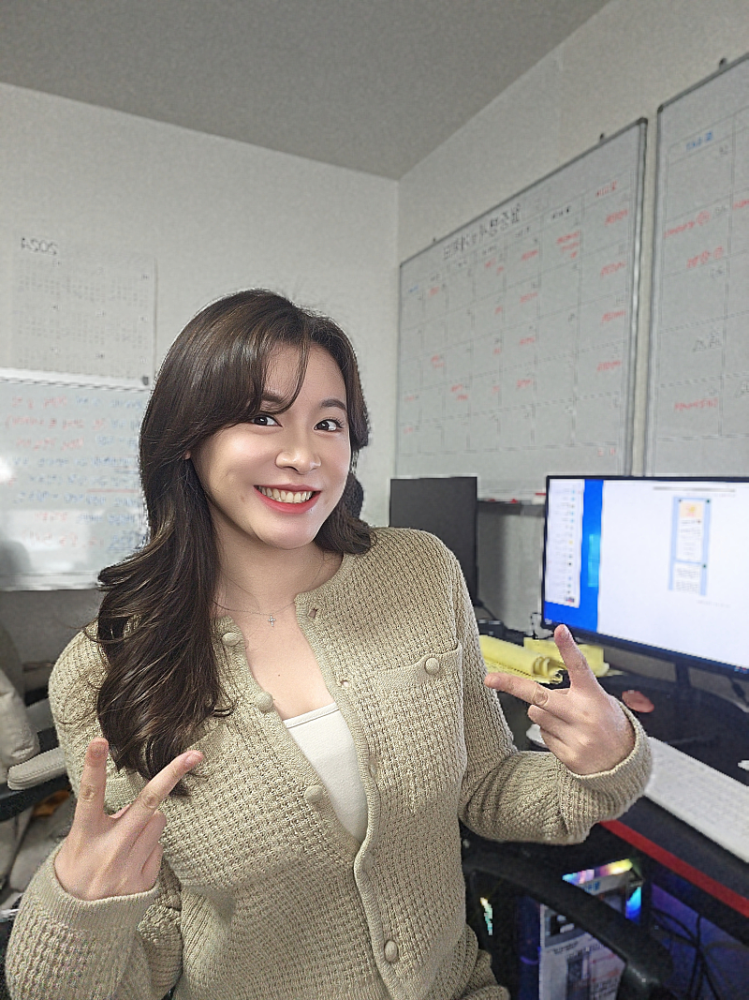
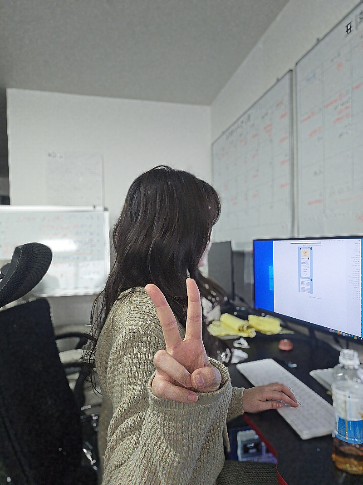

# 부업 시작

- 원천 ID: EPR-CAFE-24509
- 작성자: 주는사란
- 작성일: 2024-05-05T13:27:49.243000+09:00
- 원문: https://cafe.naver.com/ranschool/24509
- 수집일: 2026-09-21
- 텍스트 정리: HTML 문단 순서 유지, 빈 문단·제로폭 공백만 제거. 원본 HTML·JSON 별도 보존. 이미지는 아래에 모아 보관하며 원래 배치는 HTML에서 확인.

## 원문 본문

<!-- P001 -->
제가 드디어 온라인 강의 대본 수정이 끝났습니다. 이제 촬영만 남았는데요. 촬영도 2주안으로 끝날것 같습니다. 이번주부터 챕터 1개씩 강의를 바꿔놓을 예정입니다.

<!-- P002 -->
그래서 저도 부업을 해보려구요. 정확하게 말하면 다음에 하려고 하는 것에 대한 준비과정입니다. 정규(?) 업무시간에는 지금 하는 업무를 하구요. 저녁이나 주말에는 부업으로 새로운 것을 해보려고 합니다. 한 3개월 정도의 프로젝트 입니다.

<!-- P003 -->
지금부터 5월 19일까지는 컨셉을 잡고, 수익화 모델에 대해 정리할 생각이구요. 5월 20일부터 본격적으로 시작해서 7월 말까지 수익모델을 구축하는것이 목표입니다.

<!-- P004 -->
이 계획대로 하려면 지금 밀린 업무를 빨리 마무리 해야해서 약 3주전부터 토요일과 일요일에도 사무실에 나오고 있습니다. 처음에는 주말에 사무실 나오는게 싫었어요. 쉬고 싶었거든요. 근데 요즘에는 주말에 사무실 나오는 기분이 좋아요. 뭔가 갓생러같은 느낌??ㅋㅋㅋㅋㅋㅋㅋㅋㅋㅋㅋ

<!-- P005 -->
또 하나의 장점은 월요일이 월요일 같지 않다는 거예요. 이거 좋은건가?ㅋㅋㅋㅋㅋㅋㅋㅋㅋㅋㅋㅋ

## 본문 이미지

## 원문에 포함된 링크

- #
