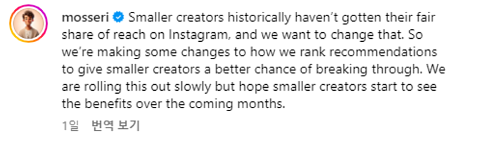
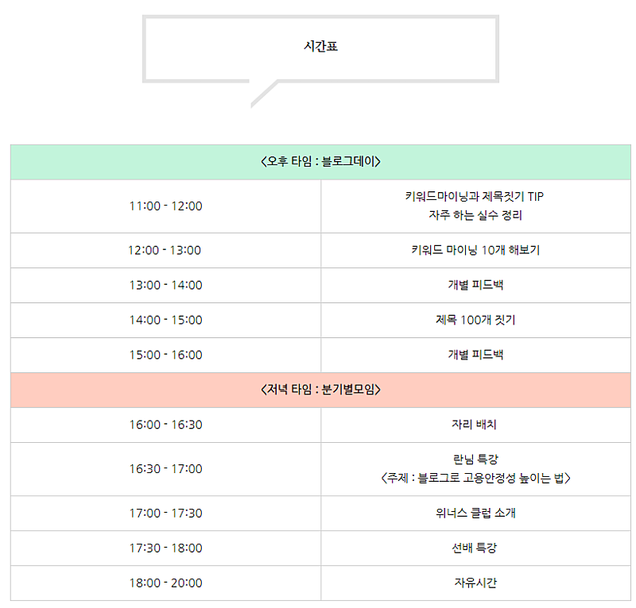

# 초보자가 SNS로 돈벌기 가장 쉬운 타이밍

- 원천 ID: EPR-CAFE-24564
- 작성자: 주는사란
- 작성일: 2024-05-07T17:10:25.710000+09:00
- 원문: https://cafe.naver.com/ranschool/24564
- 수집일: 2026-09-21
- 텍스트 정리: HTML 문단 순서 유지, 빈 문단·제로폭 공백만 제거. 원본 HTML·JSON 별도 보존. 이미지는 아래에 모아 보관하며 원래 배치는 HTML에서 확인.

## 원문 본문

<!-- P001 -->
은 알고리즘의 변화기입니다.

<!-- P002 -->
3일전 인스타그램 CEO인 아담 모세리가 인스타그램 알고리즘을 대대적으로 업데이트 한다고 공지했습니다.

<!-- P003 -->
뭐가 바뀌는지 알려면 지금 어떤지 알아야겠죠? 블로그 / 인스타 / 유튜브 알고리즘을 비교해보겠습니다.

<!-- P004 -->
블로그는 검색기반입니다. 어떤 키워드를 검색해야만 블로그가 나오죠. 인스타그램은 관계기반입니다. 나와 관계있는 사람이 어떤 게시물에 좋아요나 댓글이나 공유 등 무슨 행동을 하면 나한테도 보여주는 형태입니다. 유튜브는 취향기반입니다. 내가 어떤 영상을 자주 보냐 더 오래 보냐에 따라 그런 영상과 비슷한 종류의 영상을 보여줍니다.

<!-- P005 -->
블로그의 기본 모토는 그 정보를 필요로 하는 사람에게 보여주자 입니다. 인스타그램의 기본 모토는 친한 사람끼리 같은걸 보여주자는 겁니다. 유튜브의 기본 모토는 좋아하는걸 더 많이 보여주자는 겁니다.

<!-- P006 -->
알고리즘은 변화하고 있습니다.

<!-- P007 -->
블로그도 검색기반 안에서 점차 관계와 취향기반을 추가하고 있습니다. 이걸 합쳐서 추천기반으로도 부릅니다. 네이버에 보면 내가 검색한 단어와 관련된 블로그 컨텐츠가 검색하지 않아도 보이구요. 블로그 자체를 구독하는 시스템도 만들었습니다. 이 부분은 블로그 강의 키워드 파트에 어떻게 대처해야하는지 적어놨습니다.

<!-- P008 -->
인스타그램도 검색과 취향기반을 더 강화하고 있습니다. 3일전 아담모세리가 발표한 자료에 따르면 취향기반을 더 키우겠다고 한건데요. 인스타그램은 관계기반이다보니 팔로워가 많을수록 내 컨텐츠가 무조건 더 많이 보입니다. 그럼 어떤 문제가 생기죠? 소규모 계정들이 고인물들의 진입장벽을 뚫기 쉽지 않습니다. 팔로워가 많은 사람은 더 많은 사람에게 보일테니 계속 더 많아질거구요. 이제 시작한 사람은 팔로워가 없으니 노출이 거의 안될거고 그럼 더 크기 어렵겠죠. 팔로워 빈부격차가 심해집니다. 이 문제를 극복하려는 해결책이 3일전 업로드한 공지입니다. 팔로워수와 상관없이 동등한 노출도를 부여하겠다는 거죠. 팔로워에게 우선적으로 노출하는게 아니구요. 내 영상을 좋아할 것 같은 사람들에게 무작위로 노출하지 않겠다는거죠. 팔로워가 많은게 유리한게 아닌겁니다. 뭐 100% 동등하게 부여는 안되겠지만 그렇게 하겠다고 한겁니다. 실제 인스타그램에서 만든 스레드는 이미 그런 시스템을 갖고 있습니다.

<!-- P009 -->
유튜브는 본영상과 쇼츠 알고리즘이 약간 다른데요. 쇼츠 시청자가 워낙 많다보니 요즘은 쇼츠 알고리즘이 계속 변화하고 있습니다. 얼마전 쇼츠 링크 삭제도 그중 하나구요.

<!-- P010 -->
알고리즘은 변화하지만 방향성은 동일합니다. 컨텐츠를 좋아할 만한 사람에게 보여주자입니다. 그럼 우리는 뭘 해야할까요? 내 컨텐츠를 좋아할 만한 사람을 알고리즘이 잘 인식하도록 해야합니다. 그걸 하기위해서는 뭘해야할까요? 키워드 마이닝입니다. 내 컨텐츠를(내 키워드를) 보는 사람이 어떤 내용을 원하는지 잘 알고 컨텐츠를 만들어야 하는거죠. 제가 강의에서 항상 강조하는 내용입니다.

<!-- P011 -->
이번 블로그데이에서 이 키워드 마이닝을 더 연습해 볼겁니다.

<!-- P012 -->
아마 오늘 내용은 초보자 분들이 이해하긴 좀 어려우셨을수도 있습니다. 괜찮습니다. 블로그데이때 다시 설명드릴게요.

<!-- P013 -->
사실 저는 블로그 뿐 아니라 인스타그램과 유튜브를 키우면서 알게된 지식을 알려드리고 싶은데요. 근데 이런 지식은 사실 블로그 수익화를 해보지 않으면 이해하기 어렵습니다. 그래서 매달 수익인증을 하는 게시판을 만들려고 해요. 그리고 매달 본인이 번 모든 수익을 정리해서 올려주신 분들과 단톡방을 만들어서 다양한 마케팅 이야기를 해드리려고 합니다. 이름은 위너스 클럽으로 지었어요 ㅋㅋㅋㅋㅋㅋㅋㅋㅋㅋ(나쁘지...않죠?ㅎㅎㅎㅎ)

<!-- P014 -->
위너스 클럽은 줌으로 월 1회 저와 마케팅 스터디를 할거구요. 브블인과 함께하는 단톡방에 초대해 드릴겁니다. 참여조건은 한달간 마케팅 대행으로 번 수입을 카페에 매달 1회 이상 올려주시는 것(최소 월 10만원이상) 과 인터뷰 입니다.

<!-- P015 -->
현재 "계약했어요" 게시판이 있긴 한데, 첫 계약한 다음 그 뒤로는 인증을 잘 안하셔서 잘 하고 계신지 모르겠더라구요. 얼마나 하고계신지 알아야 다른 도움을 드릴수 있어서요. "계약했어요" 게시판과는 다르게 매달 인증 게시판으로 만들어 보려합니다.

<!-- P016 -->
인터뷰는 한달에 2-3분은 대면으로 요청드리고 그 외의 분들은 사진과 본인 스토리만 보내주시면 됩니다. 매달 단톡방은 폭파되며, 매달 두가지를 올려주신 분에게만 초대 링크를 전송드릴거예요.

<!-- P017 -->
위너스클럽에 대해 더 좋은 아이디어가 있으면 댓글로 남겨주세요! 위너스클럽 들어오고 싶은분들은 미리 지난달에 얼마 벌었나 정리해 놓으시면 좋을것 같습니다 :) 뿅

## 본문 이미지

## 원문에 포함된 링크

- #
