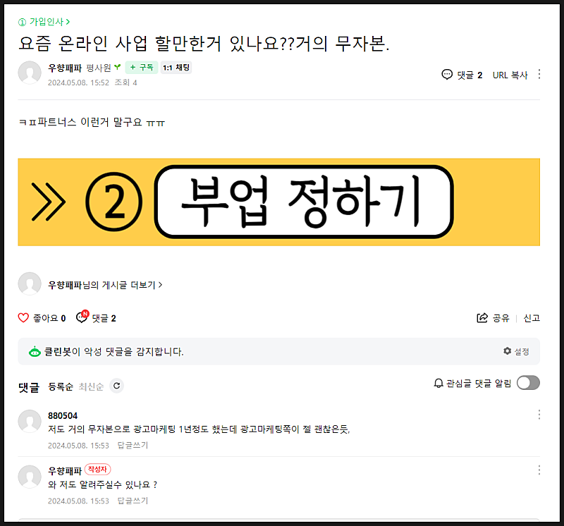
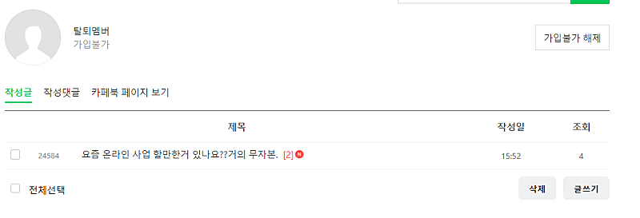

# 고전적인 마케팅 방법

- 원천 ID: EPR-CAFE-24586
- 작성자: 주는사란
- 작성일: 2024-05-08T16:56:06.010000+09:00
- 원문: https://cafe.naver.com/ranschool/24586
- 수집일: 2026-09-21
- 텍스트 정리: HTML 문단 순서 유지, 빈 문단·제로폭 공백만 제거. 원본 HTML·JSON 별도 보존. 이미지는 아래에 모아 보관하며 원래 배치는 HTML에서 확인.

## 원문 본문

<!-- P001 -->
요즘 계속 제 카페에 이런 글이 올라와요. 제목도 똑같은걸 보면 메크로인것 같은데요.

<!-- P002 -->
그리고는 댓글로 바로 새싹멤버가 이렇게 답니다. "~가 낫다" 이런식으로요. 그 밑에는 작성자가 "저도 알려주세요" 라고 하죠. 마지막 댓글은 제가 지웠는데 "여기에서 알았어요." 하고 링크를 넣습니다.

<!-- P003 -->
아주 고전적인 방법이죠. 고전적인 방법을 쓰는건 좋은데 너무 티나게 하는건 좀 아쉽네요. 다음에는 좀더 티나지 않게 해주셨으면 좋겠어요 ㅎㅎㅎ 딱 저기까지는 맞는 말이라 그건 안지웠습니다 ㅋㅋㅋㅋㅋㅋㅋㅋㅋㅋ

<!-- P004 -->
제가 이전에 카페 침투 마케팅 할때 어떻게 하면 되는지 적어놓은 글이 있는데요. 아래 글 TIP 두번째를 참고하라고 말씀드리고 싶네요. ㅎㅎ 여러분도 하실때 TIP두번째를 참고하세요 ㅎㅎㅎ

<!-- P005 -->
제가 마케팅 대행 부업에 대해 아주 자세하게 무료강의 3강에서 알려드렸는데요. 가장 어려워 하시는 딱 한가지를 뽑자면 이겁니다. 3시간 만에 마케팅 계약 따내는 방법 하나를...

<!-- P006 -->
cafe.naver.com

<!-- P007 -->
아니면 저분처럼 강퇴당합니다...ㅎ

## 본문 이미지

## 원문에 포함된 링크

- #
- https://cafe.naver.com/ranschool/12849
