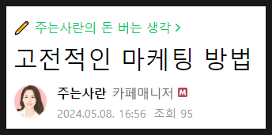
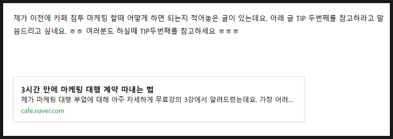
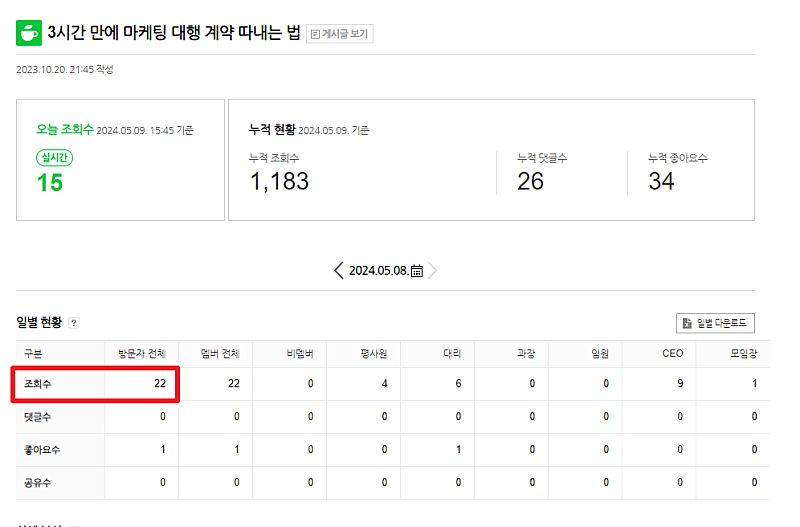

# 딱 한 분을 찾습니다.

- 원천 ID: EPR-CAFE-24637
- 작성자: 주는사란
- 작성일: 2024-05-09T16:25:05.397000+09:00
- 원문: https://cafe.naver.com/ranschool/24637
- 수집일: 2026-09-21
- 텍스트 정리: HTML 문단 순서 유지, 빈 문단·제로폭 공백만 제거. 원본 HTML·JSON 별도 보존. 이미지는 아래에 모아 보관하며 원래 배치는 HTML에서 확인.

## 원문 본문

<!-- P001 -->
제가 어제 '고정적인 마케팅 방법'이라는 주제로 글을 썼습니다. 글 조회수는 지금까지 95회네요.

<!-- P002 -->
그리고 마지막에는 이전의 제 글을 tip2번째를 보라고 첨부했습니다.

<!-- P003 -->
과연 어제 제 글을 본 95분중에 이 글을 클릭해서 실제 본 분은 몇분이나 될까요?

<!-- P004 -->
22분이었습니다. 약 23% 분이 보셨네요.

<!-- P005 -->
이 글을 보고 바로 영업할때 적용까지 해봤다? 하신분도 있으신가요?

<!-- P006 -->
직접 적용까지 해보셨을 그 딱 한 분을 찾습니다. 제가 커피한잔 삽니다☕ 성공할 분💘

<!-- P007 -->
정보는 누구한테 가느냐에 따라 가치가 달라집니다. 아무리 좋은 걸 알려줘도 준비되지 않은 사람에게는 쓰레기입니다.

<!-- P008 -->
위너스클럽을 준비하고 있습니다. 수강생 분중에서 수익화에 성공하신 분들을 마케팅 고수로 이끌기 위한 스터디입니다. 단톡방 초대와 월 1회 저와의 마케팅 스터디를 할 거예요.

<!-- P009 -->
제가 블로그나 인스타나 유튜브를 키우는 모습에 대해도 보여드릴거구요. 각 sns의 알고리즘이 변하면 마케팅 트랜드도 알려드릴거구요. 모든 트래픽을 모아서 활용하는 모습도 보여드릴겁니다. 부업스파르타처럼 아예 한 업체를 키우는 모습을 보여드릴지도 모르구요. 여러 생각들이 있습니다.

<!-- P010 -->
어떤 분은 이런 생각이 드실지도 몰라요. 아니 왜 굳이 수익화에 성공한 사람들만 보여주지? 왜 뭐든 수강생들만 모아서 하지? 라구요. 편가르기를 하는 것처럼 보이실텐데 편가르기가 맞습니다. 이렇게 편가르기를 하는 이유는 제 정보가 필요한 사람에게 제대로 쓰이길 원하기 때문입니다. 수강생이 아니면 제가 무슨 말을 해도 제 용어를 이해할 수가 없습니다. 수익화를 하지 않으시면 뜬구름 잡는 이야기처럼 드릴거예요. 듣는 분에게도 알려드리는 저에게도 시간낭비 정보낭비입니다.

<!-- P011 -->
제 목표는 편을 좀 더 구체적으로 갈라서 듣는 분들에게 정확히 딱 맞는 정보만 드리는거예요.

<!-- P012 -->
그래서 처음에는 위너스클럽 조건을 낮출겁니다. 일단 어떤 분들에게 어떤 이야기 도움되는지 알아야 하니까요. 지금 계획은 월 10만원이상? 정도로 생각하고 있습니다. 하지만 매월 기준을 높여갈거예요. 점점 더 딥한 이야기를 하기 위해서요. 좀 나중에는 위너스 클럽 자체도 유료로 할 생각입니다. 정보의 가치를 제대로 드릴 수 있는 순간에는요.

<!-- P013 -->
위너스클럽....COMING SOON

## 본문 이미지

## 원문에 포함된 링크

- #
