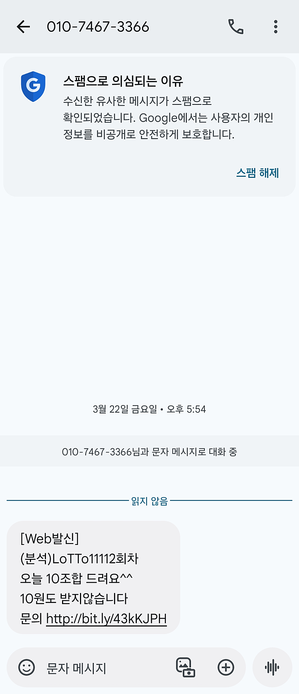
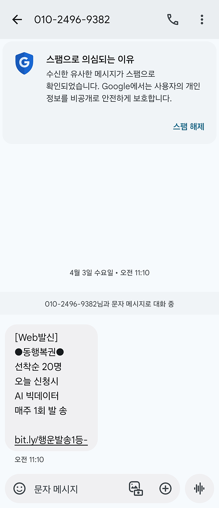
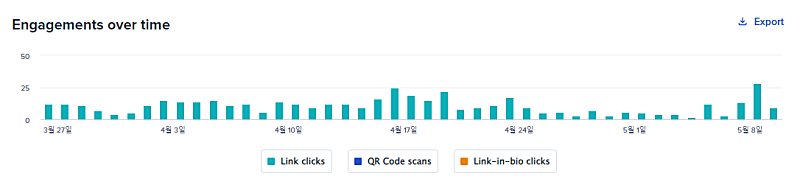
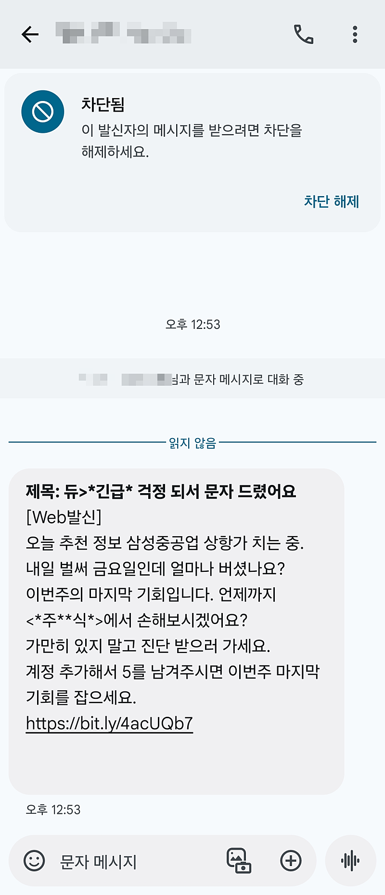

# 스팸문자도 이렇게까지 합니다.

- 원천 ID: EPR-CAFE-24659
- 작성자: 주는사란
- 작성일: 2024-05-10T14:18:46.927000+09:00
- 원문: https://cafe.naver.com/ranschool/24659
- 수집일: 2026-09-21
- 텍스트 정리: HTML 문단 순서 유지, 빈 문단·제로폭 공백만 제거. 원본 HTML·JSON 별도 보존. 이미지는 아래에 모아 보관하며 원래 배치는 HTML에서 확인.

## 원문 본문

<!-- P001 -->
저는 스팸문자가 오면 꼭 봅니다. 문제 유형만 봐도 어느정도 지능적인(?) 놈인지 대충 알수 있거든요. ㅎㅎㅎ

<!-- P002 -->
마케팅을 할 때 가장 기본 중의 기본은 '링크 클릭률' 확인입니다. 스팸문자를 차마 마케팅이라고 표현하긴.....그렇지만요. 여튼 스팸문자를 보내는 애들 조차도 링크 클릭률을 확인한다는 겁니다.

<!-- P003 -->
아래 사진은 제게 온 스팸문자입니다. 아래 보면 링크가 있는데요. 링크가 변환되어있는걸 알수 있습니다.

<!-- P004 -->
이 링크를 클릭할 경우 몇명이 클릭했는지 알기 위해서 바꿔놓는거죠. 저도 어디나 링크를 바꿔서 올려놓습니다. 그럼 이런식으로 하루에 몇명이 이 링크를 클릭했는지 알 수 있거든요.

<!-- P005 -->
여기서 좀더 발전된 버전은 아래와 같습니다.

<!-- P006 -->
아까 보여드린 두 문자와 같이 링크 변환을 했구요. 여기에 2가지 더 추가를 했어요.

<!-- P007 -->
첫번째로는 스팸문자에 걸리지 않도록 주식 => *주**식*으로 바꿔서 보냈구요. 두번째로는 '5'를 남겨달라고 하면서 어디서 들어온 사람인지 확인하려 했습니다.

<!-- P008 -->
요즘 스팸문자는 이 3가지를 하더라구요.

<!-- P009 -->
1. 링크 변환

<!-- P010 -->
2. 스팸문자 안 걸리도록 핵심단어 변형

<!-- P011 -->
3. 문자 혹은 텔레그램으로 유도한 후 숫자를 남겨달라는 액션 유도

<!-- P012 -->
얘네들도 하는데 우리도 안하면 안되겠죠? ㅎㅎㅎ

<!-- P013 -->
위 방식을 적용해보자면 이렇습니다.

<!-- P014 -->
1. 블로그나 톡톡등 링크를 넣을때는 링크를 변환해 보세요.

<!-- P015 -->
링크 변환 사이트 -

<!-- P016 -->
긴~ URL 짧게 보라. 다양한 통계데이터 수집. 단축링크, QR코드, 바이오링크

<!-- P017 -->
vo.la

<!-- P018 -->
Bitly’s Connections Platform is more than a free URL shortener, with robust link management software, advanced QR Code features, and a Link-in-bio solution.

<!-- P019 -->
bitly.com

<!-- P020 -->
하루에 몇명이 클릭하는지 보는거죠. 만약 클릭률이 너무 낮다면 멘트를 바꿔야겠죠?

<!-- P021 -->
2. 핵심단어를 정확하게 언급해주세요.

<!-- P022 -->
가끔 긴 글의 제안을 읽어보면 '뭘 해주겠다는건지' 정확히 모를때가 있습니다. '블로그대행' '플레이스지도관리대행' 등 정확하게 내가 해주려는 서비스에 대해 언급해보세요.

<!-- P023 -->
3. 항상 어떤 제안을 보냈으면 답변을 받는 형식도 정해놔야 합니다.

<!-- P024 -->
예를들어 쭉 제안을 한 뒤 마지막에는 이렇게 적는거죠.

<!-- P025 -->
위 제안이 괜찮다고 생각하시면 "제 가게도 분석해주세요"라는 말과 함께 네이버 지도를 보내주세요. 그럼 대표님의 가게에 맞는 마케팅 제안서를 정리해서 보내드릴 수 있도록 하겠습니다. 제안서 발송까지는 답문 받은 후 48시간 정도가 소요됩니다.

<!-- P026 -->
라구요. 정확하게 뭐라고 답변해줬을 때 뭐를 해줄지를 알려주는거죠.

<!-- P027 -->
위 내용은 데이터 쌓는 시기가 되신 분에게만 필요한 내용 입니다. 아직 블로그를 쓰는 것 자체가 익숙하지 않은 분은 "이런게 있구나" 하고 넘어가시면 됩니다.

<!-- P028 -->
수익화에 성공하신 분들을 대상으로 위너스클럽을 준비하고 있습니다. 위너스클럽은 카페에 '이번달 수익인증' (준비중) 게시판에 인증해주신 분 중 일부를 선별할 예정입니다. 위너스클럽에서는 데이터를 쌓는 다양한 방법도 보여드릴겁니다. 제가 쌓은 데이터 일부도 보여드릴 예정(부끄)

<!-- P029 -->
위 글을 따라할때 주의사항

<!-- P030 -->
대한민국 모임의 시작, 네이버 카페

<!-- P031 -->
cafe.naver.com

## 본문 이미지

## 원문에 포함된 링크

- #
- https://vo.la/
- https://bitly.com/
- https://cafe.naver.com/ranschool/23598
