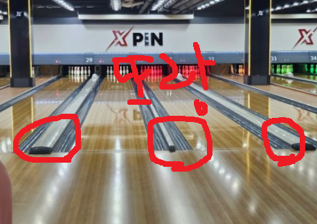

# 좌절되는 순간 보세요.

- 원천 ID: EPR-CAFE-25334
- 작성자: 주는사란
- 작성일: 2024-05-27T21:58:58.533000+09:00
- 원문: https://cafe.naver.com/ranschool/25334
- 수집일: 2026-09-21
- 텍스트 정리: HTML 문단 순서 유지, 빈 문단·제로폭 공백만 제거. 원본 HTML·JSON 별도 보존. 이미지는 아래에 모아 보관하며 원래 배치는 HTML에서 확인.

## 원문 본문

<!-- P001 -->
노력해도 안되는 일이 있고, 노력하지 않았는데 또 잘되는 일도 있습니다. "이건 나 좀 잘했는데?"라고 생각했는데 결과가 별로일 때가 있고, "아 이건 좀 별로인데?" 라고 생각했는데 결과가 좋을 때도 있죠.

<!-- P002 -->
문제는 인생에서 후자인 경우는 1% 미만이며, 99%가 전자의 경우입니다. 참 좌절스럽죠. 좌절은 크게 2가지에서 옵니다.

<!-- P003 -->
1. 노력할 기회조차 없을 때

<!-- P004 -->
2. 내가 노력할수록 오히려 목표와 멀어질 때

<!-- P005 -->
저는 특히 2번일 때가 많았던것 같아요.

<!-- P006 -->
어릴 때 부터 주말이면 엄마랑 동생이랑 볼링을 쳤는데요. 제 첫 볼링은 고1때 였어요. 인생 처음으로 친건데 90점이 나왔어요. (처음 치고는 잘한 점수입니다) 스스로 "꽤 잘하네?" 라는 생각을 했죠.

<!-- P007 -->
근데 재밌는건 치면 칠수록 점수가 줄더라구요? 6개월간 거의 주말마다 엄마를 쫄라서 갔는데 점수가 20까지 내려갔습니다. 칠때마다 또랑(양옆)으로 빠지더라구요. 노력할 수록 목표와 멀어져 갔어요.

<!-- P008 -->
이때까지 저는 볼링을 잘하기 위해 노력을 하고 있다고 생각했어요. 열심히 노력하면 잘 하게 될거라고 생각했죠.

<!-- P009 -->
근데 나중에 친구한테 배우고 알게 된건데요. 제가 자세 자체를 몰랐더라구요. 노력의 방향 자체가 잘못됐어요.

<!-- P010 -->
제 노력 포인트가 쌓이지 않고 있었던거예요. 멤버쉽 포인트 적립할때 보통 핸드폰 번호를 누르잖아요? 근데 그 번호를 매번 잘 못 누르고 있었던거죠!! 이렇게 바보 같을수가 있나요!! (물론 현실에서는 점원분이 알려주시겠지만요 ㅎㅎ)

<!-- P011 -->
자 그럼 어떻게 해야 할까요?

<!-- P012 -->
일단 내 목표 였던걸 적으세요. 그걸위해 내가 노력한걸 적어보세요. 그리고는 둘 사이에 부족한걸 적어보는거예요.

<!-- P013 -->
<예시>

<!-- P014 -->
목표 -

<!-- P015 -->
3개월안에 업체 1개 계약하기

<!-- P016 -->
실제 한 것 -

<!-- P017 -->
3개월간 블로그를 100개 썼다.

<!-- P018 -->
부족한 점 -

<!-- P019 -->
1. 글을 썼다고 해서 계약을 하는건 아니었어. 계약을 하기 위해서는 영업을 해야하는데, 막상 영업은 일주일에 한개도 안했네

<!-- P020 -->
2. 솔직히 영업이 하기 싫었던것 같아. 왜 하기 싫었을까? 매번 전화 돌리고 이런 시간이 아까워.

<!-- P021 -->
3. 앞으로도 매번 영업을 할 자신도 없어. 그럼 어떻게 해야하지?

<!-- P022 -->
4. 카페 후기에도 보니깐 다들 블로그로 문의 왔다고 했었네. 영업을 못하는 주에는 최소한 내 마케팅 블로그에 글 한개라도 써보자.

<!-- P023 -->
실제 저는 좌절스러울때마다 일기에 매번 이렇게 씁니다. 내일은 <기회를 놓쳤을때>라는 주제로 글을 쓸 예젙입니다. 낼 만나요.

## 본문 이미지

## 원문에 포함된 링크

- #
