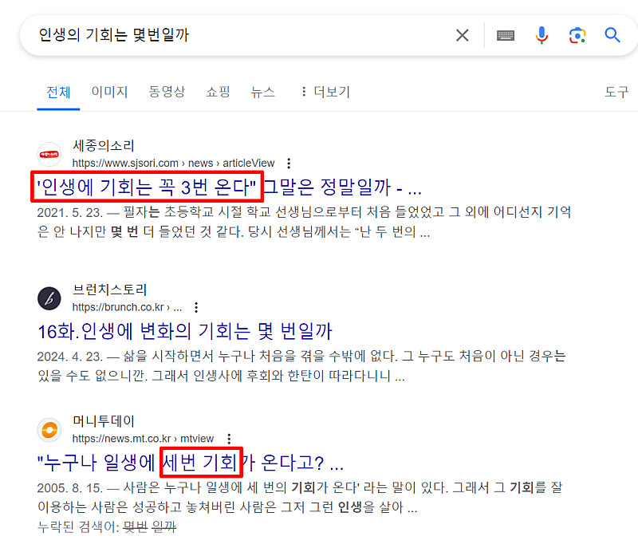
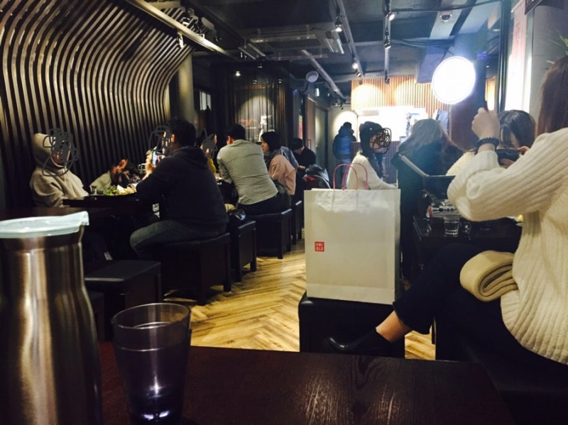

# 기회를 놓쳤을때 보세요.

- 원천 ID: EPR-CAFE-25343
- 작성자: 주는사란
- 작성일: 2024-05-28T10:38:22.970000+09:00
- 원문: https://cafe.naver.com/ranschool/25343
- 수집일: 2026-09-21
- 텍스트 정리: HTML 문단 순서 유지, 빈 문단·제로폭 공백만 제거. 원본 HTML·JSON 별도 보존. 이미지는 아래에 모아 보관하며 원래 배치는 HTML에서 확인.

## 원문 본문

<!-- P001 -->
인생에 기회는 몇번 정도 온다고 생각하세요?

<!-- P002 -->
그럼 이번에는 질문을 바꿔볼게요. 지금까지 살면서 내게 찾아온 기회를 몇번 정도 놓쳤다고 생각하세요?

<!-- P003 -->
저는 어릴 때부터 이런말을 들어봤어요. "인생에 기회는 꼭 3번은 온다"라구요. 구글에도 쳐보니깐 그렇게 생각하시는 분이 많은 것 같아요.

<!-- P004 -->
"지금까지 내 인생에 기회가 몇번 왔을까? " 생각해봤는데 기억이 잘 안나요. 근데 반대로 '기회를 놓쳤다' 라고 생각한 순간은 이미 3번이 넘어요. 이상하죠. 여러분은 어떠세요?

<!-- P005 -->
제가 첫 이자카야를 했을 때 친해진 주류대표님이 있었어요. 그 대표님은 20대 초반에 제가 만난 사람중에 가장 부자였어요. 그 대표님은 저를 좋게 봐주셨죠. 그래서 홍대에 자기가 가지고 있는 이자카야 운영권을 주겠다고 했어요. 저는 기회라고 생각했죠. 아래 사진이 실제 그 이자카야예요.

<!-- P006 -->
근데 알고보니깐 여기는 매달 -500만원씩 적자가 나는 이자카야였어요. 저와 팀원은 그 대표님이 믿어주셨다는 생각에 온갖 노력을 다했어요. 그리고 개업한지 약 1년만에 처음으로 순수익 200만원이 됐죠. 그리고 그 대표님은 우리에게 고맙다며 3개월간 일한 보수로 팀원 2명에게 총 100만원씩 줬어요. 딱 순수익 200만원을 나눠준거죠. 그 결과 제가 기존에 운영하던 이자카야에 신경을 못 써 오히려 제 순수익을 떨어졌습니다.

<!-- P007 -->
그 대표님을 원망하진 않아요. 그 때 처음으로 배웠죠. 기회라고 생각해도 기회가 아닐 수도 있구나. 마트가서 특가인줄 알고 샀더니 알고보니 쿠팡이 더 쌌던거죠ㅋㅋㅋㅋㅋㅋㅋ무겁게 들고 오기까지 했는데...ㅎㅎ

<!-- P008 -->
근데 참 다행인건 반대의 경우도 있다는 거예요. 기회가 아니라고 생각했는데 기회인 경우요. 별로 열심히 쓴 글이 아닌데, 생각보다 그 글로 문의가 많이 오기도 하구요. 처음에 반응이 애매해서 "이분은 안하겠다" 했는데 갑자기 얼마 뒤에 연락이 와서 하겠다고 하는거죠.

<!-- P009 -->
그니깐 제말은 지금 기회를 놓친게 아닐지도 모른다는거예요. 또 알아요? 제가 기회일지도 ㅎㅎ

## 본문 이미지

## 원문에 포함된 링크

- #
