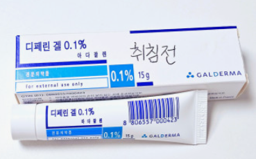
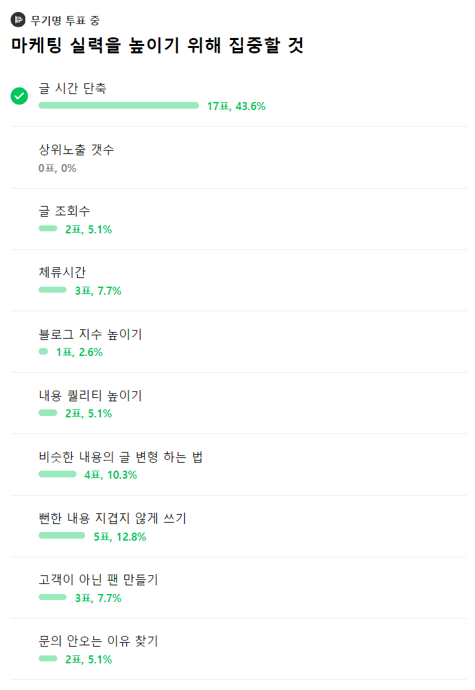

# 토요일에 '이것'을 몰라 3만원 날렸어요ㅠㅠ

- 원천 ID: EPR-CAFE-25534
- 작성자: 주는사란
- 작성일: 2024-06-03T11:20:22.363000+09:00
- 원문: https://cafe.naver.com/ranschool/25534
- 수집일: 2026-09-21
- 텍스트 정리: HTML 문단 순서 유지, 빈 문단·제로폭 공백만 제거. 원본 HTML·JSON 별도 보존. 이미지는 아래에 모아 보관하며 원래 배치는 HTML에서 확인.

## 원문 본문

<!-- P001 -->
토요일에 집 근처 피부과에 다녀왔어요. 3만원짜리 바르는 약을 처방받고 약국에서 사왔죠.

<!-- P002 -->
다시 집에 올 때는 날씨가 좋아서 따릉이를 탔는데요. 근데 따릉이를 반납하려고 보니 약이 없더라구요. 따릉이 바구니에서 빠졌나봐요.

<!-- P003 -->
그렇게 집에 왔는데 제가 읽어버린 약과 똑같은 약이 있더라구요. 이전에 사놓은 새것이었죠.

<!-- P004 -->
의사가 "디페린 있으세요? 처방해드릴까요?" 물어봤을땐, 뭔지 몰라 달라고 했거든요. (일단 쟁여놓고 보는 ㅋㅋㅋㅋㅋ) 약 이름을 알아야겠다고 생각한 적이 없었어요. 그리고 그 이름을 몰라 3만원을 날렸죠.

<!-- P005 -->
여러분은 혹시 지금 중요하지 않다고 생각해서 놓치고 있는건 없나요? 놓치고 있는걸 찾아보세요.

## 본문 이미지

## 원문에 포함된 링크

- #
