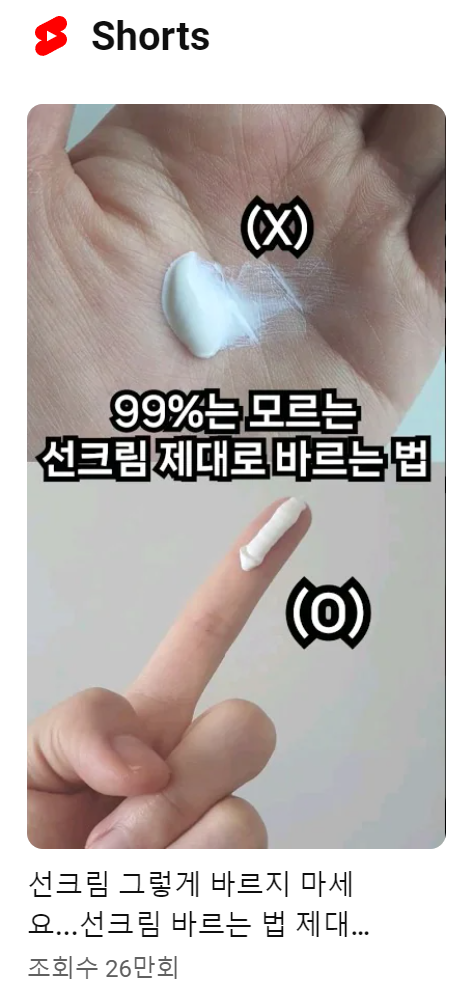
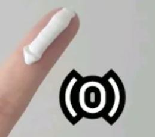

# 문제가 생겼을 때 대처하는 법

- 원천 ID: EPR-CAFE-25558
- 작성자: 주는사란
- 작성일: 2024-06-04T11:36:28.640000+09:00
- 원문: https://cafe.naver.com/ranschool/25558
- 수집일: 2026-09-21
- 텍스트 정리: HTML 문단 순서 유지, 빈 문단·제로폭 공백만 제거. 원본 HTML·JSON 별도 보존. 이미지는 아래에 모아 보관하며 원래 배치는 HTML에서 확인.

## 원문 본문

<!-- P001 -->
저는 원래 화장하기 전에 선크림을 바르지 않았어요. 근데 요즘은 자외선이 너무 세서 얼굴이 타는게 느껴지더라구요. 그래서 화장하기 전에 선크림을 바르기로 했습니다. 며칠을 선크림을 바르고 화장을 했더니 화장이 잘 안되더라구요.

<!-- P002 -->
처음에는 "선크림 문제인가?"라는 생각에 선크림을 새로 샀어요. 똑같았죠.

<!-- P003 -->
결국엔 "선크림이 나랑 안맞나보다" 하는 생각에 선크림을 바르지 않았습니다. 그랬더니 밖에만 나가면 뭔가 찝찝하더라구요. 그래서 오히려 얼굴을 가리게 되었죠. 열심히 화장을 해놓고 말이예요.

<!-- P004 -->
그러다 우연히 알고리즘이 추천해준 이 영상을 봤어요.

<!-- P005 -->
충격받았죠. 제품의 문제도 아니었고, 내 얼굴에 안 맞는 것도 아니었어요. 그냥 잘 못 바른거였어요. 선크림을 너무 많이 바른거죠.

<!-- P006 -->
이만큼만 발라야 하는데 말이예요.

<!-- P007 -->
저는 거의 3배를 넘게 발랐습니다. 그 때 알았죠.

<!-- P008 -->
내가 몰랐구나.

<!-- P009 -->
마케팅 대행을 시작하면 여러 문제가 발생합니다. 사장님이 사진을 매번 제대로 안 주는 아주 사소한 것에서부터 대행료를 주기로 한 날짜에 주지 않는 아주 중요한(?) 문제까지 여러 문제가 생깁니다.

<!-- P010 -->
그럼 보통 두가지를 선택하죠.

<!-- P011 -->
1. 참는다.

<!-- P012 -->
2. 포기한다.

<!-- P013 -->
보통은 1번을 하다가 2번으로 넘어가고 끝나게 되죠. 여기서 끊어내지 못하면 1=>2=>1=>2 무한굴레죠.

<!-- P014 -->
물론 저는 마케팅대행을 할 때 '나와 결에 맞는' 사장님을 찾는 건 중요하다고 생각합니다. 결국 나와 결에 맞는 고객을 찾아야 장기고객으로 이어갈 수 있기 때문이죠. 그래서 당연히 1=>2는 필요합니다.

<!-- P015 -->
근데 같은 문제가 반복이 된다면 그건 방법을 모르고 있는 것입니다. 내가 맡은 사장님마다 사진을 똑바로 안 준다면 그건 내가 사진을 받는 방법을 모르고 있는거죠. 대행료도 계속 밀린다면 그건 내가 대행료를 받는 방법을 모르고 있는겁니다.

<!-- P016 -->
그래서 일단 내가 지금 뭘 모르는지를 알 필욘 있죠. 제 선크림처럼 바로 답을 찾을 순 없겠지만, 분기별모임이나 블로그데이 위너스클럽등 저와 만나는 자리에서 같이 이야기해보면 좋을것 같습니다.

## 본문 이미지

## 원문에 포함된 링크

- #
