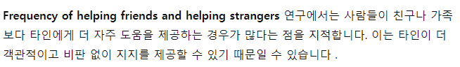
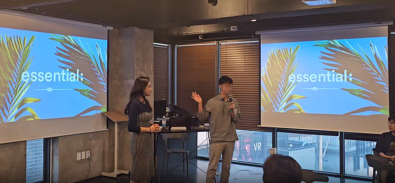
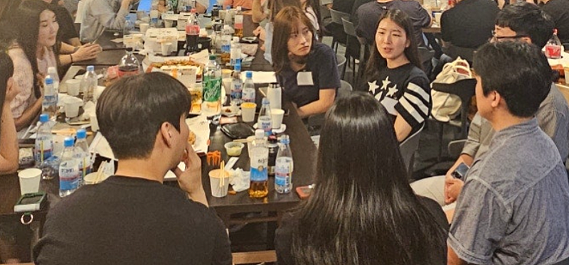
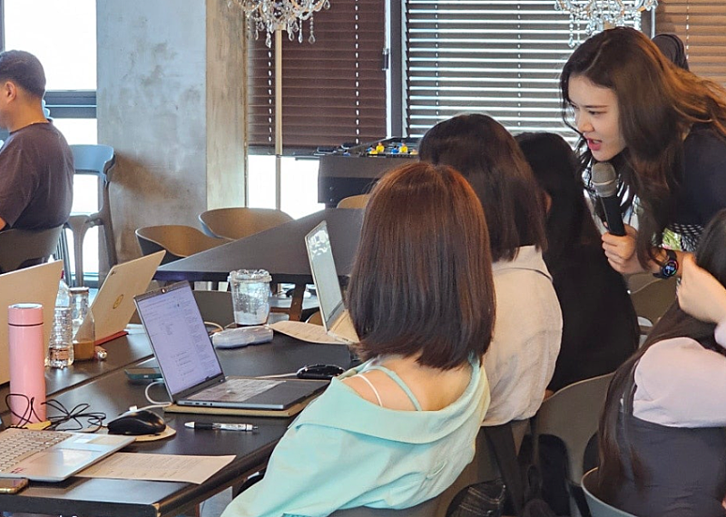
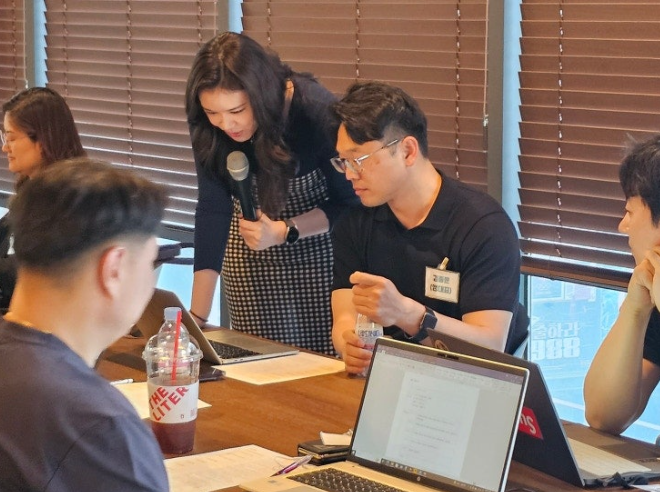
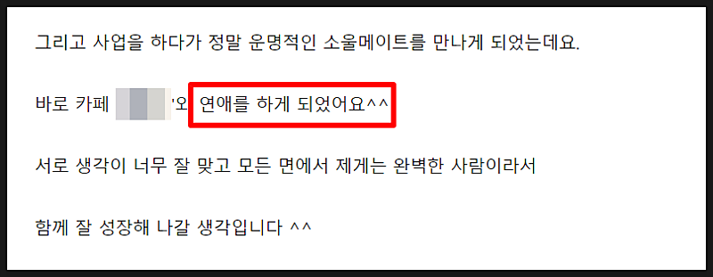
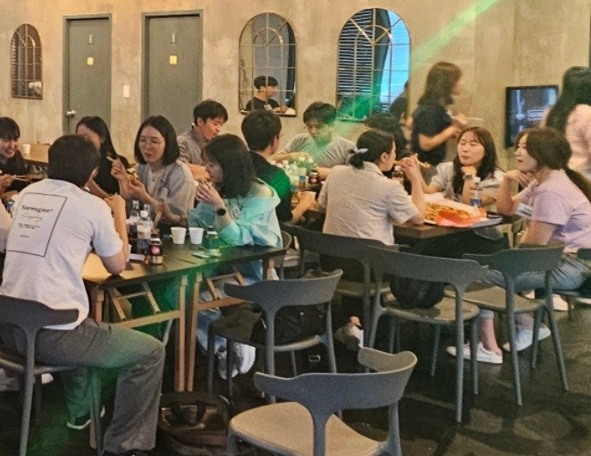
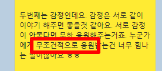
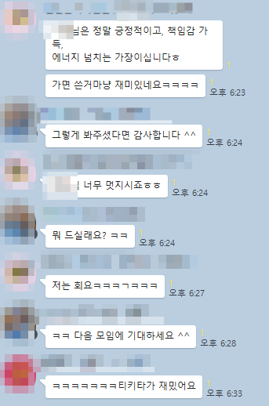

# 내 도전이 응원받지 못할 때

- 원천 ID: EPR-CAFE-25653
- 작성자: 주는사란
- 작성일: 2024-06-07T15:16:05.860000+09:00
- 원문: https://cafe.naver.com/ranschool/25653
- 수집일: 2026-09-21
- 텍스트 정리: HTML 문단 순서 유지, 빈 문단·제로폭 공백만 제거. 원본 HTML·JSON 별도 보존. 이미지는 아래에 모아 보관하며 원래 배치는 HTML에서 확인.

## 원문 본문

<!-- P001 -->
한 아이가 있습니다. 이 아이의 아빠는 알코올 중독입니다. 아빠는 술에 취해 집에 들어오면 매일 엄마를 때렸습니다. 결국 엄마는 이 아이를 버리고 집을 떠났습니다. 이 아이는 매일 아빠에게 맞았습니다. 그리고 매일 결심했습니다. 아빠처럼 살지 않겠노라고. 그리고 이 아이는 커서 지금의 누군가가 되었습니다.

<!-- P002 -->
아마 이런 이야기를 들어보신 적이 있으실거예요. 근데 사실 이런 경우보다는 대다수는 나쁜 길로 빠집니다. 그 차이가 뭔지 아시나요?

<!-- P003 -->
'자신을 무조건적으로 지지하는 대상이 있었느냐' 라고 합니다. 범죄자들의 100%는 다 가정환경이 좋지 않았다고 합니다. 세계적으로 예외가 단 1명도 없을정도라고 하네요. 그니깐 가정환경이 좋지 않아도 어린시절에 단 한명이라도 자신에게 무조건적인 지지를 받아본다면 범죄하지 않는다는거죠. 반대로 말하면 범죄자가 되었다는건 사실 인생을 살면서 한번도 무조건적인 지지를 어느 누구에게도 받지 못한겁니다. 참 나쁘지만 참 안타깝기도 하죠.

<!-- P004 -->
근데 재밌는건 어른도 똑같다고 합니다. 성인이 되어서 어떤 일을 도전한다고 했을때 지지를 받기 어렵습니다. 무조건적인 지지는 더 어렵죠. 성인의 도전은 친구는 물론이고 가족에게도 환영받지 못합니다.

<!-- P005 -->
한 연구에 따르면, 어떤 누구라도 나의 도전에 대해 지지를 보내면 성공확률이 높아진다고 합니다. 특히나 가족과 지인이 아닌 타인이 주는 지지일 때 그 효과가 더 커진다고 합니다. 타인이 더 객관적이게 판단하여 지지를 보낸다고 생각하기 때문이죠.

<!-- P006 -->
어제는 블로그데이와 분기별모임을 했습니다. 이제는 서로에게 무조건적인 지지를 보내는 문화가 잘 자리잡은 것 같습니다.

<!-- P007 -->
이미 수익화에 성공한 분들이 시작한 분들에게 보내는 지지가 있었습니다.

<!-- P008 -->
시작하는 분들의 용기는 이제 막 수익화를 시작해 고민거리가 많은 분들에게 다시 에너지가 되었습니다.

<!-- P009 -->
그리고 저는 한분한분에게 필요한 피드백을 드릴 수가 있었죠.

<!-- P010 -->
정말 행복했습니다. 오글거릴지모르지만 사랑이 가득했습니다. 그리고 실제로 여기 카페에서 만나 진짜 연애를 하고 계시는 두분도 있더라구요. (개인사이니 본명?닉네임?은 블러처리하겠습니다ㅎㅎ)

<!-- P011 -->
마침 나란히 앉아 계심 여기 어딘가에 있음

<!-- P012 -->
제가 후기를 항상 다 읽는데 마침 맨 아래를 안 읽어서 못 봤던거예요. 어제 처음 알게됐는데 정말 기뻤습니다. 정말 축하드리구요. 제가 생각했던 사랑이 넘치는 카페는 이런(?) 사랑은 아니었지만 이런 사랑도 환영입니다 :)

<!-- P013 -->
약 2년전 저는 정말 이런 모임을 꿈꿔왔습니다. 나의 어떤 도전도 응원받는 모임이요. 저도 누군가의 도전을 응원할 수 있는 모임이요. 그리고 드디어 이제 시작된것 같아요.

<!-- P014 -->
위너스클럽(수강생들 중 수익화에 성공하신 분들끼리 모인 모임)에서는 이걸 서로 매일 해주자고 했는데요. 실제로 매일 그렇게 하고 있습니다.

<!-- P015 -->
참 이런 모임은 너무 중독성이 강한것 같아요. 빨리 또 하고 싶네요. 많은 분들의 성원에 힘 입어 올해 안에 MT도 기획해 보겠습니다. 그때까지 다들 잘 살아남아 계시길 바랍니다 ㅎㅎ

## 본문 이미지

이미지 2: 로컬 보관 실패. [원래 이미지 주소](https://thumb2.photo.mybox.naver.com/3472575227224743252?type=m1280_1280_2&nocache=1843110706) — 수집 응답은 `_관리/이미지수집.json`에 기록.

## 원문에 포함된 링크

- #
