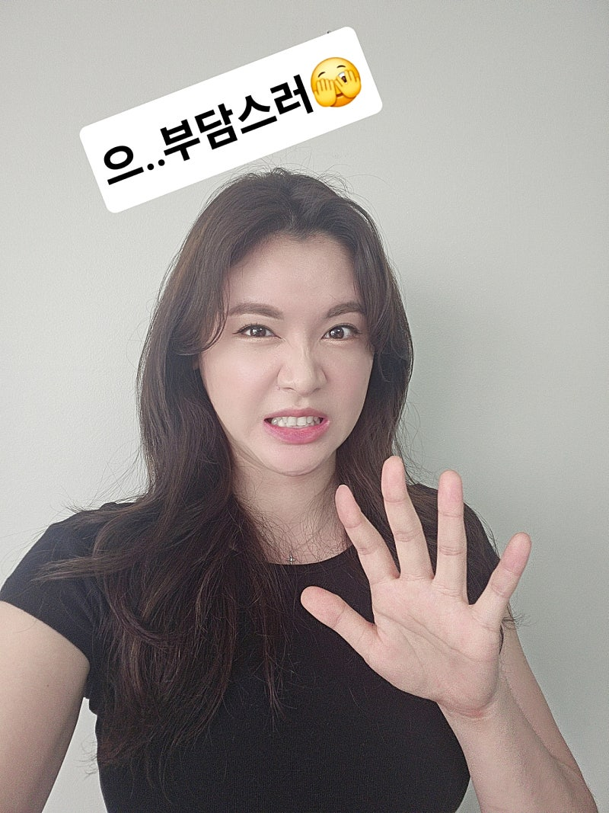

# 일한만큼 돈을 못 받는 이유

- 원천 ID: EPR-CAFE-25764
- 작성자: 주는사란
- 작성일: 2024-06-11T11:15:20.030000+09:00
- 원문: https://cafe.naver.com/ranschool/25764
- 수집일: 2026-09-21
- 텍스트 정리: HTML 문단 순서 유지, 빈 문단·제로폭 공백만 제거. 원본 HTML·JSON 별도 보존. 이미지는 아래에 모아 보관하며 원래 배치는 HTML에서 확인.

## 원문 본문

<!-- P001 -->
"똑같이 글을 쓰는데 왜 버는 돈이 달라요?"

<!-- P002 -->
"브랜드블로그 라는걸 했더니 초보자도 글 1개당 5만원씩 받아요" 라는 말을 처음 들으시는 분이 하는 말입니다.

<!-- P003 -->
체험단 블로그를 해보신 분은 잘 아실겁니다. 내 블로그에 xx맛집,xx후기 이런 글이죠. 보통 체험단 글은 '무료체험'과 원고료 1만원 이하로 보수를 받습니다. 내 노력에 비해 받는 돈이 적죠. 블로그에 글 쌓는데도 시간이 오래 걸리는데 심지어 매번 방문이나 체험을 하고 후기를 쓰는게 쉬운일은 아니니까요.

<!-- P004 -->
근데 브랜드블로그는 초보자여도 글 1개당 최소 3만원이상씩 받습니다. 그럼 왜 같은 일을 하는데 버는 돈이 다를까요?

<!-- P005 -->
바로 '책임감' 때문입니다. 회사를 다니는 분은 아실거예요. 내가 회사에 소속된 이상 내가 회사에서 잘못해도 책임은 '회사'가 집니다. 그래서 잘못하면 상사한테 혼나는겁니다. 상사가 같이 책임을 져야하니까요. 진급을 할 수록 월급이 높아지는 이유도 똑같습니다. 책임져야 할 부분이 많아지기 때문이죠.

<!-- P006 -->
반대로 생각하면 회사는 '책임'을 져주기 때문에 우리에게 많은 일을 시키고 막상 월급은 그만큼 주지 않는겁니다. 아니 정확히 말하면 주지 못하는 겁니다. 책임을 져야하니까요.

<!-- P007 -->
책임지는 부분이 클수록 받는 돈이 많아집니다.

<!-- P008 -->
브랜드블로그에 써주는 글은 초보자는 최소 3~5만원 / 중수는 5~10만원 / 고수는 최소 10만원 이상을 받습니다. 현재 브블인 기준 최소 건당 20만원이상 받습니다.

<!-- P009 -->
이걸 이렇게 착각하는 분이 계세요. "아 아는게 많아지면 돈을 더 많이 받는구나" "포트폴리오가 쌓이면 더 많이 받는구나" 라구요. 아닙니다. 포트폴리오가 많아서 돈을 더 받는게 아니구요. 아는게 많아져서 돈을 더 받는게 아닙니다.

<!-- P010 -->
아는게 많아져서 책임져줄 수 있는 부분이 많아서 돈을 더 받는거예요. 포트폴리오가 많아져서가 아니라 해본 업종이 많아서 책임져줄 확률이 높아져서 돈을 더 받는겁니다.

<!-- P011 -->
물론 어떤 분은 이게 너무 부담스러우실수도 있어요. 보통 수익화 하기 전에는 '빨리' 수익화하기를 원하지만, 막상 수익화를 하면 부담감이 몰려오거든요. 근데 이것도 잘못된 생각이예요. 책임은 내가 지는게 아닙니다. 내 글쓰기 실력이 책임지는 거예요. 그리고 그 글쓰기 실력은 제 글쓰기 공식을 따라했기 때문에 낮아질리는 없습니다. 그니깐 여러분이 제 글쓰기 공식을 똑바로 따라한다면 책임감을 느낄 필요가 없습니다.

<!-- P012 -->
책임감때문에 부담스럽다는건 제 글쓰기 공식을 제대로 따라하지 않았기 때문이예요. 다시한번 봐보세요.

<!-- P013 -->
문제점

<!-- P014 -->
리뉴얼 강의에서 해당되는 부분

<!-- P015 -->
어떤 내용의 글을 써야하는지 개요 정리부터 어렵다?

<!-- P016 -->
19강~20강

<!-- P017 -->
막상 글을 다 썼는데 글 내용이 별로인 것 같다?

<!-- P018 -->
21강 ~ 25강

<!-- P019 -->
글 내용이 비슷하다?

<!-- P020 -->
27강 ~ 30강

<!-- P021 -->
*현재 28강까지만 리뉴얼되어있습니다.

## 본문 이미지

## 원문에 포함된 링크

- #
