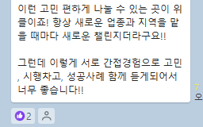
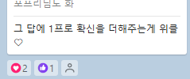

# 똑바로 하는건가 싶을때

- 원천 ID: EPR-CAFE-25856
- 작성자: 주는사란
- 작성일: 2024-06-13T16:00:00.880000+09:00
- 원문: https://cafe.naver.com/ranschool/25856
- 수집일: 2026-09-21
- 텍스트 정리: HTML 문단 순서 유지, 빈 문단·제로폭 공백만 제거. 원본 HTML·JSON 별도 보존. 이미지는 아래에 모아 보관하며 원래 배치는 HTML에서 확인.

## 원문 본문

<!-- P001 -->
초등학생때부터 친했던 한 친구가 있어요. 그 친구는 어릴 때부터 날씬한 몸은 아니었어요. 30대가 될 때까지 몸매가 똑같았죠. 다이어트를 해본적도 없었어요. 해야할 필요를 못 느꼈거든요.

<!-- P002 -->
6개월전 그 친구는 갑자기 다이어트를 하겠다고 했어요. 건강검진을 받았는데 당뇨 초기 증상이 있다며 다이어트가 꼭 필요하다고 했다더라구요. 30대에 당뇨라는 이야기를 들으니 충격적이었었나봐요.

<!-- P003 -->
그렇게 그 친구는 6개월만에 15kg를 뺐어요. 아주 건강하게요.

<!-- P004 -->
그래서 물어봤죠. "아니 어떻게 뺐어?" 친구는 이렇게 대답했어요. "다이어트 하기가 어렵냐? 마음먹기가 어렵지" 라구요.

<!-- P005 -->
전 맞다고 대답했지만 이 대답이 너무 이상하게 느껴졌어요. 그냥 마음 먹으면 되는거 아닌가?

<!-- P006 -->
그때 알았어요. 마음을 먹는다는 건 단순히 생각을 바꾸는 게 아니라는걸요. 마음을 먹는다는건 내가 어떤걸 포기했을 때 더 가치있는 것을 얻을 수 있다는 확신이 필요한 거였어요.

<!-- P007 -->
플라시보 효과라는 말을 들어보셨을 거예요. 실제 약이 아니라 가짜 약을 먹어도 실제 약이라고 믿으면 치료효과가 나타난다는 이야기입니다.

<!-- P008 -->
결국 중요한 건 무엇을 믿느냐가 아니라, 얼마나 강하게 믿느냐예요.

<!-- P009 -->
아직 스스로의 글에 확신이 없으신가요? 아래 중에 무엇이 문제인지 확인해보세요.

<!-- P010 -->
1. 같은 시간에 쓸 수 있는 글의 갯수가 달라져야 합니다.

<!-- P011 -->
2. 상위노출 하는 글이 늘어나야 합니다.

<!-- P012 -->
3. 각 글의 조회수가 늘어야 합니다.

<!-- P013 -->
4. 글을 더 오래 보도록 할수 있어야 합니다.

<!-- P014 -->
5. 목표하는 키워드의 검색량이 늘어야 합니다.

<!-- P015 -->
6. 글마다의 내용 퀄리티가 유지 돼야 합니다.

<!-- P016 -->
7. 같은 내용의 글도 다양하게 바꿔 쓸 수 있어야 합니다.

<!-- P017 -->
8. 뻔한 내용을 뻔하지 않게 말할 수 있어야 합니다.

<!-- P018 -->
9. 내 (내가 마케팅하고 있는 사장님) 이야기를 넣을 수 있어야 합니다.

<!-- P019 -->
10. 문의가 안 온다면, 뭐가 문제인지 찾을 수 있어야 합니다.

<!-- P020 -->
그래도 모르겠다면 다음달에 열심히 하셔서 위클(위너스클럽 줄임말)에 오시면 됩니다 ㅋㅋㅋ

## 본문 이미지

## 원문에 포함된 링크

- #
