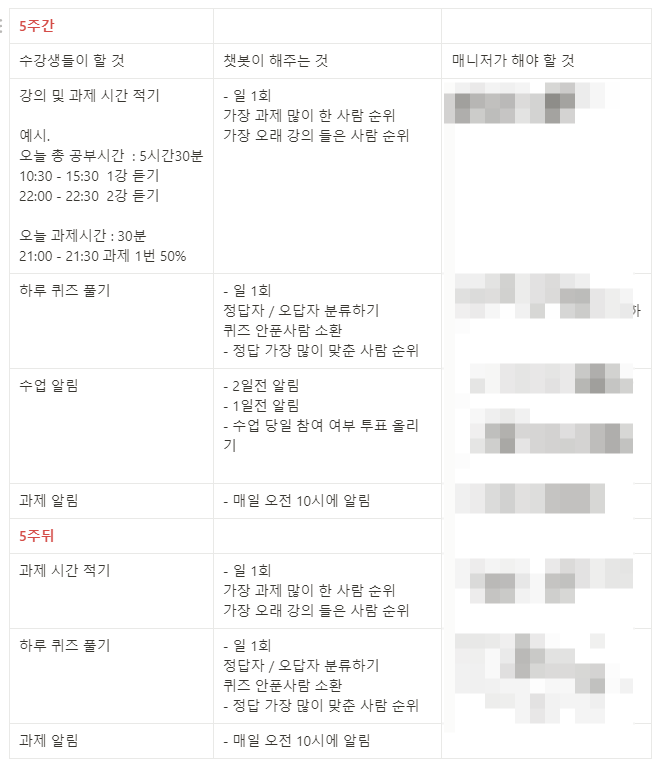
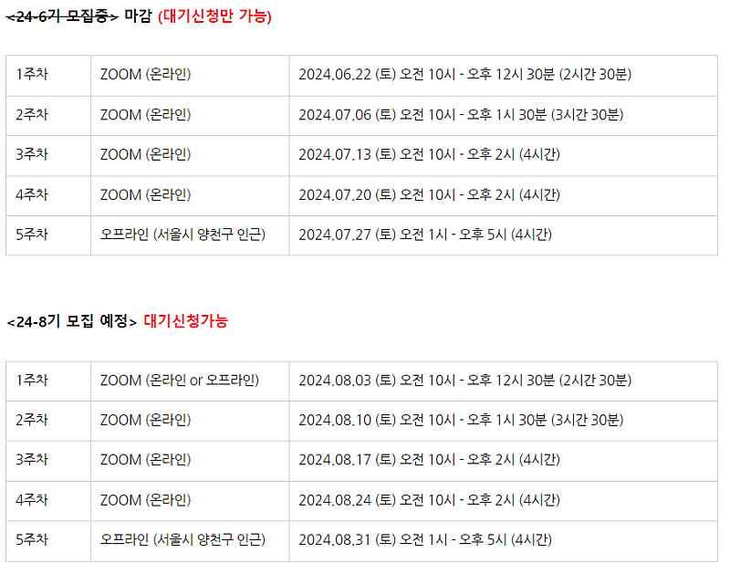

# 수익화 못하지 못하도록 하는 '봇' 개발중

- 원천 ID: EPR-CAFE-25990
- 작성자: 주는사란
- 작성일: 2024-06-18T12:15:42.890000+09:00
- 원문: https://cafe.naver.com/ranschool/25990
- 수집일: 2026-09-21
- 텍스트 정리: HTML 문단 순서 유지, 빈 문단·제로폭 공백만 제거. 원본 HTML·JSON 별도 보존. 이미지는 아래에 모아 보관하며 원래 배치는 HTML에서 확인.

## 원문 본문

<!-- P001 -->
일요일에 친구 커플이 결혼했어요. 저는 이상하게 결혼식만 가면 눈물이 나요. (눈물 많은 T랍니다 ㅎㅎ)

<!-- P002 -->
제가 결혼을 마음먹어서도 있구요. 그들의 도전이 멋있어서요.

<!-- P003 -->
30대 중반이 가까워지니깐 누군가를 만나기 위해 시도하는 것 자체가 도전이 되버리더라구요. 참 슬퍼요. 시간과 감정을 낭비하고 싶지 않다는 이유로 그 사람을 제대로 알기도 전에 빨리 판단해 버리더라구요. 아무리 좋아도 일단 '결혼할 사람 vs 아닌 사람' 을 나눕니다. 그리고 아니라는 생각이 들면 바로 헤어지죠.

<!-- P004 -->
어쩌면 이렇게 사는게 합리적일지도 몰라요. 저도 한때는 이랬어요. 나만 미친듯이 사랑해주고 아껴주고, 자신의 분야에서 최선을 다하는 그런 남자를 찾아다녔어요. 없더라구요??? ㅋㅋㅋㅋㅋㅋㅋ

<!-- P005 -->
근데 없는게 아니라 내가 못 본거 였어요.

<!-- P006 -->
내가 그런 사람이 아니니 그런 사람이 보일리가 없죠. 내가 내 분야에서 최선을 다하지 않으니깐 최선을 다하고 있는 사람이 누군지를 알리가 없죠. 내가 사랑을 주는 방법을 모르니깐 내게 이미 사랑을 주고 있는 사람이 보일리가 없죠.

<!-- P007 -->
이게 꼭 사랑만 그런건 아니더라구요. 돈을 버는 일도 그랬어요. 도전을 해본적이 없는 사람은 어떤게 기회인지 모르죠. 또 계속 실패한 사람은 어떤 도전이 올바른 방향인지도 잘 안보입니다.

<!-- P008 -->
"내가 지금 똑바로 가고 있는게 맞나?" 라는 방향은 누군가가 옆에서 계속 말해주지 않으면 잘 안보여요. 근데 저는 마침 그런 잔소리를 하는걸 참 좋아하거든요? 그래서 저는 제가 잔소리를 하기로 했어요. 여러분에게요. 그게 좋아서 여기 계신거 맞으시죠...? ㅎㅎㅎㅎ 제가 또 K-장녀 거든요.

<!-- P009 -->
이번주 토요일부터 블로그 그룹PT가 시작됩니다. 아마 이번이 첫 기수라 제가 더 많이 심혈을 기울였어요. 이번에 하신 분들이 안되면 저 망하잖아요 ㅋㅋㅋㅋㅋㅋㅋㅋㅋ그래서 제가 그룹PT는 최첨단(?)으로 방향을 계속 점검하기 위해 잔소리 봇을 만들고 있어요.

<!-- P010 -->
그룹PT는 5주간 진행되지만 5주뒤에도 그 후 4개월간 어떻게 연습하는지 정해드릴겁니다. 그리고 잔소리봇이 여러분께 지속적으로 잔소리를 해드릴거예요.

<!-- P011 -->
이렇게요.

<!-- P012 -->
대기 모집중

## 본문 이미지

## 원문에 포함된 링크

- #
