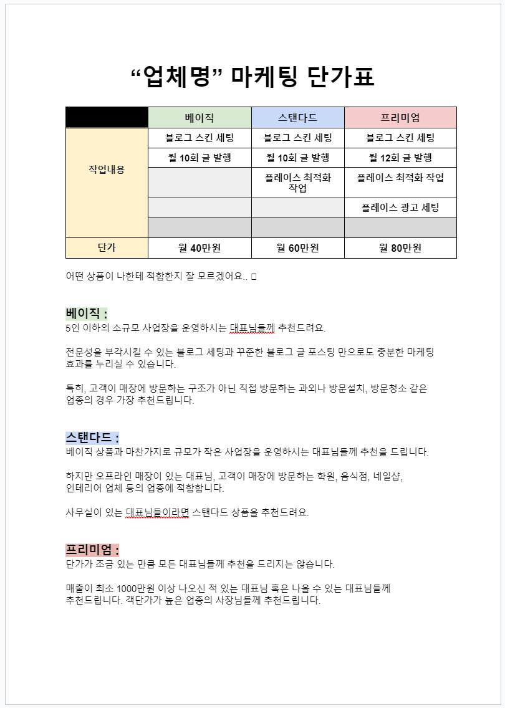

# 계약 전 상담 예시글 (1)

- 원천 ID: EPR-CAFE-26016
- 작성자: 주는사란
- 작성일: 2024-06-19T11:43:27.870000+09:00
- 원문: https://cafe.naver.com/ranschool/26016
- 수집일: 2026-09-21
- 텍스트 정리: HTML 문단 순서 유지, 빈 문단·제로폭 공백만 제거. 원본 HTML·JSON 별도 보존. 이미지는 아래에 모아 보관하며 원래 배치는 HTML에서 확인.

## 원문 본문

<!-- P001 -->
마케팅 대행 부업이란, 마케팅을 대신 해주고 돈을 받는 부업입니다. 이 부업의 가장 큰 장점은 돈을 먼저 받고 일을 시작할 수 있다는 점이구요. 내가 마케팅을 할 수 있게 되고, 장기 계약을 하면 매달 수입이 될수 있다는 점이죠.

<!-- P002 -->
단점도 있습니다. 바로 먼저 사장님한테 "내가 어떻게 마케팅을 해줄지" 설득을 해야한다는거죠. 순서로 보면 이렇습니다.

<!-- P003 -->
사장님에게 영업

<!-- P004 -->
계약전 상담

<!-- P005 -->
계약

<!-- P006 -->
실제 마케팅을 위한 정보받기

<!-- P007 -->
근데 보통 영업보다 '계약전 상담' 을 어려워 하시더라구요.

<!-- P008 -->
사장님에게 영업

<!-- P009 -->
계약전 상담

<!-- P010 -->
계약

<!-- P011 -->
실제 마케팅을 위한 정보받기

<!-- P012 -->
그래서 오늘은 그 예시를 적어보겠습니다. 아래 예시는 이런 사장님과 상담할때 이야기 하시면 됩니다.

<!-- P013 -->
- 오프라인 홍보만 해본 사장님

<!-- P014 -->
- 전단지를 돌려본 사장님

<!-- P015 -->
- 전단지로 효과를 못 본 사장님

<!-- P016 -->
만약 위 3가지에 해당되는 사장님을 만났다는 가정하에 아래 내용을 외워서 말하시면 됩니다. 앞으로 이런 예시글을 주기적으로 적어드릴테니 케이스별로 암기하시고 그대로 말하세요.

<!-- P017 -->
🔔🔔🔔🔔🔔🔔🔔🔔🔔🔔🔔!!!!!!!!!!!암기 할 부분 시작!!!!!!!!!!!!!🔔🔔🔔🔔🔔🔔🔔🔔🔔🔔🔔

<!-- P018 -->
멘트 시작 전 확인 대화

<!-- P019 -->
자 그럼 지금부터 '암기' 하시면 됩니다. 질문 톤 예시 녹음 파일입니다.

<!-- P020 -->
나 : 사장님 혹시 전단지 뿌려본적 있으신가요?

<!-- P021 -->
사장님 : 네 뿌려봤어요. 근데 효과가 어쩌고~

<!-- P022 -->
*예상 답변

<!-- P023 -->
- 아예 없다 파

<!-- P024 -->
- 보통 있었을 때도 있는데, 요즘은 없다파

<!-- P025 -->
보통 이 둘 중 하나로 나뉨

<!-- P026 -->
나 : 전단지 보통 얼마나 뿌려보셨어요?

<!-- P027 -->
사장님 : 뭐 대충 이정도 어쩌고 ~

<!-- P028 -->
*예상 답변

<!-- P029 -->
- 아예 없다 파 : 1-2번 뿌리다 말았다고 할 것. 아마 사무실에 남은 전단지가 쌓여있을 것

<!-- P030 -->
- 좀 있었다 파 : 주기적으로 뿌렸고 지금도 뿌리고 있을 가능성, 보통 아주머니 써서 대신 뿌림, 혹은 아예 집앞에 붙이는 알바 쓰기도 함

<!-- P031 -->
위 예상 답변 안에서 사장님이 이야기 한다면, 아래 암기 후 그대로 말하시면 됩니다. 아래 밑줄 부분은 사장님에 맞게 바꿔서 말하시면 됩니다.

<!-- P032 -->
아래 제가 어떻게 말해야하는지 제가 말한 녹음 파일도 첨부되어있습니다. 들으면서 암기하세요!

<!-- P033 -->
상담 시작

<!-- P034 -->
*시간대 별로 시작점을 다르게 하세요

<!-- P035 -->
*아래는 블로그 편이며, 플레이스 편도 업뎃 하겠습니다.

<!-- P036 -->
어떻게 말해야하는지 제가 말한 녹음파일입니다. 지나다니면서 노래 듣지 말고 제 목소리를 들어보심이...?😊

<!-- P037 -->
*시작점 1 (상담시간 : 30분 이상)

<!-- P038 -->
저도 마케팅을 하다보면 (사장님 / 원장님 / 기술자)들을 많이 만나는데요. 대부분 오프라인 홍보를 한다고 하면 '전단지 홍보'를 하시곤 해요. 근데 보통 이 전단지 홍보를 한 사장님에게 "혹시 왜 전단지 홍보 시작 하셨나요?" 라고 여쭤보면 답변이 거의 비슷하더라구요. '뭐라도 해야 할 것 같아서요' 정도로 이야기 하세요.

<!-- P039 -->
그럼 보통 언제 전단지를 돌릴지 고민하시나 보면, 창업후 6개월부터 입니다. 왜냐면 일단 4개월까지는 오 픈빨과 재방문으로 버티거든요. 근데 6개월이 지나면 내가 투자한 돈과 지금까지 번 돈을 비교했을때 약간 불안해진다고 하시더라구요. 그래서 그냥 다들 한다는 '전단지' 한번 돌려보는거죠.

<!-- P040 -->
여기서 효과를 본 분들은 사장님처럼 (만약 효과가 있었다는 사장님이라면) 주기적으로 돌리시기도 하구요. 만약 처음 한 두번 돌렸는데 효과가 없는 분들은 사장님처럼 (만약 효과가 전혀 없었던 사장님이라면) 아예 안 돌리시기도 합니다.

<!-- P041 -->
*시작점 2 (상담시간 : 15분)

<!-- P042 -->
근데 이 전단지가 효과가 있냐 없냐는 사장님이 잘못하셨다기 보다는 시기에 따라 다릅니다. 그니깐 효과가 있을 때가 있고 없을때가 있다는 거죠.

<!-- P043 -->
제가 아시는 분도 10년간 학원이랑 음식점 운영하면서 전단지를 80만장 정도 돌려보신 분이 있거든요? 보통 전단지 최소수량이 4000장이잖아요. 그거 한 20번 정도 돌리셨어요. 근데 시기가 너무 중요하다고 하시더라구요. 그걸 일단 말씀드려볼게요. 이걸 이해하시면 온라인 마케팅도 이해하시기 쉬우실것 같아서요.

<!-- P044 -->
시기가 왜 중요하냐면요. 전단지 돌리는 목적을 생각해보시면 됩니다. 사실 사장님이 전단지 돌리시는 이유가 내 매장을 근처 사람들에게 알리기 위함이잖아요. 그니깐 (지역명) 근처 고객들이 이 매장을 알고 오면 되는거죠. 근데 그러려면 일단 두가지가 있어야 해요.

<!-- P045 -->
1. (지역명) 근처 고객들이 (상호명)을 알아야 하구요.

<!-- P046 -->
2. (지역명) 근처 사람들이 (상호명)을 알고, 관심이 있어야 합니다.

<!-- P047 -->
모르는 고객이면 (상호명)을 올수가 없고, 알아도 관심이 없으면 (상호명)를 안 올 테니까요. 그래서 일단 (지역명) 근처 고객들이 (상호명) 를 아는지가 중요해요. 근데 (상호명) 은 (몇년) 정도 되었으니깐 아마 (지역명) 근처 고객들이 (알것 / 잘 모를 것) 같아요. 그래서 여기는 일단은 전단지를 (안 뿌려도 됩니다 / 한번쯤은 뿌리는게 좋을것 같습니다)

<!-- P048 -->
그리고 그 외에도 전단지를 뿌려야 하는 경우가 있는데요. (상호명) 가 큰 변화가 있을 때예요. 인테리어 공사로 리뉴얼을 했다거나, 사장이 바뀌었다거나, 대폭 할인한다거나 등이요. 이럴때는 일부로 알리지 않으면 고객들이 (상호명) 의 변화를 알수 없으니깐 일부로라도 알려야 하는거죠. 근데 사실 할인 말고 다른 경우는 자주 하긴 어려운 일이죠. 그렇다고 매번 할인으로만 고객을 모집하고 싶지도 않구요.

<!-- P049 -->
이럴때 전단지를 돌려야 하는 이유는 고객에게 끌릴만한 요소가 있어야 되기때문에 그렇습니다. 아니면 솔직히 지나가다가 전단지 잘 받지도 않구요. 받아도 주는 분에게 거절하기 죄송해서 받는 경우가 많거든요.

<!-- P050 -->
물론 이런 경우가 아니라도 전단지를 보고 고객이 오는 경우가 있어요. 이미 (업종)  에 관심이 있었던 거죠. (업종)  를 어짜피 하려고 마음 먹었는데 마침 사장님 전단지를 받게 되는 경우입니다. 이게 (업종)  마다 다르지만 제가 사장님들에게 여쭤보니깐 평균 2000장 돌리면 1명 이런 고객을 만날까 말까입니다. 그래서 사장님이 지금까지 전단지 효과가 (거의 없었던 거예요. / 가끔만 있었던 거예요)

<!-- P051 -->
*시작점 3 (상담시간 : 5분)

<!-- P052 -->
요즘 온라인 마케팅 그 중에서도 특히나 블로그를 하는 이유는 이런 전단지를 딱 받을 사람에게만 나눠줄수 있기 때문입니다. 솔직히 전단지 뿌렸는데 그 근처에 내 전단지 떨어져있는거 보면 마음 아프잖아요. 그리고 전단지 배포하는 것도 보통 장당 60원 정도 받는데 4000장만 돌리려고 해도 24만원입니다. 전단지 제작하고 배포까지 하면 4000장 기준으로 최소 30만원 이상 들어가죠. 그렇게 돈들여서 뿌려놓아도 그때 잠깐 뿌리고 끝이구요.

<!-- P053 -->
근데 블로그는 한번 쓰면 일단 글이 계속 남아있습니다. 물론 항상 떠있는건 아니지만 계속 쓰다보면 심지어 내 가게가 고객한테 보이는 시간이 점점 늘어나구요. 그리고 그 글은 어짜피 사장님꺼거든요.  그래서 전단지 30만원 주고 뿌릴 바에는 보통 블로그는 건당 5만원이라고 하면 최소 6개 정도는 쓸 수 있는데요. 그중 글 1개만 잘써도  (그 지역명 키워드 검색량) 의 고객에게 내 가게를 알릴 수 있는거예요.

<!-- P054 -->
이 뒤로부터는 본인이 받고 싶은 단가를 선정 후 말씀하시면 됩니다. 아래는 제 블로그 강의를 들었다는 가정하에 6개월 미만 초보자기준 평균 단가표입니다. 아래 양식을 다운 받으셔서 수정 가능합니다.

<!-- P055 -->
이래도 안하시면.....

## 본문 이미지

## 원문에 포함된 링크

- https://downapi.cafe.naver.com/v1.0/cafes/article/file/9a79988b-2de7-11ef-b408-0050568d80e1/download
- https://downapi.cafe.naver.com/v1.0/cafes/article/file/753f576f-2de9-11ef-ace7-0050568da23d/download
- https://downapi.cafe.naver.com/v1.0/cafes/article/file/4a3829f3-2de5-11ef-b1a0-0050568dd43a/download
- #

## 첨부파일 보관

- [마케팅 단가 견적표.docx](<../첨부파일/26016_마케팅 단가 견적표.docx>) — saved. 첨부 음성은 전사·내용 검토 전.
- [질문 녹음파일.m4a](<../첨부파일/26016_질문 녹음파일.m4a>) — saved. 첨부 음성은 전사·내용 검토 전.
- [영업전 계약 상담 (1) 전단지.MP3](<../첨부파일/26016_영업전 계약 상담 (1) 전단지.MP3>) — saved. 첨부 음성은 전사·내용 검토 전.
