# 마케팅대행, 연차별 시급 변화표

- 원천 ID: EPR-CAFE-26168
- 작성자: 주는사란
- 작성일: 2024-06-24T11:52:21.980000+09:00
- 원문: https://cafe.naver.com/ranschool/26168
- 수집일: 2026-09-21
- 텍스트 정리: HTML 문단 순서 유지, 빈 문단·제로폭 공백만 제거. 원본 HTML·JSON 별도 보존. 이미지는 아래에 모아 보관하며 원래 배치는 HTML에서 확인.

## 원문 본문

<!-- P001 -->
마케팅 대행 부업이란, 어떤 한 가게를 운영하는 사장님을 위해 마케팅을 대신 해주고 돈을 받는 부업이라고 했습니다. 당연히 이 부업의 핵심은 사장님의 가게 매출을 올려줄만한 마케팅 실력입니다. 근데 이 글을 보는 대부분의 분들은 마케팅을 잘 하실줄 모르겠죠.

<!-- P002 -->
이런 분에게 저는 블로그를 가장 먼저 추천하곤 합니다. 왜냐면 마케팅 원리를 몰라도, 전략이 없어도, 정해진 포맷대로 글만 대신 써주면 사장님에게 도움을 줄 수 있기 때문입니다. 당연히 그럼 나도 계속 돈을 받을수 있게 되겠죠.

<!-- P003 -->
근데 블로그를 하라고 하면 혹은 블로그를 막상 해보면 생각보다 시간이 오래걸립니다. 그럼 "아씨...이거 막상 따지면 최저시급도 안나오는거 아니야?"라는 생각이 들때도 있습니다.

<!-- P004 -->
그래서 오늘은 연차(?)별 마케팅대행으로 받을수 있는 시급 변화표를 알려드리겠습니다. 아래 변화표를 보시면 "얼마나 공부했을때 시간당 얼마를 벌수 있는지"를 알수 있습니다. 먼저 변화표를 알려드리기 전 주의사항 2가지부터 말씀드리겠습니다.

<!-- P005 -->
1. 1년마다 시급이 바뀌는건 아닙니다.

<!-- P006 -->
마케팅 대행으로 시급이 바뀌는 기간은 제 수강생 기준 평균 6/9/12개월 단위로 보고 있는데요. 그래서 연차라는 표현이 적당하진 않지만 편의상 연차라는 표현으로 말씀드리겠습니다.

<!-- P007 -->
2. 시급이라는 표현을 쓰진 않습니다.

<!-- P008 -->
마케팅 대행 계약을 할때는 '건당' 혹은 '월별' 관리비용을 기준으로 돈을 받습니다. 그니깐 '시간' 단위로 돈을 받는게 아니고, '업무량' 단위로 돈을 받는겁니다. 그래서 사실 마케팅 대행에서 '시급'이라는 표현은 쓰지 않죠.

<!-- P009 -->
근데 이 말은 반대로 말하자면 내 업무를 빨리 끝낼수록 시급이 높아질수 있다는 겁니다. 물론 이 시급을 높일때 가장 중요한건 '사장님의 매출을 올려주면서 빨리 끝내야한다'는 것이죠. 월급루팡을 하고 싶다고 회사에 출근자체를 안하면 그냥 해고를 당할테니까요. 매출을 올려주지 못하면 시급이 높아지는게 아니라 해고를 당합니다.

<!-- P010 -->
그래서 아래 시급 변화표는 퀄리티를 떨어지지 않는다는 (제가 강의에서 알려드린 글쓰기 공식)을 지킨다는 가정하에 작성했습니다.

<!-- P011 -->
시급은 초보 / 중수 / 고수 3가지 스텝을 기준으로 나눴습니다. 각 기준을 알아볼게요.

<!-- P012 -->
1. 초보자

<!-- P013 -->
초보자는 블로그 글 100개미만으로 작성한 분을 말합니다.

<!-- P014 -->
수강생 기준 평균 6개월까지는 초보자입니다. 이 말이 수익화전에 100개를 써야한다는 말은 아니예요. 보통 첫 수익화는 3개월내로 하며, 수익화를 한 후 글 100개 쓸때까지 시급이 잘 변하지 않는다는 말씀을 드리는겁니다.

<!-- P015 -->
추가로 여기서 블로그 글이란, xx후기 등 체험단 블로그 글은 제외되며, 브랜드 블로그 글만 해당됩니다. 그럼 브랜드블로그글은 뭐냐? 내가 쓴 글을 누가 볼지를 정해놓고, 그 사람에게 특정한 행동을 요구하는 글 이어야 합니다.

<!-- P016 -->
예를 들어, 필라테스 학원에 관한 글을 쓴다고 해보겠습니다. 체험단 블로그에서는 이런식으로 쓸겁니다. "xx필라테스 후기, 시설좋고 잘가르쳐요. 여기로 오세요. 지금 할인이벤트 합니다" 이런 글은 특정 행동 (문의)을 요구하는 글이긴 하지만, 내가 쓴 글을 누가 볼지 정해져있지 않습니다. 누구든 보고 연락하라는거죠. 그럼 아무도 연락하지 않습니다.

<!-- P017 -->
브랜드 블로그 글은 똑같이 특정행동(문의)를 요구하는 글이지만, 내가 쓴 글을 누가 볼지 정해놔야 합니다. xx지역에 살면서 다이어트를 하고 싶어서 필라테스를 알아보는 사람 이런식이죠.

<!-- P018 -->
파트별로 봐볼게요. 아래는 체험단블로그와 브랜드블로그 제목 예시입니다.

<!-- P019 -->
(왼) 체험단블로그 제목예시  (오) 브랜드블로그 제목예시

<!-- P020 -->
아래는 체험단블로그와 브랜드블로그 첫 줄 예시입니다.

<!-- P021 -->
(왼) 체험단블로그 첫 줄 예시  (오) 브랜드블로그 첫 줄 예시

<!-- P022 -->
아래는 체험단블로그와 브랜드블로그 마지막 부분 예시입니다.

<!-- P023 -->
(왼) 체험단블로그 마지막부분 예시  (오) 브랜드블로그 마지막부분 예시

<!-- P024 -->
2. 중수

<!-- P025 -->
중수는 블로그 글 100개 이상 작성했거나 월 300이상 버는 분을 말합니다. 수강생 기준 초보자 6개월기간이 넘어가면 중수로 넘어오시곤 합니다.

<!-- P026 -->
3. 고수

<!-- P027 -->
월 300만원 이상을 6개월 이상 유지하신 분입니다. 돈을 더 버는 것보다 유지하는게 더 중요하고 어렵거든요. 빠르면 시작한지 9개월부터 고수단계로 넘어오시곤 합니다.

<!-- P028 -->
자 그럼 시급에 영향을 주는 요인을 알아보겠습니다. 이걸 알아야 시간당 얼마 벌수 있는지를 알수 있으니까요.

<!-- P029 -->
시급에 영향을 주는 요인 3가지

<!-- P030 -->
마케팅대행에서 시급에 영향을 주는 요인은 3가지 입니다. 단가 / 소요시간 / 추가상품 이죠.

<!-- P031 -->
1) 단가

<!-- P032 -->
블로그를 기준으로 한다면 건당 얼마를 받았냐에 따라 시급에 영향을 받을겁니다. 당연하지만 내 실력이 늘면 건당 페이가 늘어납니다. 블로그 1건당 초보자기준 3~5만원 / 중수기준 5~10만원 / 고수기준 20만원 이상이죠. 페이는 늘어나지만 소요시간은 대폭줍니다. 글을 많이 써보면 본인의 글 스타일이라는게 정해집니다. 그럼 그 스타일대로만 쓰게 되면 글쓰는 시간은 대폭 줄죠.

<!-- P033 -->
어제 위너스클럽 (수강생중 수익화에 성공하신 분들 모임) 스터디를 했습니다. 위클분들 기준으로 계산해보니 건당 4~8만원대가 평균이었습니다.

<!-- P034 -->
2) 소요시간

<!-- P035 -->
돈을 아무리 많이 받아도 오래 걸리면 시급이 낮아질수 밖에 없습니다. 많이 일을 하고 많이 버는 것도 좋지만 시간대비 효율이 나는 일을 하고 싶으실테니까요. 개인적으로 저도 어떤 일을 '업'으로 하려면 당연히 시급을 계산해보는건 중요하다고 생각합니다. 시급이 낮다는건 내 가치를 제대로 인정받지 못하고 있는걸수도 있으니까요.

<!-- P036 -->
블로그 기준으로 글을 쓰는데 얼마나 걸리느냐 하는건 사람마다 너무 다릅니다. 기존에 글을 얼마나 써봤냐에 따라 이해하시는게 다르니까요. 그래도 제 수강생 평균 기준을 말씀드려보자면 이렇습니다. 쌩초보자 (글 30개 이하) 8시간 / 초보자 (글 30개 이상 ~ 글 100개이하) 3-4시간 / 중수 2시간 / 고수 2시간 이하 로 소요됩니다.

<!-- P037 -->
현재 위너스클럽에서는 매일 업무시간을 체크해서 올려주고 계신데요. 위클분들 기준 2~3시간 사이입니다.

<!-- P038 -->
3) 추가상품

<!-- P039 -->
마케팅대행으로 시급을 올리는 가장 쉬운 방법은 추가상품입니다. 마케팅이라는게 꼭 하나의 방법으로 한다고해서 매출이 오르는건 아니거든요. 그래서 어짜피 매출을 올려줘야하면 돈을 조금 더 받고 같이 관리해주는게 효과를 내기 더 좋습니다.

<!-- P040 -->
추가상품으로는 보통 블로그로 시작해 추가상품으로 플레이스를 같이 판매합니다. 물론 반대로도 합니다. 플레이스를 맡고 있다가 블로그를 써주는 형태로 하기도 하죠. 이건 업종마다 효과가 있는 방법을 먼저 하고 서브로 맡아서 하기도 합니다.

<!-- P041 -->
물론 추가상품 구성에서 주의하실점은 일단 메인 종목(?) 하나는 제대로 해야한다는 겁니다. 블로그나 플레이스 둘중 하나는 똑바로 하고 있어야 한다는거죠. 아직 블로그도 글쓰는데 시간이 오래걸리는데 괜히 플레이스까지 맡으면 시급이 오히려 더 낮아집니다. 모르는 내용 공부하면서 하면 시간이 더 걸리거든요. 그래서 추가상품은 보통 최소 3개월 이상 대행을 유지하고 해당 업체와 사장님의 현황을 파악 후 그 뒤로 추가해서 하는게 좋습니다. 한번에 여러개 맡는건 초보자에게는 정말 비추입니다.

<!-- P042 -->
주의사항이 한가지 더 있는데요. 서비스로 추가상품을 해주지 마세요. 아마 블로그 대행을 맡다보면 "플레이스 이걸 바꾸면 좋을텐데" 이런 생각도 들구요. "당근마켓은 왜 이렇게 하지" 이런 생각도 듭니다. 그래서 좋은 마음에 "서비스로 이것까지 봐드릴게요."라고 하시는 분들이 있어요. 최악입니다. 공짜로 해준걸 다시 돈 받긴 어렵습니다. 만약 서비스로 하고 싶다면 처음에 2개월은 무료로 해드리지만 이후에는 '유료'로 전환된다는 점을 꼭 말씀해주셔야 해요. 서비스는 곧 내 시간입니다. 내 시간을 무료로 판매하지 마세요.

<!-- P043 -->
마케팅대행 연차별 시급표

<!-- P044 -->
그럼 위 내용을 정리해서 연차별 시급표로 정리해보겠습니다.

<!-- P045 -->
연차

<!-- P046 -->
기간

<!-- P047 -->
블로그 건당 단가

<!-- P048 -->
소요시간

<!-- P049 -->
시급

<!-- P050 -->
쌩초보자

<!-- P051 -->
(글 30개 이하)

<!-- P052 -->
2-3개월

<!-- P053 -->
3만원 이하

<!-- P054 -->
8시간

<!-- P055 -->
3750~6250원

<!-- P056 -->
초보

<!-- P057 -->
(글 100개 미만)

<!-- P058 -->
3~6개월

<!-- P059 -->
3~5만원

<!-- P060 -->
3-4시간

<!-- P061 -->
7500~12,500원

<!-- P062 -->
중수

<!-- P063 -->
(글 100개 이상

<!-- P064 -->
or 월 300 이상)

<!-- P065 -->
6~9개월

<!-- P066 -->
5~10만원

<!-- P067 -->
2시간

<!-- P068 -->
2.5~5만원

<!-- P069 -->
고수

<!-- P070 -->
(월 300이상 6개월 유지)

<!-- P071 -->
9개월 이후

<!-- P072 -->
20만원 이상

<!-- P073 -->
2시간 이하

<!-- P074 -->
10만원 이상

<!-- P075 -->
내 시급 올리고 싶다면

## 본문 이미지

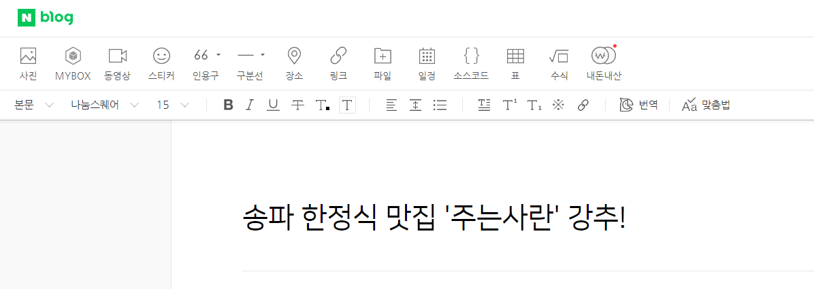

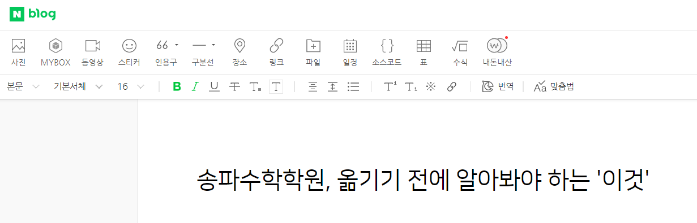

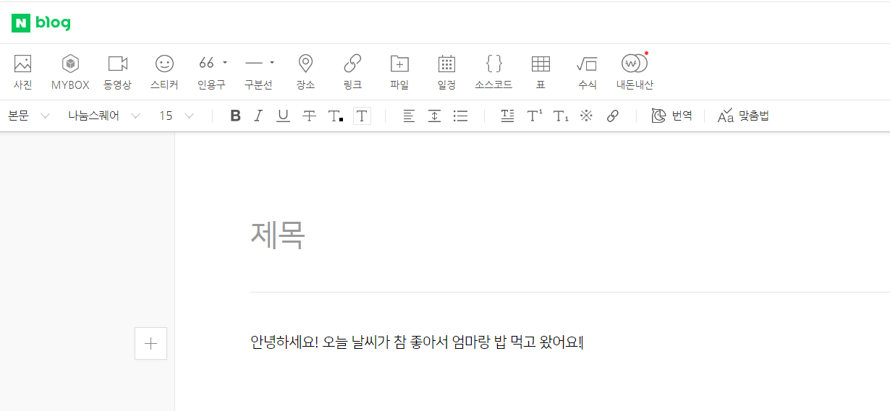

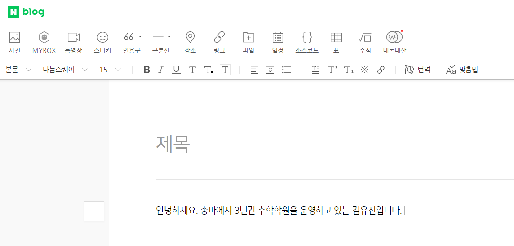

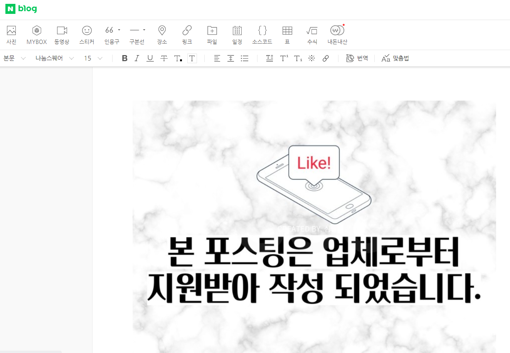

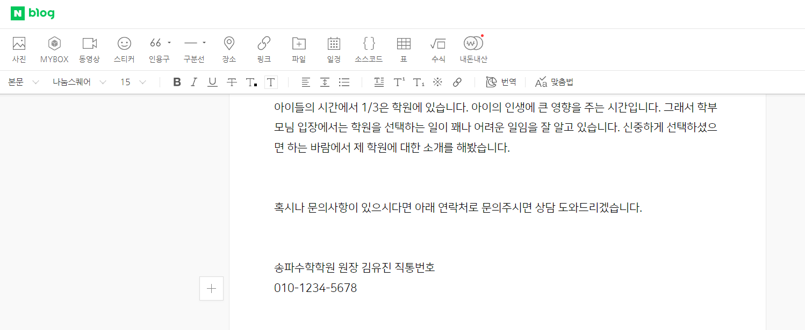

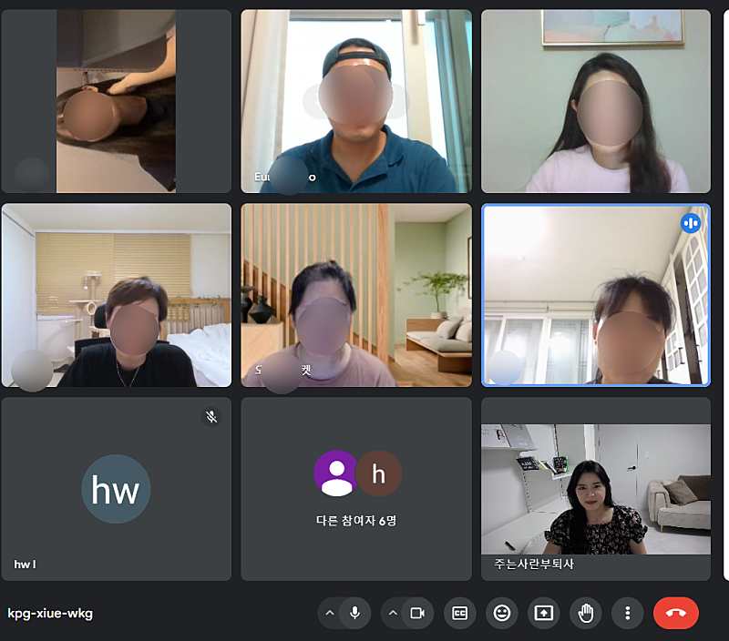

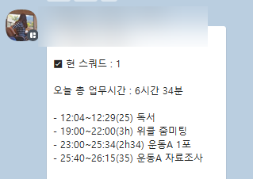

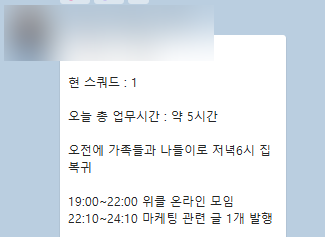

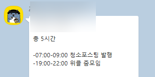

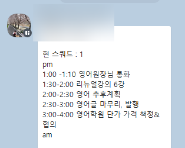

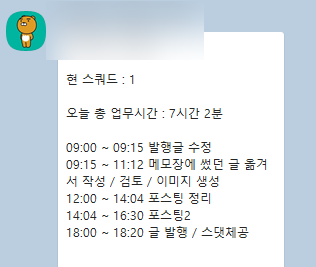

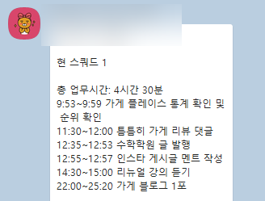

## 원문에 포함된 링크

- #
