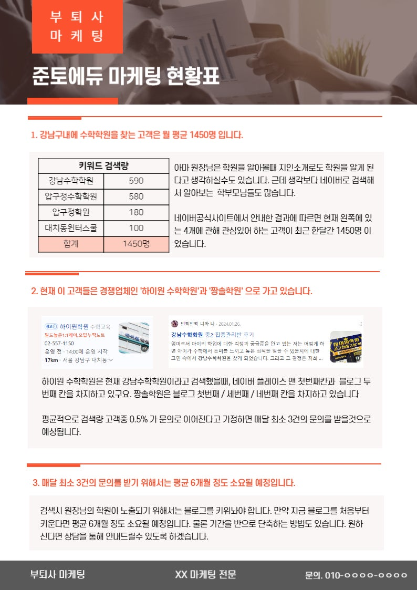
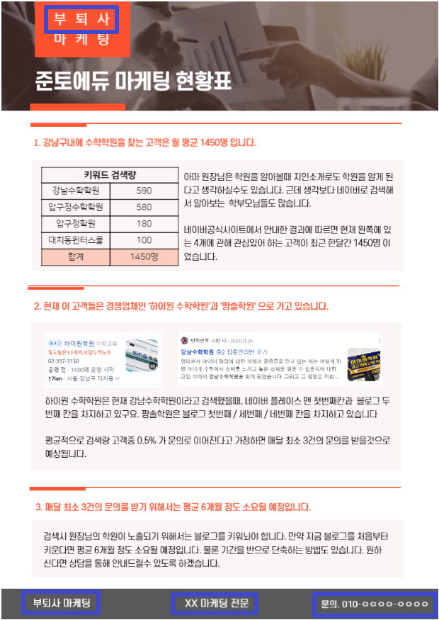
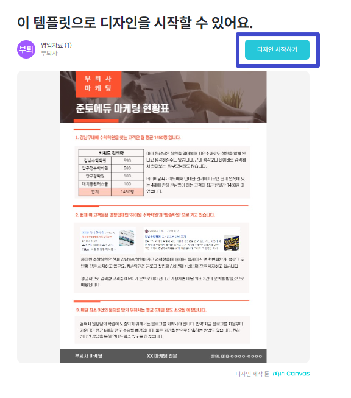
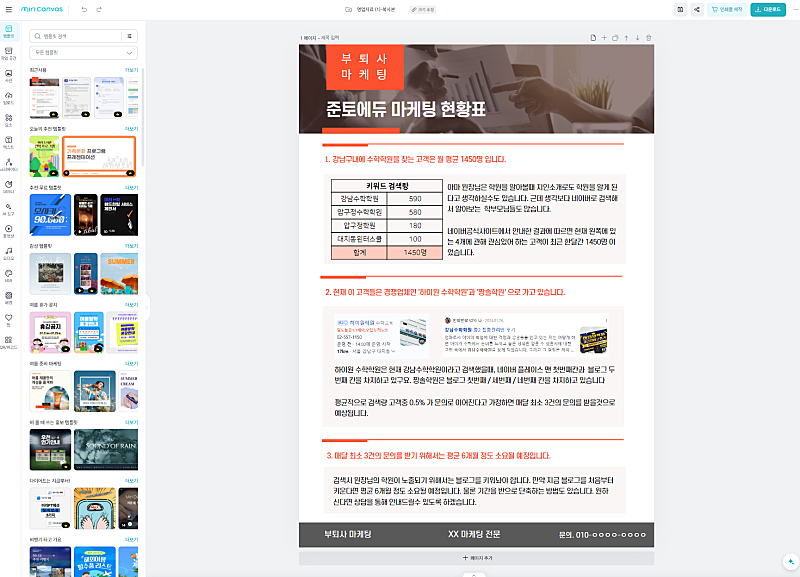

# 마케팅대행 영업자료 (1)

- 원천 ID: EPR-CAFE-26276
- 작성자: 주는사란
- 작성일: 2024-06-26T12:22:31.383000+09:00
- 원문: https://cafe.naver.com/ranschool/26276
- 수집일: 2026-09-21
- 텍스트 정리: HTML 문단 순서 유지, 빈 문단·제로폭 공백만 제거. 원본 HTML·JSON 별도 보존. 이미지는 아래에 모아 보관하며 원래 배치는 HTML에서 확인.

## 원문 본문

<!-- P001 -->
마케팅 대행 부업이란, 마케팅을 대신 해주고 돈을 받는 부업입니다. 이 부업의 가장 큰 장점은 돈을 먼저 받고 일을 시작할 수 있다는 점이구요. 내가 마케팅을 할 수 있게 되고, 장기 계약을 하면 매달 수입이 될수 있다는 점이죠.

<!-- P002 -->
단점도 있습니다. 바로 먼저 사장님한테 "내가 어떻게 마케팅을 해줄지" 설득을 해야한다는거죠. 순서로 보면 이렇습니다.

<!-- P003 -->
사장님에게 영업

<!-- P004 -->
계약전 상담

<!-- P005 -->
계약

<!-- P006 -->
실제 마케팅을 위한 정보받기

<!-- P007 -->
보통 시작조차 못하는 분들은 첫 단계인 '사장님에게 영업' 이 단계를 못 넘어가시더라구요. 이분들을 위해 오늘은 영업할때 드리면 좋을 자료 만드는 법을 알려드릴게요.

<!-- P008 -->
아래 자료는 꼭 대면으로 만나서 주실필요가 없습니다. 그냥 만들어서 톡톡이나 오픈채팅방에 뿌려도 됩니다. 단, 아무한테나 뿌리지 마시고, 아래 예시를 업로드 한 후 신청을 받아서 만들어 주시면 좋을것 같습니다.

<!-- P009 -->
<순서>

<!-- P010 -->
1. 예시와 신청서를 오픈채팅방 혹은 톡톡에 올린다.

<!-- P011 -->
2. 신청이 온 분에게 아래 양식에 맞춰서 만들어서 보낸다.

<!-- P012 -->
3. 보고 상담요청이 오면 계약 전 상담 예시글(1) 처럼 상담후 계약한다.

<!-- P013 -->
그럼 예시와 신청서를 제가 드린 양식에서 이제 수정해서 하시면 됩니다. 아래 양식에서 꼭 본인 상호명으로 수정하신 후 사용하세요.

<!-- P014 -->
예시

<!-- P015 -->
왼쪽이 예시 원본 파일이구요. 오른쪽은 예시 파일에서 배포하기전 여러분이 바꿔야 하는 부분입니다. 상호명 바꿔주시고, 맨 아래에 전문분야와 연락처를 적으신 후 배포하셔야 합니다.

<!-- P016 -->
위 예시 파일은 아래 방법대로 수정하시면 됩니다.

<!-- P017 -->
예시 수정방법

<!-- P018 -->
1. 미리캔버스에 가입합니다.

<!-- P019 -->
2. 위 링크를 들어갑니다.

<!-- P020 -->
www.miricanvas.com

<!-- P021 -->
*위 자료에 대해 재배포는 금합니다.

<!-- P022 -->
3. 디자인 시작하기를 누릅니다.

<!-- P023 -->
4. 아래 페이지 처럼 나온다면 제대로 된겁니다. 수정해주시면 됩니다.

<!-- P024 -->
설문지를 만들기

<!-- P025 -->
1. 구글로 로그인 한다.

<!-- P026 -->
2. 구글 설문지를 만든다.

<!-- P027 -->
3. 아래 링크를 들어간다.

<!-- P028 -->
내 업체의 마케팅 현황이 궁금하신 분을 위해. 무료로 마케팅 현황표를 만들어 드립니다. ✅마케팅 현황표를 신청하시면 아래와 같은 내용을 아실수 있습니다. - 내 업체에 문의할 수 있는 잠재고객이 월평균 몇명인지 - 그 고객을 경쟁업체 누가 데리고 가고 있는지 - 내 업체가 문의받기 위해 얼마나 걸릴지 아래 예시를 참고해주세요.

<!-- P029 -->
forms.gle

<!-- P030 -->
3. 내용을 그대로 복사한다.

<!-- P031 -->
이렇게까지 드리는데 안하시는건 아니시죠...?

<!-- P032 -->
이렇게 해서 얼마 벌수 있냐구요?

<!-- P033 -->
대한민국 모임의 시작, 네이버 카페

<!-- P034 -->
cafe.naver.com

## 본문 이미지

## 원문에 포함된 링크

- https://cafe.naver.com/ranschool/26016
- #
- https://www.miricanvas.com/v/13e1yax?mode=templateshare
- https://forms.gle/ATGd92C59u4uGwU3A
- https://cafe.naver.com/ranschool/26168
