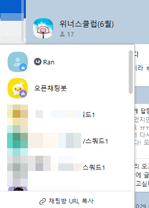
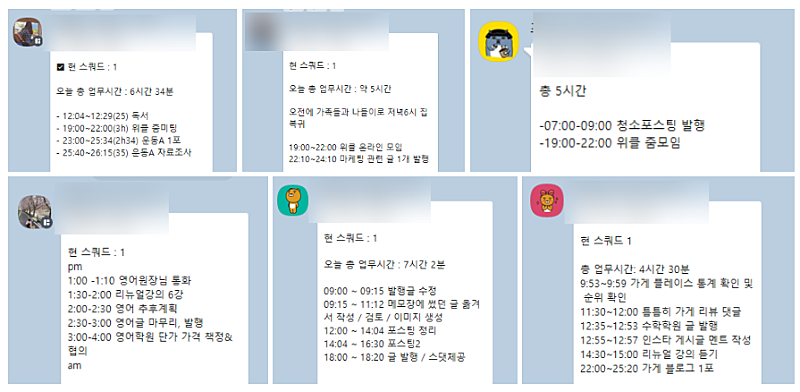
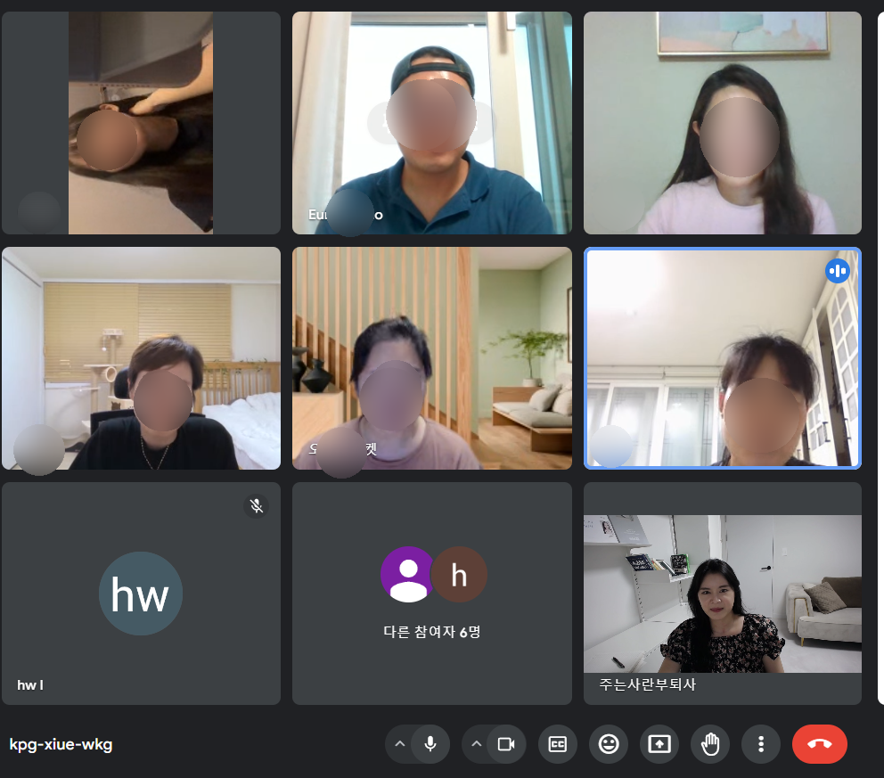
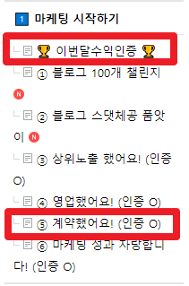

# 블로그 제목 55초컷 '봇' 개발 (7월 위너스클럽 혜택)

- 원천 ID: EPR-CAFE-26359
- 작성자: 주는사란
- 작성일: 2024-06-28T12:43:15.390000+09:00
- 원문: https://cafe.naver.com/ranschool/26359
- 수집일: 2026-09-21
- 텍스트 정리: HTML 문단 순서 유지, 빈 문단·제로폭 공백만 제거. 원본 HTML·JSON 별도 보존. 이미지는 아래에 모아 보관하며 원래 배치는 HTML에서 확인.

## 원문 본문

<!-- P001 -->
위너스클럽 (줄여서 위클) 은 수익화에 성공한 분들에게 마케팅 고수로 갈 수 있도록 돕기위해 만들어진 수강생 혜택 중 하나입니다.

<!-- P002 -->
위클에서는 이런걸 합니다.

<!-- P003 -->
1. 위클 전용 단톡방 초대

<!-- P004 -->
5월에 수익인증 하셔서 6월에 위클에 현재 저 빼고 총 15분이 들어와있습니다. 매일 미션이 있고 제게 편하게 질문도 가능합니다.

<!-- P005 -->
2. 월 1회 저와 함께하는 마케팅 스터디

<!-- P006 -->
아래 사진은 6월 위클 스터디 사진입니다. 약 3시간 정도 진행했습니다.

<!-- P007 -->
위클의 목표는 딱 한가지 입니다.

<!-- P008 -->
"마케팅 고수 만들기"

<!-- P009 -->
근데 강의에서도 항상 말씀드리지만, 저는 제가 드리는 정보가 필요한 사람에게만 가길 바랍니다. 준비되지 않은 사람에게는 쓰레기일 뿐이니까요.

<!-- P010 -->
그래서 위너스클럽을 가입하기 위해서는 조건이 있습니다. 제 이야기를 듣기 위해서는 최소한 매달 마케팅 대행이나 본인의 사업체를 마케팅 하고 수익상승을 한 경험이 있으셔야 합니다. 그런 경험을 부퇴사카페 - 계약했어요 게시판과 이번달수익인증 게시판에 올려주세요.

<!-- P011 -->
다음주 월요일에 시작되는 7월 위클에 들어오시기위해서는 6월 30일 저녁 6시 전까지 수익인증을 하셔야 합니다. 이틀 남았습니다!

<!-- P012 -->
6시 땡할때까지 작성한 글에 관해서 선별할 예정입니다!!

<!-- P013 -->
아까도 말씀드렸지만 위클에서는 여러분이 이제 마케팅을 더 잘할 수 있도록 도울 예정이예요. 그래서 당연하지만 매달 드리는 내용은 업데이트가 됩니다. 그래서 오늘은 일단 다음달에 업데이트 되는 내용을 알려드릴게요.

<!-- P014 -->
앞으로 저는 블로그 글쓰기를 아주 빠르게 끝내실수 있도록 '봇'을 만들 예정이예요. 그중 첫번째 봇입니다. 바로 '제목봇' 이예요. 제목봇은 제가 강의에서 알려드린 유형 10가지대로 키워드만 입력하면 알아서 지어주는 봇입니다.

<!-- P015 -->
아래 시연영상을 보여드릴게요.

<!-- P016 -->
딱 1분 걸렸네요. 1분 만에 머리 안쓰고 제목봇을 이용하고 싶은 분들은 서둘러주세요. 위클은 글을 작성했다고 모두 가입되는건 아닙니다. 실제로 지난 달에는 죄송하게도 들어오지 못하신 분도 있어요.

<!-- P017 -->
위클 가입을 위해서는 아래 양식에 맞춰서 글을 정성스럽게 써주시면 감사하겠습니다 .

<!-- P018 -->
대한민국 모임의 시작, 네이버 카페

<!-- P019 -->
cafe.naver.com

<!-- P020 -->
그럼 모든 수강생분이 위클에서 다시 만나길 바라며

## 본문 이미지

## 원문에 포함된 링크

- #
- https://cafe.naver.com/ranschool/24944
