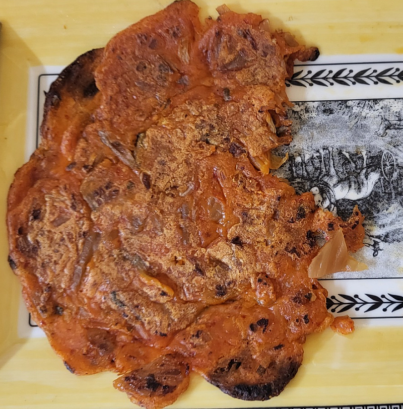
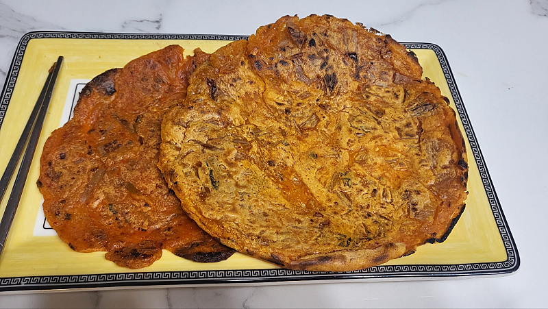

# 김치전이 준 지혜

- 원천 ID: EPR-CAFE-2678
- 작성자: 주는사란
- 작성일: 2023-02-13T19:32:26.867000+09:00
- 원문: https://cafe.naver.com/ranschool/2678
- 수집일: 2026-09-21
- 텍스트 정리: HTML 문단 순서 유지, 빈 문단·제로폭 공백만 제거. 원본 HTML·JSON 별도 보존. 이미지는 아래에 모아 보관하며 원래 배치는 HTML에서 확인.

## 원문 본문

<!-- P001 -->
토요일에서 일요일로 넘어가는 밤 12시에 손흥민이 출전하는 토트넘 경기가 있었다. 근데 최근에 밤 10시면 자버려서 12시까지 도저히 버틸 자신이 없었다. 그래서 뭘 해야 12시까지 버텨서 경기를 볼수 있을까 생각하다가, 오랜만에 요리(?)라는걸 해보기로 했다. 근데 내가 요리라고는 부를만 한것 중 만들줄 아는게 '김치전'이다. 그래서 '김치전'을 만들기로 했다.

<!-- P002 -->
오랜만에 김치전을 만드려고 보니 레시피가 기억이 안났다. 그래서 네이버에 '김치전 바삭하게 만드는 법'을 검색했더니 필요한 재료가 많았다. 내가 생각한 김치전은 그런게 아니었다. 그냥 튀김가루랑 김치로만 하는 기본에 충실한 김치전을 만들고 싶었다. 근데 그런 레시피가 없었다.

<!-- P003 -->
그래서 그냥 만들어보기로 했다. 집에 있는 신김치를 잘라서 튀김가루를 넣고 물을 부었다. 후라이팬에 기름을 넣고 전을 부쳤다. 예상대로 망했다. 사실 부칠때부터 알았다. 망할것 같았다...ㅋㅋㅋㅋㅋㅋㅋㅋ한번 먹어봤는데 밀가루맛 그대로였다 ㅋㅋㅋㅋㅋㅋㅋㅋㅋ우리 집 음식물 처리기 미생물들에게 양보했다.

<!-- P004 -->
두번째 전을 부치기 전, 지난번에 왜 실패했는지 생각해봤다. 튀김가루가 좀 부족한것 같았다. 그래서 튀김가루를 좀더 넣고 부쳤다. 먹을 만은 했다. 나름 성공적 이었다. 근데 김치가 너무 셨고 김치가 너무 많았다. 나는 밀가루의 바삭한 부분이 먹고 싶었다.

<!-- P005 -->
세번째 전을 부치기 전에도 고민을 했다.  어떻게 해야 밀가루 바삭한 김치전을 만들수 있을까? 그래서 이번엔 튀김가루와 물을 더 부었다. 근데 처음 요리하는 사람이 모두 그렇듯 역시나 비율을 잘못 맞춰서 '떡'이 되었다. 음식물 처리기에있는 미생물에게 기부했다.

<!-- P006 -->
네번째 전을 부치려고 보니 욕심이 생겼다. 해내고 싶었다. 그래서 이번에 비율을 어느정도 맞춰서 했다. 대성공적 이었다

<!-- P007 -->
전을 네번 부치면서 느낀 사실이 있다. 내 인생은 김치전과 같았다. 나는 지금까지 10년간 사업하면서 "사업 성공률이 몇%인가요?" 라고 묻는다면 50%정도라고 답할것 같다. 첫번째 실패를 맛봤고, 두번째에 성공의 가능성을 봤다. 두번째 성공에서 엄청난 기대를 하지만 사실 세번째는 실패였다. 근데 이때 포기하지 않고 네번째를 했기때문에 지금의 내가 있는건 아닐까?

<!-- P008 -->
내 인생에서 가장 후회한 사업중 하나가 음식점이다. 근데 음식점을 해보지 않았더라면 마케팅을 할때 자영업자의 마음을 이정도 이해하지 못했을거다. 근데 놀라운건 내가 음식점을 하고 학원을 할때는 내가 나중에 마케팅회사를 할 줄 몰랐다는 점이다.

<!-- P009 -->
사실 나는 처음부터 레시피를 잘 찾아서 처음부터 성공할수도 있었을거다. 이게 사람들이 말하는 인생의 공략집일지도 모른다. 근데 나는 인생의 공략집 같은건 모른다. 아니 정확히 말하면 성격이 급해서 그런걸 찾는게 답답하다.

<!-- P010 -->
그래서 나는 돌아가기로 했다. 인생의 공략집을 찾는 시간에 그냥 김치전을 4번 만들어보기로 했다. 과연 김치전 레시피를 찾아서 한번에 성공하는 사람과 그냥 김치전을 4번 만들어 본 사람을 비교하면 누가 더 잘할까? 아니 누가 더 빠를까? 이것도 아니라면...누가 더 만족할까?

<!-- P011 -->
그리고 문득 이런 생각이 들었다. 잘못된 레시피를 찾았다고 해서 꼭 김치전을 실패할까?

## 본문 이미지

## 원문에 포함된 링크

- #
