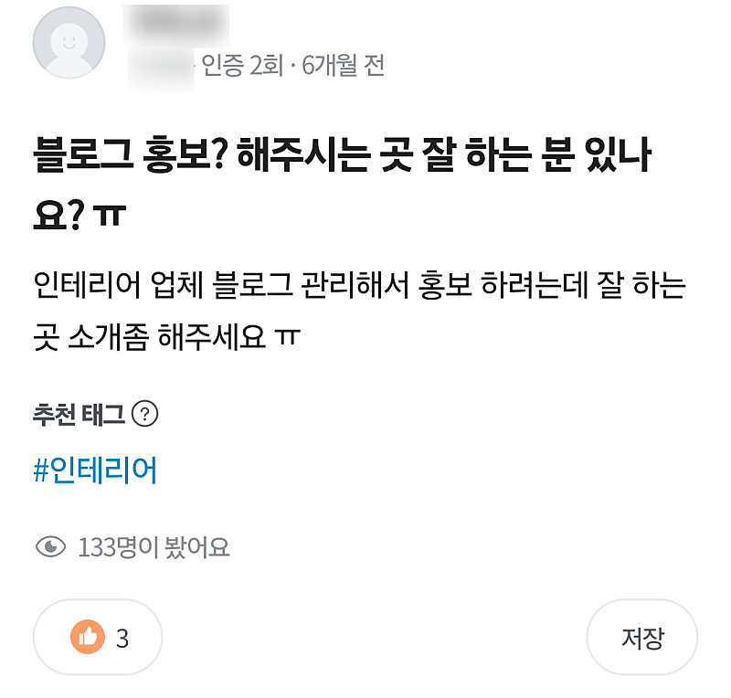
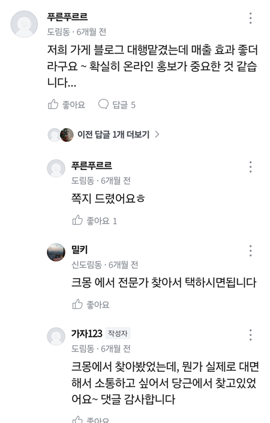
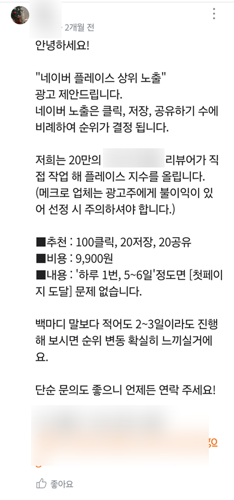

# 마케팅대행 실제 영업편 (1) 90초 걸림

- 원천 ID: EPR-CAFE-26858
- 작성자: 주는사란
- 작성일: 2024-07-09T15:58:25.167000+09:00
- 원문: https://cafe.naver.com/ranschool/26858
- 수집일: 2026-09-21
- 텍스트 정리: HTML 문단 순서 유지, 빈 문단·제로폭 공백만 제거. 원본 HTML·JSON 별도 보존. 이미지는 아래에 모아 보관하며 원래 배치는 HTML에서 확인.

## 원문 본문

<!-- P001 -->
마케팅 대행 부업이란, 마케팅을 대신 해주고 돈을 받는 부업입니다. 이 부업의 가장 큰 장점은 돈을 먼저 받고 일을 시작할 수 있다는 점이구요. 내가 마케팅을 할 수 있게 되고, 장기 계약을 하면 매달 수입이 될수 있다는 점이죠.

<!-- P002 -->
단점도 있습니다. 바로 먼저 사장님한테 "내가 어떻게 마케팅을 해줄지" 설득을 해야한다는거죠. 순서로 보면 이렇습니다.

<!-- P003 -->
사장님에게 영업

<!-- P004 -->
계약전 상담

<!-- P005 -->
계약

<!-- P006 -->
실제 마케팅을 위한 정보받기

<!-- P007 -->
영상에서 보이는 것과 달린 저는 생각보다 MBTI 에서 I 성향이 강합니다. 이런 분들은 사장님께 영업하는걸 힘들어하시는데요. 그래서 앞으로 '실제 영업편'에서는 말 그대로 제가 실제로 영업한다면 어떻게 할지를 과정 하나하나 보여드리도록 하겠습니다. 아래 내용을 참고하셔서 여러분도 똑같이 해보시면 좋을것 같아요.

<!-- P008 -->
영업하는 방법은 다양하지만 오늘은 당근마켓으로 영업을 해보겠습니다.

<!-- P009 -->
당근마켓 영업편

<!-- P010 -->
먼저 당근마켓을 켜서 블로그라고 검색해 봤습니다. 그랬더니 세번째쯤에 동네생활이 뜨네요. 여기를 들어가 봤습니다. 실제 블로그 홍보를 원하는 분이 있네요.  제가 검색하는 화면은 아래 영상을 참고해주세요.

<!-- P011 -->
블로그 홍보를 찾는 분이 올린 글입니다. 인테리어 업체 블로그 글 홍보를 원하시는 분 인것 같아요.

<!-- P012 -->
그리고 밑에 댓글을 봤는데 진짜 추천해주는건지 아니면 추천해주는척 하는건지 모를 댓글이 하나 있구요.

<!-- P013 -->
딱 답변하기 싫을만한 댓글도 하나 있네요.

<!-- P014 -->
여러분도 당근마켓에 블로그를 검색하신후 이런 글을 찾아보세요.

<!-- P015 -->
딱 90초면 됩니다.

<!-- P016 -->
저라면 여기에 이렇게 댓글을 달것 같아요. 아래 댓글을 바꿔서 본인 지역에 있는 블로그 홍보를 찾는 글 아래에 댓글을 달아보세요.

<!-- P017 -->
댓글 예시)

<!-- P018 -->
안녕하세요. 저는 현재 XX지역에서 거주하며 혼자서 블로그 마케팅을 진행하고 있는 마케터 XXX입니다.

<!-- P019 -->
당근마켓에서 블로그 홍보 업체를 찾으시려는 이유를 추측해보면, 최소한 근처 지역에서 효과를 본 사례를 알고 맡기고 싶은 마음이 있으실것 같습니다. 그리고 댓글을 보니 크몽이나 이렇게 비대면 보다는 내 업체 매출 자체를 같이 고민해주는 업체를 찾고 계신것 같구요.

<!-- P020 -->
이미 이 글을 올리신지 6개월이 지나 업체를 찾으셨을수도 있겠지만 그래도 제가 도와드릴수 있을것 같아 시간내서 적어봅니다.

<!-- P021 -->
먼저 블로그 홍보에는 크게 두가지 방법이 있습니다. 배포형과 브랜드형 입니다. 배포형은 여러 블로그에 몇개의 사진과 함께 상호명이 막 적힌 글을 배포하는 것 입니다. 건당 금액이 저렴하다는 장점이 있죠.  이 경우 많은 사람들이 사장님 업체에 대해 알 순 있겠지만 그게 꼭 '문의'로 이어지진 않습니다.

<!-- P022 -->
반면 브랜드 형은 사장님 블로그에 사장님 업체의 가치를 알리기 위한 글이 작성되죠. 건당 비용이 배포형에 비해서는 비싸나 문의율이 훨씬 올라가기 때문에 실제로는 문의율 자체로만 보면 배포형과 비교했을때 단가가 저렴하다고 할수 있습니다.

<!-- P023 -->
기존에 가지고 계신 블로그에 따라 다르지만 배포형 보다 '업체 자체를' 알리는 데에는 조금 더 오래 걸릴지도 모릅니다. 하지만 알려지는 순간 '문의율'은 훨씬 높죠. 물론 빨리 알리고 싶다면 방법이 있습니다. 이 방법은 상담시 안내드리겠습니다.

<!-- P024 -->
짐작하셨겠지만 저는 브랜드형 블로그를 진행하고 있습니다. 브랜드형 블로그에서는 사장님의 업체에 대해 잘 이해하고 그걸 고객에게 전달하는 역할이 중요합니다. 그 실력에 자신이 있기 때문에 여기에 댓글을 쓰는 것이구요.

<!-- P025 -->
결국 사장님이 블로그 홍보를 원하시는 이유는 인테리어 문의를 받고 싶어서일겁니다. 그러려면 인테리어에 대해 이해도가 있어야 할텐데요. 저는 인테리어 자체에 대해 지식이 많진 않지만 마케팅을 공부하면서 새로운 분야를 어떻게 공부해야하는지를 알고 있습니다. 무엇보다 인테리어 전문가인 사장님이 도와주신다면 더 쉽게 배울수 있을것 같구요.

<!-- P026 -->
또 사장님이 원하시는 것처럼 근처 지역에 거주하다보니 사장님 업체에 대한 고민을 같이 해줄수 있습니다.

<!-- P027 -->
물론 정해진 포맷대로 글을 배포하기만을 원하신다면 제가 적절하진 않습니다. 하지만 정말 문의가 오는 블로그 운영을 하고 싶다면 아래 연락처로 문의주시면 무료로 업체에 대한 블로그 마케팅 상담을 도와드릴수 있도록 하겠습니다.

<!-- P028 -->
상담이 부담스러우시다면 마케팅 현황표를 무료로 보내드리겠습니다.

<!-- P029 -->
연락처 010-0000-0000

<!-- P030 -->
마케팅 현황표 만드는 법

<!-- P031 -->
대한민국 모임의 시작, 네이버 카페

<!-- P032 -->
cafe.naver.com

## 본문 이미지

## 원문에 포함된 링크

- #
- https://cafe.naver.com/ranschool/26276
