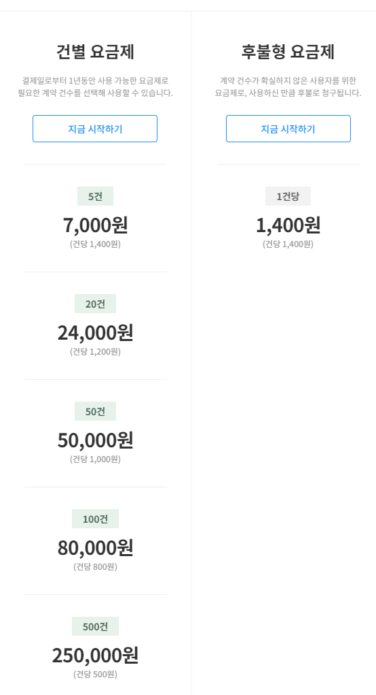
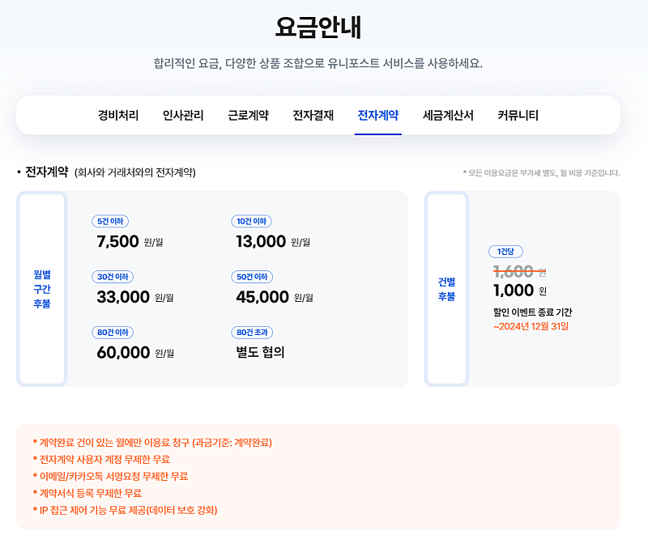
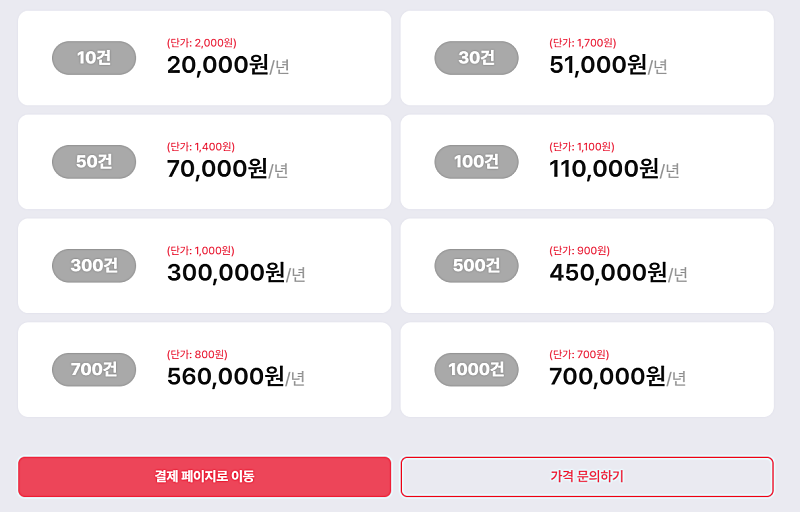

# 마케팅대행부업, 사업자등록증 및 계약서 관련 간단 정리

- 원천 ID: EPR-CAFE-26906
- 작성자: 주는사란
- 작성일: 2024-07-11T11:30:19.680000+09:00
- 원문: https://cafe.naver.com/ranschool/26906
- 수집일: 2026-09-21
- 텍스트 정리: HTML 문단 순서 유지, 빈 문단·제로폭 공백만 제거. 원본 HTML·JSON 별도 보존. 이미지는 아래에 모아 보관하며 원래 배치는 HTML에서 확인.

## 원문 본문

<!-- P001 -->
마케팅 대행 부업이란, 마케팅을 대신 해주고 돈을 받는 부업입니다. 이 부업의 가장 큰 장점은 돈을 먼저 받고 일을 시작할 수 있다는 점이구요. 내가 마케팅을 할 수 있게 되고, 장기 계약을 하면 매달 수입이 될수 있다는 점이죠.

<!-- P002 -->
순서로 보면 이렇습니다.

<!-- P003 -->
사장님에게 영업

<!-- P004 -->
계약전 상담

<!-- P005 -->
계약

<!-- P006 -->
실제 마케팅을 위한 정보받기

<!-- P007 -->
여기서 오늘은 계약서 작성양식과 작성시 참고하시면 좋을 사이트를 알려드리려고 합니다. 아직 계약서를 작성하지 않더라도 어떻게 작성하는지를 알아둬야 나중에 작성이 가능하니깐 미리 한번 읽어두세요.

<!-- P008 -->
먼저 계약서를 작성하려면 정해야 할게 있습니다. 바로 '사업자등록증'을 낼건지 여부입니다. 혹시나 궁금하실까봐 말씀드리면 마케팅대행부업은 사업자등록증이 필요하진 않습니다. 다만 나중에 매출이 증가했을때 사업자등록증을 내는게 유리하기 때문에 내는게 좋다는 것일 뿐이지 무조건 있어야 하진 않습니다.

<!-- P009 -->
여기서 매출이 증가했을때라는 기준은 1월 1일부터 12월 31일까지를 기준으로 매출이 2천만원 이상일 때를 말합니다. 만약 내가 7월부터 시작했어도 12월까지 마케팅대행료로 2천만원 이상 받는다면 사업자등록증을 내는게 세금적으로 유리합니다. (그 외의 세금에 관한 사항은 세무사에게 상담해주세요. 그 이상은 저도 잘 모릅니다)

<!-- P010 -->
위와 같은 기준에서 여러분은 결국 두가지를 선택하게 됩니다. 사업자등록을 내거나 안내거나. 사업자등록증 여부에 따라 필요한 계약서 양식과 돈을 받을때 받을수 있는 돈 그리고 해야하는 세금 신고가 모두 다릅니다. 아래 표를 참고해주세요.

<!-- P011 -->
사업자 등록증

<!-- P012 -->
있음

<!-- P013 -->
없음

<!-- P014 -->
계약서 양식

<!-- P015 -->
마케팅대행 계약서

<!-- P016 -->
프리랜서 계약서

<!-- P017 -->
대행료 받을 때 받는 돈

<!-- P018 -->
약속한 금액 x 1.1 받음

<!-- P019 -->
(10% 부가세)

<!-- P020 -->
약속한 금액 x 0.967 만 받음

<!-- P021 -->
(3.3% 원천세 공제)

<!-- P022 -->
해야하는 세금 신고

<!-- P023 -->
종합소득세 / 부가세 (상반기, 하반기)

<!-- P024 -->
종합소득세

<!-- P025 -->
위 양식에 맞춰서 아래 계약서 양식을 다운 받으신 후 하시면 됩니다. 계약서 양식은 이미 제가 업로드 해놨습니다. 아래 양식의 차이는 무료 자료에는 마케팅대행계약서만 제공하며 프리랜서 계약서는 제공하지 않습니다. 프리랜서 계약서는 인터넷에 검색하셔서 다운 받으신후 수정하셔서 사용하시면 됩니다. 블로그 강의 수강생 분들은 제가 수정해 놓은 양식이 있으니 수정하셔서 쓰시면 됩니다.

<!-- P026 -->
(무료자료용)

<!-- P027 -->
대한민국 모임의 시작, 네이버 카페

<!-- P028 -->
cafe.naver.com

<!-- P029 -->
(블로그강의 수강생용)

<!-- P030 -->
cafe.naver.com

<!-- P031 -->
원래 제가 이걸 프로그램으로 만들어서 드리려고 했는데 만들다가 실패했습니다....한 3시간 붙잡고 있었는데ㅋㅋㅋㅋㅋㅋㅋ 좀더 ai를 잘 다루게 되면 다시 시도해보겠습니다.

<!-- P032 -->
추가로 계약서 양식을 드리긴 했지만 저는 대면해서 서로 계약서 사인하는걸 선호하지 않습니다. 계약서 사인 받자고 매달 만나는것도 업체가 많아지면 번거롭거든요. 그렇다고 파일을 카톡으로 주고 받기에는 또 너무 없어보이구요. 무엇보다 나중에 혹시나 문제가 생겼을때 항상 계약서를 확인해야 하는데요. 계약서를 종이로 가지고 있으면 보관하기가 어렵습니다. 그래서 저는 전자계약 사이트를 사용합니다. 아래 사이트는 저와 아예 상관 없는 사이트들입니다. (아래 사이트한테 돈 받는거 없음. 소개비 줬으면 좋겠음 ㅎㅎㅎ)

<!-- P033 -->
전자계약 사이트는 보통 두가지로 나뉩니다. 월별결제와 건별결제인데요. 나중에 업체가 10개 이상 늘어나면 월결제가 더 저렴합니다. 하지만 지금 당장 월결제를 하기엔 부담스러우니 건별결제를 추천드립니다.

<!-- P034 -->
현재 건결제가 가능한 사이트는 아래 사이트들 정도로 보입니다. 글로사인 / 유니포스트 / 싸인오케이

<!-- P035 -->
글로사인 / 유니포스트 / 싸인오케이

<!-- P036 -->
저는 싸인 오케이 쓰는데요. 더 저렴한 곳으로 바꾸고 싶은데 기존 계약서가 다 싸인오케이에 있어 계속 쓰고 있습니다.

<!-- P037 -->
이렇게 계약서를 쓰려면 영업하러 가야겠죠?

<!-- P038 -->
1. 영업자료를 만든다

<!-- P039 -->
대한민국 모임의 시작, 네이버 카페

<!-- P040 -->
cafe.naver.com

<!-- P041 -->
2. 영업한다.

<!-- P042 -->
대한민국 모임의 시작, 네이버 카페

<!-- P043 -->
cafe.naver.com

<!-- P044 -->
혼자 못하겠으면

## 본문 이미지

## 원문에 포함된 링크

- https://cafe.naver.com/ranschool/1516
- https://cafe.naver.com/ranschool/24439
- #
- https://cafe.naver.com/ranschool/26276
- https://cafe.naver.com/ranschool/26858
