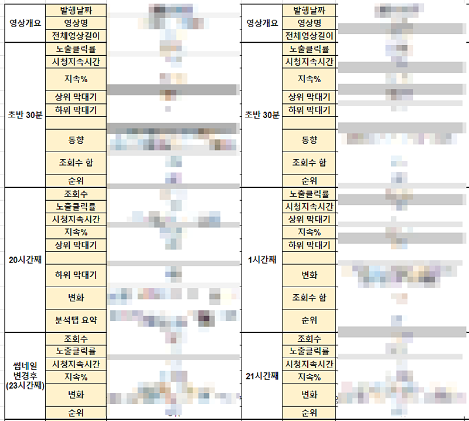

# 낙심이 될때

- 원천 ID: EPR-CAFE-27006
- 작성자: 주는사란
- 작성일: 2024-07-15T11:14:34.480000+09:00
- 원문: https://cafe.naver.com/ranschool/27006
- 수집일: 2026-09-21
- 텍스트 정리: HTML 문단 순서 유지, 빈 문단·제로폭 공백만 제거. 원본 HTML·JSON 별도 보존. 이미지는 아래에 모아 보관하며 원래 배치는 HTML에서 확인.

## 원문 본문

<!-- P001 -->
제가 학원을 할 때 일이예요. 첫 상담때마다 아이들은 이렇게 말합니다. "공부 했는데 성적이 안올라요" 바로 이어서 어머님들은 이렇게 말씀하시죠. "우리 아이가 공부법을 모르는 것 같아요"

<!-- P002 -->
근데 대부분 보면 공부법을 모르는게 아니구요. 그냥 그정도를 안한거예요.

<!-- P003 -->
공부를 못하는 애들은 공부를 잘하는 애들이 '어느정도' 공부한지 모릅니다. '어떤 깊이'까지 공부해야하는지 몰라요. 그래서 내가 공부를 했다고 착각하는거죠. 공부는 상대평가니까요.

<!-- P004 -->
요즘 제 유튜브 조회수가 안나와서 답답했어요. 영상을 더 많이 올리고 더 열심히 조사를 해서 올렸는데도 크게 다르지 않았거든요. 그래서 원래는 유튜브 올리고 조회수가 얼마나 나오는지 반응이 어떤지 이런식으로 다 기록을 해놓는데요.

<!-- P005 -->
최근에는 낙심이 돼서 이런걸 안했어요. 마음 컨트롤 하는게 더 중요하다고 생각했거든요.

<!-- P006 -->
근데 최근에 구독자 10만 이상인 사람들끼리 하는 한 채팅방에 초대됐어요. 거기에는 100만 넘는 분들이 계셨는데요. 그분들이 알고 있는 정보를 나눠주시는데 충격적이었어요.

<!-- P007 -->
"이런 것 까지 생각하고 영상을 만든다고?" 할만한게 많았거든요.

<!-- P008 -->
그래서 더 열심히 분석하고 있어요.

<!-- P009 -->
저는 몰랐어요. 그 깊이를. 어느정도 깊이를 가지고 영상을 만들어야 이정도 조회수가 나오는지를요.

<!-- P010 -->
분명 선생님일 때는 이런게 보였는데요. 막상 제가 학생이 되니깐 이게 안보이네요.

<!-- P011 -->
만약 지금 내가 하는 일이 권태기에 왔다면 한번 생각해보세요. 정말 하나하나 그 깊이를 챙기고 있는지를요.

## 본문 이미지

## 원문에 포함된 링크

- #
