# 주는사란 2탄이 곧 시작됩니다.

- 원천 ID: EPR-CAFE-27627
- 작성자: 주는사란
- 작성일: 2024-08-05T14:31:44.300000+09:00
- 원문: https://cafe.naver.com/ranschool/27627
- 수집일: 2026-09-21
- 텍스트 정리: HTML 문단 순서 유지, 빈 문단·제로폭 공백만 제거. 원본 HTML·JSON 별도 보존. 이미지는 아래에 모아 보관하며 원래 배치는 HTML에서 확인.

## 원문 본문

<!-- P001 -->
저는 주는사란 2탄을 준비하고 있습니다. 새로운 유튜브예요. 부업 말고 완전 다른 주제입니다. 사실 이미 작년 9월부터 하려고 마음 먹고 위에 영상 하나를 올렸다가 말았네요.

<!-- P002 -->
그리고 지난주부터 다시 시작했습니다. 근데 지금 반응이 미쳤어요. 공유드리려고 올려봅니다.

<!-- P003 -->
주는사란 초창기

<!-- P004 -->
반응 비교를 위해 주는사란 초창기 시절을 보여드리겠습니다. 저는 주는사란을 2022년 9월 18일에 시작했습니다. 미리 만들어 놓은 영상 3개를 올렸죠.

<!-- P005 -->
영상을 3개나 올렸지만 4일간 구독자는 0명이었습니다.

<!-- P006 -->
그 다음날 구독자는 1명이었어요. 아직도 기억합니다. 이 분에게 정말이지 너무 감사했어요.

<!-- P007 -->
또 그 다음날은 3명이 늘어서 4명이 되었습니다. 기쁨이 3배였어요. 한분한분 너무 소중했습니다.

<!-- P008 -->
그렇게 처음 영상 3개로 모은 구독자는 4명이었습니다. 그리고 25일에 또 영상 3개를 한번에 올렸습니다.

<!-- P009 -->
영상을 올린날 구독자가 조금 더 늘더군요. 7명이 되었습니다. 영상 6개에 구독자 7명이었습니다.

<!-- P010 -->
그 다음날은 똑같이 7명이었어요. 아침에 일어나자마자 확인했는데 조금 실망스럽더군요.

<!-- P011 -->
그런데 다음날!! 봤더니 12명이 되어있는거예요.

<!-- P012 -->
그리고 그 다음날은 또 14명이 됐습니다. 다행이다 싶었어요.

<!-- P013 -->
여기까지가 주는사란을 시작하고 10일째 이야기 입니다. 영상 6개를 올리고 구독자 14명 정도였죠. 지금은 해당 영상들의 조회수가 많이 올라왔지만 그당시만 해도 영상 한개당 조회수는 100이하였습니다.

<!-- P014 -->
주는사란 2탄

<!-- P015 -->
그럼 주는사란 2탄인 지금의 새로운 유튜브를 보여드리겠습니다.

<!-- P016 -->
1년전에 새로운 채널을 하려고 본영상 1개를 올렸었구요. 쇼츠는 12개정도 올렸었어요.

<!-- P017 -->
처음 영상은 쇼츠로 8월 27일에 올렸구요. 다음날인 8월 28일까지 구독자가 0명이었습니다.

<!-- P018 -->
쇼츠 12개와 본영상을 1개를 올리고 거의 1년을 아무것도 하지 않았습니다. 지난주에 영상을 올리려고 들어가보니 구독자가 20명이 되어있더라구요.

<!-- P019 -->
지난주 영상을 두개 올렸습니다. 그리고는........

<!-- P020 -->
짠!

<!-- P021 -->
주는사란은 영상을 처음 올렸을때 6개까지 조회수가 100이하였어요. 근데 현재는 일주일만에 조회수 평균이 2000입니다. 미친거죠.

<!-- P022 -->
구독자는 딱 일주일만에 42명이 되었죠.

<!-- P023 -->
댓글 반응도 좋네요

<!-- P024 -->
근데 주는사란도 그렇고 잘생겼다는 댓글이 종종 있네요 ㅋㅋㅋㅋㅋㅋㅋㅋ저 좀 잘생겼나봐요 ㅋㅋㅋㅋㅋㅋㅋㅋㅋ

<!-- P025 -->
위 채널이 뭔지는 아직 비밀로 하겠습니다. 처음에 채널을 공유하면 알고리즘이 망가지거든요. 좀더 크면 공개하겠습니다. 아마 3개월이면 여러분에게 공개할 수 있을것 같아요.

<!-- P026 -->
중간에 종종 공유하겠습니다.

## 본문 이미지

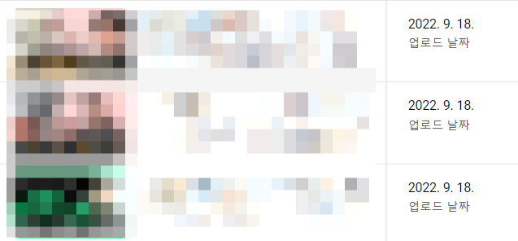

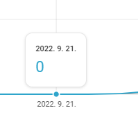

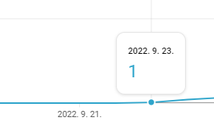

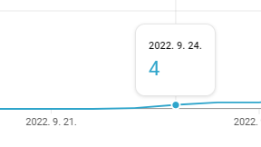

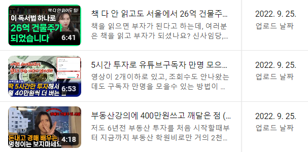

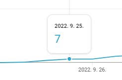

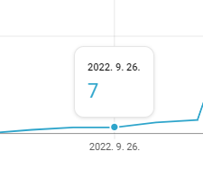

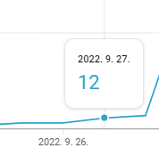

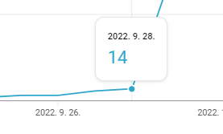

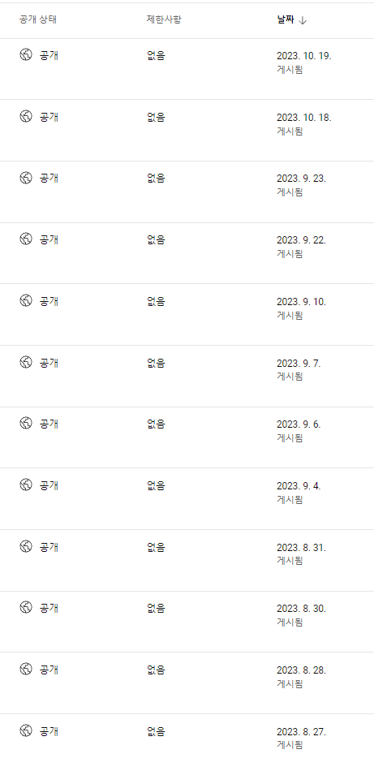

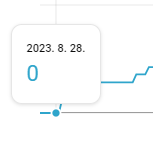

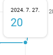

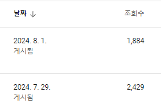

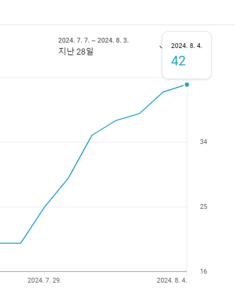

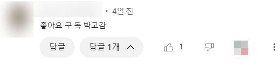

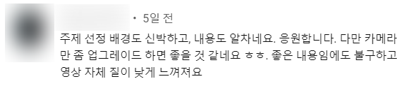

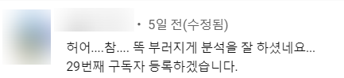

## 원문에 포함된 링크

- #
