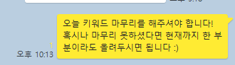
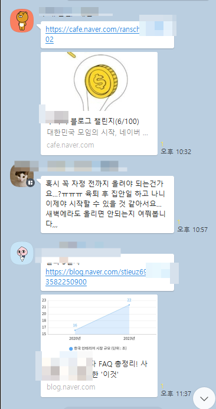
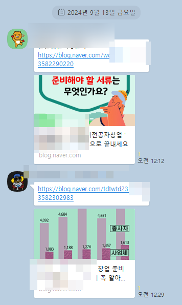
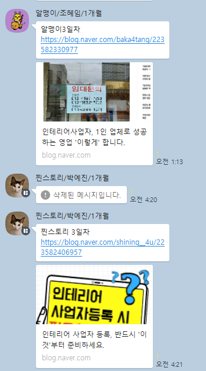
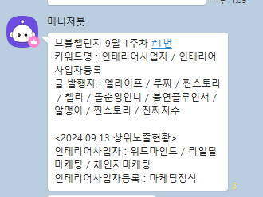
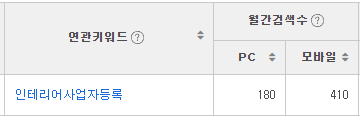
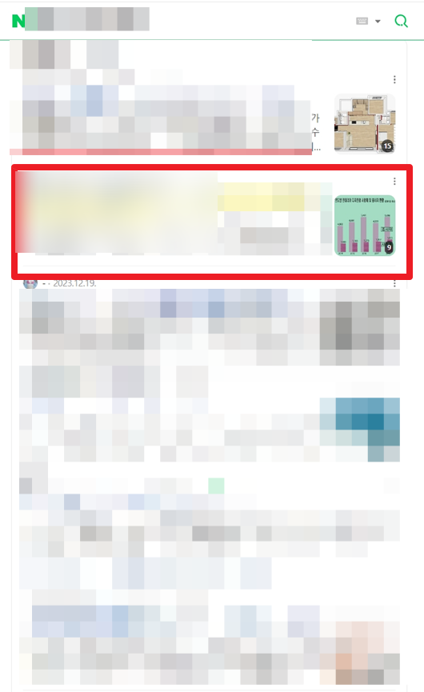
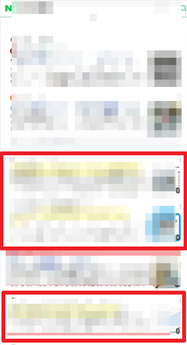

# 사람을 바꾸는 방법

- 원천 ID: EPR-CAFE-28655
- 작성자: 주는사란
- 작성일: 2024-09-14T18:53:35.200000+09:00
- 원문: https://cafe.naver.com/ranschool/28655
- 수집일: 2026-09-21
- 텍스트 정리: HTML 문단 순서 유지, 빈 문단·제로폭 공백만 제거. 원본 HTML·JSON 별도 보존. 이미지는 아래에 모아 보관하며 원래 배치는 HTML에서 확인.

## 원문 본문

<!-- P001 -->
마케팅은 사실 '사람을 바꾸는 방법'이다. 생판 모르는 남에게 "이렇게 하세요" 라고 말하는 법이다. 그래서 사실 마케팅을 잘한다는건 굉장히 어려운 일이다. 생판 모르는 남이 "사세요" 한다고 사지 않으니까 말이다.

<!-- P002 -->
돌이켜보면 나는 마케팅을 하기 전에 아이들을 가르쳤을때도 같은 일을 했다. 아이들을 가르치면서 "어떻게 해야 공부를 하게 할까?"를 오랜기간 고민해왔다. 그리고 지금은 매일 "어떻게 해야 블로그를 하게 할까?"를 고민한다.

<!-- P003 -->
아이들을 바꾸기 위해 내가 자주 썼던 방법은 '불안'이다. 이건 흔한 어른들이 아이들에게 겁주려고 하는 방법이다.

<!-- P004 -->
"나중에 어떻게 살려고 그래?"

<!-- P005 -->
근데 이게 내가 가르쳤던 지역에서는 통하지 않았다.

<!-- P006 -->
실제로 있었던 일인데, 한 아이에게 이렇게 말한적이 있었다. "이렇게 공부를 못하면 나중에 어떤 일도 하기 어려워. 지금부터~" 아주 뻔한 말로 설득해보려했다. 근데 그 아이가 이렇게 대답했다. "아빠 건물 받으면 돼요" 순간 멍했다. 나중에 알게 됐는데 실제로 그 아이는 그 건물 지분의 일부를 소유하고 있었다.

<!-- P007 -->
20대 초반 나도 어렸기 때문에 솔직히 왜 공부를 해야하는지 설명하기 어려웠다. 정확히 말하면 나는 그냥 돈을 벌려고 아이들을 가르쳤기 때문에 깊게 고민하지 않고 한 말이었다.

<!-- P008 -->
블로그도 마찬가지였다. 수강생에게 나는 "블로그를 하지 않으면 어떻게 될것이다~" '불안'의 감정을 많이 이용했다. "블로그 강의 비용이 아깝지 않으세요?" "지금 남들은 이렇게 벌고 있어요" 솔직히 여전히 그렇게 말하고 있긴 하다.

<!-- P009 -->
근데 최근에 사람을 바꾸는 방법엔 '불안' 말고 '믿음' 도 있다는걸 알았다.

<!-- P010 -->
가끔 보는 프로그램 중에 금쪽같은 내새끼라는 프로그램이 있다. (아이들을 가르쳐서 그런지 '학습법' 이런거에 관심이 많음) 이 프로그램에는 말썽을 일으키는 아이들이 나오는데 대부분은 부모와의 관계가 틀어져서 생기는 문제가 많다. 근데 재밌는건 대다수 원인이 똑같다는 것이다.

<!-- P011 -->
부모들은 보통 아이들에게 이렇게 말한다. "숙제를 하면 뭘 해줄게" "뭘 안하면 뭘 해줄게" 아이들이 어떤 조건을 지켜야만 보상을 주는 행동을 한다. 즉 '無조건적인' 사랑이 아니라 '조건적인' 사랑을 하는데 이게 아이들의 불안요소를 자극시켜 문제 행동을 유발하게 된다. (다 그런것은 아님 약 80%이상) 부모의 무조건적인 사랑이 아니라 조건적인 사랑을 받아온 아이들이 애정결핍이 생긴다는 것이다.

<!-- P012 -->
이런 아이들에게 오은영 박사님이 내리는 솔루션도 거의 동일하다. "조건 없이 그냥 사랑해라" 그게 끝이다.

<!-- P013 -->
'불안'은 단기간 사람을 변화시킨다. 하지만 장기적으로 신뢰관계가 깨질수도 있다.

<!-- P014 -->
'믿음'은 단기간 사람을 변화시키기 어렵다. 하지만 장기적으로 완전히 사람을 변화시킨다.

<!-- P015 -->
요즘 브블챌린지 하고 있는데, 과제를 할것이라고 믿는것 참....어렵다ㅎㅎㅎㅎㅎ그래서 저녁 10시에 카톡을 보냈는데ㅎㅎㅎ

<!-- P016 -->
새벽 4시까지 과제를 해서 올려주셨다.

<!-- P017 -->
그리고 짠

<!-- P018 -->
거의 월 검색량 300대 / 500대 키워드를 브블챌린지 분들이 거의 점령했다 ㅎ

<!-- P019 -->
믿어야겠다...과제를 하시리라고 ㅎㅎㅎㅎㅎ

## 본문 이미지

## 원문에 포함된 링크

- #
