# 1년전 시작했던 간판업체 현황

- 원천 ID: EPR-CAFE-28838
- 작성자: 주는사란
- 작성일: 2024-09-20T18:10:19.773000+09:00
- 원문: https://cafe.naver.com/ranschool/28838
- 수집일: 2026-09-21
- 텍스트 정리: HTML 문단 순서 유지, 빈 문단·제로폭 공백만 제거. 원본 HTML·JSON 별도 보존. 이미지는 아래에 모아 보관하며 원래 배치는 HTML에서 확인.

## 원문 본문

<!-- P001 -->
이 영상을 보셨나요?

<!-- P002 -->
www.youtube.com

<!-- P003 -->
1년전 저는 팀원들과 함께 간판회사를 오픈했습니다. 벌써 1년이 되었는데요. 현재는 대환님이 맡아서 하고 계세요.

<!-- P004 -->
지금은 어떻게 되었냐구요?

<!-- P005 -->
매출을 보여드리겠습니다. 지난달 2024년 7월 매출입니다.

<!-- P006 -->
지난달 하루 최대 매출은 147만원 이네요. 하루 평균 60만원정도 매출을 내고 있습니다.

<!-- P007 -->
이후 부업스파르타 2기에는 '청소' 업체를 오픈했는데요. 그렇게 시작한 '폴리매스'님과 '이래도좋고 저래도 좋다'님은 아직도 하고계세요.

<!-- P008 -->
'이래도좋고 저래도좋다' 님은 6월과 7월에 수익인증을 해주시기도 했는데요.

<!-- P009 -->
이렇게 성과가 있음에도 불구하고 1년간 하지 못한 이유가 있었어요. 좀더 개편하고 싶었거든요.

<!-- P010 -->
원래 부업스파르타반에서 제가 알려주고 싶었던건 "마케팅을 이렇게도 활용할 수 있어요"였어요. 아무것도 할줄 몰라도 일단 마케팅을 해 놓고 => 그 뒤로 기술을 배워서 판매하는 형태였죠.

<!-- P011 -->
실제로 그렇게 알려드렸고 수익도 났습니다. 근데 문제는 그 다음이었죠.

<!-- P012 -->
사실 '처음 몇달' 수익을 만드는건 어렵지 않습니다. 어려운건 '매달' 수입을 내는거죠. 매달 수입을 내기 위해서는 '매달' 손님을 데리고 와야합니다. 그러려면 '매달' 마케팅을 '안정적'으로 할 수 있어야 하죠. 그러려면 두가지 조건이 필요합니다.

<!-- P013 -->
1. 마케팅을 매달 한다.

<!-- P014 -->
마케팅을 안다고해서 할수 있는건 다른 문제예요. 정말 매달 매출을 내기 위해서는 블로그를 계속 써야하구요. 플레이스도 계속 관리해 줘야해요. 근데 매달 이걸 꾸준히 한다는건 굉장히 힘들죠. 내 업체를 운영하면서 마케팅을 한다는건 계속 말씀드리지만 너무 힘들어요. 그래서 내 마케팅을 대신해줄 사람이 필요한거죠.

<!-- P015 -->
하지만 계속 매출내려면 '좋다' 님처럼 계속 해야하죠.

<!-- P016 -->
2. 내 기술을 업그레이드 한다.

<!-- P017 -->
대표적인 예시가 위에 보여드린 '좋다' 님입니다. 원래 부업스파르타반 2기에서는 계단청소업체를 창업하기로 했어요. 실제로 계단 청소부터 시작했죠.

<!-- P018 -->
하지만 현재는 화장실 청소도 하구요. 사무실 정기청소도 하십니다.

<!-- P019 -->
수입을 '더' 내기 위해서는 '내 기술' 에 대해서도 발전시켜야 해요. "간판 이렇게 하면 됩니다"는 알려줄수 있지만 그 뒤로 돈을 더 벌기위해서는 스스로 더 공부를 하셔야 하는거죠.

<!-- P020 -->
실제 지금 간판업체는 영상에서 나왔던 대환님이 운영하고 계시는데요. 원래 이전에는 직접 나가서 견적을 내고 설치현장도 따라갔지만 현재는 온라인으로만 판매하고 있습니다.

<!-- P021 -->
간판 관련 단어 첫 페이지에 무려 3개나 상위노출 되어있죠.

<!-- P022 -->
그리고 지금 이 방법을 여러 업종에 테스트를 하고 있습니다. 실제로 다른 업종으로도 성과가 나고 있습니다. (공지 업로드 할때 보여드릴게요 ㅎㅎ)

<!-- P023 -->
이 두가지를 줄여서 '운영능력' 이라고도 부릅니다. 이 두가지를 보완해서 부업스파르타반이 리뉴얼되었습니다. 11월에 오픈할 부업스파르타반 공지는 다음주에 업로드 될 예정인데요. 개편된 강의내용은 대략적으로 이렇습니다.

<!-- P024 -->
강의는 총 기술파트와 마케팅파트로 나눠서 진행됩니다.

<!-- P025 -->
내 기술이나 사업체가 이미 있어서 내 업체를 홍보하는 방법을 위주로 배우고 싶다? 하는 분들은 마케팅파트만 들으시면 되구요. 내 기술이나 사업체가 없지만 배워서 창업을 하겠다는 분은 기술파트 + 마케팅파트 둘 다 배우시면 됩니다.

<!-- P026 -->
기술은 이번 기수에서는 간판만 배우실수 있구요. 앞으로는 저희가 이 방법으로 확대해가고 있기 때문에 원하는 기술을 기술자분에게 배울수 있도록 도울 예정입니다. 기술은 각 기술별로 금액과 배우는 기간이 상이하기 때문에 모집시마다 안내드릴 예정입니다.

<!-- P027 -->
강의는 모두 오프라인(서울시 양천구)으로 진행됩니다. 진짜 사업체를 운영하는 방법을 배우는 것이다보니 온라인으로는 알려드리기 어려워서요. '좋다'님 처럼 강의기간 한달 내내 대구에서 왕복 ktx 타고 올라오셨던 열정이 있는 분을 기다리겠습니다💕

<!-- P028 -->
수업 방식 외에도 3가지 부분을 개편했습니다.

<!-- P029 -->
1. 마케팅 범위를 훨씬 넓힌다.

<!-- P030 -->
- 블로그 / 플레이스 는 필수로 함

<!-- P031 -->
*블로그 온라인 / 플레이스 온라인 강의는 필수로 듣고 와주셔야 합니다. 비수강생분들은 동시에 수강하셔도 됩니다.

<!-- P032 -->
- 검색광고 / 네이버 쇼핑 / 유튜브 / 인스타 광고 모두 진행

<!-- P033 -->
- 당근마켓 / 숨고 / 크몽 등 전 플랫폼 활용

<!-- P034 -->
2. 마케팅을 직접 하지 않는다.

<!-- P035 -->
- 위 모든 마케팅은 맡기되, 관리만 한다

<!-- P036 -->
- 제 마케팅대행사 직원분이 초반에는 도와주고 => 마케팅대행사창업반 수강생과 협업

<!-- P037 -->
*마케팅대행사창업반은 아예 검색광고등 다른 광고를 어떻게 하는지 중점적으로 배움

<!-- P038 -->
부업스파르타반의 핵심은 마케팅을 직접 하지 않아도 매월 마케팅이 되도록 하는 것입니다. 운영자는 해당 광고에 대한 광고비용을 어느정도 운영할 것인지 각 광고를 어떻게 조정해야하는지만 신경쓰시면 됩니다. 물론 직접 하셔도 되구요. 여기서 핵심은 광고비용을 지출하고도 문의가 충분히 와야겠죠?

<!-- P039 -->
3. 내 사업체 운영하는 분들끼리의 커뮤니티를 운영한다.

<!-- P040 -->
- 정보 공유가 핵심

<!-- P041 -->
- 여러 업종이 어떻게 확장되는지 서로 공유

<!-- P042 -->
- 회원제 형태로 운영

<!-- P043 -->
내 사업체를 운영하는 분들에게 핵심은 서로 정보 교류가 되야합니다. 다들 어떻게 확장해가고 있는지를 알아야 내 것에도 적용할수가 있거든요.

<!-- P044 -->
사실...저는 이미 내 사업체를 운영하는 분들끼리의 커뮤니티를 운영하고 있어요. (몰래 하고 있었어요 ㅎㅎㅎ)  아직 활성화 되지 않았지만 부업스파르타반 끝날때쯤이면 꽤나 인원이 있을겁니다. 현재 위너스클럽 (매월 수익화 한분들끼리의 모임) 처럼 아예 별도로 도와드릴수 있는 창구를 만들 예정입니다.

<!-- P045 -->
내용이 전면 개편된 만큼 기존 부업스파르타 / 마케팅대행창업반 수강생분들의 경우 재수강도 가능하도록 할 예정입니다. (재수강비 별도)

<!-- P046 -->
부업스파르타 관련 문의 주신 분들이 꽤 있으신데요. 원하시는 분들은 아래 대기 신청서 작성해주시면, 별도로 연락드릴예정입니다.

<!-- P047 -->
드디어 기다리시던 부업스파르타반이 오픈 예정입니다. 예상 강의 일정은 2024년 11월 ~ 12월입니다. 본 강의는 아래에 해당 하는 분을 위해 개설되었습니다. "내 기술 혹은 사업체가 있어요" => 마케팅파트만 수강 "할 줄 아는건 없지만 배워서 내 사업체를 만들어 보고 싶어요" => 기술 + 마케팅파트 수강 부업스파르타반은 기술파트와 마케팅파트가 아예 별도의 강의로 진행됩니다. 기술파트 강의가 끝난 후 마케팅파트 강의가 시작됩니다. 각자에게 맞는 강의를 들으시면 됩니다. 각 강의에 대해 안내드립니다. <기술파트> 업종 : 간판 ...

<!-- P048 -->
docs.google.com

## 본문 이미지

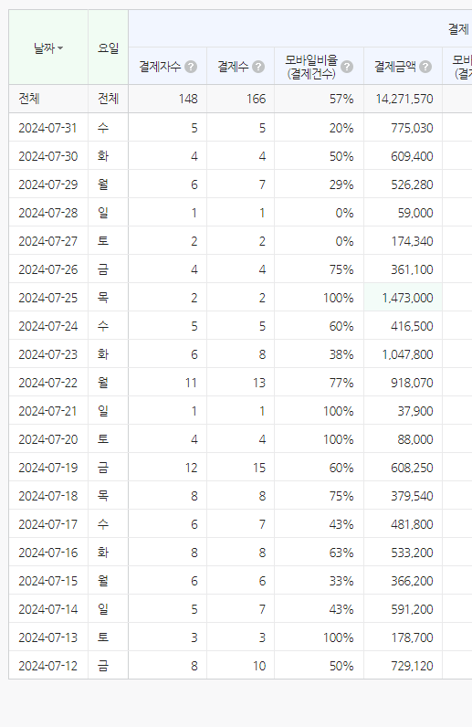

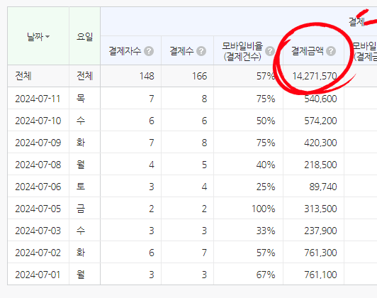

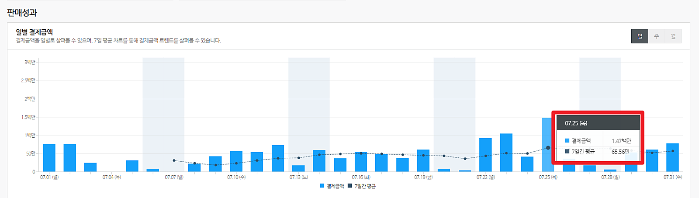

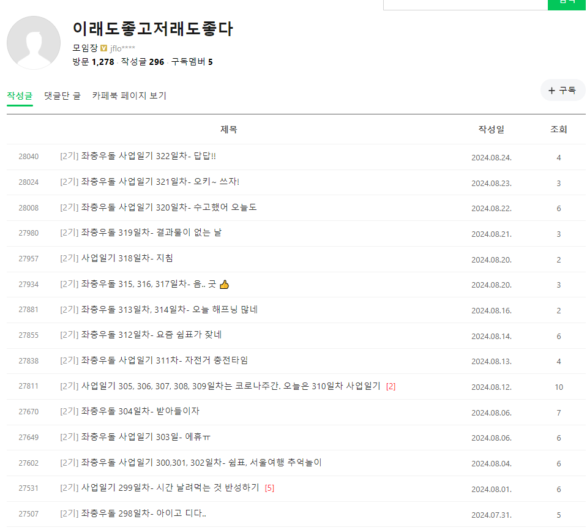

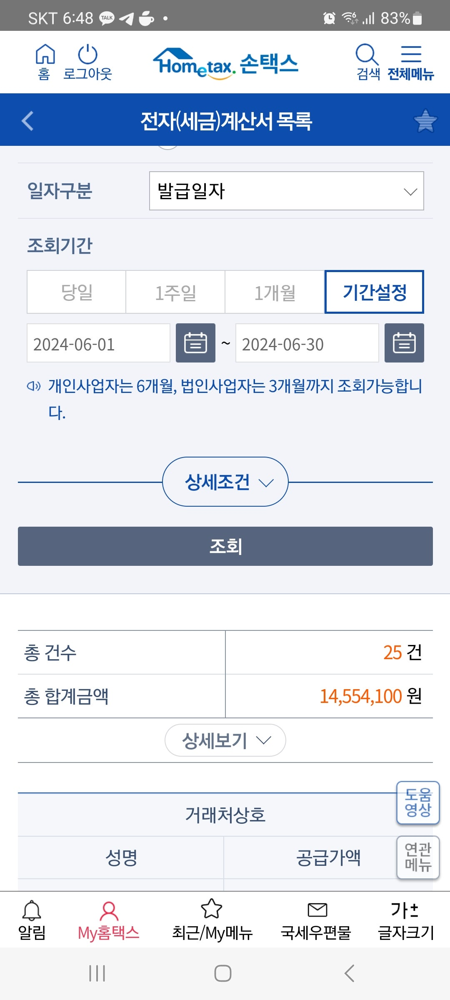

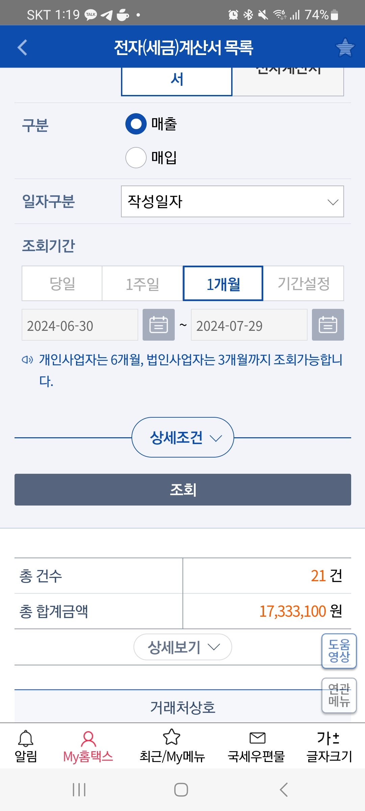

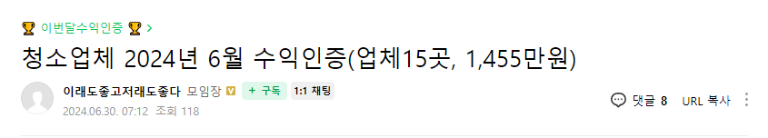

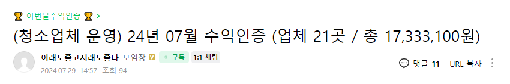

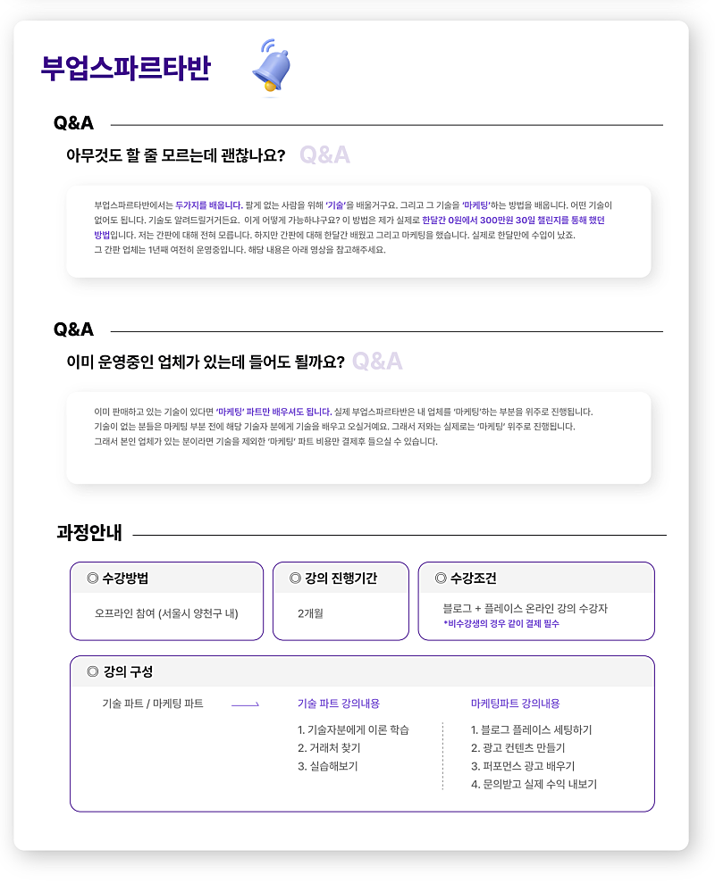

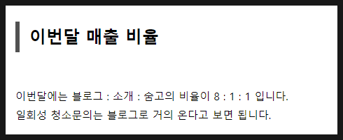

이미지 12: 로컬 보관 실패. [원래 이미지 주소](https://thumb2.photo.mybox.naver.com/3472526937081787220?type=m1280_1280_2&nocache=4933162910) — 수집 응답은 `_관리/이미지수집.json`에 기록.

이미지 13: 로컬 보관 실패. [원래 이미지 주소](https://thumb2.photo.mybox.naver.com/3472526937089816149?type=m1280_1280_2&nocache=5833162910) — 수집 응답은 `_관리/이미지수집.json`에 기록.

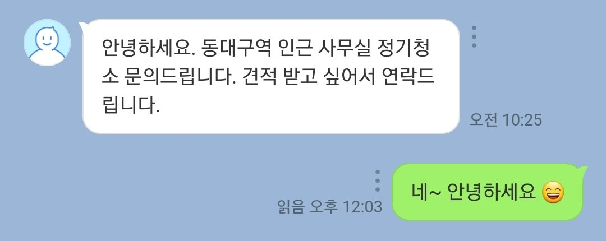

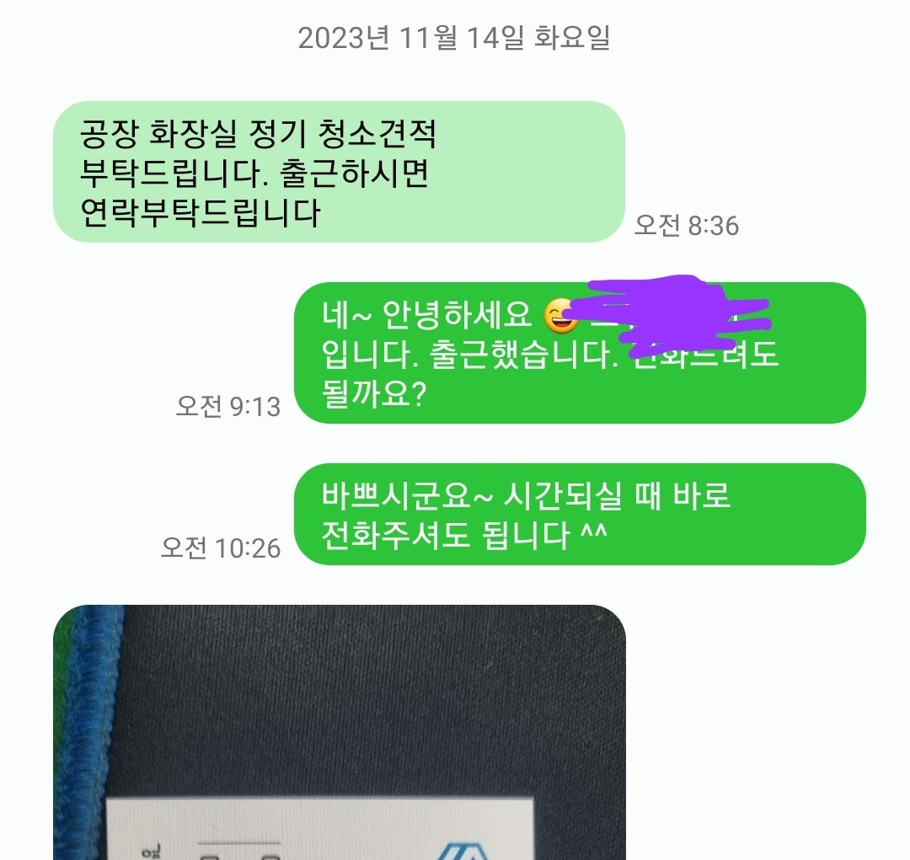

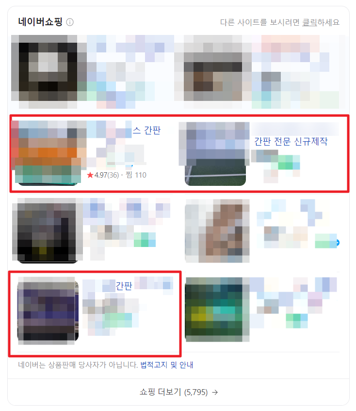

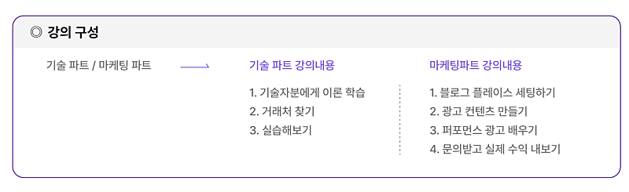

## 원문에 포함된 링크

- https://www.youtube.com/playlist?list=PL_88-XgtYyKe-CfXKbbv9FIC-E_HjtVgv
- #
- https://docs.google.com/forms/d/e/1FAIpQLSc9Zlv0pRCPEtFP0ZTn6hULAF4haHKWGuxGXb4WxsVb8j5QVw/viewform?usp=sf_link
