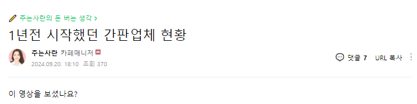
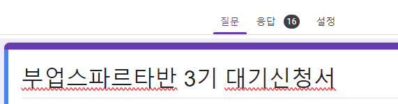

# 부업스파르타 / 마케팅대행창업반 공지관련 안내

- 원천 ID: EPR-CAFE-29303
- 작성자: 주는사란
- 작성일: 2024-10-10T16:00:40.003000+09:00
- 원문: https://cafe.naver.com/ranschool/29303
- 수집일: 2026-09-21
- 텍스트 정리: HTML 문단 순서 유지, 빈 문단·제로폭 공백만 제거. 원본 HTML·JSON 별도 보존. 이미지는 아래에 모아 보관하며 원래 배치는 HTML에서 확인.

## 원문 본문

<!-- P001 -->
얼마전 이런 글을 올렸습니다.

<!-- P002 -->
그래서인지 부업스파르타반과 마케팅대행창업반 관련 문의도 많아졌구요. 대기 신청서에는 16분 정도 신청해주셨습니다.

<!-- P003 -->
먼저 죄송하다는 말씀드려요. 약속을 못 지킬것 같습니다. 제가 원래 올해 안으로 마케팅대행창업반과 부업스파르타반을 하려 했습니다. 근데 준비를 좀더 하고 싶어요.

<!-- P004 -->
사실 지금도 간판하는법 가르치는 것은 어렵지 않습니다. 마케팅 어떻게 하는지 알려드릴순 있는데요. 아마 그렇게 배운 분들이 수익을 달성하게 하는 것도 어렵지 않을겁니다. 들으신 분도 수익을 얻고 저도 돈 벌고 좋다고 생각했어요.

<!-- P005 -->
근데 저는 사실 이 반의 핵심은 '한번'이 아니라 '매달' 수입을 얻게하는거라고 생각하거든요. 부업스파르타 1기 수강생분중 제가 알기로는 수익을 얻었어도 지금까지 하는 분은 10%정도 입니다. 2기 수강생분도 그렇구요. 저는 이번 3기에서는 이 확률을 더 높이고 싶어요. 그러려면 제가 좀더 준비해 놓을것 들이 있어요.

<!-- P006 -->
강의를 하면서 준비해야지~ 생각했는데요. 근데 그건 아닌것 같아요. 제가 제대로 준비하고 알려드리는게 좋을것 같습니다.

<!-- P007 -->
올해 안에 부업스파르타 / 마케팅대행창업반 하겠다는 약속 못 지켜서 죄송합니다. 근데 더 제대로 알려드리기 위함이니 제게 시간을 주세요. 제 목표는 3개월입니다. 3개월 안에 제 성과 다시 보여드릴게요.

<!-- P008 -->
대기신청서 작성해주신 분들에게는 너무 죄송하단 말씀드려요.

## 본문 이미지

## 원문에 포함된 링크

- #
