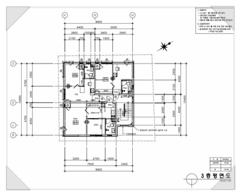
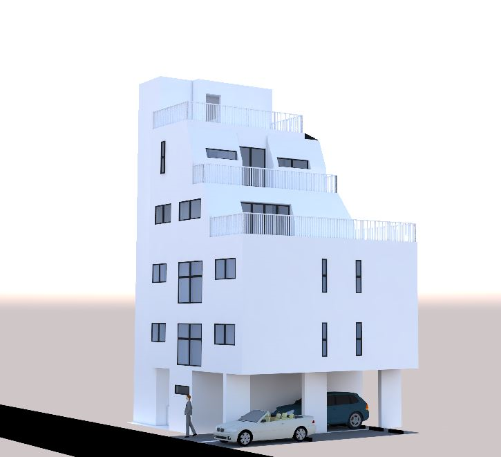

# (1편) 주는사란의 부퇴사 카페에서 0원으로 얻을 수 있는 2가지

- 원천 ID: EPR-CAFE-3
- 작성자: 란박사
- 작성일: 2022-09-29T23:52:15.487000+09:00
- 원문: https://cafe.naver.com/ranschool/3
- 수집일: 2026-09-21
- 텍스트 정리: HTML 문단 순서 유지, 빈 문단·제로폭 공백만 제거. 원본 HTML·JSON 별도 보존. 이미지는 아래에 모아 보관하며 원래 배치는 HTML에서 확인.

## 원문 본문

<!-- P001 -->
먼저, 제 유튜브를 보고 시간을 내서 이 카페까지 방문해 주신 모든분들께 감사합니다.

<!-- P002 -->
제가 이 카페를 개설한 이유는 '저도 사람을 얻고, 여기 있는 분들에게 사람을 드리기'위함입니다.

<!-- P003 -->
사람을 얻는 카페를 하고 싶습니다.

<!-- P004 -->
이제 막 시작해서 사람을 얻을수 있는 정도로 도움이 되는 카페는 아닐겁니다. 그래서 제가 먼저 여러분의 인맥(?) 이 되어드리겠습니다. 제가 10년간 사업했던 모든 지식을 카페에 계속 써 놓겠습니다.

<!-- P005 -->
너는 굳이 왜 이런거까지 하려고해?

<!-- P006 -->
사기꾼...이니?

<!-- P007 -->
제가 굳이 이렇게 나눈다고 해도, 아마 의심가는 분들도 계실겁니다. 이 글을 보신 분이 나이가 어떻게 될진 모르겠지만 최소 20년 이상을 살아오면서 우리는 '준것 만큼'도 못 받는 세상에서 살았고, 그래서 '먼저' 준다는 사람이 의심스러울수 밖에 없습니다.

<!-- P008 -->
이 카페에서 얻어 갈수 있는것

<!-- P009 -->
사람을 얻는다는게 도대체 뭔데 저래? 하실수 있어서, 구체적으로 이 카페에서 뭘 드릴수 있을지를 생각해봤습니다. 저는 당장은 여러분께 드릴수 있는게 많지 않습니다. 그렇지만 당장 2가지는 드릴수 있습니다.

<!-- P010 -->
첫째, 저 라는 인맥

<!-- P011 -->
제가 지금까지 경험했던 것을 나누겠습니다. 제가 뭘 경험했는지 알아야, 제가 여러분께 도움이 될지 안될지 아실수 있겠죠?ㅎㅎ 그래서 자기소개를 간단히(?) 하겠습니다.

<!-- P012 -->
안녕하세요. 주는 사란의 란입니다.

<!-- P013 -->
저는 돈버는 생각을 하는게 취미인 30대 사업가 입니다.현재는 마케팅회사를 운영하며 서울에서 26억짜리 건물을 짓고있는 건물주이기도 합니다.

<!-- P014 -->
제게 "무슨 일 하세요?" "왜 이렇게 많은 일을 하세요?" 라고 물으면, 사실 대답하기가 애매합니다. 저는 돈 자체도 좋지만, 돈 버는 생각하는게 재밌습니다. 취미랄까요?ㅎㅎ 그래서 제가 했던일과 하고 있는 일을 모두 정리해봤습니다.

<!-- P015 -->
1. 국영수 고등학생 학원

<!-- P016 -->
2. 이자카야 2개지점 (목동,홍대점)

<!-- P017 -->
3. 배달전문프랜차이즈 (5개지점)

<!-- P018 -->
4. 부동산 경매투자

<!-- P019 -->
5. 앱개발 (학원리뷰어플)

<!-- P020 -->
6. 공인중개사 취득

<!-- P021 -->
7. 서울시 부동산 5개지점

<!-- P022 -->
8. 분양 대행사

<!-- P023 -->
9.감정평가사 1차 인터넷 강사

<!-- P024 -->
10. 마케팅 회사 운영

<!-- P025 -->
11. 서울시에 50평짜리 땅 소유

<!-- P026 -->
저도 처음에는 힘들었습니다. 돈되는 일은 불법 말고는 다했습니다. 20살부터 친구와 술자리 한번 했던 기억이 없으며, 어린 여자애가 설친다며, 욕도 들었습니다. '어떻게' 해야 돈을 벌수 있는지 알려주는 사람이 없었습니다.

<!-- P027 -->
20대 초에 만났던 남자친구와는 매일 전단지 데이트 하는게 일상이었습니다. 그렇게 돈에 미쳐 25살에 월 천만원씩 벌게되니 제 안에는 허세가 가득했습니다. 허세가 가득했던 어느 25살, 동업자와의 다툼으로 모든 걸 내려놓았더니 빚 3천만원과 리스로 산 벤츠하나만 남았습니다. 남들보다 빨리가는 줄 알았는데 알고보니 한참 늦었더라구요.

<!-- P028 -->
그렇게 다시 학원부터 시작해 빚 다 갚을때까지 3개월이 걸렸고, 26억 건물주가 되기까지 4년이 걸렸습니다. 제가 10년간 11개의 일을 하며 알게된 한가지 사실은, 결국 돈보다 사람을 얻어야 한다는 것입니다. 그리고, 사람을 얻기 위해서는 내가 먼저 베푸는 사람이 되어야 한다는 것입니다. 제가 아는것을 베푸는 사람이 되겠습니다.

<!-- P029 -->
저라는 인맥을 얻고 싶은분들은 아래 인스타보시면 됩니다!

<!-- P030 -->
팔로워 149명, 팔로잉 29명, 게시물 3개 - 주는사란 (자기계발, 창업, 사업, 마케팅)(@ran0220)님의 Instagram 사진 및 동영상 보기

<!-- P031 -->
www.instagram.com

<!-- P032 -->
둘째, 실행력

<!-- P033 -->
돈 잘번다는 유튜버들이 똑같이 중요하다고 말하는 한가지가 있습니다.

<!-- P034 -->
'실행력'

<!-- P035 -->
저는 똑똑하지 못합니다. 고1때 국영수 888등급이었습니다. 근데 그 경력(?)으로 중하위권 학원으로 지금까지도 하루에 2시간 일하고 월 순수익 1500만원이 넘습니다.

<!-- P036 -->
저는 혼자 할 능력이 안됩니다. 그래서 잘 나가는 분들과 동업, 협업을 합니다. 동업하고 있는 회사만 4개이며, 해당 회사에서 들어오는 월 순수익이 2000만원이 넘습니다.

<!-- P037 -->
인맥빨로 먹고 살았습니다.

<!-- P038 -->
제가 10년간 목동에서 학원을 했었고, 하고 있습니다. 물론 저도 부유하진 않지만 부족하진 않은 환경에서 자랐습니다. 근데 금수저 아이들을 가르쳐 보니, 그 아이들이 부러운건 그아이가 받을 재산이 아니라, 환경이었습니다.

<!-- P039 -->
부모가 항상 책을 읽는걸 봤기 때문에, 잔소리 하지 않아도 책을 읽는게 당연하다고 느끼는 집안 분위기

<!-- P040 -->
부모가 스스로 세상에서 이루면서 느꼈던 경험을 바탕으로 한 세상을 보는 관점

<!-- P041 -->
그리고 그걸 실제 해낼수 있게 하는 '환경적' 도움

<!-- P042 -->
물론 저희 부모님을 탓하는건 절대 아닙니다. 아직 완성되진 않았지만, 저는 이 환경을 '후천적'으로 극복했다고 생각합니다. 이 환경이 갖춰지니, 수입이 늘더라구요.

<!-- P043 -->
저는 여러분께 이 환경(카페)를 통해 실행력을 드리겠습니다.

<!-- P044 -->
같이하면 할수 있습니다.

<!-- P045 -->
저도 매일같이 제가 시도하는 모든것들을 같이 나누겠습니다.

<!-- P046 -->
저와 함께 돈 벌러 가실분은

<!-- P047 -->
다음편 으로 가시면 됩니다.

<!-- P048 -->
오늘은 보통 사람들이 서울 건물주가 되기까지의 가장 보통의 방법을 적어보려합니다. 서울의 건물주가 되는 법은 경제적 자유를 이루는 방법과 같습니다. 결국 본질은 내가 '일을 ...

<!-- P049 -->
cafe.naver.com

## 본문 이미지

이미지 4: 로컬 보관 실패. [원래 이미지 주소](https://dthumb-phinf.pstatic.net/?src=%22https%3A%2F%2Fscontent-nrt1-1.cdninstagram.com%2Fv%2Ft51.2885-15%2F313867032_157768743628688_6504359919776316833_n.jpg%3Fstp%3Ddst-jpg_s100x100%26_nc_cat%3D102%26ccb%3D1-7%26_nc_sid%3D8ae9d6%26_nc_ohc%3DOJKGyqHxsxAAX9SQuWf%26_nc_ht%3Dscontent-nrt1-1.cdninstagram.com%26oh%3D00_AfARKZKK7Dw0FXpUAF5oJ6ktvp2RkFRTAOkVxe2MdW3n_g%26oe%3D63C2F024%22&type=ff120) — 수집 응답은 `_관리/이미지수집.json`에 기록.

## 원문에 포함된 링크

- #
- https://www.instagram.com/ran0220/?igshid=YmMyMTA2M2Y%3D
- https://cafe.naver.com/ranschool/8
