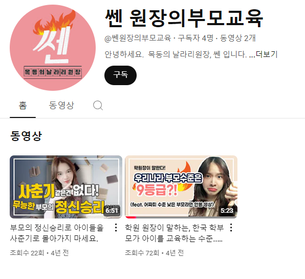
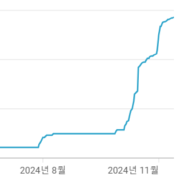

# 괴로운 일

- 원천 ID: EPR-CAFE-30128
- 작성자: 주는사란
- 작성일: 2024-11-14T15:19:06.500000+09:00
- 원문: https://cafe.naver.com/ranschool/30128
- 수집일: 2026-09-21
- 텍스트 정리: HTML 문단 순서 유지, 빈 문단·제로폭 공백만 제거. 원본 HTML·JSON 별도 보존. 이미지는 아래에 모아 보관하며 원래 배치는 HTML에서 확인.

## 원문 본문

<!-- P001 -->
무슨 일을 시작할 때 가장 고통스러운 일 하나를 뽑으라고 한다면 포맷을 만드는 것이다.

<!-- P002 -->
주는사란을 시작하기 전에 유튜브를 3번 말아먹었다. 정확히 표현하자면 하다가 말았다. 영상을 2개 올렸는데 구독자가 4명 밖에 안되는 사실을 받아들이기 힘들었다.

<!-- P003 -->
아직도 남아있다.

<!-- P004 -->
그래서 주는사란때는 도중에 멈추는걸 막기 위해 영상 10개를 찍고 그 뒤로부터 올리기 시작했다. 참고로 영상 10개를 찍는데 6개월 넘게 걸렸다.

<!-- P005 -->
물론 나중에 알게된건데 영상 2개에 이정도 조회수에 구독자 4명이면 엄청난 수치다. 주는사란은 영상 3개 올렸을때도 구독자 0명이었다.

<!-- P006 -->
도중에 포기하게 되는 가장 큰 이유로는 2가지가 있다.

<!-- P007 -->
1. 된다는 확신이 없다는 것

<!-- P008 -->
2. 어떻게 해야할지 생각할게 너무 많다는것

<!-- P009 -->
개인적으로 2번이 요즘 나를 괴롭히고 있다.  요즘 새로운 유튜브를 하고 있다. 나는 이미 유튜브가 된다는걸 너무 잘 알고 있다. (1번 해결) 근데도 하기가 너무 어렵다. 왜냐면 어떤 컨셉으로 어떤 내용을 어떻게 말할건지 처음부터 다 짜야된다.

<!-- P010 -->
이 과정에서 너무 머리를 많이 쓰게 된다. 심지어 며칠간 감기때문에 고생했는데 감기약을 먹고 자는 그 순간에도 대본 서론에 어떤 내용을 써야 할지 계속 고민됐다.

<!-- P011 -->
지금은 주는사란 영상 하나 만드는데 2일정도 걸린다. 근데 새로운 유튜브에 영상 하나를 만드는데는 일주일 내내 고민해도 시작도 못할때도 많다.

<!-- P012 -->
요즘 새 유튜브가 알고리즘을 제대로 타서 구독자도 엄청 늘고 있고

<!-- P013 -->
2건의 문의도 왔다.

<!-- P014 -->
둘다 최소 월 천만원대 계약이다. (현재 한개는 조율중에 있음)

<!-- P015 -->
이제 벌써 4년째 매일 글을 쓰고 있다. 처음에는 매일 내 블로그를 썼고, 그 다음에는 매일 남의 블로그를 썼다. 또 2년 전부터는 매일 내 대본을 쓰고 있고, 또 남의 대본을 써주기도 한다. 매일 글을 쓰는데도 매일 대본을 쓰는데도 매일 괴롭다. 강의를 하는 사람 입장에선 "언젠가는 좋아집니다" 라고 말해야 하지만 솔직히 불가능하다....ㅎㅎ

<!-- P016 -->
물론 막상 영상을 보면 진짜 뿌듯하긴 하다. "이걸 내가 썼다고?ㅎㅎ 미쳤다ㅎㅎ" 신기하면서도 다시 쓸 생각에 괴로워진다.

<!-- P017 -->
그래서 오늘은 왜이렇게 괴로울까에 대해서도 생각을 해봤다. 괴로운 가장 큰 이유는 '더 잘하고 싶은 마음'이다. 이전에 잘했던것 보다 더 잘하고, 못했던건 보완하고 싶은 마음이 생긴다. 지금 주는사란 영상에서도 하나하나 보완하고 싶은 것들이 있어서 하고 있는 중이다. 그래서 새로운 것에는 잘한것 아쉬운것을 보완해서 하려니 생각할게 참 많다.

<!-- P018 -->
물론 그냥 해볼수도 있지만 지금 이 괴로움을 놓고 싶지는 않다. 이 괴로움이 꽤나 즐겁다랄까?

<!-- P019 -->
아마 내 강의를 처음 듣고 시작하려는 분의 마음도 이러지 않을까 싶다. 그 분들이 나처럼 즐기는 날이 왔으면 ㅎㅎ

<!-- P020 -->
괴로움이 즐거움이 되려면 같이 하면 됩니다 🔽

<!-- P021 -->
2024년 연말 분기별 모임을 오픈합니다🎉🎉 분기별 모임이란, 수강생들끼리 만나서 수다떨고 정보교류 하고 저의 간단한 특강을 듣는 시간입니다. 벌써 2024년 마지막 분기...

<!-- P022 -->
cafe.naver.com

## 본문 이미지

## 원문에 포함된 링크

- #
- https://cafe.naver.com/ranschool/29838
