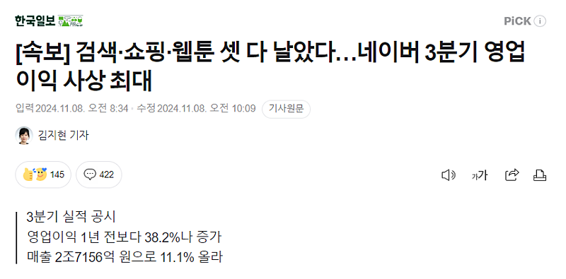
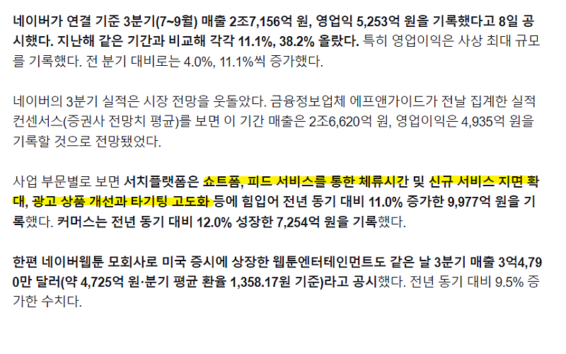
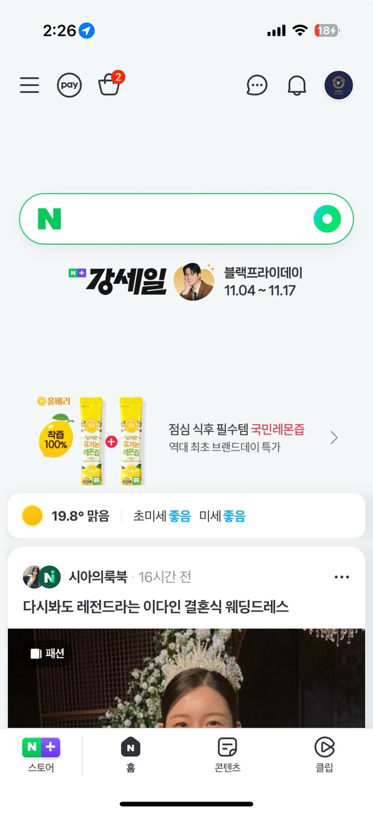
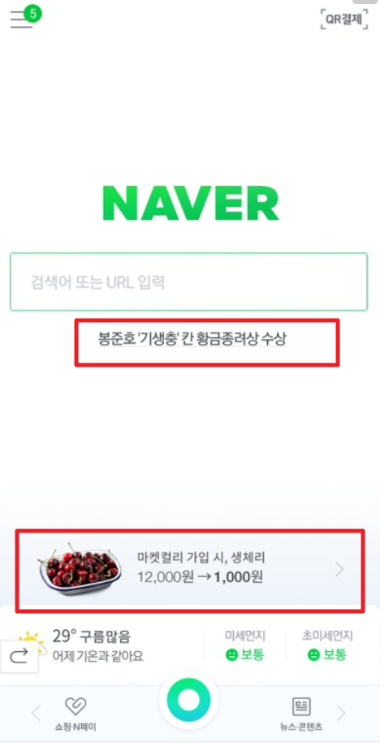
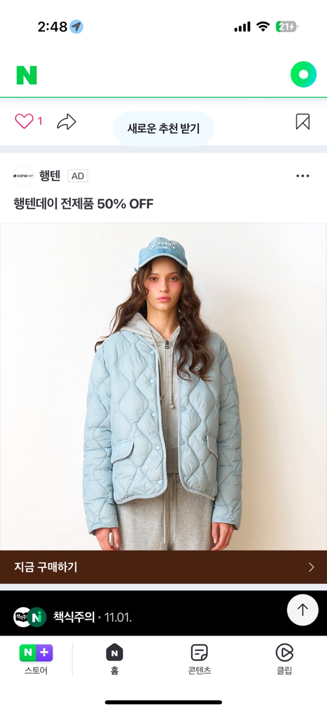
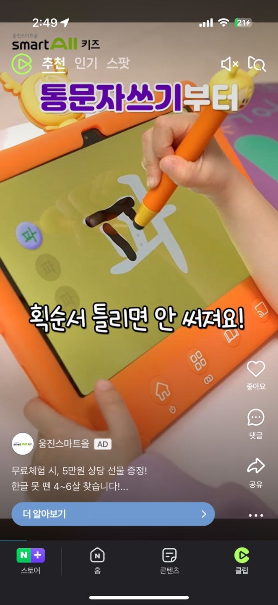

# 블로그, 이렇게도 활용할 수 있습니다.

- 원천 ID: EPR-CAFE-30161
- 작성자: 주는사란
- 작성일: 2024-11-15T14:51:37.387000+09:00
- 원문: https://cafe.naver.com/ranschool/30161
- 수집일: 2026-09-21
- 텍스트 정리: HTML 문단 순서 유지, 빈 문단·제로폭 공백만 제거. 원본 HTML·JSON 별도 보존. 이미지는 아래에 모아 보관하며 원래 배치는 HTML에서 확인.

## 원문 본문

<!-- P001 -->
지난주에 한 뉴스를 봤다.

<!-- P002 -->
챗 gpt가 나오면서 네이버는 곧 망할거라는 기사가 많다. 근데 실제로는 이번 분기에 네이버는 영업이익이 사상 최대란다. 심지어 검색분야에서 영업이익을 냈다고 해서 좀더 살펴봤다.

<!-- P003 -->
크게 3가지 부분이 있다.

<!-- P004 -->
1. 쇼트폼, 피드서비스를 통한 체류시간 증대

<!-- P005 -->
2. 신규서비스 지면 확대

<!-- P006 -->
3. 광고상품 개선과 타기팅 고도화

<!-- P007 -->
먼저 첫번째다. 쇼트폼과 피드서비스를 통해 체류시간을 높였다는 이야기가 나온다. 여기서 말하는 숏폼은 네이버에서의 클립을 말한다. 실제로 현재 네이버 어플로 접속하면 아래칸에 보면 클립이 추가됐다. 원래는 뉴스/ 컨텐츠만 있었다.

<!-- P008 -->
*아래 내용은 왼쪽 사진을 신버전 1로 부르고, 오른쪽 사진을 신버전 2로 적었습니다.

<!-- P009 -->
(바뀌기 전 / 후)

<!-- P010 -->
네이버 실적에 따르면 이 클립으로 인해서 네이버 어플 체류시간이 늘었다는 말이다. 개인적으로는 저 클립 칸때문에 늘었다기 보다는 바로 아래에 내리면 블로그 글이랑 클립이 같이 나오는데 이것 때문에 늘었을거라 추측된다.

<!-- P011 -->
바로 이 부분이 2번 신규서비스 지면 확대다. 사실 이것 말고도 쇼핑 부분지면에서도 많은 변화가 있었는데 이건 우리 마케팅대행과는 연관이 없으니 생략한다.

<!-- P012 -->
홈화면 아래에 블로그/ 클립을 추가한건 개인적으로 네이버가 최근에 가장 잘했던 부분이라고 생각한다. 기억할지 모르겠지만 네이버는 초창기 모바일 화면이 이랬다.

<!-- P013 -->
*아래 사진과 같은 포맷은 구버전으로 적었습니다.

<!-- P014 -->
뭘 검색하지 않아도 볼 것이 있었다. 이게 사실 고객이 네이버에 더 길게 체류하도록 하는 요인중 하나였다고 생각하는데 사라졌다.

<!-- P015 -->
뇌피셜인데 구버전에서 신버전1로 바뀐 이유는 광고효과와 광고 비용때문이라고 생각한다.

<!-- P016 -->
구버전(바로 위 사진)은 중간에 뉴스가 나오고 아래 잠깐 광고가 보이는 형태이고, 신버전1 (아래 사진)은 딱 깔끔하게 광고 2개를 띄울수 있다. 당연하지만 신버전1이 광고 효과가 더 높을거라 생각하고 광고 비용도 더 많이 받을수 있었을거라 생각한다. 고객 입장에서도 깔끔해서 좋고. (너무 구글 따라한 느낌이 들긴 하지만)

<!-- P017 -->
근데 이러다 보니 체류시간은 떨어질수밖에 없다. 들어가자마자 영상이 보이는 유튜브와 인스타에 비해 네이버는 어떤 컨텐츠까지 가기까지 클릭을 너무 많이 해야한다. 그래서 이 부분을 해결하기 위해 신버전 2로 바꾼거라고 생각한다. 굳이굳이 홈화면을 깔끔하게 바꿨다가 다시 아래 피드를 넣은걸 보면 말이다.

<!-- P018 -->
이렇게 하면 체류시간을 늘릴 수 있을 뿐 아니라 피드 중간에 광고도 넣을수 있다.

<!-- P019 -->
이게 바로 3번 광고상품 개선과 타기팅 고도화 이야기다.

<!-- P020 -->
광고상품을 '개선' 했다고 표현했는데 내 생각에는 '다양화'가 더 맞는 표현 같다. 광고 상품이 많아졌다. 방금 위에서 본 홈 화면 아래 피드에 광고를 넣을수 있기 때문에 이 광고 상품이 생겼고, 클립 파트에서도 유튜브쇼츠 / 인스타 릴스처럼 넘기다 보면 아래처럼 광고가 나온다.

<!-- P021 -->
네이버 광고는 원래 거의 이미지 기반이었는데 클립 덕분에 영상 광고도 많아졌다. 그래서 '개선'이라고 표현한것 같기도...

<!-- P022 -->
마케팅 대행과 더 연관있는건 타기팅 고도화에 대한 이야기인데 이 이야기를 좀더 해볼까 한다. 다음편에서...ㅎ 이걸 알면 앞으로 블로그를 어떻게 활용할수 있는지가 보입니다. 그럼 다음편에서 만나요 뿅

## 본문 이미지

## 원문에 포함된 링크

- #
