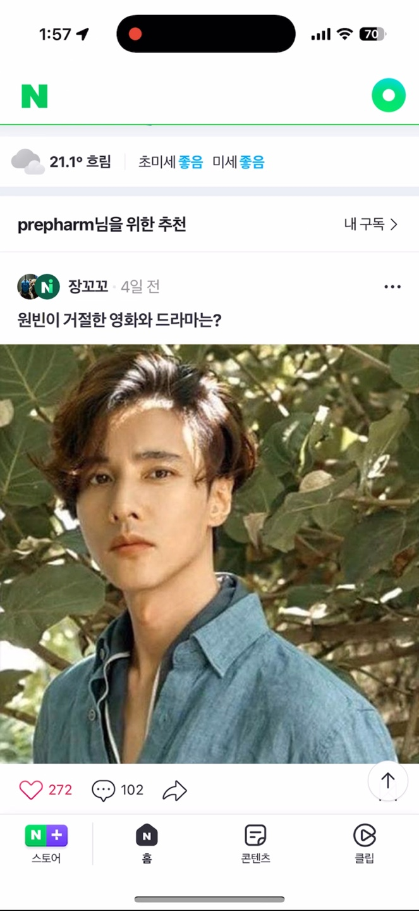
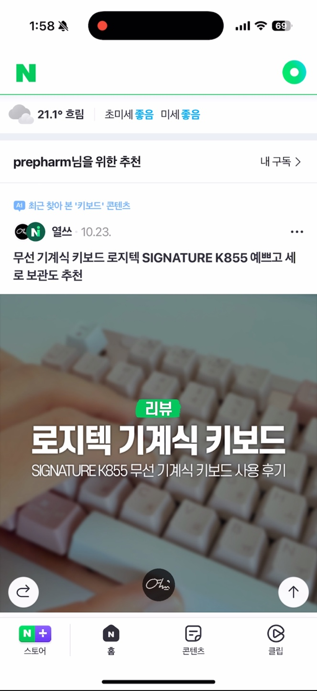
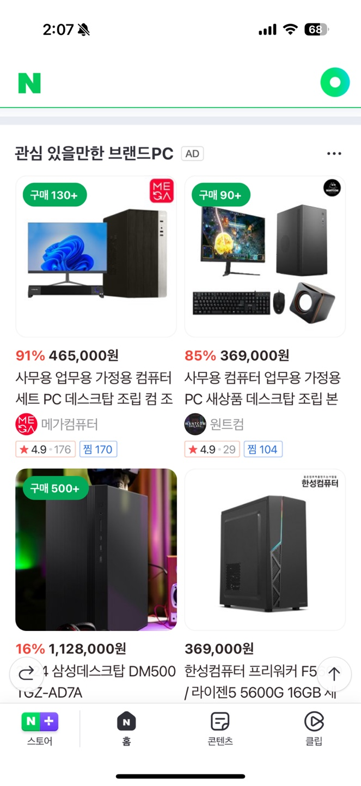
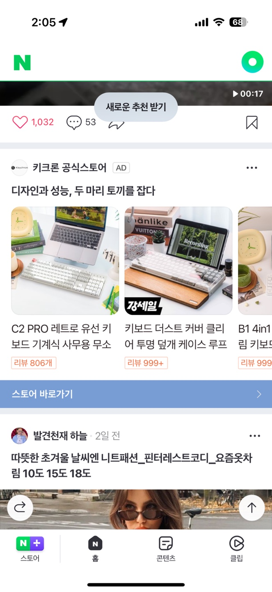
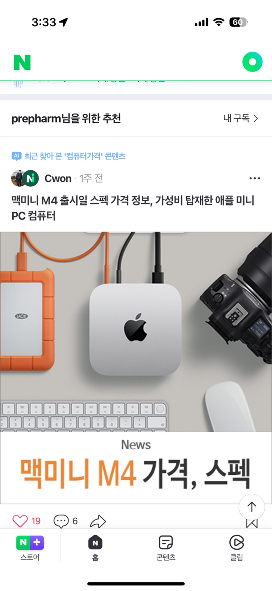
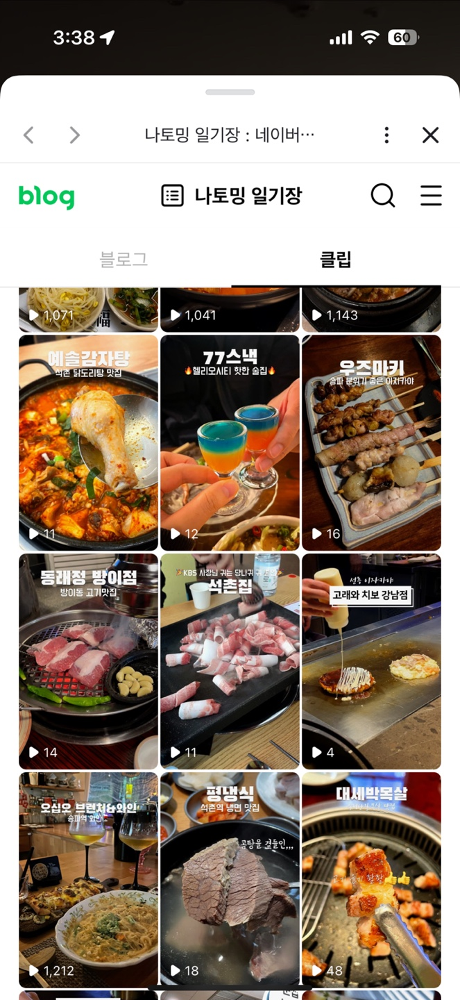
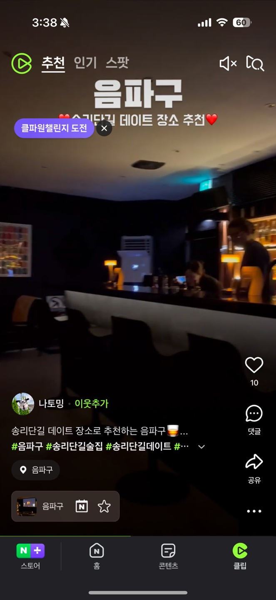
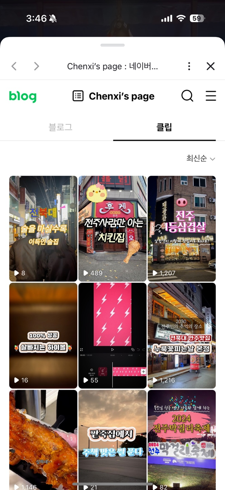
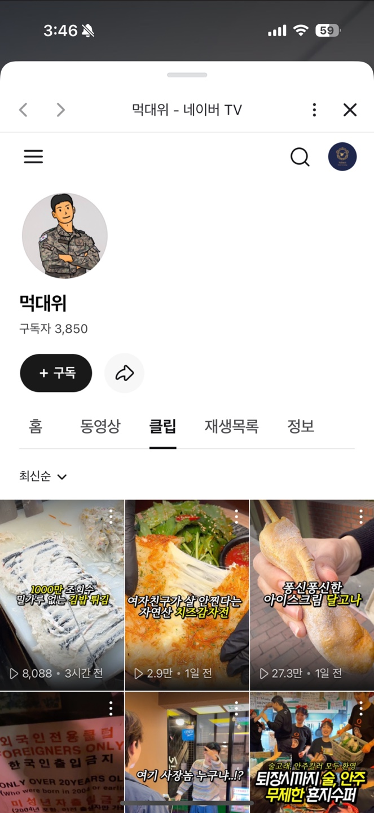

# 블로그, 지금 시작해도 할수 있는 이유가 생겼어요

- 원천 ID: EPR-CAFE-30196
- 작성자: 주는사란
- 작성일: 2024-11-16T15:56:03.057000+09:00
- 원문: https://cafe.naver.com/ranschool/30196
- 수집일: 2026-09-21
- 텍스트 정리: HTML 문단 순서 유지, 빈 문단·제로폭 공백만 제거. 원본 HTML·JSON 별도 보존. 이미지는 아래에 모아 보관하며 원래 배치는 HTML에서 확인.

## 원문 본문

<!-- P001 -->
대한민국 모임의 시작, 네이버 카페

<!-- P002 -->
cafe.naver.com

<!-- P003 -->
이 글의 2편입니다.

<!-- P004 -->
위 글을 요약하자면 이렇습니다.

<!-- P005 -->
1. ai가 나오면 네이버는 망할거라는 예측이 있었지만, 아이러니하게도 네이버는 올해 3분기 사상 최대 영업이익을 냈다.

<!-- P006 -->
2. 대표적인 이유로는 3가지가 있다.

<!-- P007 -->
- 쇼트폼, 피드서비스를 통한 체류시간 증대

<!-- P008 -->
- 신규서비스 지면 확대

<!-- P009 -->
- 광고상품 개선과 타기팅 고도화

<!-- P010 -->
3. 유튜브 인스타 틱톡 숏폼 최강자들 사이에서 네이버가 체류시간을 늘릴수 있는 가장 큰 요인으로는 예상외로 숏폼이다. (네이버에서는 클립으로 부름)

<!-- P011 -->
4. 이 클립을 노출 하기 위해 홈화면도 개편했다. 그러면서 네이버는 광고를 더 많이 할수 있었고 돈을 더 벌었다.

<!-- P012 -->
근데 네이버가 돈을 많이 버는 것과 내가 마케팅대행으로 돈을 많이버는건 연관이 있으면서도 없다. 그래서 오늘은 좀더 마케팅대행부업을 하는 사람 입장에서 이 이야기를 적용해보려한다.

<!-- P013 -->
바로 '타기팅 고도화' 에 관한 이야기다.

<!-- P014 -->
일단 타기팅 고도화 라는 말을 간단히 정리해보면 이렇다. 광고를 더 '살' 사람에게 보여주겠다는 말이다. 그래야 광고 효율이 더 잘 나올테고 그래야 네이버가 돈을 더 잘벌테니까 말이다. 근데 사실 우리는 블로그를 대신 써주는 일을 하기 때문에 여기서 말하는 '광고' 와는 연관이 없어보이지만 그렇진 않다.

<!-- P015 -->
네이버가 타기팅 고도화를 할때에는 단순히 광고에만 적용하지않고 모든 컨텐츠에도 적용하기 때문이다. 그걸 알수 있는 예시가 있다.

<!-- P016 -->
위의 영상을 봐보자.

<!-- P017 -->
일단 처음에는 홈화면 아래에 보면 원빈 / 드라마 / 여행 관련 컨텐츠가 나온다. 그리고 일부러 나는 평상시에 관심 없는 컴퓨터 / 키보드 등에 대한 키워드를 검색해봤다. 일부로 몇개의 쇼핑에도 들어가서 보고, 좋아요도 눌러보고 또 관련 컨텐츠도 더 검색해봤다. 그리고 다시 홈 화면에 돌아와서 추천 다시 받기를 눌렀다. 그랬더니 이렇게 보인다.

<!-- P018 -->
검색하기 전 (왼쪽) / 검색한 후 (오른쪽)

<!-- P019 -->
오른쪽 사진에 보면 바로 '최근 찾아본 키보드 컨텐츠' 라고 해서 내가 검색한 내용을 기반으로 블로그를 추천해준다. 그리고 밑에 광고도 바뀌었다. 컴퓨터 / 키보드 관련 내용으로.

<!-- P020 -->
이 알고리즘이 얼마나 고도화가 됐는지 최근 몇번 테스트 해봤는데 아직 미숙하긴 하다. 개인적으로 미숙하다고 느끼는 점은 아래와 같다.

<!-- P021 -->
1. 검색한 단어 기반으로 1차원적인 내용정도 밖에 추천이 안된다.

<!-- P022 -->
예를 들어 키보드 - 컴퓨터 - 본체 딱 이정도 => 현재 구글의 경우 키보드 - 컴퓨터 - 본체 - 방송용 - 방송용 제품까지 같이 추천해주고 있음 (최소 3~4차원까지 확대됨)

<!-- P023 -->
아래도 보면 정확히 내가 검색한 단어가 해당 블로그 제목으로 들어가 있는 경우만 추천해주는 형태를 띔 => 확장 검색어까지는 반영이 안됨

<!-- P024 -->
2. 검색하고 피드가 바뀌는건 일시적이다. 리타겟이 안된다.

<!-- P025 -->
보통은 구매가 될때까지 추천하곤 하는데 검색한 그 즉시 일시적으로만 반영이 되는 정도이다.

<!-- P026 -->
3. 보여주는 블로그 / 카페 / 광고가 거의 정해져있다.

<!-- P027 -->
유튜브,인스타의 경우 보통 10개당 한개정도는 신규 계정의 채널을 띄워서 초반 진입자를 위한 기회를 준다. 하지만 아직 네이버는 그런 기회를 주는 것 같지는 않다.

<!-- P028 -->
마케팅대행부업을 하는 사람이 활용할 수 있는 내용

<!-- P029 -->
1. 블로그 키우기는 클립으로.

<!-- P030 -->
아직은 신규 블로그에게 홈피드에 기회를 주고 있진 않다. 하지만 앞으로 몇년내로 신규블로거들에게 기회를 줄거라 생각한다.

<!-- P031 -->
왜냐면 아직 홈피드는 열지 않았지만 클립에는 신규 클립을 많이 노출하려고 하고 있다. 최근 클립을 계속 보면서 연결된 계정을 다 가봤는데 아직 시작한지 얼마 안된 클립들도 잘 노출이 된다.

<!-- P032 -->
아래도 시작한지 얼마 안된 블로그인데도 나한테 노출이 됐다.

<!-- P033 -->
무엇보다 장기적으로 신규 블로거들에게 기회를 주지 않으면 모든 컨텐츠에 광고만 있을테고 그렇다면 체류시간이 떨어질거라 그렇게 갈수밖에 없다는 생각이다.

<!-- P034 -->
2. 노출은 클립으로, 설득은 글로.

<!-- P035 -->
클립이 활성화 되면 블로그 글 대행은 의미가 없을까? 솔직히 나는 더 글의 중요성이 강조될거라고 본다.

<!-- P036 -->
지금도 유튜브 쇼츠와 인스타 릴스 그리고 틱톡에서의 가장 큰 문제점 중 하나는 부족한 설득력이다. 누군가를 1분도 안되는 시간에 설득해서 "내꺼 사" 라고 말하기는 부족하다. 그래서 여전히 유튜브에서 롱폼 (긴영상)이 효과가 있는 이유이기도 하다.

<!-- P037 -->
물론 그냥 많은 노출을 목표로 하는 업종들은 블로그 글의 효과가 떨어질수도 있다. 근데 지금 우리가 메인으로 하는 업종 (학원, 인테리어, 요양원 등)은 대부분 많은 노출을 목표로 하고 있지 않기 때문에 영향은 미미할 것으로 본다.

<!-- P038 -->
오히려 장점은 블로그 레벨때문에 노출하지 못했던 키워드를 클립을 통해 노출할수 있게 되면서 기회가 열릴것이다.

<!-- P039 -->
3. 클립은 무조건 블로그로.

<!-- P040 -->
현재 클립을 보면 네이버 tv / 블로그 이 두곳에 업로드된 영상을 노출하고 있다.

<!-- P041 -->
블로그에 클립을 올린경우 (왼쪽) / 네이버 tv에 클립을 올린경우 (오른쪽)

<!-- P042 -->
네이버가 네이버 tv라는걸 만들어서 유튜브 처럼 운영하려고 했지만, 크게 성공하진 못했다. 일단 네이버 tv를 어디서 봐야하나 라고 했을때 접근성이 떨어지고 기존 유튜버와 인플루언서들을 모두다 유입시키지 못했다. 그래서 그 대안으로 블로그에 클립을 올리는 방식을 추가했다.

<!-- P043 -->
현재 클립이 블로그 레벨에 어떤 영향을 줄지에 대해서는 확인된바가 없지만, 개인적으로는 반드시 영향을 줄수밖에 없다고 생각한다. 블로그의 핵심은 유입과 체류시간인데 일단 클립을 통해 유입을 시키는 것이 가능하고 체류시간도 글보다는 영상이 더 길수 있기 때문이다.

<!-- P044 -->
그리고 위에서도 말했지만 이게 곧 신규 블로그에게 주는 기회라고도 본다.

<!-- P045 -->
결론 -

<!-- P046 -->
앞으로의 블로그는

<!-- P047 -->
클립을 통해 블로그를 키워서 내 글로 유도한 후 문의를 받는다

<!-- P048 -->
로 활용법이 변할것이다.

<!-- P049 -->
앞으로는 짧은 컨텐츠를 만드는 법을 배워야 한다. 근데 사실 이건 내가 이미 강의에서 말한 내용이다. 짧은 컨텐츠란 다시 짧게 글을 쓰는게 절대 아니다. 긴 글에서 서론을 가져오면 된다.

<!-- P050 -->
다시 말해서 서론을 얼마나 잘쓰냐 이게 결국 블로그가 어떻게 변화하건 살아남는 사람이라고 생각한다.

<!-- P051 -->
이 부분을 어떻게 잘할지에 대해서는 앞으로 추가적으로 글을 쓰도록 하겠습니다. 블로그 미래편  끝!

## 본문 이미지

## 원문에 포함된 링크

- https://cafe.naver.com/ranschool/30161
- #
