# 내 마케팅 대행 블로그로 문의를 받는 과정

- 원천 ID: EPR-CAFE-30321
- 작성자: 주는사란
- 작성일: 2024-11-21T11:32:50.737000+09:00
- 원문: https://cafe.naver.com/ranschool/30321
- 수집일: 2026-09-21
- 텍스트 정리: HTML 문단 순서 유지, 빈 문단·제로폭 공백만 제거. 원본 HTML·JSON 별도 보존. 이미지는 아래에 모아 보관하며 원래 배치는 HTML에서 확인.

## 원문 본문

<!-- P001 -->
저의 첫 제자이자 친구인 브블인에게 몇달전 블로그를 다시 써봐달라고 했습니다. 본인의 마케팅대행 브랜드 블로그에 블로그 마케팅 대행을 해주겠다는 글이요. 진짜 계약을 하려는 목적이었다기 보다는 계약을 따내는 과정을 보여드리고 싶어서요.

<!-- P002 -->
해당 과정과 몇가지 팁을 드리려 합니다. 먼저 과정입니다.

<!-- P003 -->
첫 글은 7월에 시작했구요.

<!-- P004 -->
그뒤로 7월과 8월에 8개정도 적었습니다.

<!-- P005 -->
그리고는 바쁘다고 열심히 안적더라구요..?ㅎㅎ 다시 이번달 초부터 적어달라고 부탁했습니다.

<!-- P006 -->
총 몇건의 문의를 받았을까요?

<!-- P007 -->
문의는 톡톡으로만 받고 있는데요.

<!-- P008 -->
총 3건의 문의가 왔습니다.

<!-- P009 -->
단가는 약 이정도 받고 있습니다.

<!-- P010 -->
진행과정에 대한 안내도 이렇게 드렸구요.

<!-- P011 -->
글을 몇가지 형태로 바꿔가면서 적어봤는데요. 팁 2가지를 드립니다.

<!-- P012 -->
1. 아예 예시를 보여주기

<!-- P013 -->
이제는 더이상 뻔한 말로 적어서는 문의 받기가 어렵습니다. 아주 구체적인 예시가 들어가 줘야해요.

<!-- P014 -->
"이런 이런식으로 할거예요" 가 아니라 "a부분에 대해서는 1,2,3,4 형태로 말할거구요. b 부분에 대해서는 5,6,7 형태로 할게요" 라고 구체적으로 이야기 해줘야 합니다.

<!-- P015 -->
문의온 글의 예시를 보여드릴게요.

<!-- P016 -->
강의에서 언급했던 키워드 마이닝 과정 자체를 글에 녹여냈구요.

<!-- P017 -->
강의에서 언급한 이야기를 하되 아예 예시를 보여줬습니다. 각 예시는 문장을 적은거예요.

<!-- P018 -->
이런 예시를 통해 어떻게 내가 글을 적을건지에 대한 내용을 짐작 가능하도록 적었습니다.

<!-- P019 -->
2. 사연 중심으로 글 작성하기

<!-- P020 -->
문의가 오려면 결국 '왜 나여야만 하는지'가 있어야 해요. 그냥 정보만 전달하면 "그렇구나" 하고 나갑니다. 그래서 핵심은 '그 개념을 왜 내가 잘 적용할수 있는지'가 보여야 됩니다. 그걸 가장 잘 보여줄수 있는 것중 하나가 사연입니다. 그래서 글을 사연 중심으로 구성했는데요.

<!-- P021 -->
예를 들면 이런식입니다.

<!-- P022 -->
일단 처음에는 문의 온 과정에 대한 설명을 했구요.

<!-- P023 -->
그 뒤로는 중간의 소통과정을 언급 하면서 어떻게 해주는지 자연스럽게 인식하도록 했습니다.

<!-- P024 -->
당연히 구체적인 예시도 넣었구요.

<!-- P025 -->
그리고 마지막에는 어떤 부분이 아쉬운지 어떤 성과를 냈는지까지 언급했습니다.

<!-- P026 -->
최근에 인터뷰를 하면서 수강생의 글을 읽고 있는데요. 제가 알려드린것 중 잘 적용이 안된 부분이 있더라구요. 한분한분 보면서 부족한 부분을 어떻게 보완할수 있는지도 주기적으로 피드백 드릴수 있도록 하겠습니다.

## 본문 이미지

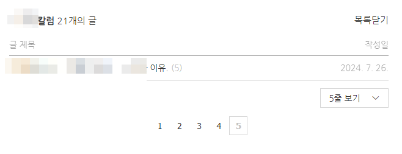

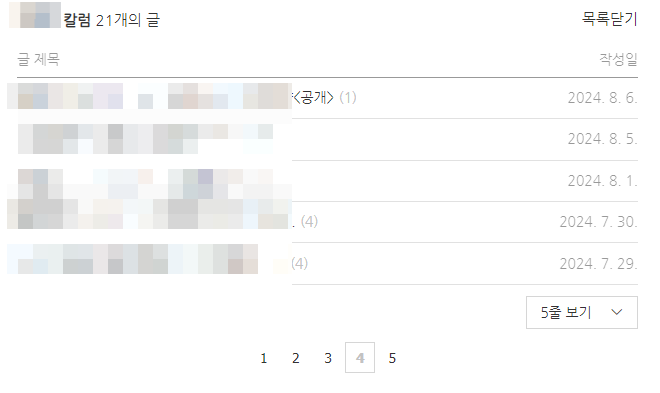

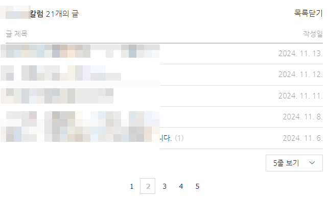

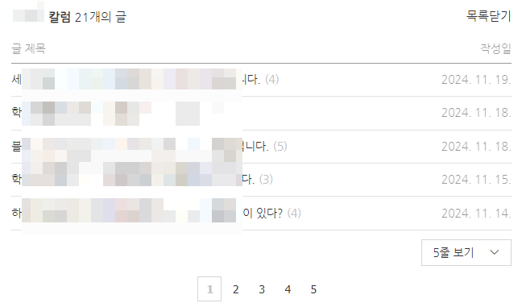

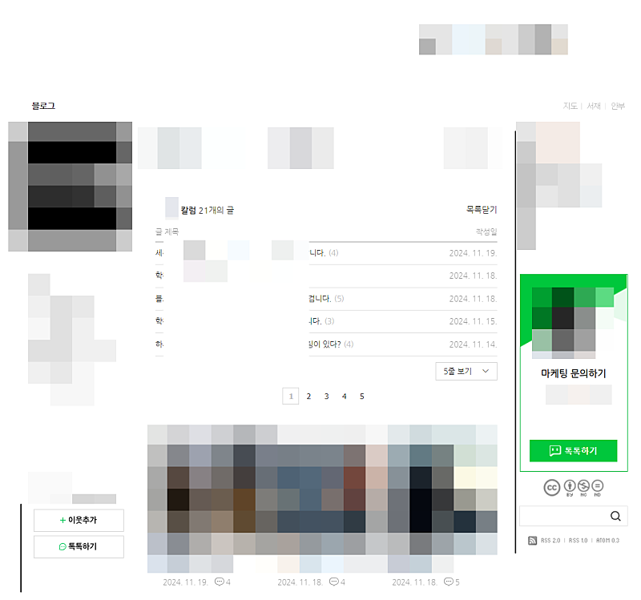

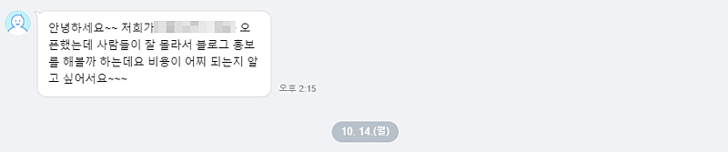

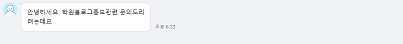

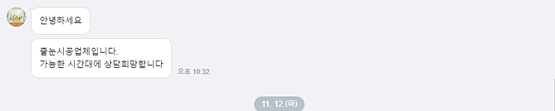

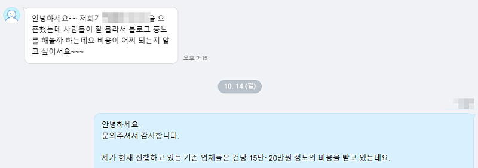

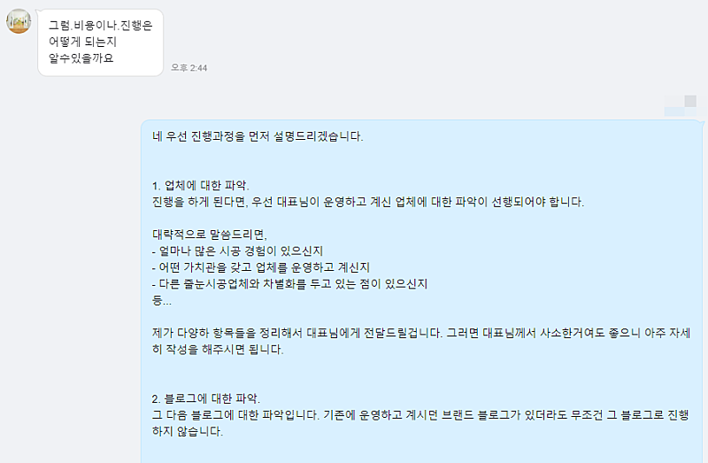

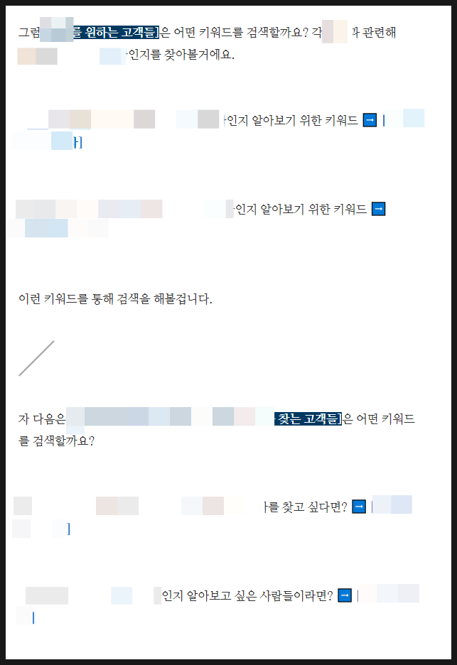

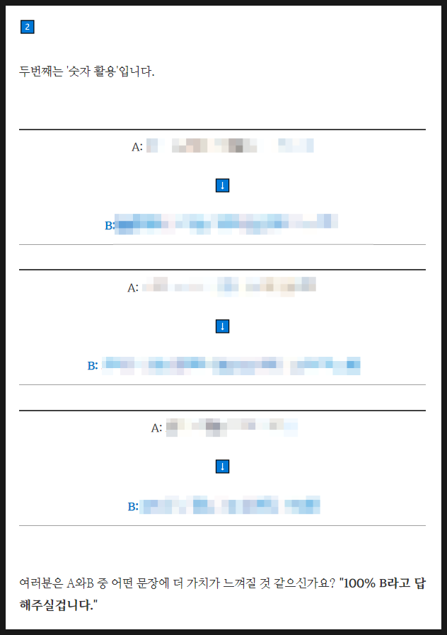

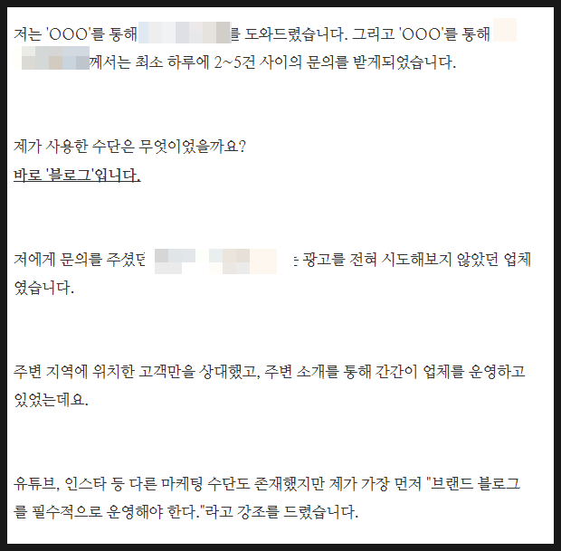

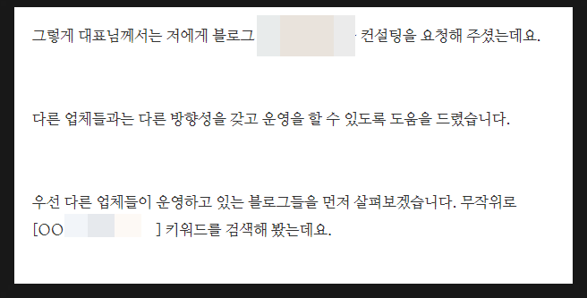

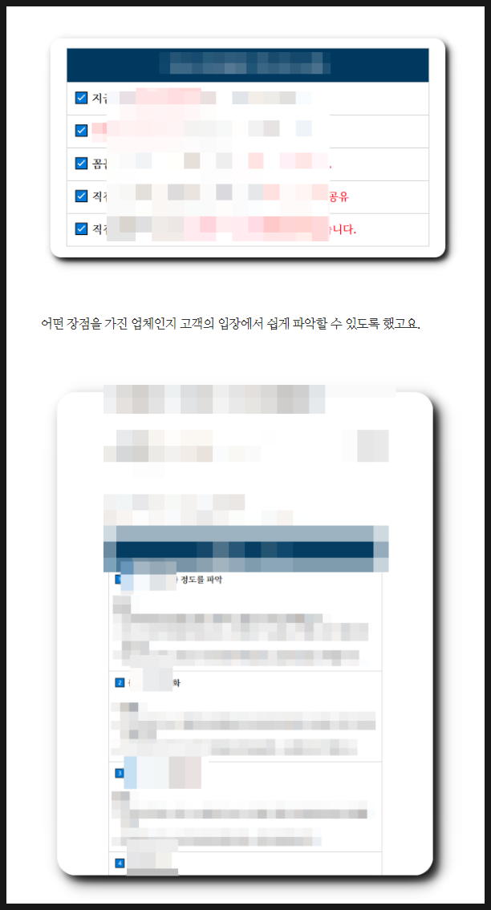

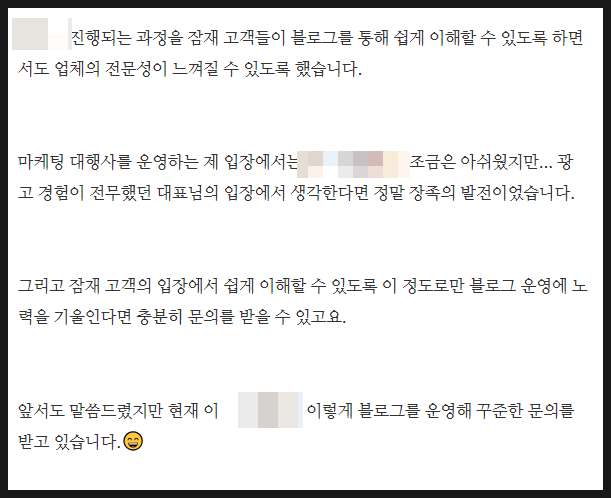

## 원문에 포함된 링크

- #
