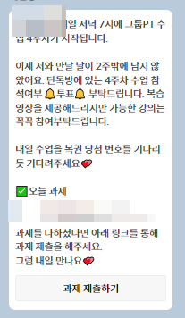
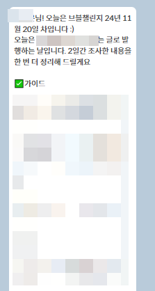
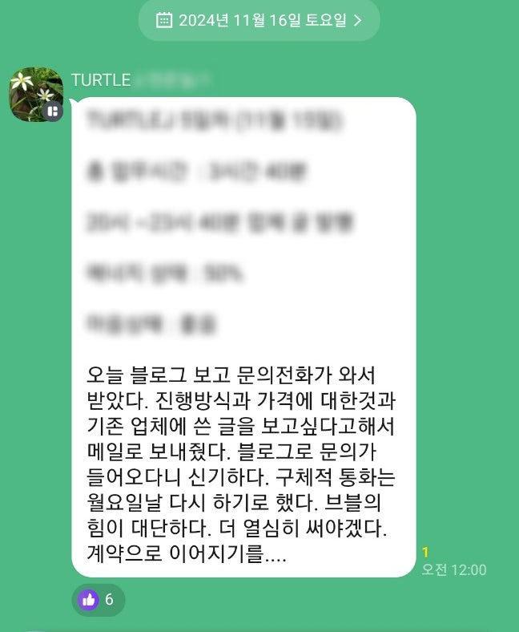
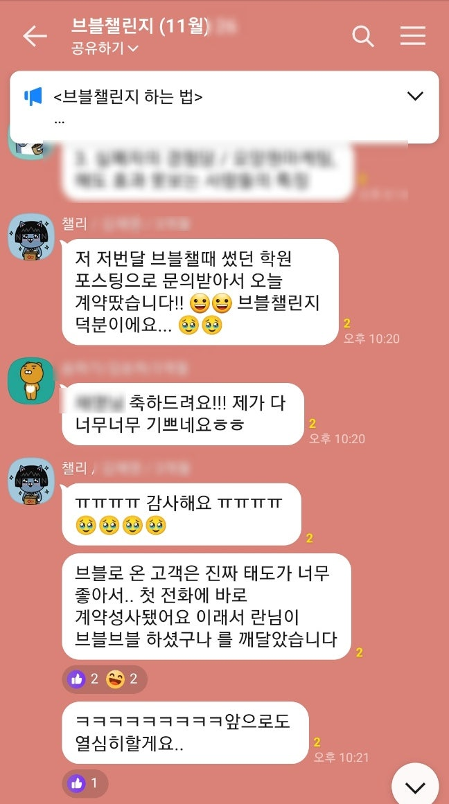
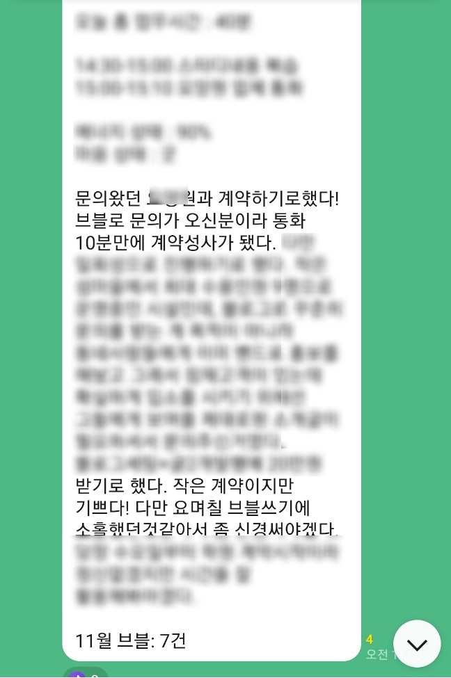
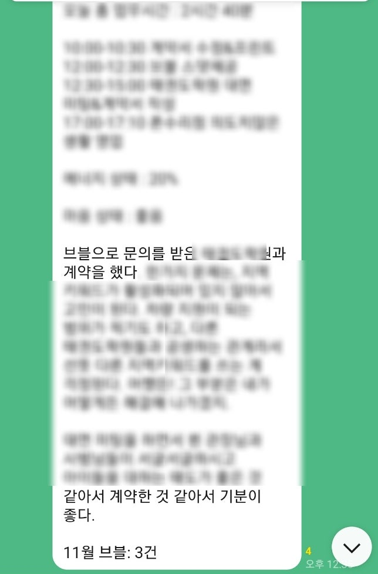
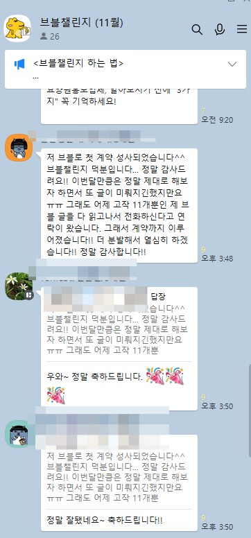
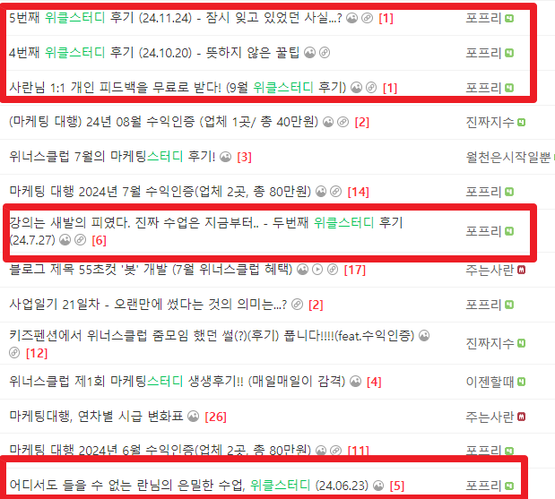
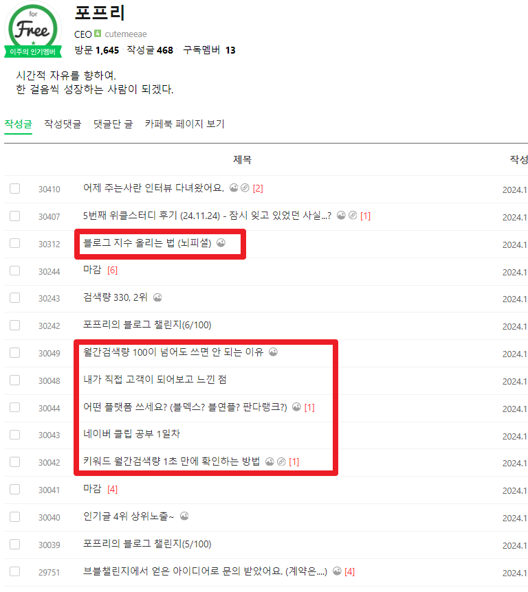

# 글 100개의 의미

- 원천 ID: EPR-CAFE-30466
- 작성자: 주는사란
- 작성일: 2024-11-27T18:47:52.530000+09:00
- 원문: https://cafe.naver.com/ranschool/30466
- 수집일: 2026-09-21
- 텍스트 정리: HTML 문단 순서 유지, 빈 문단·제로폭 공백만 제거. 원본 HTML·JSON 별도 보존. 이미지는 아래에 모아 보관하며 원래 배치는 HTML에서 확인.

## 원문 본문

<!-- P001 -->
문의량이 미친듯이 올라갈때가 있다. 블로그 기준으로 글 100개가 쌓였을 때이다. 실제로 대행한 곳들 중 초반에 문의가 안 온 곳도 있었다. 근데 글 100개가 쌓이니깐 상황은 바뀌었다.

<!-- P002 -->
물론 이런 경우는 많지 않다.  대행을 맡기는 사람이건, 대행을 하는 사람이건, 이 100개까지 기다리는건 힘들다. 맡기는 사람은 돈 계속 나가는데 계속 맡기기가 쉽지 않고, 하는 사람도 문의가 안 오는데 돈 받고 100개까지 쓰기가 양심상 찔리기 때문이다.

<!-- P003 -->
이건 꼭 돈을 받고 안 받고의 문제는 아니다. 시간도 마찬가지다.

<!-- P004 -->
못하는 일을 100개까지 하기가 어렵고, 성과가 없는 일을 100개까지 하기가 참 어렵다. 그럼 결국 100개 되기 전에 잘하게 되거나 성과가 만들어져야 한다. 그러려면 전략이라는게 필요한데, 문제는 초보자는 이런걸 모른다는 것이다. 그래서 결국 포기하게된다. 이건 내가 2년간 블로그를 가르쳐 보니 그랬다. 참 꾸준함이 어렵다...

<!-- P005 -->
그래도 나는 어떻게든 해내게 하고 싶었다.

<!-- P006 -->
처음에 오프라인으로 시작했지만 복습을 안하는게 의미가 없었다. 그래서 온라인 강의를 오픈했다. 근데 온라인을 결제해 놓고 안보는 사람이 많다는걸 알았다. 그래서 과제부터 온라인 강의를 전면 개편했다. 그리고 이때부터 아예 내가 시켜주는 그룹pt도 시작했다.

<!-- P007 -->
비싼 돈 내면 할거라고 생각했지만 착각이었다. 5주간의 강의를 모두다 듣는 사람도 많지 않았다. 그래서 그 다음 기수에는 매일 카톡을 보내는 시스템을 추가했다. 매일 카톡을 보내서 매일 과제와 강의를 들어야 한다고 강조하는 것이다. 그러니까 그 다음 기수에는 다 참석하는 사람이 1명 늘었다. 하지만 부족했다.

<!-- P008 -->
그룹pt에서 블로그를 어떻게 쓰는지 배웠으면 써봐야 하는데 쓰는 사람이 없었다. 그래서 브블챌린지를 만들었다. 왜 글을 매일 못쓸까? 고민해본 결과 어떤 키워드로 어떤 내용을 써야 하는지 모르는것 같았다. 그래서 또다시 매일 카톡을 보내주기로 했다. 실제로 지금 브블챌린지 하는 사람에게는 매일 오전 9시에 이렇게 카톡이 간다.

<!-- P009 -->
그룹pt를 하는 분에게 무조건 브블 챌린지를 4개월 하라고 한다. 이유는 내 마케팅 브블로 문의 오는 경우가 평균 30개 이상 쌓였을때 이기 때문이다. 그래서 월 8건씩 4개월해서 최소 32건을 채우게 하기 위해서다. 실제로 그래서 요즘 계속 브블로 문의 받았다는 단톡방 후기가 많다

<!-- P010 -->
오늘도 있었다.

<!-- P011 -->
하나하나 도와드릴때마다 효과가 나타나니 진짜 기분 좋다. 이번달에는 좀더 많은 영업을 시키기 위해 그룹pt하는 분들에게 더 많은 영업 과제를 내드리기로 했다. 담달에 효과 보여드릴 예정.

<!-- P012 -->
근데 재밌는건 하는 분만 한다는 거다. 과제도. 영업도. 수익화도.

<!-- P013 -->
카페 활동도 마찬가지다. 매월 위너스클럽이라고 수익인증 한 분들을 위해 무료로 마케팅 스터디를 하고 있다. 해당 스터디에서는 카페 활동을 열심히 해주시면 스터디때 피드백을 드리고 있는데 매달 포프리님만 한다.

<!-- P014 -->
그리고 진짜 너무 감사한건 포프리님은 매번 위너스클럽 스터디 때마다 후기를 남겨주신다. 5개월동안 단 한번도 빠지지 않고 작성해주셨다.

<!-- P015 -->
심지어 매월마다 자신이 알고 있는 팁을 나눠주신다.

<!-- P016 -->
내가 봐도 진짜 도움되는 글이 많다. 꼭 보시길

<!-- P017 -->
다시한번 포프리님께 감사드립니다. 포프리님 만큼도 카페에 정보를 안쓴 저를 반성하며 작성합니다...!

## 본문 이미지

## 원문에 포함된 링크

- #
