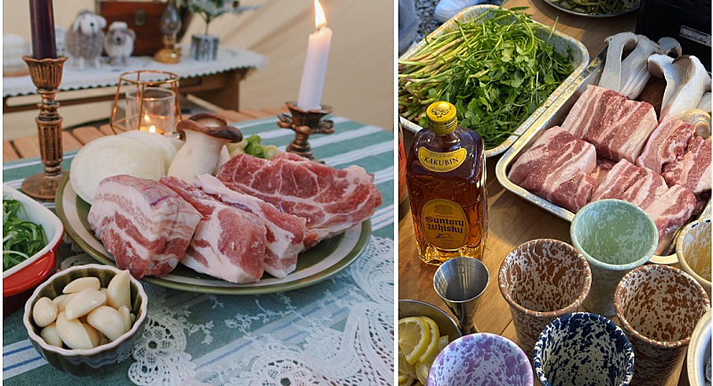
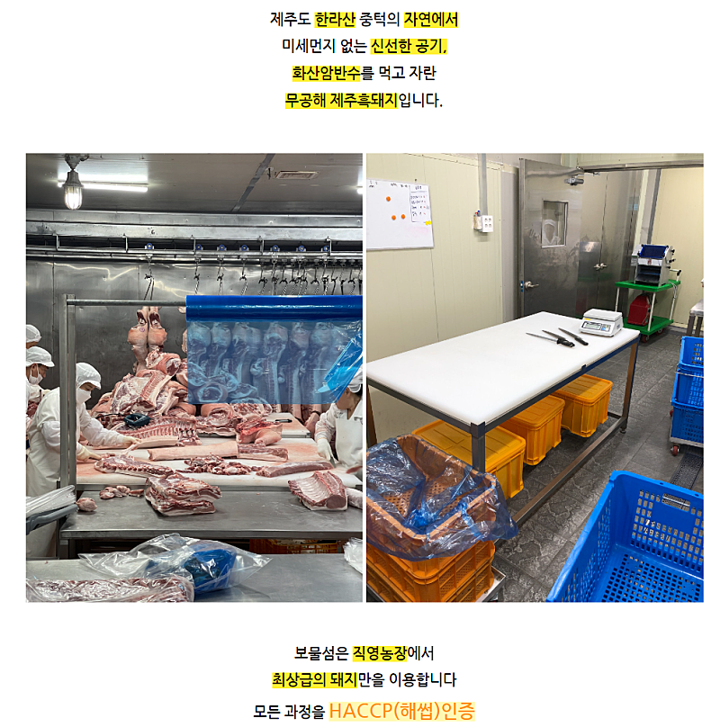
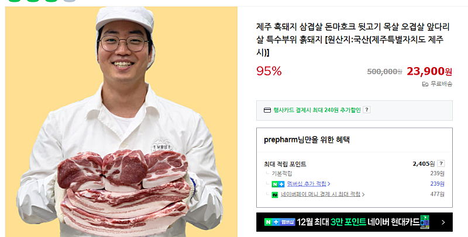
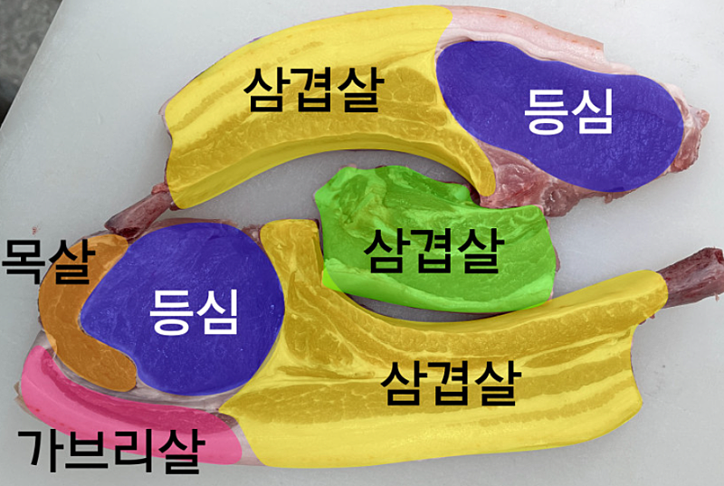
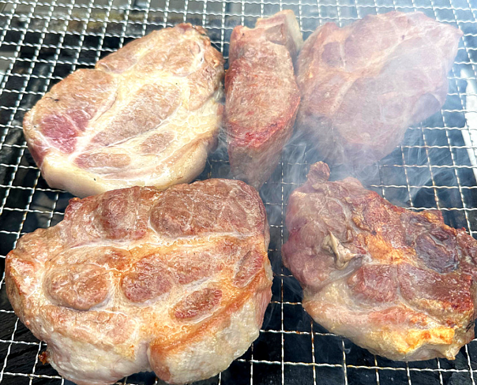
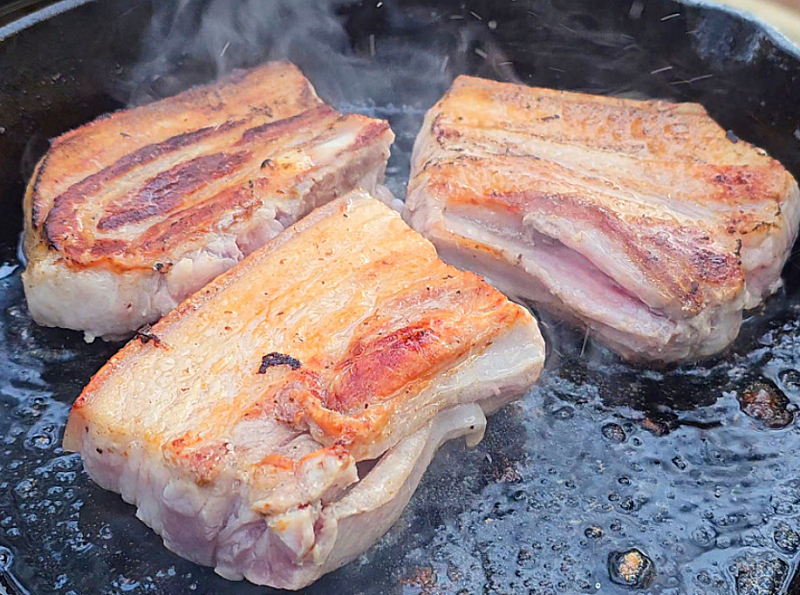
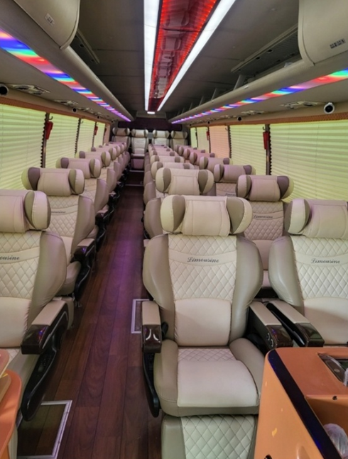
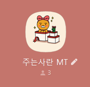

# 2년만에 처음으로 가는 주는사란 mt 준비중

- 원천 ID: EPR-CAFE-30632
- 작성자: 주는사란
- 작성일: 2024-12-04T12:38:39.090000+09:00
- 원문: https://cafe.naver.com/ranschool/30632
- 수집일: 2026-09-21
- 텍스트 정리: HTML 문단 순서 유지, 빈 문단·제로폭 공백만 제거. 원본 HTML·JSON 별도 보존. 이미지는 아래에 모아 보관하며 원래 배치는 HTML에서 확인.

## 원문 본문

<!-- P001 -->
일단 가장 중요한 고기는 뭐로 할까 하다가

<!-- P002 -->
나름 처음 가는 MT인데 그냥 고기는 좀 섭섭해서

<!-- P003 -->
제주 흑돼지로 시켰죠

<!-- P004 -->
아주 넉넉하게 9KG로 갑니다. 고기만 시켰는데 회비 다 써버린거 실환가요ㅠㅠㅎㅎ

<!-- P005 -->
그래도 부위별로 다 먹어보긴 해야겠죠?ㅎㅎ

<!-- P006 -->
다~ 시켜버림 ㅎㅎ

<!-- P007 -->
대구에서 오는 정화님을 포함해 멀리서 오는 분을 위해 버스도 리무진으로 해버렸어요. (거의 누울수 있음)

<!-- P008 -->
주전부리가 부족하면 안되니까요.라면도 종류별로 시키구요. 과자도 충분히 넉넉히 ㅎㅎ

<!-- P009 -->
자 그럼 이제 뭐할지도 정리해볼게요

<!-- P010 -->
영업챌린지에서는 뭘 할지 이미 정해놨구요. 레크레이션을 준비해봐야겠네요 ㅎㅎ

<!-- P011 -->
MT 전용 단톡방 오픈됐습니다. 참여하시는 분들은 오는 길이나 공지등을 안내하기 위해 곧 단톡방 링크 보내드릴거니까요. 바로바로 들어와주세용

<!-- P012 -->
그럼 곧 만나용

<!-- P013 -->
아직도 갈지 말지 고민하시는건 아니시죠? ㅎㅎ

<!-- P014 -->
한번만 용기내시면 됩니다.

<!-- P015 -->
2024년 연말 분기별 모임을 오픈합니다🎉🎉 분기별 모임이란, 수강생들끼리 만나서 수다떨고 정보교류 하고 저의 간단한 특강을 듣는 시간입니다. 벌써 2024년 마지막 분기...

<!-- P016 -->
cafe.naver.com

## 본문 이미지

이미지 10: 로컬 보관 실패. [원래 이미지 주소](https://bootoesa.notion.site/image/https%3A%2F%2Fprod-files-secure.s3.us-west-2.amazonaws.com%2Fed44f80c-fc41-4fc6-ad3a-583a4ee8f3fa%2F4552d8df-b3ae-4a99-a49b-9656b6c21838%2Fimage.png?table=block&id=a6aa9b9f-00b5-4844-88fa-4c39510b092b&spaceId=ed44f80c-fc41-4fc6-ad3a-583a4ee8f3fa&width=2000&userId=&cache=v2) — 수집 응답은 `_관리/이미지수집.json`에 기록.

## 원문에 포함된 링크

- #
- https://cafe.naver.com/ranschool/29838
