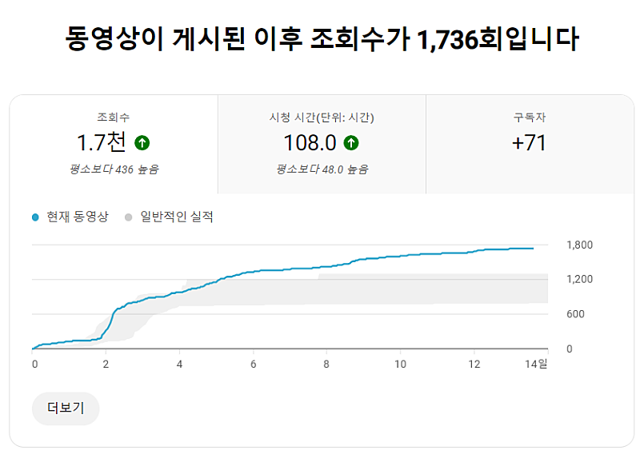
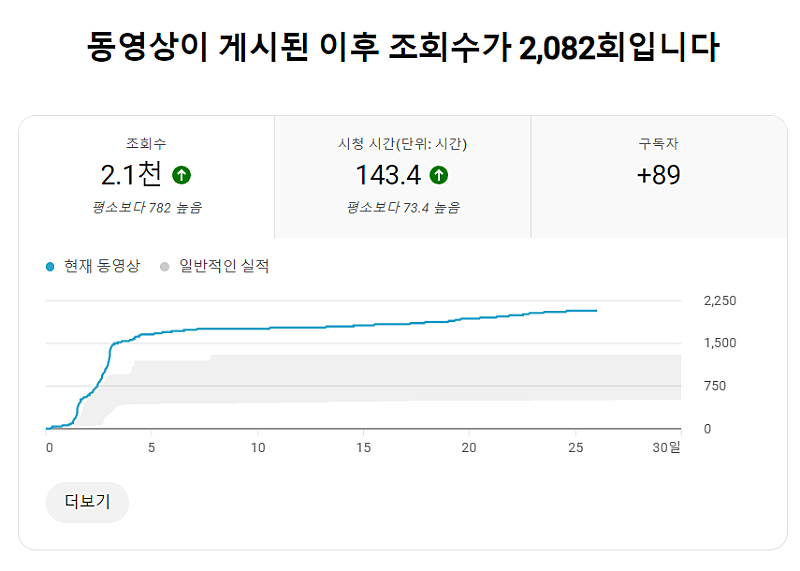
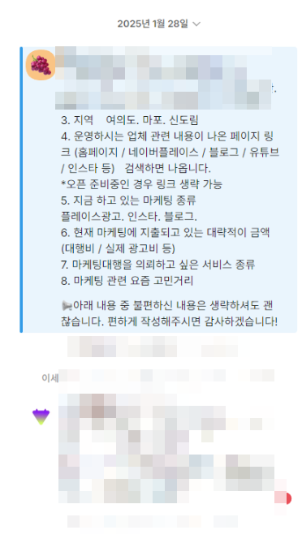
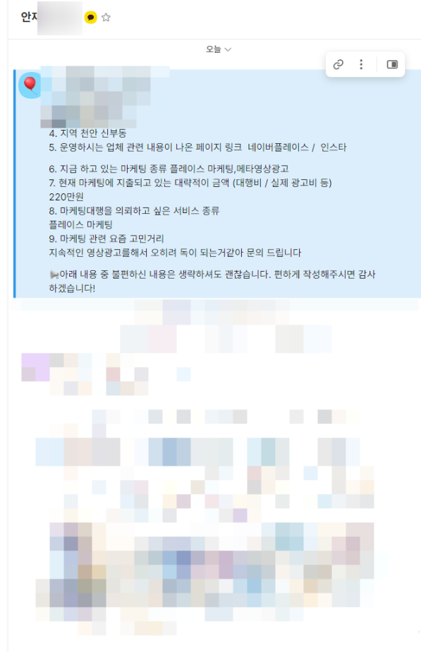
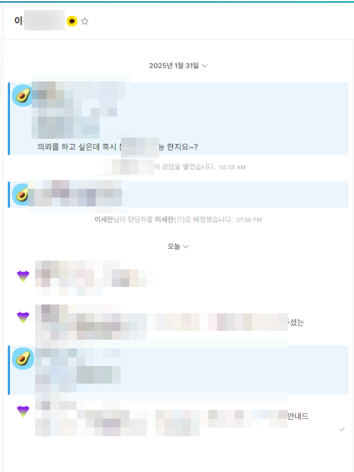
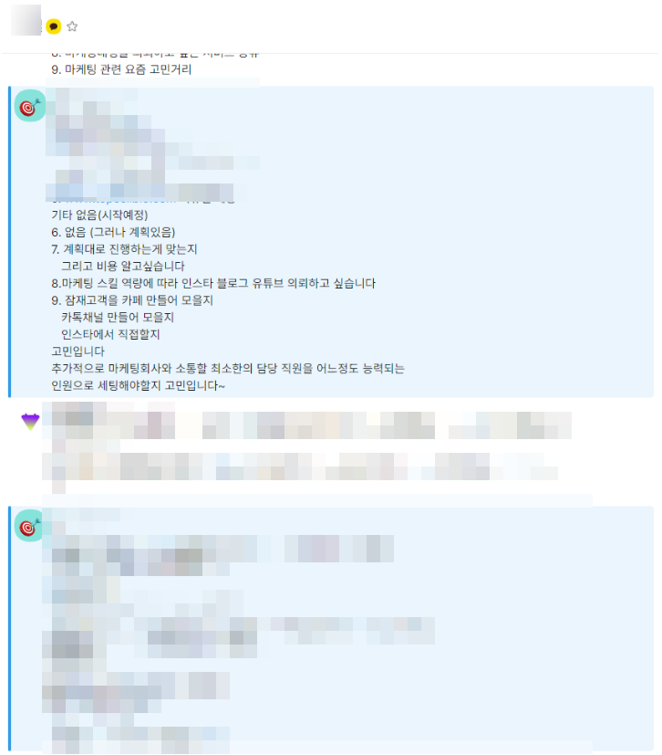

# 8,9,10,11번째 문의

- 원천 ID: EPR-CAFE-31712
- 작성자: 주는사란
- 작성일: 2025-02-04T10:28:41.377000+09:00
- 원문: https://cafe.naver.com/ranschool/31712
- 수집일: 2026-09-21
- 텍스트 정리: HTML 문단 순서 유지, 빈 문단·제로폭 공백만 제거. 원본 HTML·JSON 별도 보존. 이미지는 아래에 모아 보관하며 원래 배치는 HTML에서 확인.

## 원문 본문

<!-- P001 -->
얼마전에 글을 올렸습니다. 주는사란 2탄을 하고 있고 덕분에 문의 7건과 계약 3건을 했다구요.

<!-- P002 -->
이 영상은 평균 조회수가 1000회정도인데요. 최근 1,7천~2천회 정도 나오면서 구독자가 늘어나면서 문의가 대폭 늘었습니다.

<!-- P003 -->
처음~3개월간 7개 문의 => 3건 계약이었는데요. 최근 일주일간 4건의 문의를 받았습니다.

<!-- P004 -->
8번째 문의

<!-- P005 -->
9번째문의

<!-- P006 -->
10번째문의

<!-- P007 -->
11번째문의

<!-- P008 -->
4개 문의중 3개는 현재는 불가능할것 같아 진행안하기로 했고 한개는 진행 할지말지 고민중입니다. 이제 곧 공개할 시기가 올것 같아요.

<!-- P009 -->
마케팅대행창업반분들과 같이해보고 또 성과 공유할게요💕

<!-- P010 -->
🚫🚫2일뒤 🚫🚫 마감예정

<!-- P011 -->
안녕하세요. 주는사란입니다. 약 14개월만에 마케팅대행창업반을 오픈합니다. 마케팅대행창업반은 '마케팅대행사'를 아예 전업으로 하는 분을 대상으로 하는 강의입니다. 전업이기...

<!-- P012 -->
cafe.naver.com

## 본문 이미지

## 원문에 포함된 링크

- #
- https://cafe.naver.com/ranschool/31638
