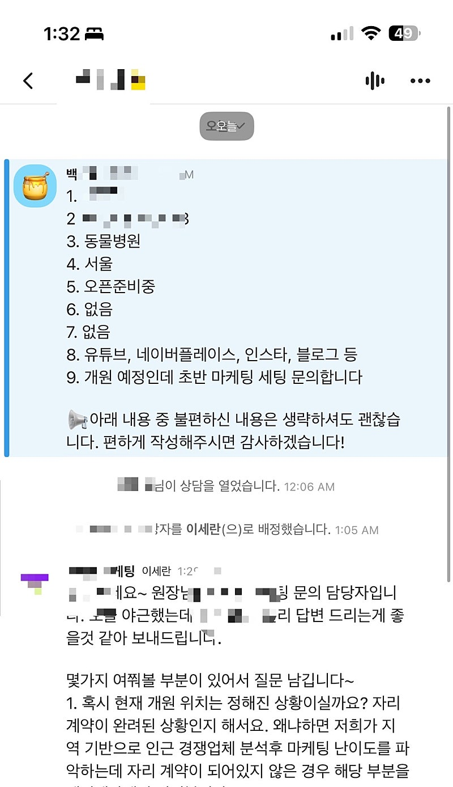

# 16번째문의

- 원천 ID: EPR-CAFE-32034
- 작성자: 주는사란
- 작성일: 2025-02-25T01:36:03.630000+09:00
- 원문: https://cafe.naver.com/ranschool/32034
- 수집일: 2026-09-21
- 텍스트 정리: HTML 문단 순서 유지, 빈 문단·제로폭 공백만 제거. 원본 HTML·JSON 별도 보존. 이미지는 아래에 모아 보관하며 원래 배치는 HTML에서 확인.

## 원문 본문

<!-- P001 -->
새벽에 주무시지도 않고 문의를….

<!-- P002 -->
그렇다면 나도 기대에 부흥해야지 ㅋㅋㅋㅋㅋ

<!-- P003 -->
새벽 1시에도 답변하는 열정

## 본문 이미지

## 원문에 포함된 링크

- #
