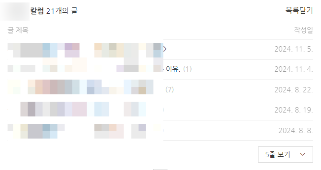
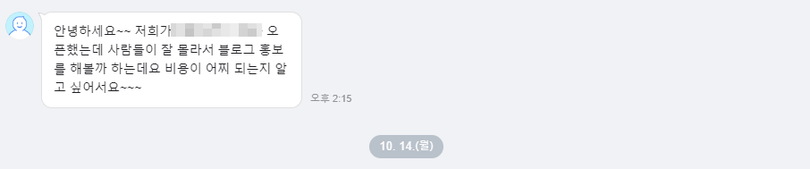
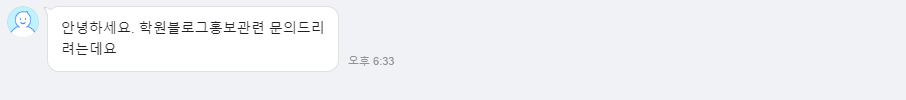
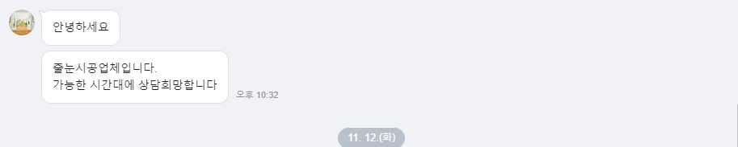
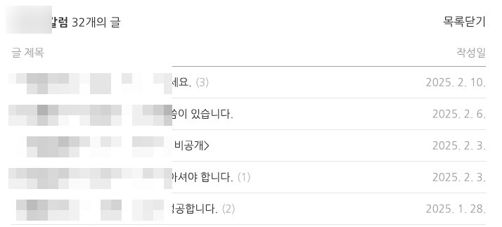
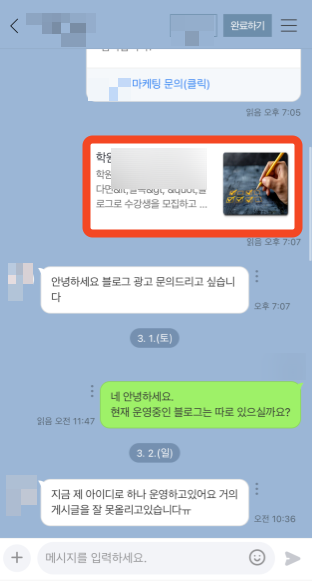
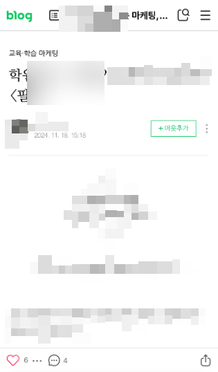
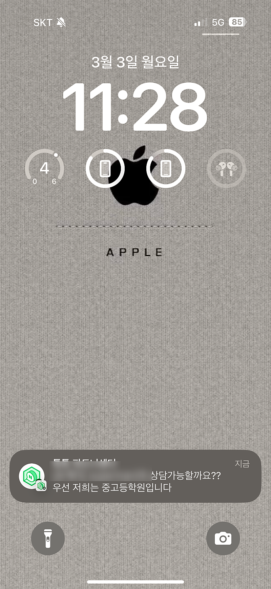
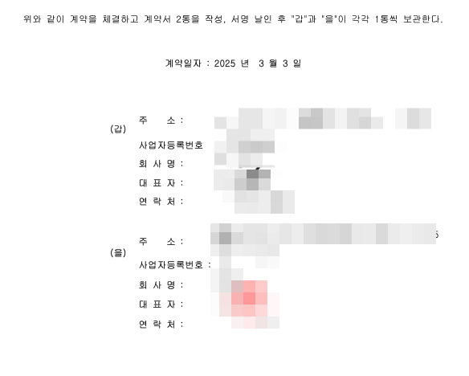
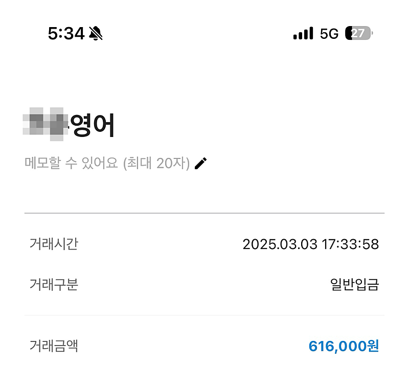

# 2024.11.18에 발행한 글 1개로 월 60만원씩 벌게된 방법 (상위노출 X)

- 원천 ID: EPR-CAFE-32179
- 작성자: 주는사란
- 작성일: 2025-03-03T17:47:18.620000+09:00
- 원문: https://cafe.naver.com/ranschool/32179
- 수집일: 2026-09-21
- 텍스트 정리: HTML 문단 순서 유지, 빈 문단·제로폭 공백만 제거. 원본 HTML·JSON 별도 보존. 이미지는 아래에 모아 보관하며 원래 배치는 HTML에서 확인.

## 원문 본문

<!-- P001 -->
제가 제 친구이자 첫 제자인 브블인에게 몇달전 내마케팅 브랜드블로그를 적어달라고 했습니다. 그리고 어제 2024년 11월 18일에 적은 글이 상위노출도 안되었었지만 문의가 왔고 오늘 계약했습니다.

<!-- P002 -->
그 과정을 보여드릴게요.

<!-- P003 -->
글은 7월에 시작했구요.

<!-- P004 -->
그뒤로 7월과 8월에 8개정도 적었습니다.

<!-- P005 -->
그리고는 11월까지 총 21개의 글을 적었습니다.

<!-- P006 -->
문의는 톡톡으로만 받고 있는데요. 그 당시 총 3건의 문의가 왔습니다.

<!-- P007 -->
그리고 이후에 조금 더 써서 현재는 글이 32개가 있습니다.

<!-- P008 -->
당연히 글은 상위노출이 안되어있습니다.

<!-- P009 -->
근데 문의가 왔죠. 아래 보시면 블로그에 톡톡을 연결하면 어떤 글을 통해 문의를 했는지가 나오는데요. 해당 글을 보면 2024년 11월 18일에 작성한 글입니다.

<!-- P010 -->
그리고 오늘도 또 같은 계정으로 문의가 왔네요.

<!-- P011 -->
위 업체는 이야기 진행중이구요. 어제 연락 온 업체는 계약 완료 했습니다.

<!-- P012 -->
입금도 완료했습니다.

<!-- P013 -->
이게 어떻게 가능했냐구요? 바로 모바일 블로그 버전에 답이 있는데요. 해당 내용은 이번주 내로 영상으로 찍어서 업로드 하겠습니다.

<!-- P014 -->
내 마케팅브랜드블로그가

<!-- P015 -->
제 기능을 못하고 있다면?

<!-- P016 -->
아래 내용이 리뉴얼될 예정입니다. 1. 포트폴리오 만드는 법 2. 기존 수강생이 작성한 글 피드백 사례 3. 영업 따라하기 4. ai 글쓰기 활용법 강의 리뉴얼 에서 기...

<!-- P017 -->
cafe.naver.com

## 본문 이미지

## 원문에 포함된 링크

- #
- https://cafe.naver.com/ranschool/31838
