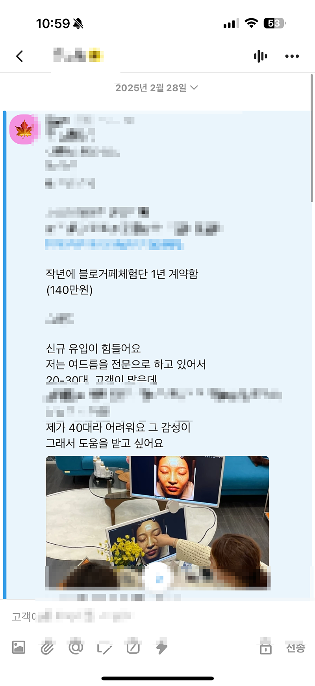
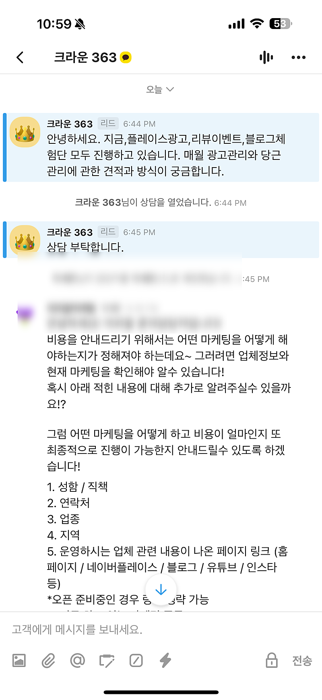

# 한번 마케팅엔진을 만들어놓으면 생기는 자동화

- 원천 ID: EPR-CAFE-32184
- 작성자: 주는사란
- 작성일: 2025-03-03T23:19:56.517000+09:00
- 원문: https://cafe.naver.com/ranschool/32184
- 수집일: 2026-09-21
- 텍스트 정리: HTML 문단 순서 유지, 빈 문단·제로폭 공백만 제거. 원본 HTML·JSON 별도 보존. 이미지는 아래에 모아 보관하며 원래 배치는 HTML에서 확인.

## 원문 본문

<!-- P001 -->
진짜 되는데. 하나만 제대로 세팅하면 내가 아무일을 안해도 이렇게 문의가 오는데...

<!-- P002 -->
17번째 문의

<!-- P003 -->
오늘도 왔는데..

<!-- P004 -->
18번째 문의

<!-- P005 -->
내친구도 계속 받고 있는데....

<!-- P006 -->
대한민국 모임의 시작, 네이버 카페

<!-- P007 -->
cafe.naver.com

## 본문 이미지

## 원문에 포함된 링크

- #
- https://cafe.naver.com/ranschool/32179
