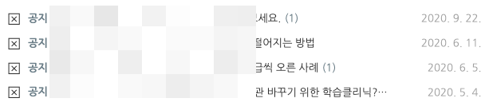
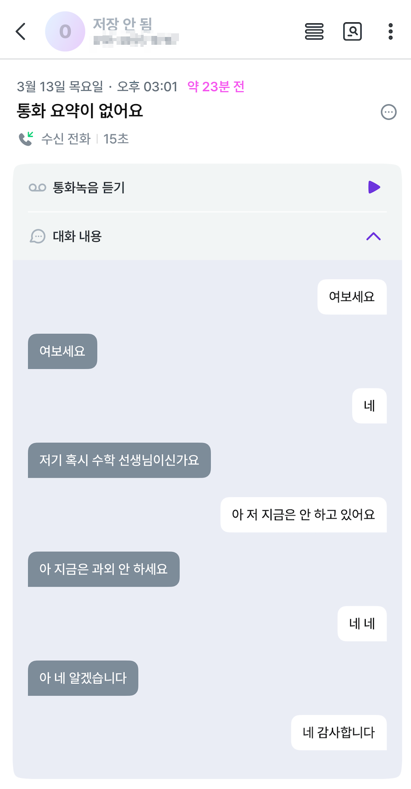
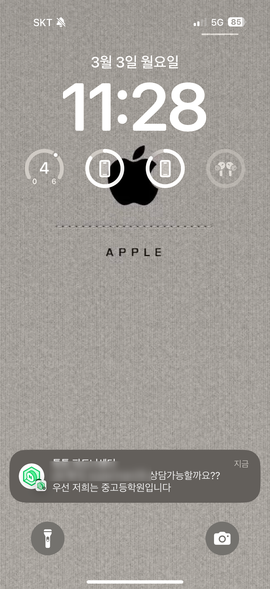
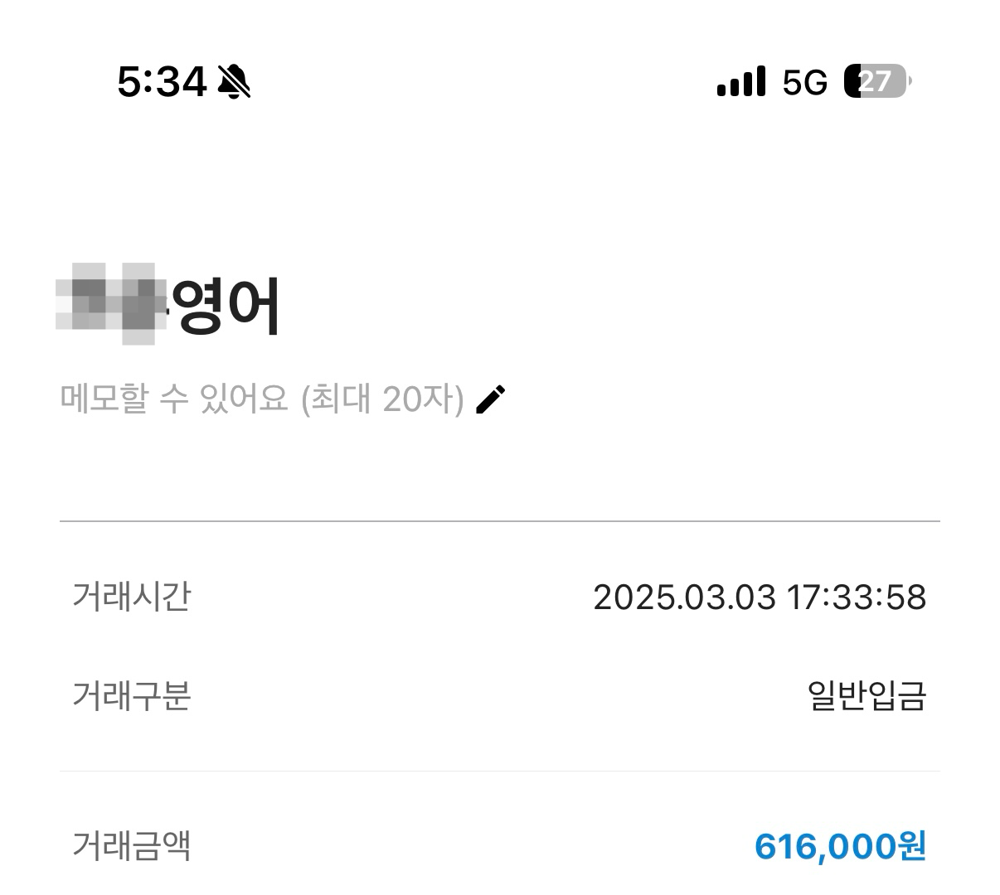

# 2020년에 쓴 블로그로 문의가 왔어요.

- 원천 ID: EPR-CAFE-32333
- 작성자: 주는사란
- 작성일: 2025-03-13T18:07:58.550000+09:00
- 원문: https://cafe.naver.com/ranschool/32333
- 수집일: 2026-09-21
- 텍스트 정리: HTML 문단 순서 유지, 빈 문단·제로폭 공백만 제거. 원본 HTML·JSON 별도 보존. 이미지는 아래에 모아 보관하며 원래 배치는 HTML에서 확인.

## 원문 본문

<!-- P001 -->
저는 10년간 수학학원을 했어요. 그리고 실제로 제 첫 마케팅 성공사례는 제 수학학원이었죠. 그때 마지막으로 쓴 블로그 글입니다.

<!-- P002 -->
근데 방금 23분전에 이 글을 보고 또 연락이 왔어요. 이건 실제 제 핸드폰에서 통화 요약을 해준 내용입니다.

<!-- P003 -->
이건 얼마전에 올린 브블인도 그랬는데요. 2025년 02월 이후로 글을 적지 않았지만

<!-- P004 -->
문의가 왔구요.

<!-- P005 -->
계약을 했습니다.

<!-- P006 -->
이 방법에 대해서는 아래 영상 12분 48초 이후를 다시한번 확인해주세요

<!-- P007 -->
음식점 하나가 잘되기 위해서는 상권도 좋아야 하고, 인테리어도 예뻐야 하고, 음식도 맛있어야 합니다. 너무 당연한 이야기죠? 그래서 만약 음식점을 차린다고 하면 창업전에 '준비' 과정을 겪어요. 그리고 사실상 이때 어떤 상권에 어떤 인테리어로 어떤 음식을 팔거냐에 따라 이 가게의 매출이 결정됩니다.

<!-- P008 -->
실제 가게 매출은 음식점을 오픈해봐야 알겠지만, 사실 그 매출은 오픈전에 어떻게 준비했냐에 따라 결정되죠.

<!-- P009 -->
마케팅대행도 똑같아요. 우리는 온라인으로 마케팅을 대신해주는 일을 하니깐 따로 초기 비용이 필요한건 아니지만 '준비기간'이 필요합니다. 이 준비기간을 얼마나 잘 해놨느냐가 결국 이후에 어쩌면 '문의 자동화'를 만들수도 있어요.

<!-- P010 -->
그러려면 글 하나하나 쓸때 고민을 많이 하고 써야 합니다. 물론 갯수도 중요하죠. 하지만 그건 진짜 초보자인 경우에만 유의미합니다. 수강생 분들은 강의 꼭 다시 보고 따라해보세요ㅠㅠ!

<!-- P011 -->
네이버는 점점 글 '잘' '열심히' 쓴 사람에게 더더 반응하고 있습니다.

## 본문 이미지

## 원문에 포함된 링크

- #

## 원본 HTML에 포함된 외부 게시물 메타데이터

외부 게시물의 현재 본문을 재수집한 것이 아니라, 카페 게시 당시 함께 저장된 제목·설명이다. 잘린 문구는 보완하지 않았다.

- 원문 링크: https://youtu.be/MLw6kqW7Buw?si=YtqG_PBmefqB7zDm

어제 GPT로 ‘매월’ 60만 1천원씩 벌게된 방법 총정리! (다른거 볼필요X)

#블로그수익화 #블로그체험단 #글쓰기 #글쓰기강좌 #부업 #부업추천 #마케팅공부 00:00 어제 블로그 수익화 성공했어요01:16 블로그 수익화 종류 1번02:24 2번03:10 3번04:18 매월 60만원씩 벌게 해준 방법04:54 1번 장단점06:56 2번 장단점 09:16 3...

