# 마케팅대행 잘 못하는 사람 특징

- 원천 ID: EPR-CAFE-32350
- 작성자: 주는사란
- 작성일: 2025-03-16T12:36:31.603000+09:00
- 원문: https://cafe.naver.com/ranschool/32350
- 수집일: 2026-09-21
- 텍스트 정리: HTML 문단 순서 유지, 빈 문단·제로폭 공백만 제거. 원본 HTML·JSON 별도 보존. 이미지는 아래에 모아 보관하며 원래 배치는 HTML에서 확인.

## 원문 본문

<!-- P001 -->
저는 처음에 마케팅이 좋아서 이 일을 시작한게 아니예요. 그냥 돈을 많이 벌수 있어서 한거예요.

<!-- P002 -->
블로그로 처음 내 과외를 홍보했을때 효과가 있었고, 이미 수업시간이 다 차버려서 오전시간에 뭐 할수 있는거 없을까? 하다가 한게 블로그 대행이었거든요.

<!-- P003 -->
그리고 하면서 느낀건 제가 이 일을 잘 한다는거였어요. 왜냐면 '이것'을 했거든요. 혹시나 지금 시작하려는 분은 '이것'을 가질 수 있을지 생각해 보셔야 할것 같구요. 지금 하고 있는 분도 하고 있는 업체 반응이 시원치 않거나 재계약이 잘 안된다면 '이것'을 생각해보세요.

<!-- P004 -->
'확신' 이 있어야해요. 내가 쓴 블로그가 반드시 고객에게 간다는 확신이요. 근데 사실 이건 블로그를 공부해보시면 당연히 간다는 사실을 알거예요. 이미 네이버에는 사람이 모여있거든요.

<!-- P005 -->
근데 여기서 더 중요한게 있어요. 보통은 "어떻게 매출을 올려줘야하지?" 만 집중하는데, 여기서 진짜 잘하려면 하나 더 나가야 해요. 바로 나한테 맡긴 사장님한테도 확신을 주는거죠.

<!-- P006 -->
사실 마케팅대행은 '확신'을 파는거예요. 그러려면 가장 먼저 나 스스로 '이렇게 하면 된다' 라는 확신을 가져야 하구요. 그리고 내가 가진 '확신'을 나한테 맡긴 그 사장님한테 먼저 팔아야해요. 그니깐 나한테 맡긴 사장님도 '이렇게 하면 된다' 라는 확신을 갖고 있어야하는거죠.

<!-- P007 -->
보통 사장님들은 처음에는 확신을 가져요. 그랬으니깐 돈 주고 맡겼겠죠. 근데 이게 시간이 지날수록 확신이 떨어져요. 당연하죠. 그 사장님들은 우리가 매일 어떻게 일을 하는지 모르니까요. 그럼 여기서 나는 계속 '내가 가진 확신'을 다시 팔아야해요.

<!-- P008 -->
재계약이 안되는 이유가 여기에 있어요. 보통은 블로그 쓰느라 사장님한테 확신 주는 일은 소홀히 해요. 근데 블로그는바로 효과가 안올때도 있거든요. 근데 그건 안돼서가 아니라 시간이 필요한거예요. 혹은 내 실수로 키워드를 잘 못잡았을수도 있죠. 이걸 계속 피드백을 하면서 사장님의 확신이 흔들리지 않도록 해야되는데요.

<!-- P009 -->
보통은 이걸 귀찮아해요. 그냥 발행한 글 링크나 정리해서 준다거나 한페이지짜리 보고서 같은거 보내주고 끝이죠. 그러면 문제가 뭐냐? 계속 결과를 내야해요. 그럼 사장님은 나를 못 믿고 이것저것 참견할 거예요. 그러다 불신이 생기는 순간 연락이 안되고 계약이 끊기겠죠.

<!-- P010 -->
근데 사실 여기서 진짜 문제는 뭐냐? 나 스스로도 확신이 흔들린다는거예요. 나 스스로도 "이게 될까?" 라는 생각이 드니깐 차마 그 사장님에게 다시 확신을 주지 못하는거죠.

<!-- P011 -->
내가 확신을 갖고 확신을 주는건 '자신감'이지만, 내가 확신을 갖지 않고 확신을 주는건 '사기'거든요.

<!-- P012 -->
그럼 왜 나 스스로도 확신이 흔들리냐? 경험이 없어서 그래요. 근데 당연히 초보자는 경험이 없잖아요. 그래서 처음에는 어쩔수 없이 남의 경험을 사야해요. 또 내 경험도 나눠야하죠.

<!-- P013 -->
그래서 일단 제가 가장 먼저 제 경험을 나누고 있는거예요. 지금 저는 3개월간 문의를 22개를 받았구요.

<!-- P014 -->
어제 23번째 문의를 받았어요

<!-- P015 -->
그리고 지금 두달동안만해도 이정도 계약을 했어요. 참고로 다 매월 받는 금액입니다

<!-- P016 -->
1번계약

<!-- P017 -->
2번계약

<!-- P018 -->
3번계약

<!-- P019 -->
4번계약

<!-- P020 -->
5번계약 (담당자배정대기중)

<!-- P021 -->
6번계약 (담당자배정대기중)

<!-- P022 -->
앞으로 제 경험을 더 많이 갖고 싶으시다면 아래 방법으로 참여해보세요. 느껴지시는게 다를거예요.

<!-- P023 -->
업체를 맡고 계신분들은 계약했어요 게시판에

<!-- P024 -->
유튜버 주는 사란이 운영하는 카페입니다.

<!-- P025 -->
cafe.naver.com

<!-- P026 -->
아닌 분들은 블로그 100개 챌린지와 마케팅 소통하기에 나눠주시면 좋습니다 :)

<!-- P027 -->
유튜버 주는 사란이 운영하는 카페입니다.

<!-- P028 -->
cafe.naver.com

<!-- P029 -->
이 글이 올라오자마자 보고 싶다면 두가지를 해두시면 좋습니다.

<!-- P030 -->
1. 네이버 카페 어플 다운 받으시고 이 카페에 들어온다.

<!-- P031 -->
2. 글쓴이 옆에 구독을 누른다

<!-- P032 -->
3. 단톡방에 입장한다

<!-- P033 -->
비수강생 단톡방

<!-- P034 -->
https://open.kakao.com/o/goqdC17f

<!-- P035 -->
수강생 단톡방 - 수강생인데 비번 못 받으셨다면 카톡채널로 문의주시면 됩니다

<!-- P036 -->
https://open.kakao.com/o/gcWU66hh

<!-- P037 -->
그럼 또 소식 전할게요!

## 본문 이미지

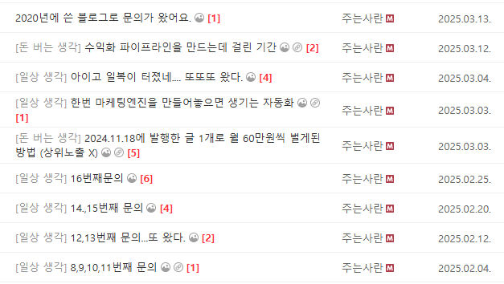

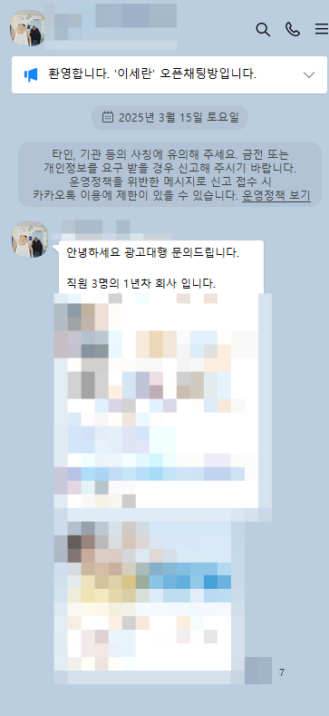

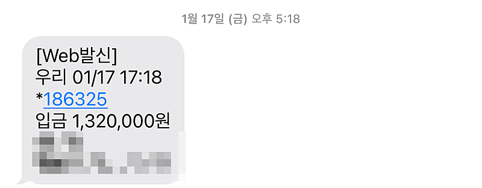

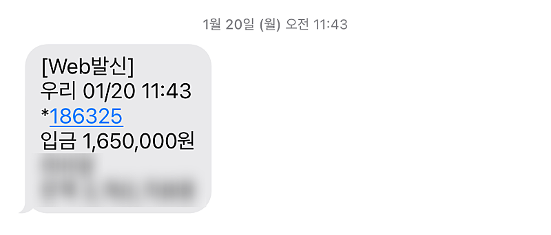

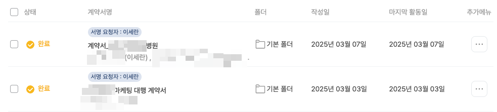

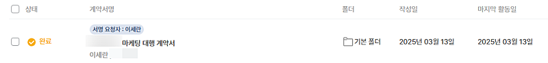

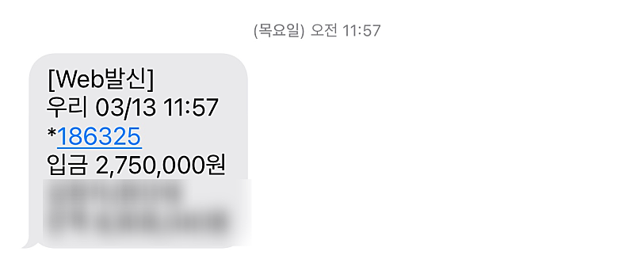

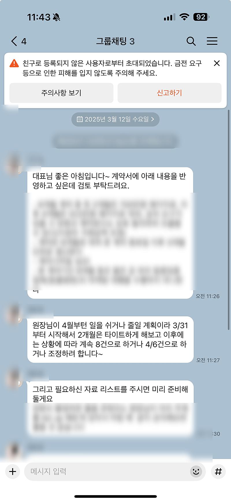

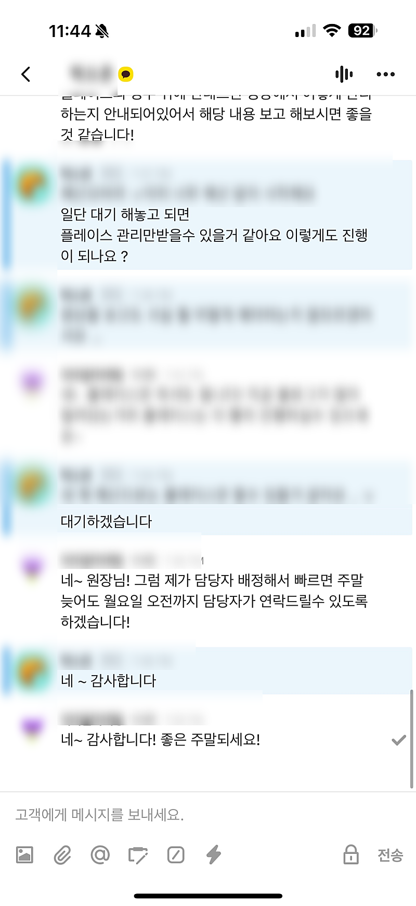

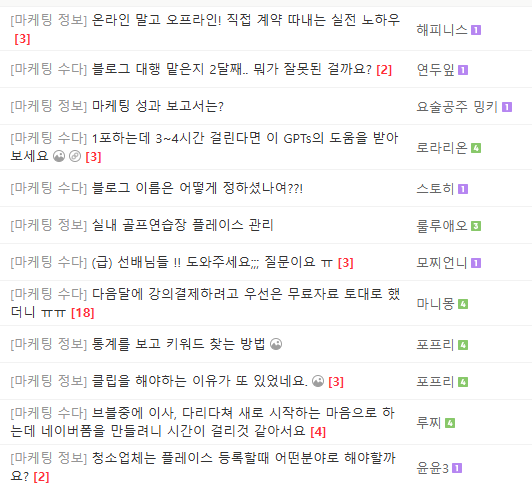

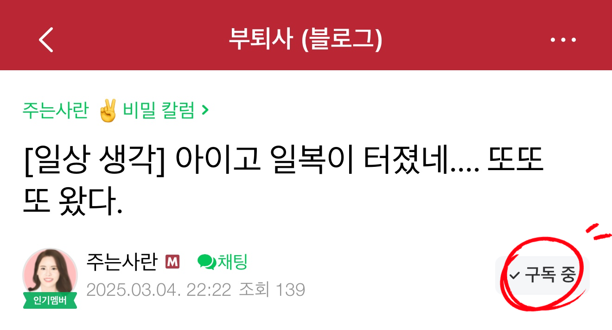

## 원문에 포함된 링크

- #
- https://cafe.naver.com/f-e/cafes/30781985/menus/182?viewType=L
- https://cafe.naver.com/f-e/cafes/30781985/menus/75
- https://open.kakao.com/o/goqdC17f
- https://open.kakao.com/o/gcWU66hh
