# 진짜 문의가 올까? 의심이 된다면

- 원천 ID: EPR-CAFE-32460
- 작성자: 주는사란
- 작성일: 2025-03-26T22:29:03.970000+09:00
- 원문: https://cafe.naver.com/ranschool/32460
- 수집일: 2026-09-21
- 텍스트 정리: HTML 문단 순서 유지, 빈 문단·제로폭 공백만 제거. 원본 HTML·JSON 별도 보존. 이미지는 아래에 모아 보관하며 원래 배치는 HTML에서 확인.

## 원문 본문

<!-- P001 -->
블로그에 글을 쓰면 문의가 옵니다.라는 말은 블로그를 한번도 안 쓴 분이라면 좀 믿기 어려우실거예요. 저도 그랬으니까요.

<!-- P002 -->
근데 만약 그렇다면 그냥 내가 임의로 한 가게를 운영한다고 생각해보고 글을 써보시는것도 좋습니다. 오늘 마케팅대행창업반의 한 수강생 분이 블로그에 학원을 맡았다고 가정하고 학원에 대해 글을 썼어요. 이런식으로요.

<!-- P003 -->
근데 그랬더니 학부모가 연락이 왔다고 합니다. 수학학원인줄 알구요ㅋㅋㅋㅋ

<!-- P004 -->
만약 진짜 내가 이 사장님의 매출을 올려줄수 있을까? 의심이 되면 한번 써보시면 좋을것 같아요. 진짜 오거든요. 이렇게요.

<!-- P005 -->
마케팅대행창업반에서 위에 수학학원 문의 말고도 진짜 블로그 대행 문의도 왔어요. 제가 좀 빡세게 시키고 있는데요. 너무 빡세게 알려드렸더니 시작한지 9일만에, 글 12개만에 문의가 왔네요.

<!-- P006 -->
짠!

<!-- P007 -->
단톡방에 불났어요🔥🔥

<!-- P008 -->
신나서 ㅋㅋㅋㅋㅋㅋㅋㅋ

<!-- P009 -->
어떻게 가능했냐? 제가 진짜 오질라게 시킵니다. 이틀간 서로 줌 키고 글 쓰는거 제가 쳐다보고 있구요.

<!-- P010 -->
글 쓸때마다 피드백을 폭풍 쏟아냅니다.

<!-- P011 -->
그리고 어제는 아예 제가 글쓰는 과정을 줌으로 다 보여드리면서 설명드렸어요.

<!-- P012 -->
또 저도 질수 없죠. 이번주에 문의 2건 더 받았습니다.

<!-- P013 -->
24번째 문의

<!-- P014 -->
25번째 문의

<!-- P015 -->
근데 사실 제가 문의가 계속 오는걸 자랑했지만, 문의가 이렇게 계속 오는게...음...좋은건 아니예요. 솔직히 가장 좋은건 내가 맡을수 있을때 문의 오는게 좋습니다. 그니깐 문의를 '조절' 하는게 사실 가장 좋죠.

<!-- P016 -->
그래서 요즘은 문의 조절중입니다. 보시면 초반에 1월에는 문의를 받기 위한 영상이랑 글만 올려가지고, 거의 2-3일에 한번씩 연락이 왔는데요.

<!-- P017 -->
지금은 글갯수도 1~2주에 한개씩만 올려서 문의비율을 줄였습니다. 이런걸 '트래픽 보관' 이라고도 하는데요. (제가 지은말) 트래픽(문의)를 보관(안 날리겠다) 라는 말이예요. 문의 받기 어려운데 날리면 너무 아깝잖아요ㅠㅠㅠ

<!-- P018 -->
이걸 어떻게 해야하는지는 이번주 분기별모임에서 알려드릴게요!

<!-- P019 -->
안녕하세요. 주는사란입니다. 2025년을 맞아 여러분과 직접 만나서 이야기 나누고 서로가 서로에게 동기부여도 얻을 수 있는 2025년 첫 번째 분기별 모임을 개최합니다! 🥳...

<!-- P020 -->
cafe.naver.com

<!-- P021 -->
기대하세요😍

## 본문 이미지

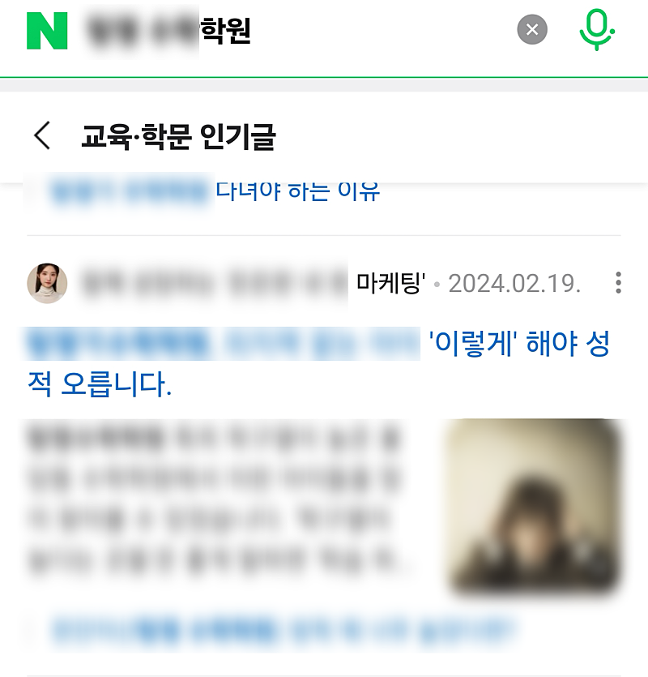

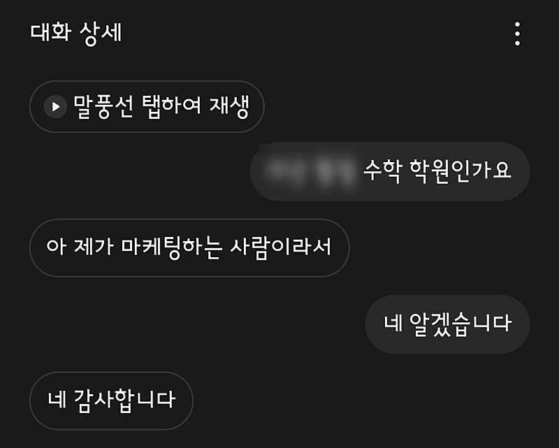

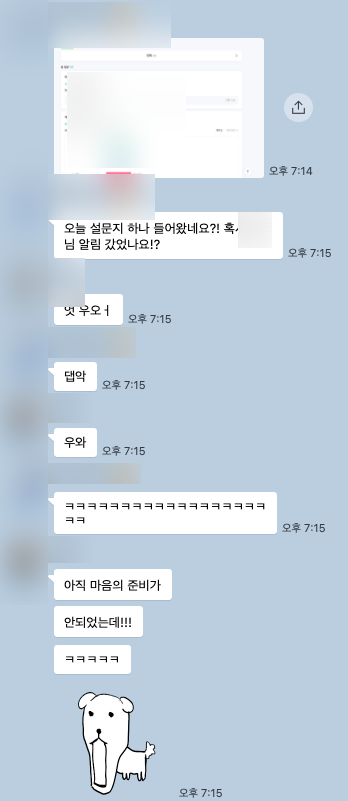

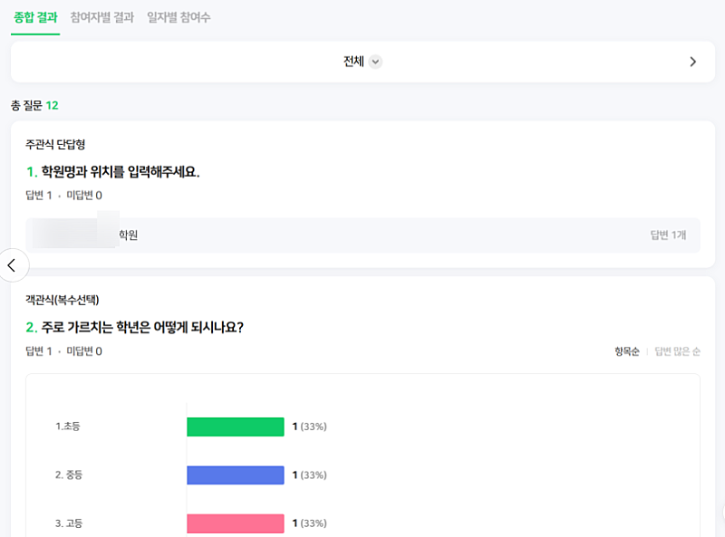

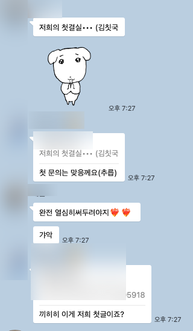

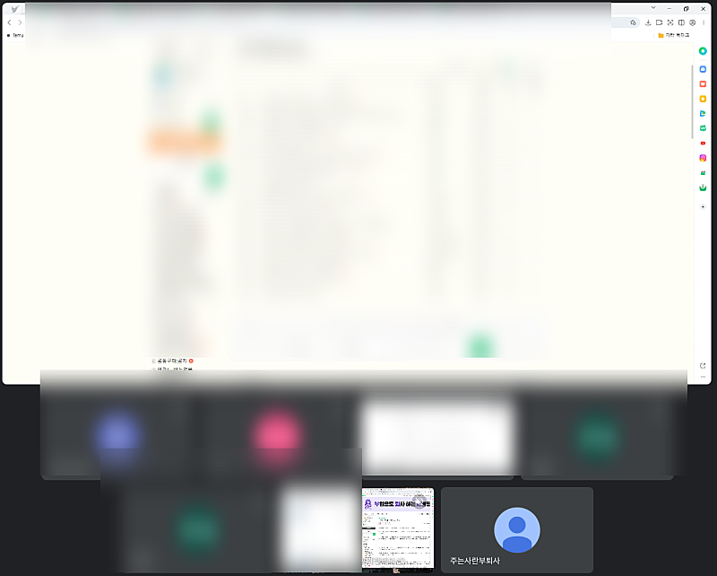

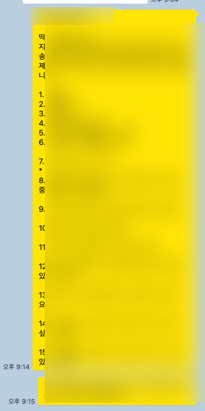

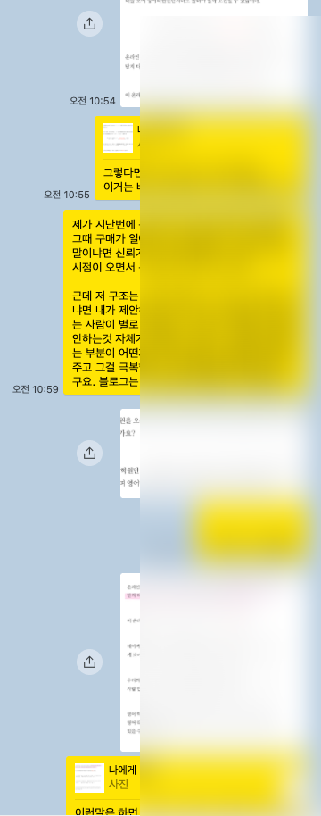

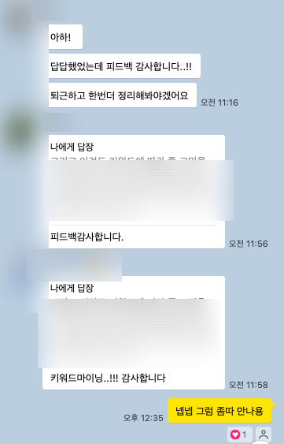

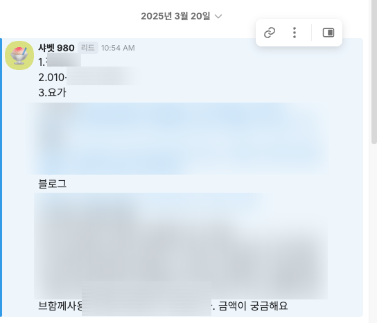

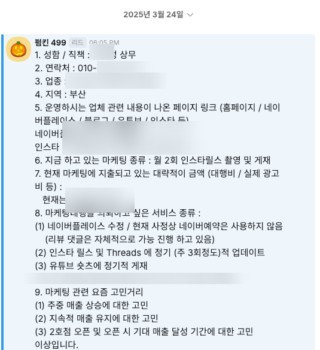

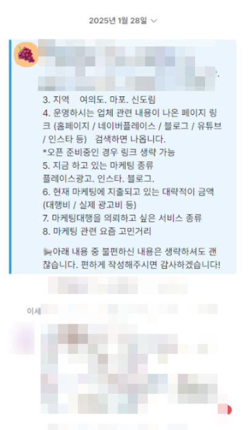

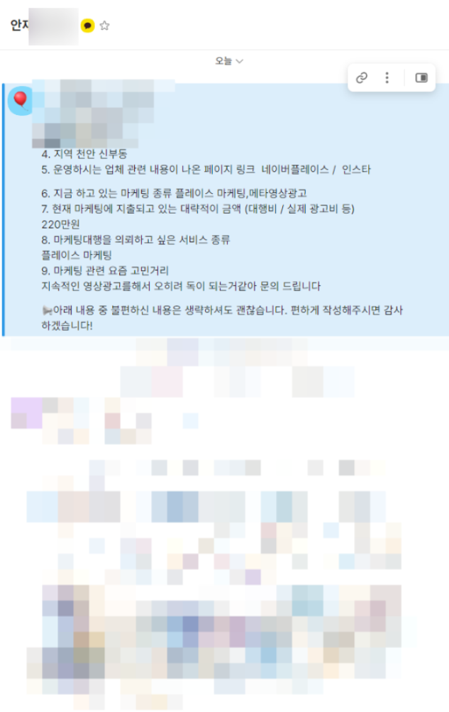

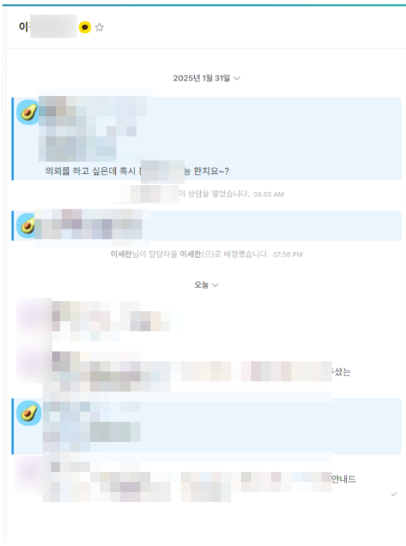

## 원문에 포함된 링크

- #
- https://cafe.naver.com/ranschool/32069
