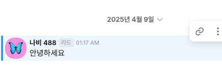
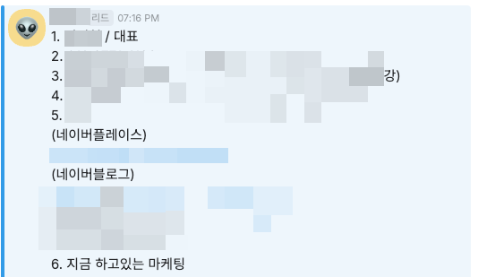
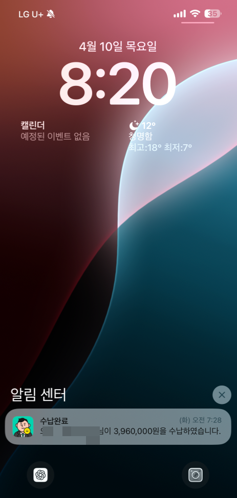
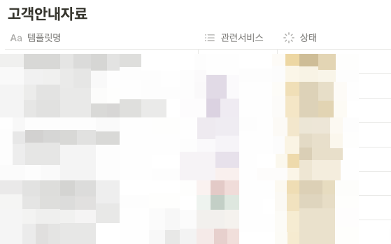

# 듣고 싶은 이야기 투표해주세요!

- 원천 ID: EPR-CAFE-32578
- 작성자: 주는사란
- 작성일: 2025-04-11T22:52:42.253000+09:00
- 원문: https://cafe.naver.com/ranschool/32578
- 수집일: 2026-09-21
- 텍스트 정리: HTML 문단 순서 유지, 빈 문단·제로폭 공백만 제거. 원본 HTML·JSON 별도 보존. 이미지는 아래에 모아 보관하며 원래 배치는 HTML에서 확인.

## 원문 본문

<!-- P001 -->
요즘에는 업체가 많아지면서 부퇴사에 글을 못썼어요ㅠㅠ

<!-- P002 -->
또 문의, 또 계약을 받았거든요.

<!-- P003 -->
26번째 문의

<!-- P004 -->
27번째 문의

<!-- P005 -->
7번째 계약

<!-- P006 -->
제가 맨날 계약했다고 하고 문의 받았다고 하고 그러니깐 제가 쉽게쉽게(?) 하는 거라고 느낄수도 있겠지만 그렇지는 않아요. 저도 매번 새 업체를 할때마다 여러 장애물을 겪습니다.

<!-- P007 -->
그리고 사내 자료를 엄청 업데이트 합니다.

<!-- P008 -->
요즘 일이 많다보니깐 자료 업데이트도 정말 엄청 하고 있습니다. 진짜 시간만 되면 이런것도 강의에 더 업데이트 하고 싶은데 지금 하려는 것도 다 못하고 있어서 너무 슬퍼요ㅠㅠㅠ 틈틈히 해볼게요!!

<!-- P009 -->
그리고 매번 진짜 고객마다 상황이 다 달라서 하면 할수록 여러분에게 해드리고 싶은 말이 많거든요..... 당연히 다 마케팅과 마케팅으로 돈 버는 이야기에 관한 것입니다.

<!-- P010 -->
어떤 이야기를 먼저 쓰는게 좋을까 고민중인데 아래 키워드를 보시고 댓글로 번호 투표해주시면 될때마다 빨리 써보겠습니다.

<!-- P011 -->
1. 광고로 문의 받은 사연

<!-- P012 -->
2. 계약 연장하는 힘

<!-- P013 -->
3. 월 396만원 짜리 또 계약했어요

<!-- P014 -->
4. 클라이언트 사로 잡는 법

<!-- P015 -->
5. 마케팅에 회의감 든 사례

<!-- P016 -->
6. C레벨 마케터들이 하는 일

<!-- P017 -->
오늘은 너무 피곤해서 여기까지만 할게용 ㅠㅠ!

## 본문 이미지

## 원문에 포함된 링크

- #
