# 클라이언트 사로 잡는 법 (대행 오래 유지하는 법)

- 원천 ID: EPR-CAFE-32665
- 작성자: 주는사란
- 작성일: 2025-04-22T23:06:11.087000+09:00
- 원문: https://cafe.naver.com/ranschool/32665
- 수집일: 2026-09-21
- 텍스트 정리: HTML 문단 순서 유지, 빈 문단·제로폭 공백만 제거. 원본 HTML·JSON 별도 보존. 이미지는 아래에 모아 보관하며 원래 배치는 HTML에서 확인.

## 원문 본문

<!-- P001 -->
결론부터 말씀드릴게요.

<!-- P002 -->
1. 내 실력과 고객 만족도는 비례하지만 일치하지 않습니다.

<!-- P003 -->
2. 깊이감이 달라야 합니다.

<!-- P004 -->
3. 이렇게까지 챙겨주면 됩니다.

<!-- P005 -->
대행을 오래 유지하려면 이 세가지를 잘해야 합니다. 업체 파이를 키우고 싶으면 이 3가지를 잘해야 합니다. 내 몸 값이 높아지려면 이 3가지의 범위가 늘어나면 됩니다.

<!-- P006 -->
마케팅 대행은 마케팅을 대신 해주는 일이 아닙니다. 글 몇건을 써주는 일이 아닙니다. 글 몇건은 ai나 크몽의 프로그램을 대체 될수 있습니다. 근데 이 3가지는 대체될수 없습니다.

<!-- P007 -->
제가 어떻게 하는지 보여드릴게요.

<!-- P008 -->
1. 내 실력과 고객 만족도는 비례하지만 일치하지 않는다.

<!-- P009 -->
블러핑을 하라는 소리가 아닙니다. 내가 하지 않는 일을 고객에게 더 많이 한것 처럼 꾸며내라는 의미가 아닙니다. 내가 열심히 한 만큼 그 일을 다 표현하라는 것입니다.

<!-- P010 -->
핵심은 일한 '결과'만 보여주지 말고, 일하는 '과정'을 보여주라는 이야기입니다.

<!-- P011 -->
블로그를 작성하고 "발행했습니다" 라고만 말하는 분이 있습니다. 이러면 절대 나중에 가격을 올릴수 없습니다. 정확히는 내가 노력한 것에 대해 제대로 보상받지 못합니다. 이건 마치 회사에서 인사평가를 하는데 업무일지가 텅텅 비어있는 것과 같습니다.

<!-- P012 -->
저는 팀원들과 일할때 가장 중요하게 여기는 부분도 이 부분입니다. 갑자기 "다 했습니다"라고 하면 결과로 밖에 평가를 할수 없습니다. 과정을 모르면 결과 외에 평가할 수단이 없습니다. 근데 어떤 글이건 처음부터 완벽한 글은 없습니다. 결과 (글)로만 평가 받으면 매번 안좋은 평가 만 옵니다. 반대로 과정을 말하고 결과를 보면 '이해가' 됩니다. 그럼 지금 완벽하지 않아도 어떤걸 내가 보완해줘야하는지가 보입니다.

<!-- P013 -->
결과로만 평가받지 마세요. 과정(내 노력)에 대한 오해가 생깁니다. '결과'라고 했을때는 피드백을 주기도 애매합니다. 지금 이건 '완성해가는 과정' 이라고 생각하면 피드백이 달라집니다. 피드백이 달라지면 마지막 완성 글의 퀄리티가 달라집니다. 내 실력이 올라갑니다. 고객 만족도도 올라갑니다. 그럼 내 몸값도 올라갑니다.

<!-- P014 -->
아래는 예시입니다.

<!-- P015 -->
저는 실제로 밤 11시까지 일하고 주말에도 일합니다. 그래서 밤 늦게까지 주말에도 계속 클라이언트에게 연락을 합니다. 그랬더니 대표님이 이렇게 말하시더라구요.

<!-- P016 -->
"다들 언제 쉬시나요?" 라고 여쭤보신 분도 있었구요.

<!-- P017 -->
최근에 계약한 분도 이렇게 말씀해주셨어요.

<!-- P018 -->
단순히 '오래일한' 것만을 어필하진 않습니다. 저는 우리 팀이 하는 거의 모든 과정을 이야기 합니다.

<!-- P019 -->
- 이 글을 쓰기까지 어떤 자료를 공부했는지

<!-- P020 -->
- 그 공부한 내용을 정리한 내용은 무엇인지

<!-- P021 -->
- 여기서 어떻게 피드백을 주셨으면 좋겠는지

<!-- P022 -->
- 주신 피드백은 어떻게 반영할 계획인지

<!-- P023 -->
- 키워드는 왜 이걸로 잡았는지

<!-- P024 -->
- 각 포인트마다 왜 글을 이렇게 작성했는지

<!-- P025 -->
- 이 글의 목적은 무엇인지

<!-- P026 -->
- 이 글을 이후에 어떻게 활용할 것인지

<!-- P027 -->
단순히 글을 쓴다기 보다는 글을 쓰고 왜 이렇게 글을 썼는지 이해하는 과정을 추가로 적습니다.

<!-- P028 -->
예시 글 중 일부 -

<!-- P029 -->
이정도로 하면 이런 말이 나오더라구요.

<!-- P030 -->
열심히 해도 그걸 몰라주면 값어치에 반영이 안됩니다. 원래 서비스업이 그렇습니다. 서비스업의 핵심은 열심히 하는 것 자체도 중요하지만 열심히 한 것 자체를 '알리는 것'도 중요합니다.

<!-- P031 -->
이 정도가 어느정도까지 해야되냐면 거의 내 머릿속에서 생각하는 모든걸 다 토해낸다는 정도로 하는 편입니다. 이래야 오해가 안생기고, 이래야 내가 일한 만큼 값어치를 받을수 있습니다.

<!-- P032 -->
이것도 온라인 강의에 업데이트 하려고 적어뒀습니다.

<!-- P033 -->
정확히는 매월 보고사와 단톡방에서의 소통 자체를 잘해야하는데 이것도 좀더 디테일한 부분은 강의에 추가로 업데이트 해보겠습니다.

<!-- P034 -->
깊이감이 달라야 합니다.

<!-- P035 -->
클라이언트의 목적은 매출을 올리는 것입니다. 블로그 몇개 발행되는 것이 아닙니다. 근데 글을 몇개 발행하는걸 목표로 일을 하는 분들이 있습니다. 저는 이런분들이 너무 고맙습니다. 왜냐면 덕분에 제가 차별점이 생기거든요.

<!-- P036 -->
글을 몇개 발행하는 것과 매출을 올려주기 위해 글을 쓰는 것은 보여지는 것이 똑같아도 그 시작점이 다릅니다. 그래서 결과도 다릅니다. 목적지 자체가 다른거예요.

<!-- P037 -->
매출을 올려주기 위해 글을 쓰려면 고객과의 대화 자체가 달라야 합니다. 깊이감이 달라야해요.

<!-- P038 -->
아래는 최근에 한 업체 대표님의 사모님과 통화한 내용입니다. ai 요약이라 오타가 많은데 내용은 이렇습니다.

<!-- P039 -->
말풍선 1 : 남편이 블로그 글 보더니 진짜 조사랑 공부를 많이 하신것 같다고

<!-- P040 -->
말풍선 2 : 왜냐면 남편이 다니던 기존 회사에도 마케팅 팀이 있는데 거기는 원래 엉망인데

<!-- P041 -->
말풍선 3 : 근데 쓴거 보고 너무 잘 써서 깜짝 놀랐다.

<!-- P042 -->
제 답변 : 너무 다행이다. 근데 우리 정말 공부 많이 한다

<!-- P043 -->
여기서 깊이감이라는건 "이정도까지 안다고?" 하는 부분이거든요. 당연히 저도 이 업계에 대해 모릅니다. 이 분야 처음 하는거라 저도 잘 몰라요. 그렇지만 미친듯이 관련 블로그 유튜브를 그냥 싹다 봤습니다. 그래서 전문지식은 대표님만큼은 모르지만 최소한 그 업계가 요즘 어떤지 '대화가' 됩니다. 이게 핵심이예요.

<!-- P044 -->
그럼 이렇게 대화가 되려면 어떻게 공부해야 하냐 하는 문제가 남는데...

<!-- P045 -->
질문을 똑바로 해야합니다. 이것도 ch11 에 넣으려고 합니다.

<!-- P046 -->
조사를 어느정도 하고 내가 궁금한거를 싹다 정리해서 대표님한테 물어봐야 합니다. 글을 '알아서' 쓰는게 아니예요. 글쓰기 준비를 제대로 해야 글이 써집니다.

<!-- P047 -->
이렇게까지 챙겨주면 됩니다.

<!-- P048 -->
마케팅 대행은 글을 써주는 일이 아니라고 했는데요. 그럼 무슨 일이냐.

<!-- P049 -->
클라이언트가 놓칠수 있는 부분, 부족한 부분을 채워주는 역할을 해줘야 합니다.

<!-- P050 -->
자영업을 하다보면 혼자서 도저히 챙길수 없는 부분이 있습니다. 마케팅적으로는 이런게 있습니다.

<!-- P051 -->
- 요즘 업계에서 이슈가 되고 있는것

<!-- P052 -->
- 관련 업계 단톡방에서 무슨 말이 오고가는지

<!-- P053 -->
- 최근 근처 경쟁업체 후기 / 새로하는 마케팅 등이 뭐가 있는지

<!-- P054 -->
실제로 저는 주기적으로 이런거 보냅니다.

<!-- P055 -->
관련 기사 떠서 링크 보내드림 -

<!-- P056 -->
그리고 이런것도 합니다. 제가 생각했을때 대표님이 부족한 부분을 말씀드리고 이렇게 연습했으면 좋겠다고 안내드립니다. 그리고 연습 한거 보내주시면 피드백도 드립니다.

<!-- P057 -->
아예 이렇게 녹음도 해서 줄때도 있습니다.

<!-- P058 -->
이게 다가 아닙니다. 저는 마케팅에 필요한 자료를 얻기 위해 직원에게 어떻게 교육해야하는지, 직원이 어떤걸 어느 주기로 줘야하는지도 정리해서 드립니다.

<!-- P059 -->
사진과 매출 피드백을 우리에게 주기적으로 어떻게 전달하라고 해야하는지 혹은 대표님이 직접 어떻게 해야하는지를 말씀드립니다. 이걸 문의 왔을때부터 이렇게 할것이라는 것을 이야기 해야합니다.

<!-- P060 -->
종종 "사진을 안주세요" "문의가 왔는지 모르겠어요" 하시는 분들이 있는데. 처음부터 강조를 해야합니다. 문의가 왔는지에 대해. 매출 피드백을 줘야만 하는 이유에 대해 계속 강조를 해야합니다.

<!-- P061 -->
그걸 뭐라고 말해야 할지는 ch7에 넣으려고 합니다.

<!-- P062 -->
여기까지가 제가 고객을 사로잡는 법입니다. 고객은 절대로 '갑자기' 중단하는 경우는 없습니다. 분명 아주 사소한 오해가 꾸준히 쌓였고 그게 어떤 기준에 도달하면 '계약해지' 라는 결론에 이릅니다.

<!-- P063 -->
그렇게 안되려면 아주 사소한 과정부터 공유하는 습관이 필요합니다. 그러면 고객은 '같은 방향'을 본다고 생각합니다. 매출은 그렇게 같은 방향을 보게 되면 오릅니다.

<!-- P064 -->
앞으로 제 클라이언트의 매출 변화도 쓸수 있도록 하겠습니다. 이제 막 세팅한 업체들이 있어서 결과는 약 6개월 정도 후에 보여드릴수 있겠네요.

<!-- P065 -->
1편. 클라이언트 사로잡는 법 (끝)

<!-- P066 -->
다음 글은 어떤 내용을 보고 싶으신가요?

<!-- P067 -->
댓글로 번호를 적어주시면 가장 많은 것을 다음 글에 적어볼게요.

<!-- P068 -->
1. 마케팅 회의감

<!-- P069 -->
2. C레벨 마케터들이 하는 일

<!-- P070 -->
3. 블로그 신박한 활용법

<!-- P071 -->
4. 대행료 올리는 가격 설정법

<!-- P072 -->
5. 가격을 깎아달라고 할때 대처법

## 본문 이미지

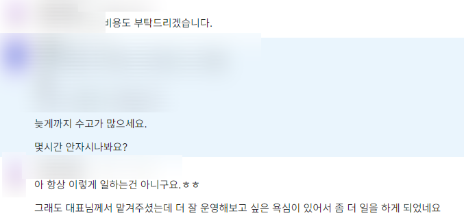

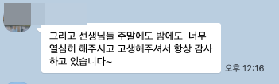

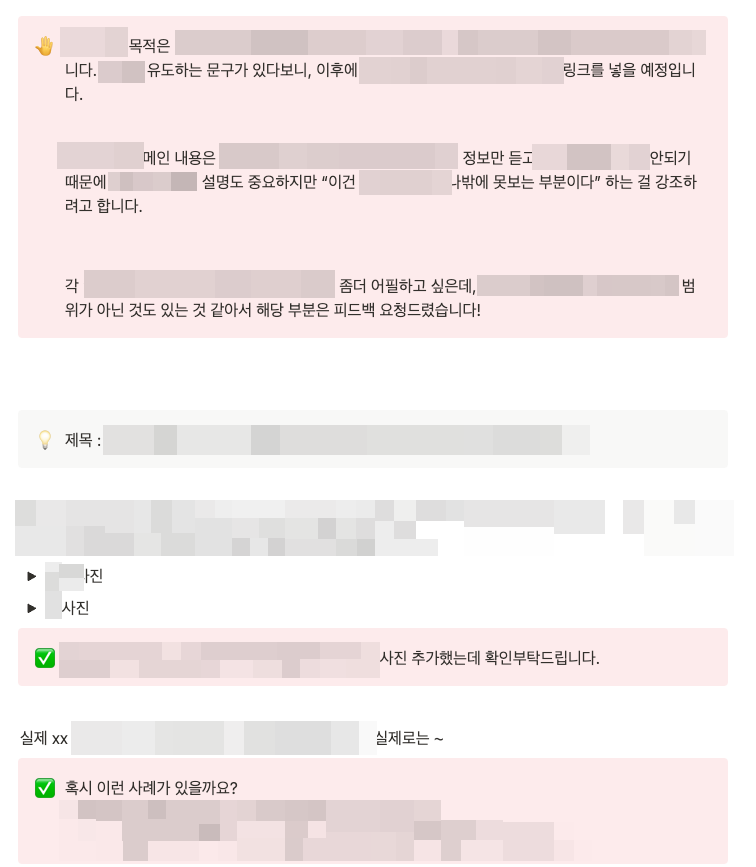

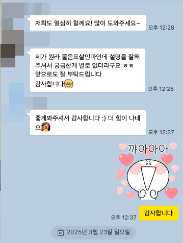

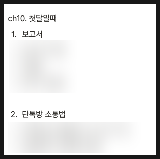

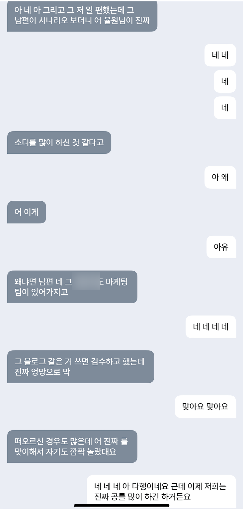

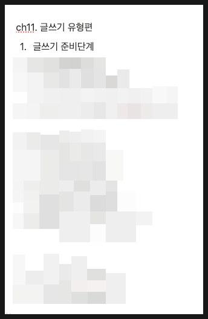

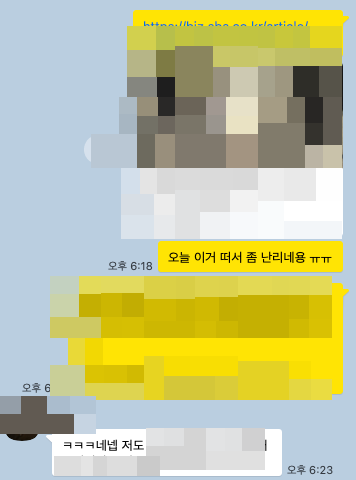

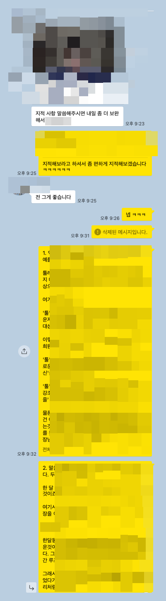

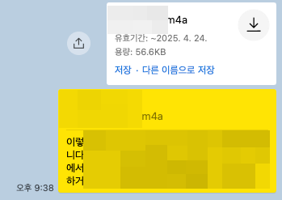

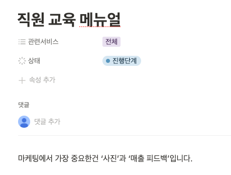

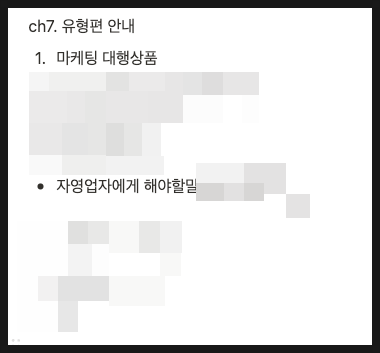

## 원문에 포함된 링크

- #
