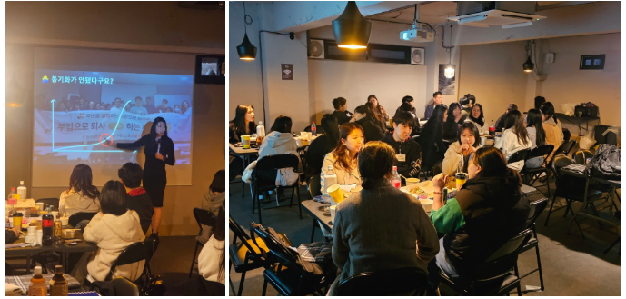
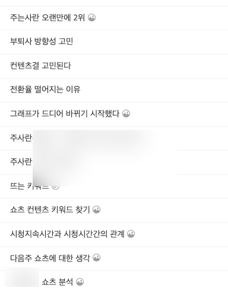
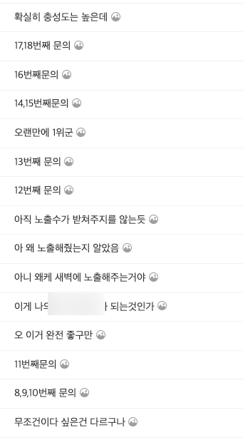
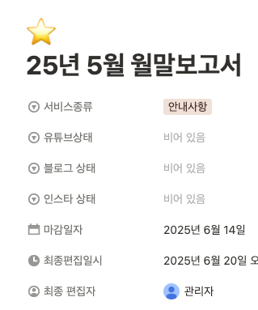
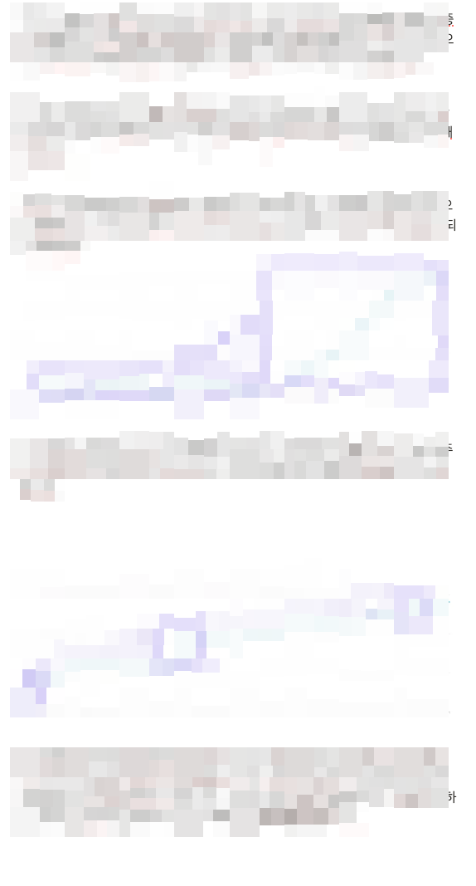
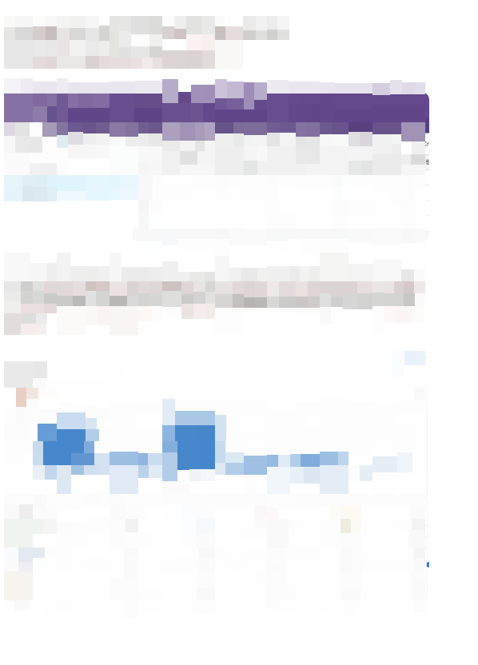
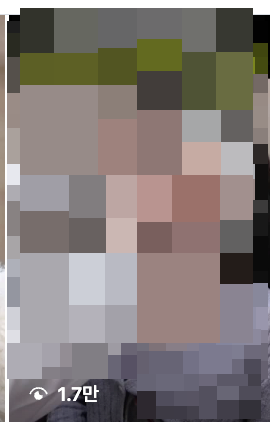

# 분기별모임 특강 내용 안내

- 원천 ID: EPR-CAFE-33039
- 작성자: 주는사란
- 작성일: 2025-07-01T22:35:28.010000+09:00
- 원문: https://cafe.naver.com/ranschool/33039
- 수집일: 2026-09-21
- 텍스트 정리: HTML 문단 순서 유지, 빈 문단·제로폭 공백만 제거. 원본 HTML·JSON 별도 보존. 이미지는 아래에 모아 보관하며 원래 배치는 HTML에서 확인.

## 원문 본문

<!-- P001 -->
이번주 토요일은 수강생 분기별 모임이 있는 날입니다.

<!-- P002 -->
오시는 분들은 아시겠지만 분기별 모임에서는 매번 특강을 합니다. 특강 내용은 당연히 제가 마케팅 대행을 하면서 느낀점 그리고 어떻게 하시면 좋을지 등에 대한 내용입니다.

<!-- P003 -->
지난번 모임때는 특강만 거의 3시간을 해버렸더라구요;;

<!-- P004 -->
사실 이번에는 할 이야기가 정말 많습니다.

<!-- P005 -->
정확히는 '제가 팔고 있는 마케팅 전략' 에 대한 이야기 입니다. 마케팅 대행은 "블로그를 대신 써주는 것, 유튜브를 대신 해주는 것, 인스타를 대신 운영해주는 것" 이런 서비스를 파는게 아닙니다.

<!-- P006 -->
마케팅 전략을 파는 것이죠.  마케팅 전략이란 이런 것입니다.

<!-- P007 -->
어떤 조건을 가진 업체에게

<!-- P008 -->
이 방법을 이렇게 했을때

<!-- P009 -->
이정도 매출 효과를 줄수 있다

<!-- P010 -->
여기서 어느 정도 매출을 올려주느냐에 따라 받을 수 있는 금액이 달라지는 거구요. 당연히 그 매출 금액은 방법이 다양할수록, 또 각 방법을 어떻게 하느냐에 따라 커질수 있습니다.

<!-- P011 -->
그래서 가능한 다양한 방법을 각 업계에 맞게 어떻게 '조정'하느냐에 따라 올려줄 수 있는 매출이 달라지고, 그래서 내가 받는 돈이 달라지는 거죠.

<!-- P012 -->
제 블로그 강의에 소개되어있는건 여러 방법중 초보자분이 가장 하기 쉬운 한가지가 소개되어있는 것입니다. 정확히는  5인이하 / 고관여 / 지역기반 이런 조건을 가진 업체들에게 '블로그' 라는 방법으로 매출을 올려주는 방법 하나를 배우는거죠. 이게 가장 기본이거든요.

<!-- P013 -->
이런거를 찾는 방법은 그냥 모든 업계를 하나하나 해보면서 저장해놓으면 됩니다.

<!-- P014 -->
이건 제가 고민한 내용과 지금까지의 기록을 적어놓은 카페입니다. 이런저런 채널을 분석하고 어떻게 할지 고민합니다. 그리고 팀원들에게 공유하죠.

<!-- P015 -->
유튜브, 인스타, 블로그 모두다 내가 원하는 방향대로 가고 있는지부터 시작해서 제가 생각했을때 좋은 것들을 모두 다 저장해 놓습니다.

<!-- P016 -->
그리고 이런 고민은 업체별로도 하는데요. 해당 업체에게 매달 월말 보고서를 주는데 여기에는 이때 고민한 내용을 적습니다.

<!-- P017 -->
그리고 실제 결과로 하나가 나오는게 있으면 그걸 다른 업체에도 적용합니다. 예를들어 최근에 한 업체에서 릴스 하나가 좋았는데요.

<!-- P018 -->
그래서 비슷한 형태로 다른 업계에 적용했는데 아래는 오늘 올린건데 벌써 1만 넘었습니다.

<!-- P019 -->
이런식으로 하는거죠.

<!-- P020 -->
뭐 이런 이야기를 해보려고 합니다. 이번주 토요일에요.

<!-- P021 -->
그리고 이번 분기별모임때 오는 분들을 보니깐 이제 진짜 남을분들만 남았다는 생각이 듭니다. 제가 주는사란에서 강의한지가 이제 3년차에 접어들었는데 3년간 남아계신분들이 계신데 정말 제가 보답할 날이 얼마 남지 않았습니다.

<!-- P022 -->
그런 분들을 위해 아주 단단한 이야기 준비해가겠습니다.

<!-- P023 -->
아 그리고 마지막으로 하나 더 공지사항이 있습니다. 곧 인스타, 유튜브를 다 같이 배우는 마대창 ver3 가 오픈할 예정입니다. 아예 사무실와서 일하면서 배우는 그런 반입니다. 3인이하 소수반으로요. 이렇게 정말 다 할수 있는 분들을 찾고 있거든요!

<!-- P024 -->
그럼 토요일에 뵐게요!

## 본문 이미지

## 원문에 포함된 링크

- #
