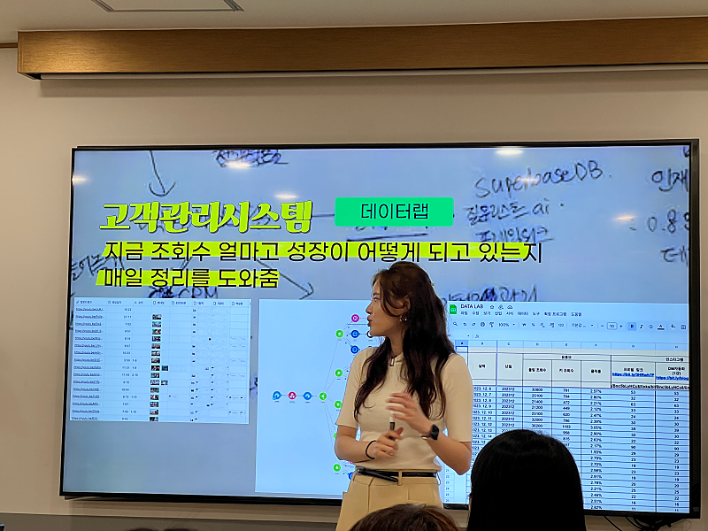
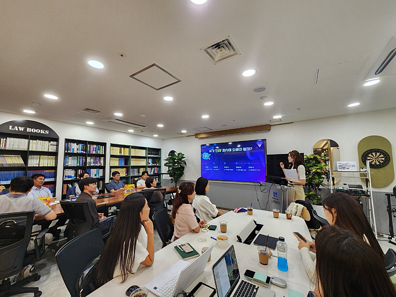
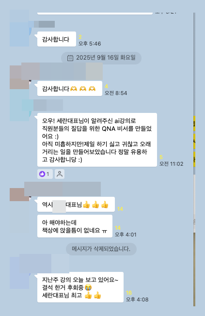
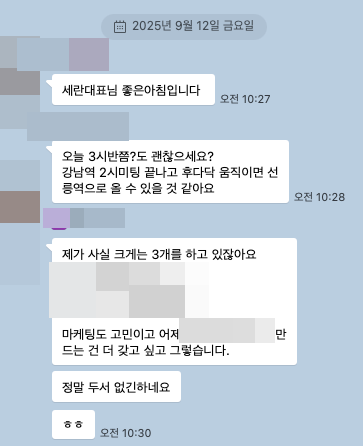
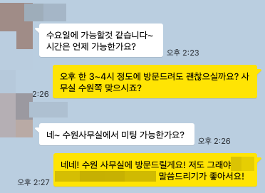
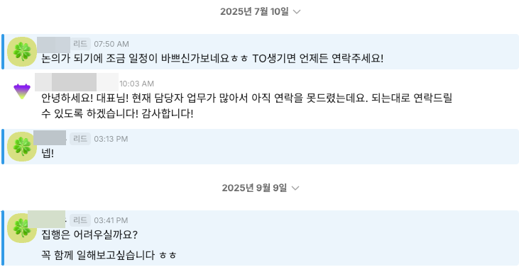

# 분기별모임 특강 + 요즘 수익화 고민

- 원천 ID: EPR-CAFE-33371
- 작성자: 주는사란
- 작성일: 2025-09-16T18:56:35.637000+09:00
- 원문: https://cafe.naver.com/ranschool/33371
- 수집일: 2026-09-21
- 텍스트 정리: HTML 문단 순서 유지, 빈 문단·제로폭 공백만 제거. 원본 HTML·JSON 별도 보존. 이미지는 아래에 모아 보관하며 원래 배치는 HTML에서 확인.

## 원문 본문

<!-- P001 -->
이번 분기별 모임 특강에서는 ai 와 마케팅에 대해서 다뤄볼까 합니다. 사실 제가 얼마전에 연매출 200억대 이상 대표님들이 계시는 모임에서 이 강의를 했는데요. 반응이 좋았어요.

<!-- P002 -->
정확히는 ai 를 어떻게 활용해서 실제 매출로 어떻게 연결하는지에 대한 이야기예요. 이건 단톡방인데 오늘 어떤분이 해보고 잘된다고 너무 좋아하시더라구요.

<!-- P003 -->
사실 본인 회사거를 비용을 줄테니 정리해 달라는 대표님들도 계셨는데요. 그중 한 세무사님은 아예 다 만드는걸 해달라고 하셔서 그거 이야기 중이구요.

<!-- P004 -->
또 한 프랜차이즈 대표님(매장 200개 정도되는)은 스스로는 절대 못한다고 하셔서, 내일 도와드리러 갑니다.

<!-- P005 -->
그래서 이 이야기를 토요일 분기별 모임에서 해드리려고해요.

<!-- P006 -->
근데 제가요. 진짜 일거리는 정말 많은데요.

<!-- P007 -->
<브랜드 7개 업체 대표님>

<!-- P008 -->
< 그외>

<!-- P009 -->
- 세무사님

<!-- P010 -->
- 실버타운 업체

<!-- P011 -->
- 프랜차이즈 200개

<!-- P012 -->
- 인터뷰채널

<!-- P013 -->
등등

<!-- P014 -->
근데 이거 솔직히 제가 다 못하거든요. 그래서 고민이 많아요....... 같이 할 사람을 어떻게 더 발굴할지에 대해서요.

<!-- P015 -->
지금 제 고민들 이예요.

<!-- P016 -->
1. 주는사란에서 더 많은 사람을 모으기

<!-- P017 -->
=> 영상 올리기 (현재 90일째 못 올리는 중)

<!-- P018 -->
2. 블로그 강의 리뉴얼 해서 ai 활용법이나 현재 제 회사에서 실제 하는 업무 위주로 개편

<!-- P019 -->
=> 지금 2편 대본 써놨는데 촬영 대기중

<!-- P020 -->
3. 마대창 커리큘럼 수정하기

<!-- P021 -->
=> 문의온 분들은 꽤 있는데 환경적 여건때문에 어렵다는 분들이 있어서 좀 조율하려구요.

<!-- P022 -->
이거를 다 해야하다보니깐 시간이 걸릴 것 같은데요. 혹시나 이 글을 보고 아예 마케팅 전업으로 하고 싶은데 마대창에 대해 제안사항이 있다면 알려주세요! 저도 의견을 받아서 수정을 해보겠습니다 ㅎㅎ 참고로 지금 마대창 해서 실무를 하시는 분(30대 여성/ 블로그 1개 운영경험) 의 경우, 마대창 주 2회 x 2개월 + 실무 3개월 = 이렇게 하니깐 업체 3개정도 맡아서 하고 계세요!

<!-- P023 -->
그럼 토요일에 만나요!

## 본문 이미지

## 원문에 포함된 링크

- #
