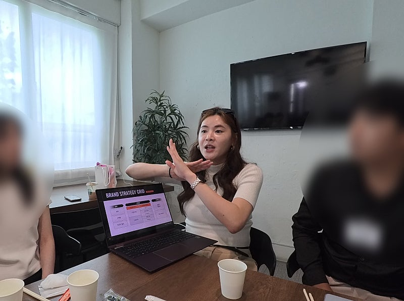
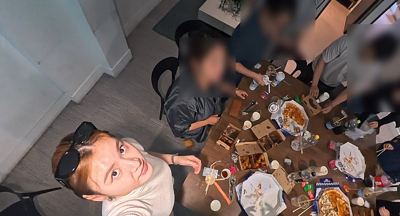
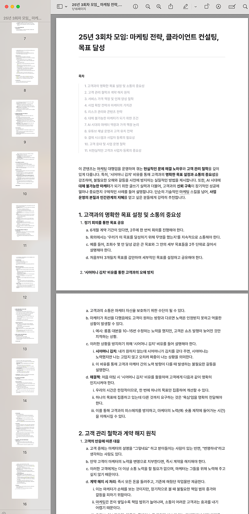

# 마케팅대행고객 규모별 응대법

- 원천 ID: EPR-CAFE-33397
- 작성자: 주는사란
- 작성일: 2025-09-22T17:44:53.193000+09:00
- 원문: https://cafe.naver.com/ranschool/33397
- 수집일: 2026-09-21
- 텍스트 정리: HTML 문단 순서 유지, 빈 문단·제로폭 공백만 제거. 원본 HTML·JSON 별도 보존. 이미지는 아래에 모아 보관하며 원래 배치는 HTML에서 확인.

## 원문 본문

<!-- P001 -->
이번 분기별 모임에서는 <규모별 클라이언트 차이점>에 대해 이야기 했습니다. 특강 내용을 다 녹음해서 ai 에게 정리를 해달라고 했는데요. 못 들으신 분을 위해 정리해서 올려드립니다!

<!-- P002 -->
특강 내용 20분만에 듣기

<!-- P003 -->
특강내용 요약정리

<!-- P004 -->
클라이언트 규모별 마케팅 전략

<!-- P005 -->
핵심 요약

<!-- P006 -->
본 문서는 클라이언트의 사업 규모에 따라 변화하는 마케팅 요구사항을 심층적으로 분석하고, 이를 기반으로 한 효과적인 마케팅 대행 전략을 제시한다. 핵심은 클라이언트의 규모가 소상공인에서 중견기업, 대기업으로 성장함에 따라 마케팅의 초점이 단기적 '광고/홍보'에서 장기적 '브랜딩'으로 이동한다는 점이다.

<!-- P007 -->
소상공인은 투자 대비 수익률(ROI)과 즉각적인 결과(직접 기여)를 중시하는 반면, 규모가 커질수록 기업 이미지, 업계 내 평판, 잠재 고객에 대한 신뢰도 구축(간접 기여) 등 브랜딩의 가치를 더 중요하게 여긴다.

<!-- P008 -->
따라서 성공적인 마케팅 대행사는 이러한 변화를 이해하고, 단기적 홍보 효과와 장기적 자산 축적을 동시에 제공하는 '브랜드 블로그'와 같은 중간 지점의 전략적 포지셔닝을 취해야 한다. 이를 통해 고객과의 신뢰를 쌓고, 플레이스 순위 보장과 같은 추가적인 광고/홍보 상품이나 심도 있는 브랜딩 컨설팅으로 서비스를 확장할 수 있다.

<!-- P009 -->
마지막으로, 고객 자신도 원하는 바를 명확히 모르는 경우가 많으므로, 대행사는 고객의 말을 맹신하기보다 실제 상황을 진단하고, '매출 상승'과 같은 주관적인 목표 대신 '특정 키워드 N일간 노출' 등 통제 가능하고 객관적인 지표로 목표를 설정하여 신뢰를 구축하는 것이 장기적인 성공의 핵심이다.

<!-- P010 -->
1. 마케팅의 4가지 개념: 광고, 홍보, 브랜딩, 마케팅

<!-- P011 -->
마케팅 전략을 이해하기 위해서는 흔히 혼용되는 네 가지 핵심 용어의 차이를 명확히 인지해야 한다.

<!-- P012 -->
용어

<!-- P013 -->
정의 및 특징

<!-- P014 -->
예시

<!-- P015 -->
광고 (Advertising)

<!-- P016 -->
안내의 성격. 신제품 출시나 이벤트 발생 사실을 기존 고객이나 잠재 고객에게 알리는 활동.

<!-- P017 -->
매장 앞 신제품 출시 배너 설치, 카페 내 공지글 게시

<!-- P018 -->
홍보 (Promotion/PR)

<!-- P019 -->
적극적인 접근. 신규 고객을 유입시키기 위해 잠재 고객에게 직접 다가가는 활동.

<!-- P020 -->
전단지 배포, 무료 시식 행사, 신규 고객 유치를 위한 유튜브 영상 제작

<!-- P021 -->
브랜딩 (Branding)

<!-- P022 -->
고객과의 약속. 가게의 컨셉, 방향성, 철학 등을 정립하고 이를 고객에게 일관되게 전달하여 신뢰를 구축하는 과정. 로고, 슬로건 등 무형의 가치를 다루며 주로 자금력이 있는 큰 회사들이 중요하게 여김.

<!-- P023 -->
기업의 로고와 그 의미, 평창 올림픽 슬로건 "Passion. Connected." 개발

<!-- P024 -->
마케팅 (Marketing)

<!-- P025 -->
총체적 과정. 광고, 홍보, 브랜딩을 포함한 모든 활동을 전략적으로 기획하고 실행하여 전반적인 비즈니스 목표를 달성하는 것. 가장 상위의 포괄적인 개념.

<!-- P026 -->
시장 분석부터 광고, 홍보, 브랜딩 전략 수립 및 실행까지의 전 과정 관리

<!-- P027 -->
2. 클라이언트 규모에 따른 요구사항 변화

<!-- P028 -->
클라이언트의 사업 규모는 그들이 필요로 하는 마케팅의 종류를 결정하는 가장 중요한 변수이다.

<!-- P029 -->
2.1. 소상공인 (5인 이하 서비스업) - 광고와 홍보 중심

<!-- P030 -->
- 핵심 요구사항: **투자 대비 수익률(ROI)**과 직관적인 결과를 최우선으로 고려한다.

<!-- P031 -->
- 특징:

<!-- P032 -->
마케팅 비용 지출에 민감하며, 지출한 비용이 얼마의 매출로 이어졌는지를 3개월 단위로 명확하게 확인하길 원한다.

<!-- P033 -->
"건당 5만 원의 글 하나가 최소 10만 원의 고객을 데려와야 한다"는 식의 직접적인 계산을 한다.

<!-- P034 -->
'네이버 플레이스 순위 보장', '체험단 배포' 등 즉각적이고 눈에 보이는 효과를 내는 상품에 대한 선호도가 높다.

<!-- P035 -->
이들에게 '방향성', '차별점' 등 브랜딩 개념을 설명하는 것은 '뜬구름 잡는 소리'로 인식되어 효과적이지 않다.

<!-- P036 -->
2.2. 성장 기업 및 고가 서비스 - 브랜딩의 시작

<!-- P037 -->
- 핵심 요구사항: 직접적인 매출 기여를 넘어, '없어 보이는 것'을 피하고 전문적인 이미지를 구축하는 것을 중요하게 여긴다.

<!-- P038 -->
- 특징:

<!-- P039 -->
직접 기여(Direct Contribution): 블로그 글을 보고 바로 문의가 오는 것. 소상공인이 중시하는 지표.

<!-- P040 -->
간접 기여(Indirect Contribution): 직접적인 매출 외에 발생하는 긍정적 효과. 규모가 커질수록 이 가치를 이해하고 요구하기 시작한다.

<!-- P041 -->
예시 1 (2차 동물병원): 2차 동물병원의 고객은 반려동물 보호자뿐만 아니라, 수술 의뢰를 보내주는 인근의 1차 동물병원도 포함된다. 따라서 다른 수의사들이 볼 전문적인 수술 사례 콘텐츠를 블로그에 축적하여, 업계 내 신뢰도를 높여 추천을 유도하는 것이 매우 중요하다. 이는 간접 기여에 해당한다.

<!-- P042 -->
예시 2 (입소문): 입소문으로 브랜드를 알게 된 잠재 고객이 검색했을 때, 신뢰를 줄 수 있는 양질의 콘텐츠를 제공하여 최종 구매 결정을 돕는다.

<!-- P043 -->
2.3. 대규모 브랜드 기업 - 브랜딩에 대한 집중

<!-- P044 -->
- 핵심 요구사항: 브랜드의 정체성과 컨셉을 유지하고 강화하는 것에 모든 마케팅 활동의 초점을 맞춘다.

<!-- P045 -->
- 특징:

<!-- P046 -->
ROI를 직접적으로 계산하기 어려운 활동에 막대한 비용을 투자한다.

<!-- P047 -->
네이밍, 슬로건 개발 하나에 수천만 원을 사용하며, 디테일한 부분까지 브랜드의 일관성을 챙긴다.

<!-- P048 -->
일반 소비자가 보기에 "저 광고가 왜 필요하지?" 싶은 B2B 기업의 대형 전광판 광고 등은 대부분 브랜딩 활동의 일환이다.

<!-- P049 -->
3. 성공적인 마케팅 대행을 위한 전략적 포지셔닝

<!-- P050 -->
고객의 규모별 니즈를 이해했다면, 그에 맞는 서비스 포지셔닝을 설정하는 것이 중요하다.

<!-- P051 -->
3.1. '브랜드 블로그'의 위치: 홍보와 브랜딩의 중간 지점

<!-- P052 -->
- 광고/홍보의 한계: 체험단, 전단지, 플레이스 순위 작업 등은 비용을 중단하는 즉시 효과가 사라진다. 고객에게 '남는 것'이 없는 소모적인 활동이다.

<!-- P053 -->
- 브랜드 블로그의 강점: 고객 소유의 블로그에 콘텐츠가 차곡차곡 쌓이기 때문에, 비용을 지출한 시점의 홍보 효과(상위 노출)와 더불어 시간이 지나도 사라지지 않는 **자산(브랜딩 기반)**이 된다.

<!-- P054 -->
- 전략적 포지션: 이러한 특성 때문에 브랜드 블로그는 즉각적인 **'홍보'**와 장기적인 **'브랜딩'**의 중간 지점에 위치한다.

<!-- P055 -->
- 최적의 타겟 고객: 단기적인 광고/홍보 활동에 비용을 계속 소모하며 지친 고객들. 이들에게 '남는 자산'의 가치를 설명할 때 가장 큰 설득력을 얻는다.

<!-- P056 -->
3.2. 포지셔닝을 통한 상품 확장 전략

<!-- P057 -->
- 중간 포지션의 이점: 브랜드 블로그를 통해 고객과 장기적인 신뢰 관계를 구축하면, 이를 기반으로 다른 상품들을 추가로 판매하기 용이하다.

<!-- P058 -->
- 확장 경로:

<!-- P059 -->
- 브랜드 블로그로 신뢰 구축: 꾸준한 콘텐츠 발행으로 고객의 비즈니스에 기여하며 장기적 파트너로 자리매김한다.

<!-- P060 -->
- 광고/홍보 상품 추가 판매: 신뢰가 쌓인 고객이 "플레이스 순위도 관리해 줄 수 있나요?" 또는 "체험단도 필요해요"라고 요청할 때, 해당 상품을 추가로 제공한다. 이때는 다른 대행사와의 단순 가격 경쟁에서 벗어날 수 있다.

<!-- P061 -->
- 브랜딩 컨설팅으로 심화: 고객의 규모가 더 커지면, 축적된 데이터를 바탕으로 전반적인 브랜딩 전략을 컨설팅하는 단계로 발전할 수 있다.

<!-- P062 -->
- 주의: 플레이스 순위 보장과 같은 광고/홍보 상품을 주력으로 판매하면, 결국 가격 경쟁에 매몰되고 고객 충성도를 확보하기 어렵다. 이는 안정적인 수익 구조를 만들지 못하는 '로또'와 같은 방식이다.

<!-- P063 -->
4. 클라이언트 관리 및 계약 핵심 원칙

<!-- P064 -->
장기적인 파트너십은 명확한 원칙 위에서 구축된다.

<!-- P065 -->
4.1. 고객의 진짜 니즈 파악

<!-- P066 -->
- 핵심: 고객은 자신이 무엇을 원하는지 정확히 모르는 경우가 많다.

<!-- P067 -->
- 사례: "당장 매출이 안 나와도 괜찮다"며 브랜딩을 원했던 고객이, 매달 매출 성과를 따져 묻는 경우가 비일비재하다.

<!-- P068 -->
- 대응: 고객의 요구를 그대로 수용하기보다, 사업의 규모, 현황, 보유 자원(포트폴리오 유무 등)을 분석하여 진정으로 필요한 마케팅이 무엇인지 진단하고 제안해야 한다. 특히, 시공 사례나 포트폴리오가 전무한 신규 오픈 업체('제로 베이스')는 마케팅으로 성과를 내기 매우 어렵다는 점을 인지해야 한다.

<!-- P069 -->
4.2. 목표 설정: '주관성의 객관화'

<!-- P070 -->
- 핵심: 모호하고 주관적인 약속을 피하고, 통제 가능하며 측정할 수 있는 객관적인 목표를 제시해야 한다.

<!-- P071 -->
- 나쁜 목표 설정: "사장님, 저희에게 맡기시면 매출 올려드릴게요."

<!-- P072 -->
'매출'은 마케팅 외의 수많은 변수에 의해 결정되며, '올려준다'는 기준이 서로 달라 분쟁의 소지가 크다.

<!-- P073 -->
- 좋은 목표 설정 (주관성의 객관화):

<!-- P074 -->
"지난달 블로그 방문자가 500명이었으니, 이번 달에는 700명 방문을 목표로 하겠습니다."

<!-- P075 -->
"선정한 핵심 키워드 5개를 이번 달 총 15일 이상 상위 노출시키는 것을 목표로 하겠습니다."

<!-- P076 -->
- 효과: 이러한 목표는 대행사가 직접 통제하고 노력으로 달성할 수 있는 범위에 있다. 이는 고객에게 책임감 있는 인상을 주고, 만약 목표에 미달하더라도 추가적인 노력(글 추가 발행, 광고 집행 등)을 통해 신뢰를 회복할 수 있는 기반이 된다. 이러한 목표 제시는 반드시 계약 전, 즉 돈을 받기 전에 이루어져야 한다.

<!-- P077 -->
4.3. 장기적 파트너십 구축: 연금 복권 모델

<!-- P078 -->
- 관점: 마케팅 대행업을 한 번에 큰 수익을 노리는 '로또'가 아니라, 매달 꾸준하고 안정적인 수익을 창출하는 '연금 복권'으로 바라봐야 한다.

<!-- P079 -->
- 실행: 단기 성과에 집착하여 고객에게 무리한 약속을 하거나, 효과가 순간적인 상품만 판매하는 것을 지양해야 한다. 고객의 비즈니스가 안정적인 수익을 내야 대행사 역시 안정적인 수익을 얻을 수 있다는 점을 명심해야 한다.

<!-- P080 -->
- 결론: 고객의 자산을 함께 쌓아간다는 파트너십의 관점으로 접근할 때, 비로소 장기적이고 신뢰 기반의 관계가 형성되며, 이는 곧 대행사의 지속 가능한 성장으로 이어진다.

<!-- P081 -->
카메라 장만 기념 항공샷 ㅎㅎ

<!-- P082 -->
이 후에 1시간 정도 Q&A 시간이 있었는데요!

<!-- P083 -->
Q&A 자료도 받고 싶으시다면?

<!-- P084 -->
분기별 모임 참석자 분은 : '모임 후기' 게시판에 후기 작성 후 카톡채널로 문의주세요! 요약 파일 보내드려요!

<!-- P085 -->
미 참석자 분은 : 위 오디오뷰 듣고 느낀점을 '모임후기' 게시판에 작성 후 카톡채널로 문의주세요! 요약 파일 보내드려요!

<!-- P086 -->
✅ 싸움짱님 후기 예시 (아주 잘 써주심)

<!-- P087 -->
저는 2023년 7월에 한국에 와서부터 다른직장없이 프리랜서로 수익화에 도전하였습니다. 처음 한 것은 구글애드센스 였는데요, 그때 써둔 글들이 주는 수익으로 지금 생활비를 ...

<!-- P088 -->
cafe.naver.com

<!-- P089 -->
=> 약 16페이지 분량입니다!

## 본문 이미지

## 원문에 포함된 링크

- #
- https://cafe.naver.com/ranschool/33393

## 원본 HTML에 포함된 외부 게시물 메타데이터

외부 게시물의 현재 본문을 재수집한 것이 아니라, 카페 게시 당시 함께 저장된 제목·설명이다. 잘린 문구는 보완하지 않았다.

- 원문 링크: https://youtu.be/D376RPyN2z4

2025년 3번째 분기별모임 20분만에 엿보기

YouTube에서 마음에 드는 동영상과 음악을 감상하고, 직접 만든 콘텐츠를 업로드하여 친구, 가족뿐 아니라 전 세계 사람들과 콘텐츠를 공유할 수 있습니다.

