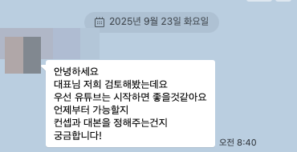
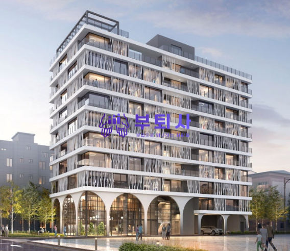

# 실버타운 마케팅 설계도 그리기

- 원천 ID: EPR-CAFE-33407
- 작성자: 주는사란
- 작성일: 2025-09-23T11:23:07.007000+09:00
- 원문: https://cafe.naver.com/ranschool/33407
- 수집일: 2026-09-21
- 텍스트 정리: HTML 문단 순서 유지, 빈 문단·제로폭 공백만 제거. 원본 HTML·JSON 별도 보존. 이미지는 아래에 모아 보관하며 원래 배치는 HTML에서 확인.

## 원문 본문

<!-- P001 -->
서울에 프리미엄 실버타운을 하려는 대표님이 계세요. 2주 전에 미팅을 다녀왔고, 지난주에 어떻게 할지와 / 비용 을 안내드렸어요. 그랬더니 오늘 마침 하고 싶다고 오셨더라구요. 이번주에 미팅을 가야해서 미팅 하기 전에, 미리 여기에 정리해봅니다.

<!-- P002 -->
<클라이언트 요구사항>

<!-- P003 -->
1. 다음달에 모델하우스 오픈 예정 => 모델하우스 방문자 증가

<!-- P004 -->
2. 6개월 후에 착공 시작 => 착공전 입주 예정 고객 선계약

<!-- P005 -->
사실 여기는 마케팅 적으로는 "어떻게 해야겠다" 가 바로 그려졌어요. 첫 미팅 때부터 느낌은 왔고, 실제로 찾아봤을때도 레퍼런스도 많이 보였구요.

<!-- P006 -->
<예시 조감도>

<!-- P007 -->
일단 기본 계획은 2단계 입니다.

<!-- P008 -->
1. 실버타운에 관심있는 사람 모은다

<!-- P009 -->
2. 우리 준공까지 붙잡아 둔다.

<!-- P010 -->
<관심 있는 사람 모으기>

<!-- P011 -->
여기서 핵심은 실버타운에 대한 인식을 전환하는 것입니다.

<!-- P012 -->
"나이들어서 가는 곳 => 빨리 가서 쉬고 싶은 곳" 으로 => 이거는 하기 쉽다고 생각했어요.

<!-- P013 -->
여기는 서울 중심가에 있는 프리미엄 실버타운이거든요. (실제 수요 조사를 하셨는데, 실버타운에서 가장 중요학 여기는게 위치라고 하더라구요. 그래서 일부로 위치를 그렇게 잡으셨데요)

<!-- P014 -->
이걸 컨텐츠적으로 녹이려면,

<!-- P015 -->
- 다른 실버타운 리뷰하기 => 여기서 배울점 공부하는 모습 보이기

<!-- P016 -->
- 기존 실버타운의 문제점 정보성 컨텐츠

<!-- P017 -->
- 실버타운 입주자 인터뷰

<!-- P018 -->
등등

<!-- P019 -->
<우리 고객으로 만들기>

<!-- P020 -->
요즘에는 유튜브 구독자가 늘어난다고해서 내 고객이 되는건 아니기 때문에, 모아둘 곳이 있어야 합니다. 특히나 이렇게 오픈 전이거나 주기가 긴 업종(재구매 기간이 최소 1년 이상, 예를들어 공인중개사 사무소나 성형외과 등)들은 더 모아둬야 해요. 그리고 우리가 필요할때까지 그 사람들을 붙들어 둬야죠.

<!-- P021 -->
제가 이렇게 카페 하는 것 처럼요.

<!-- P022 -->
컨텐츠 적으로는

<!-- P023 -->
- 우리 실버타운 건축 현장 계속 보이기 => 창업과정처럼 우리가 어떤 노력을 하는지 보이기

<!-- P024 -->
- 본 실버타운 레퍼런스한 일본 실버타운 사례 보여주기

<!-- P025 -->
등등

<!-- P026 -->
시작은 유튜브부터 하게 될것 같구요. 결국엔 인스타 / 블로그 등 다 할 예정입니다. 그럼 미팅하고 또 알려드릴게요!

## 본문 이미지

## 원문에 포함된 링크

- #
