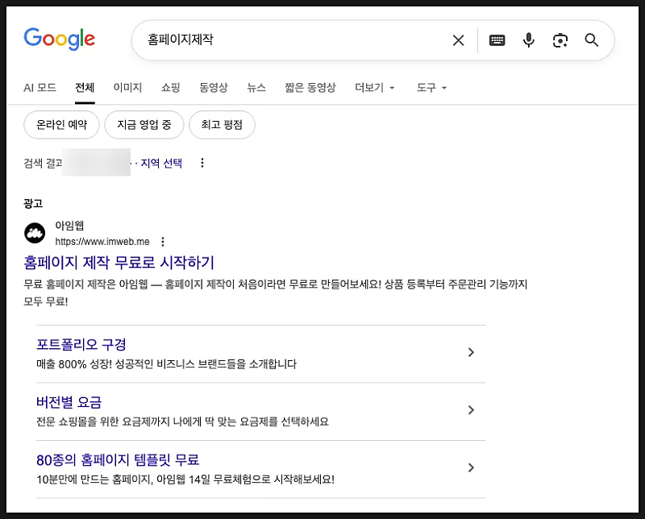
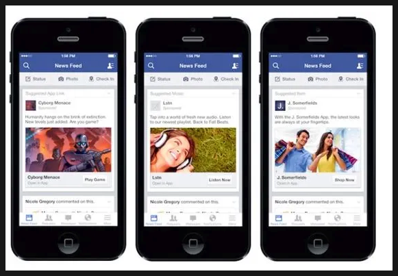
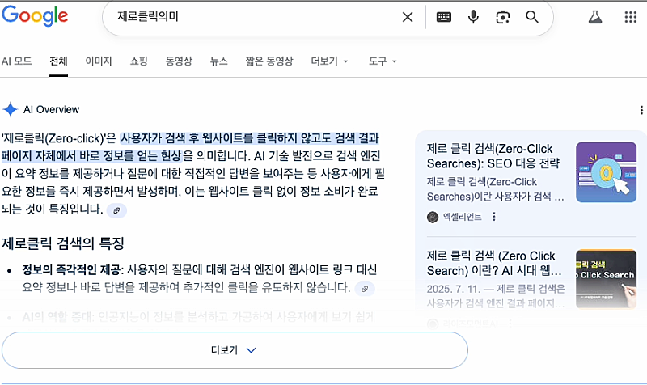
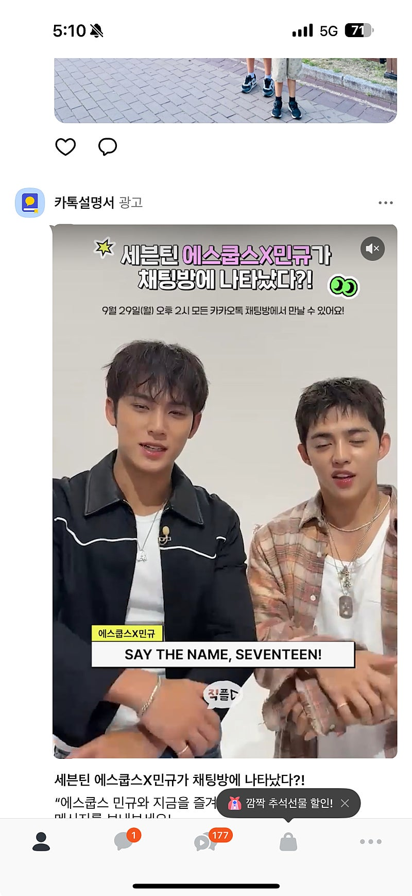
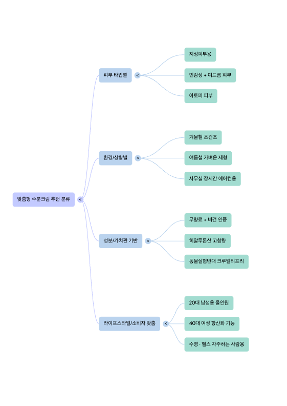
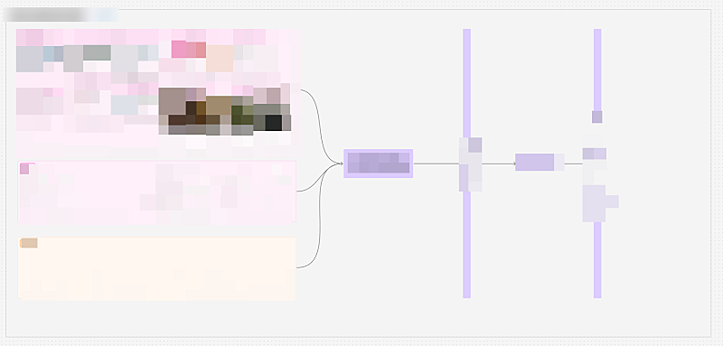
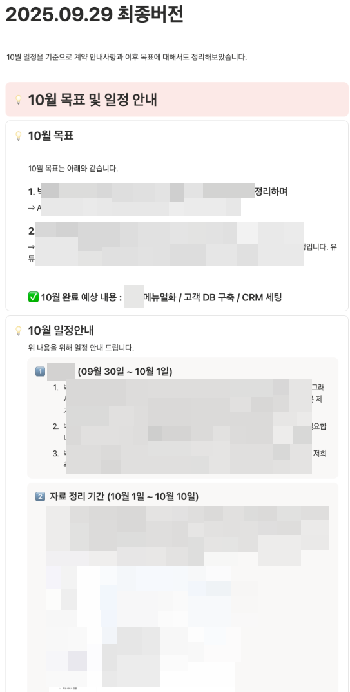
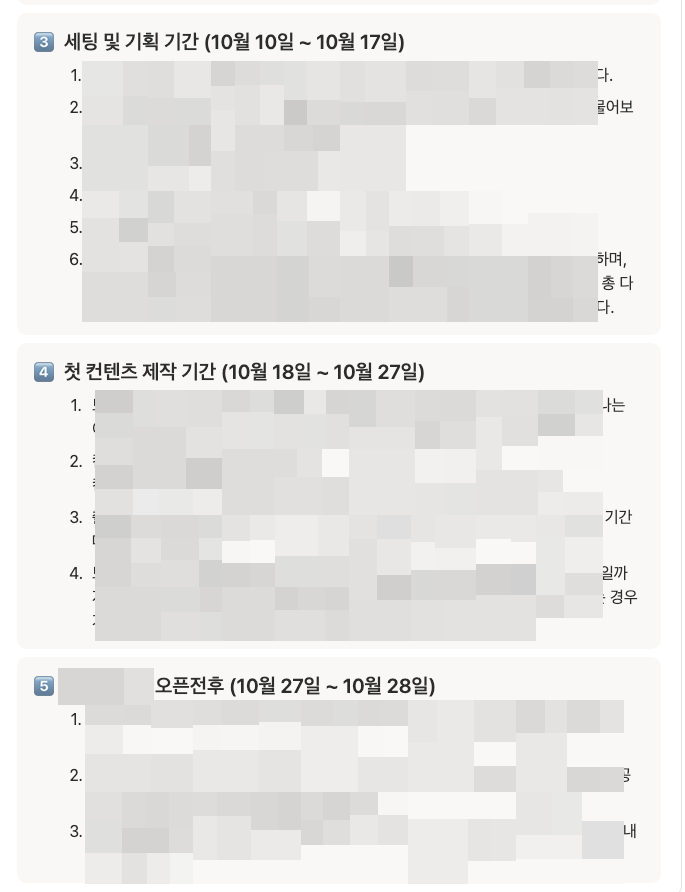
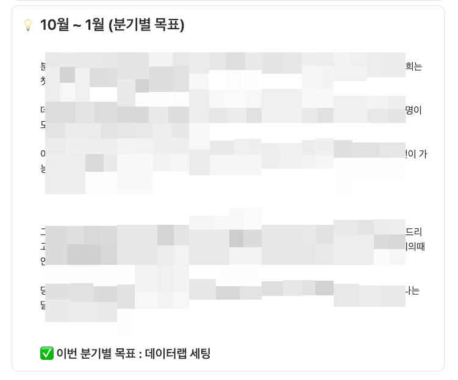
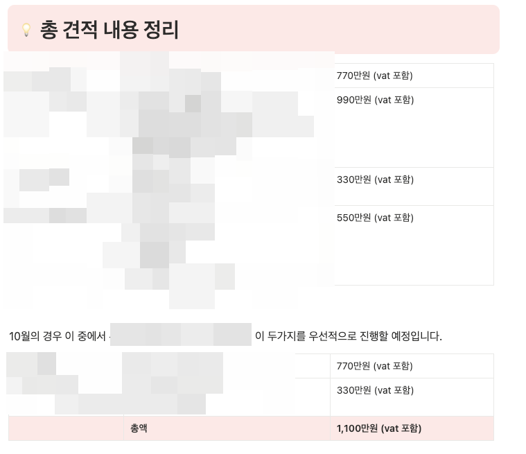

# ⭐️⭐️너무 중요⭐️⭐️2026년 마케팅 수익화 변화 예측

- 원천 ID: EPR-CAFE-33419
- 작성자: 주는사란
- 작성일: 2025-09-29T17:51:27.240000+09:00
- 원문: https://cafe.naver.com/ranschool/33419
- 수집일: 2026-09-21
- 텍스트 정리: HTML 문단 순서 유지, 빈 문단·제로폭 공백만 제거. 원본 HTML·JSON 별도 보존. 이미지는 아래에 모아 보관하며 원래 배치는 HTML에서 확인.

## 원문 본문

<!-- P001 -->
마케팅 수익화에서 ai 활용하는 방법을 포함해서 적어보겠습니다.

<!-- P002 -->
먼저 첫번째, 카톡은 욕먹을걸 알았습니다. 그래도 바꾼거예요. 왜냐? 체류시간이 아작나고 있었으니까요. 이번달 23일에 용인 카카오 인공지능 캠퍼스에서 진행된 개발자 행사가 있었는데요. 여기서 카카오 대표가 직접 말했습니다. 체류시간 아작나고 있는거 알고 있다. 이거 확대할건데, 그 방법으로 ai 기반 슈퍼앱을 만들것이다 라구요.

<!-- P003 -->
슈퍼앱이란, 챗 gpt 랑 협약해서 일정관리 / 예약 / 쇼핑 / 결제 이거 다 하겠다는 거죠.  (아래 영상 58:38 이후 참고)

<!-- P004 -->
가능성, 일상이 되다. if(kakao)25일상에 스며든 AI, 카카오가 열어가는 가능성을 소개합니다#DAY1누구나 쉽게 만나고 활용할 수 있도록'모두의 AI'로 진화한 새로워진 카카오톡을 만나보세요카카오가 선사하는 일상 혁신을 공개합니다📍 LIVE 일정 : 9.23(화) 오전...

<!-- P005 -->
www.youtube.com

<!-- P006 -->
아니 그럼 왜 카카오톡은 체류시간이 아작났냐? 사실 이게 우리한테는 더 중요한거거든요. 이걸 알아야 우리도 준비를 하니까요.

<!-- P007 -->
바로 두번째 입니다. 고객이 우리 매장을, 우리 회사를, 우리 홈페이지를, 만나는 첫 화면이 통째로 바뀌었어요. 좀 어려운 말로 고객 경로가 바뀌었다고 해요. 고객이 한 제품을 구매하는 방법이 변하고 있다는 거죠.

<!-- P008 -->
말 나온김에 온라인 마케팅 고객 경로 변천사를 잠깐만 볼게요. 처음이 포털사이트 시대입니다. 포털사이트가 막 나왔던 시기 아시나요? 이때 처음나온게 홈페이지제작 이런걸 검색하면 아래 광고가 보이는 이 마케팅 방법이 있었습니다. 혁명적이고 여전히 먹히죠.

<!-- P009 -->
그다음이 SNS 시대입니다. SNS 시대에서는 이제 완전 격변기인데, 페이스북이 시작할때는 게시물을 내리면 중간에 광고가 뜨는 포맷이 나오고, 인스타가 들어오면서 좀더 사진위주의 직관적 광고가 잘 되기 시작하구요

<!-- P010 -->
틱톡 나오면서 숏츠가 대세로 자리잡으면서 유튜브 인스타 다 따라했죠. 그리고  마지막으로 결국엔 이 모든것의 수익은 쇼핑이기 때문에 지금은 어떻게든 구매하게 하려고 온갖곳에 다 광고가 보이는 시대가 되었습니다. 사실 카카오도 그 시작점중 하나가 카카오 선물하기 였구요.

<!-- P011 -->
그리고 지금 ai 시대가 왔죠. 그래서 어떻게 됐냐?

<!-- P012 -->
요즘 구글조차도 검색의 60%가 클릭이 제로, 클릭이 빵! 클릭이 안된다는거예요. 이게 무슨말이냐면 아마 구글이나 네이버에 검색하면 이제 이렇게 아래에 ai 가 요약해주는걸 보셨을거예요. 이렇게 ai 가 요약을 다 해줘버리니깐 밑에 안보겠죠? 그러면 이런 링크를 클릭 안할겁니다. 당연히 광고가 안보이겠죠.

<!-- P013 -->
여기부터 지금 문제가 생긴거죠. 사실 카톡도 왜 바뀌었냐? 광고 붙이려고 한겁니다. 돈이 안되니깐 돈을 더 벌고 싶어서요. 벌써 광고보임.

<!-- P014 -->
(아래 카톡 피드 참고)

<!-- P015 -->
그럼 ai 가 나온 이제는 어떻게 되냐? 초초초 개인화 됩니다.

<!-- P016 -->
ai 는 내 성향, 가치관, 내 체형, 내 라이프스타일까지 모두 다 알수 있습니다. 다 하나로 통합시키고 일을 대신해주는거니까요. 물론 여기까지 가려면 시간이 필요하다고 생각해요. 근데 확실한건 더 초초초 개인화가 되었으면 됐지 반대로 갈일은 없다는 거예요.

<!-- P017 -->
그럼 초초초 개인화 되면 어떤 변화가 생기냐? 세부키워드가 생깁니다.

<!-- P018 -->
이게 무슨말이냐면, 예를들어 옛날에는 수분크림 하나만 잡아도 됐다면, 수분크림이 피부 타입별로도 다를거구요. 그럼 지성피부 / 민감성 / 아토피 이런식으로 나뉘겠죠. 또 환경/ 상황별로도 나뉠겁니다. 겨울철 / 여름철 / 사무실 / 외근직 등 으로 나뉠수도 있구요. 또 라이프스타일에 따라서도 나뉘겠죠 올인원 / 여성 항산화 등등이요. 사실 이건 제가 진짜 아주 러프하게 나눈거고 민감성 안에서도 더 세부 키워드가 생길거예요.

<!-- P019 -->
마치 이제는 s/m/l 밖에 없었던 사이즈가 맞춤복으로 바뀐거죠. 당연히 그만큼 시장이 세분화 되었기 때문에 작은 회사도 아주 작은 카테고리 하나정도는 잡을수 있는거구요. 반대로 큰 회사는 이걸 정말 더 세분화해서 다 잡을 수 있어야 합니다.

<!-- P020 -->
(이런 느낌처럼 => 여기서 하나만 제대로 잡아도 됨)

<!-- P021 -->
여기까지가 현상 분석이구요. 그럼 여기서 마케팅 대행을 파는 사람은 어떻게 해야할까요?

<!-- P022 -->
세분화된 카테고리를 얼마나 내가 점령시킬수 있느냐에 따라 돈을 벌수 있습니다. 그리고 사실 이 모든 과정을 ai 가 대신해줄수 있어요. 그래서 우리가 해야하는건 '무엇을 시킬지' 입니다. 그니깐 '기획'이죠.

<!-- P023 -->
이게 무슨말이냐면, 블로그 기준으로 설명드릴게요.

<!-- P024 -->
1. ai 글쓰기의 핵심은 디테일 싸움입니다.

<!-- P025 -->
아까도 말씀드렸지만 '초초초 개인화'가 될거예요. 그러면 진짜 그 1명에게 맞는 이야기를 해야합니다. 근데 이건 ai 에게 그 한명이 누군지를 아주 구체적으로 알려줘야해요. 근데 이걸 그냥 ai 한테 통으로 요청한다? 아무런 의미가 없습니다.

<!-- P026 -->
그래서 저는 초보자분들이 ai 를 이용해서 블로그 초안을 잡는 것은 비추천 입니다.

<!-- P027 -->
블로그 글쓰기는 "글을 써서 돈 벌 수 있어요" 이게 아닙니다. 여기의 핵심은 글쓰기 관점을 잡는것이예요. 스스로 못잡는 상태에서 ai 로 초안 쓰기 하는건 절대 안됩니다. 써준 글을 조금 가공해서 쓰는 연습부터 하면, 절대로 ai 보다 글을 잘 쓸수 없어요. ai 보다 글을 못 쓰면 당연히 나한테 맡길 이유가 없겠죠ㅠㅠ

<!-- P028 -->
즉 처음부터 ai 로 글쓰기를 연습하는 것은 안됩니다. 스스로 최소 30개 이상은 써보고 나서 ai 를 써야합니다.

<!-- P029 -->
제가 지금 블로그 강의 리뉴얼을 하고 있는데요. 제가 쓰는 학습시켜놓은 ai 드릴겁니다. 단, 이건 글 안 쓰신 분들은 드리지 않아요. 꼭 다 쓰고 인증해주셔야 사용법과 ai를 드립니다. 그리고 이거를 ai 로 썼는지도 하나하나 검증할거예요. 왜 이렇게 썼는지를 다 여쭤볼겁니다.

<!-- P030 -->
제가 쓰는 ai 는 거의 무료입니다. '거의' 무료라고 말씀드리는 이유는 여기서 제가 수익을 남기진 않을건데요. 여러분이 계속 쓰셔야 하는데, ai 호출비용이 들어가거든요. 그 비용과 그 홈페이지 유지 비용? 정도만 받을 예정이예요. 이 비용은 현재 산정중입니다.

<!-- P031 -->
이걸 돈 안 받는 이유는 제가 알려드리고 싶은건 '블로그 수익화' 만이 아니기 때문이예요. 이것만 하는건 초초초개인화 시대에 적합하지 않다고 생각하기 때문입니다. 그리고 제가 진짜 블로그 강의에서 알려드리고 싶은것도 '블로그 수익화'가 아니라 '기획'을 연습하는 것이구요. 이것에 맞춰서 강의를 수정하려구요. 아예 유튜브 대본 쓰는 것도 같은 맥락으로 리뉴얼 할 예정입니다.

<!-- P032 -->
참고로 이 ai는 제가 제 회사에서 가능한 적은 시간으로 블로그 쓰려고 만들어 둔 것이예요. 그래서 저희 업체에서 지금까지 썼던 블로그를 모두  DB에 학습시키고, 앞으로 쓰는것도 다 학습시켜 놓을거예요. 그래서 굳이 다른 비싼 ai 안쓰셔도 됩니다. 이것만 있으면 블로그 대행은 쉽게 하도록 할거예요.

<!-- P033 -->
2. 왜 굳이 글을 내가 쓸줄 알아야 하나요? 그냥 ai 로 하면 더 잘하는데요?

<!-- P034 -->
바로 그게 문제입니다. ai 보다 못하면 나한테 맡길 이유가 없습니다. 가끔 제게 "ai 로 대체가 될것 같은데요?" 라고 하시는 분들이 있는데, 당연히 그건 ai 보다 더 못하니깐 대체가 되는 것 입니다. (강하게 말씀드리는 점 양해해주세요)

<!-- P035 -->
그니깐 앞으로는 ai 보다 잘한다=> 돈 많이 범

<!-- P036 -->
못한다 => ai 잘하는 사람한테 돈 내야함

<!-- P037 -->
이렇게 된다는 의미라는 거죠. 그래서 지금부터 ai 보다 더 '잘'하게 되는게 핵심입니다. 그 완전 시작점이 ai '없이' 블로그 써보는 것이구요. 스트레스 받고 짜증나는 시기가 있어야 되구요. 모르는데 맡기는 것 자체가 말이 안되니까요. 그래서 굳이 어려운 길 , 힘들 길 돌아가라고 말씀드리는 것입니다.

<!-- P038 -->
타겟을 이해하는 것

<!-- P039 -->
그걸 바탕으로 워크플로우를 설계하는 것

<!-- P040 -->
이게 기획이고, 이걸 할줄 알면 ai 한테 시키면 됩니다. 심지어 요즘은 이 ai 한테 시키는 것도 시킬수도 있어요 ㅋㅋㅋㅋ 이거는 제가 이번에 시작하는 실버타운 워크플로우 그린것이구요.

<!-- P041 -->
이걸 바탕으로 이렇게 진행할 예정입니다.

<!-- P042 -->
그리고 이렇게 계약서 작성합니다.

<!-- P043 -->
참고로 '매월' 금액입니다

<!-- P044 -->
그래서 제가 블로그 강의를 리뉴얼 하고 있는데 아예 내용이 많이 바뀔겁니다. 블로그 잘 쓰는것 보다는 블로그 글쓰기를 배워서 이렇게 워크플로우 짜는 것 까지 어떻게 해야하는지 그 시작점을 알수 있는 내용으로요.

<!-- P045 -->
그리고 블로그 ai 랑 강의사이트 통합하고 있는데 이거 되는대로 새로운 강의를 한강씩 차차 업로드 할 예정입니다.

<!-- P046 -->
초초초개인화 시대 분석은 또 이어갈게요. 아 그리고 마침 얼마전 프랜차이즈 대표님 (방향성 안맞았던) 분이 연락왔는데 이 내용도 추가적으로 업로드 하겠습니다!

<!-- P047 -->
이거 다 써놓고 네이버 들어갔더니 카톡 정상화 한다고 하는데ㅋㅋㅋㅋ 어차피 방향 자체가 변하는 것은 아니니 위 내용 자체는 꼭 명심해주세요

## 본문 이미지

## 원문에 포함된 링크

- https://www.youtube.com/live/jswWzMCyqS8?si=fXx4W6LHFkkbaNDM&t=3499
- #
