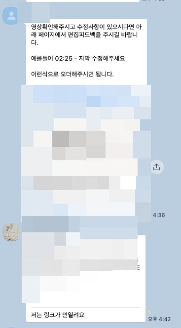
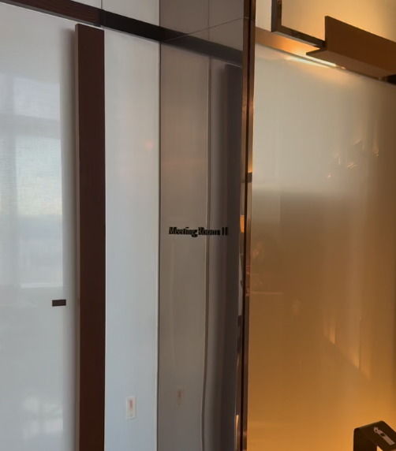

# 마케팅대행료 1억 놓친 후기

- 원천 ID: EPR-CAFE-33476
- 작성자: 주는사란
- 작성일: 2025-10-24T19:49:17.350000+09:00
- 원문: https://cafe.naver.com/ranschool/33476
- 수집일: 2026-09-21
- 텍스트 정리: HTML 문단 순서 유지, 빈 문단·제로폭 공백만 제거. 원본 HTML·JSON 별도 보존. 이미지는 아래에 모아 보관하며 원래 배치는 HTML에서 확인.

## 원문 본문

<!-- P001 -->
최근 대행료만 1억이 넘는 계약을 했습니다. 이미 마케팅도 시작이 됐고, 어제는 첫 미팅날이었습니다.

<!-- P002 -->
이 회사 사무실이 시그니엘에 있어서 미팅도 시그니엘에서 했는데요.

<!-- P003 -->
이 업체를 하려고 했던 이유는

<!-- P004 -->
1. 조건이 좋았구요

<!-- P005 -->
2. "팔리는걸 팔아야 잘 팔린다" 는 제 철학에도 맞았어요.

<!-- P006 -->
근데 결국 안할 것 같습니다. 왜냐면 대표님과 성향이 안맞았거든요.

<!-- P007 -->
여기서 성향이 안맞는다는 의미는 크게 두가지 인데요.

<!-- P008 -->
1. 테스트할 자유가 없다.

<!-- P009 -->
저는 마케팅 대행사의 가장 큰 역할은 가능한 많은 테스트를 통해 성공 확률을 높이는 것이라고 생각해요. 그런데 ‘이건 하지 마세요’, ‘그건 안 돼요’ 같은 제한이 많아지면, 테스트의 폭이 줄어들고, 결국 결과도 예측하기 어려워지죠. 그래서 우리한테 '테스트할 자유'가 주어지는게 성과에도 큰 영향을 미친다고 생각해요.

<!-- P010 -->
근데 이번에 만난 업체는 대표님이 본인의 시장 조사를 이미 아주 많이 해오셨고, 그래서 본인 안에 ‘정답’이 있는 분이셨어요. 처음에는 이점이 너무 좋았죠. 근데 이 정답이 꼭 마케팅의 정답은 아닐수 있는데, 그렇게 생각하는 것 같지는 않으셨어요. 아예 처음부터 방향을 고정하고 그 안에서만 하길 원하셨어요. 예를들어 "남자는 안나왔으면 좋겠다" "이런 컨텐츠는 싫다" 등등 '할 수 없는' 컨텐츠의 조건이 너무 많았어요.

<!-- P011 -->
반대로 지금 맡은 업체중에서 진짜 이 시도를 너무 좋아하는 대표님이 있는데, 그러다 보니 진짜 하고 싶은거 다 하거든요. 그래서 너무 재밌고 신나요. 심지어 공짜로 거의 100만원하는 서비스 다 체험해볼수도 있습니다 (2주뒤에 가는데 후기 곧 공유드릴게요)

<!-- P012 -->
2. 책임의 범위가 넓어진다.

<!-- P013 -->
저는 가장 최악의 회사가 "열심히 일할 수록 책임의 범위가 넓어지는 것" 이라고 생각해요. 내가 열심히 하고 싶어서 뭘 하다가 실수 할 수 있잖아요? 근데 그 실수를 용납할수 있는 범위가 너무 좁으면 노력하고 싶지 않아지는것 같아요. 그래서 저는 제 회사가 언제든 실수 할 수 있는 회사가 되는게 중요하다고 생각하거든요.

<!-- P014 -->
이게 회사 내부에서 뿐 아니라 회사랑 회사가 협업할때도 똑같은것 같아요.

<!-- P015 -->
대표님이 "여자만 나와야하고" "컨텐츠가 이래야하고" 이런 이야기를 하시길래, 저는 왜 그게 안되는지를 다 이야기 했어요. 제가 너무 다 대꾸를 하니깐 좀 기분이 안 좋으셨을것 같긴 해요. 근데 저는 이런거 진짜 못참는 스타일이라 ㅋㅋㅋㅋㅋㅋㅋ 마지막에는 저 말고 같이간 팀원만 보고 이야기 하더라구요 ㅋㅋㅋㅋㅋㅋㅋㅋㅋㅋㅋㅋㅋ

<!-- P016 -->
여튼 제가 다 대꾸를 하니깐 마지막에 "내 이야기는 참고만 하고, 마음대로 하셔도 된다. 결과로 이야기 하자" 라고 하시더라구요. 저는 이런 말이 겉으로 보기엔 유연해 보이지만, 사실상 ‘내가 정한 프레임 안에서 결과를 보여달라’는 의미라고 생각해요. 열심히 할수록 책임의 범위가 넓어지는 구조죠.

<!-- P017 -->
무엇보다 마케팅이라는게 처음에는 다 감이거든요. 그러다가 한두개가 잘 되고 그때 데이터를 바탕으로 틀을 만들어 가는것인데....그런 방향이 안 맞았어요.

<!-- P018 -->
감으로 시작한 결과를 “책임져라”는건 ‘책임은 주지만 자유는 없는것' 이라고 생각하거든요.

<!-- P019 -->
아직 안하기로 확정난 건 아닌데요. 이렇게 쓰면서도 아직도 좀 고민되긴 하는데........

<!-- P020 -->
내가 실력이 부족한걸 다른 이유로 합리화 하고 있는건 아닌가?

<!-- P021 -->
미팅 한번으로 너무 극단적으로 이 사람의 성향을 파악한건 아닌가?

<!-- P022 -->
클라이언트 성향이 나랑 안 맞는 거라면, 이런 업체까지 품으려면 어떤 사람이 되어야 혹은 어떤 사람을 채용해야하나?

<!-- P023 -->
클라이언트 성향이 안 맞는 업체는 앞으로 안 받을 것인가?

<!-- P024 -->
뭐 이런 고민이예요.

<!-- P025 -->
지금도 고민중이라 내용이 정리되지 않은 상태로 적은거라 뭔말인지 이해가 안되실수도 있는데요. 그럼에도 적어보려고 한건 아마 해보신 분들은 이런 고민 드실텐데, 이런 고민이 당연하다는 걸 말씀드리기 위해서였어요.

<!-- P026 -->
그럼 저는 다시 주는사란 대본 쓰러 가볼게요. 뿅

## 본문 이미지

## 원문에 포함된 링크

- #
