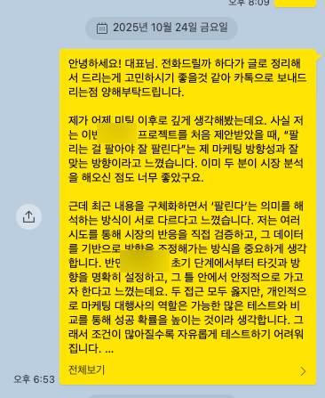
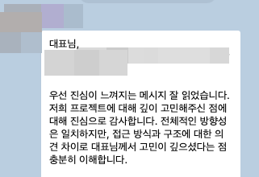
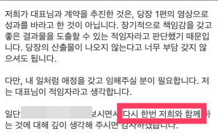
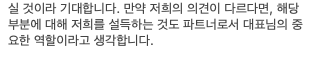

# 성향이 안맞는 고객, 극복 VS 포기

- 원천 ID: EPR-CAFE-33482
- 작성자: 주는사란
- 작성일: 2025-10-27T21:12:03.463000+09:00
- 원문: https://cafe.naver.com/ranschool/33482
- 수집일: 2026-09-21
- 텍스트 정리: HTML 문단 순서 유지, 빈 문단·제로폭 공백만 제거. 원본 HTML·JSON 별도 보존. 이미지는 아래에 모아 보관하며 원래 배치는 HTML에서 확인.

## 원문 본문

<!-- P001 -->
얼마전에 올렸던 글에서 1억짜리 고객 그만해야 할 것 같다고 올렸는데요.

<!-- P002 -->
대한민국 모임의 시작, 네이버 카페

<!-- P003 -->
cafe.naver.com

<!-- P004 -->
그래서 이렇게 보냈거든요.

<!-- P005 -->
근데...

<!-- P006 -->
이렇게 말하는데 고민되네요.

<!-- P007 -->
신경쓰이는 점 -

<!-- P008 -->
1. 저랑 연락한 분은 와이프고, 제가 안 맞는다고 생각한 분은 저 분 남편(실질적 운영자)이예요. 저 와이프분이 제 레퍼런스랑 포폴을 보고 계약을 하게된 것이라 미팅에서도 와이프분은 제 의견에 동조를 했어요. 근데 추측이긴 하지만 이 내용이 그 남편분에게 제대로 전달이 안되었을거예요. (내용상에 남편 이야기가 전혀 없는점을 미뤄봤을때) 그래서 사실상 아무런 개선점이 없는 상태인 거죠.

<!-- P009 -->
2. 이 프로젝트를 포기하고 싶은 가장 큰 이유는 '자유도가 없다'는 점이예요. 이것 저것 다 테스트를 해봐야하는데, 그 테스트에 싫다는 점이 많아요. 근데 이것에 대해서는 이렇게 대답을 해서... 허허

<!-- P010 -->
긍정적으로 생각하는 점 -

<!-- P011 -->
1. 제가 책임 소재가 넓어지는 것에 대해 부담을 느낀다고 말했더니, 이 부분에 대해서는 정확한 선을 이야기 해줬어요. 그래서 이부분은 일단 해결이 되었습니다.

<!-- P012 -->
2. 남편과 성향은 안맞으나, 이런 감정 노동은 좀 피해갈 수도 있을 것이라는 점입니다. 일단 촬영시 가능한 그 남편분 출연을 지양하고, 회의 때만 만나는 것으로 ㅋㅋㅋㅋㅋ (제 맘대로 될런지 ㅋㅋㅋㅋㅋ)

<!-- P013 -->
3. 이 프로젝트가 잘 되면 연결된 프로젝트가 많다는 점(?)

<!-- P014 -->
솔직히 왠만해서는 포기하고 싶지는 않은데.... 너무 강한 스타일이라 앞으로의 난관이 너무 예상되니깐 고민이 되네요. 내일까지 답해주기로 했는데.. ㅠㅠㅠ

<!-- P015 -->
여러분이라면 어떻게 하실건가요?

## 본문 이미지

## 원문에 포함된 링크

- https://cafe.naver.com/ranschool/33476
- #
