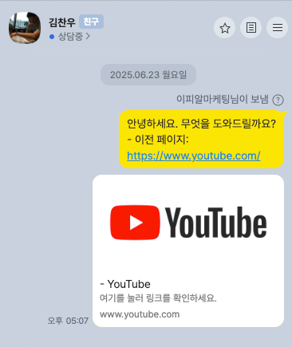
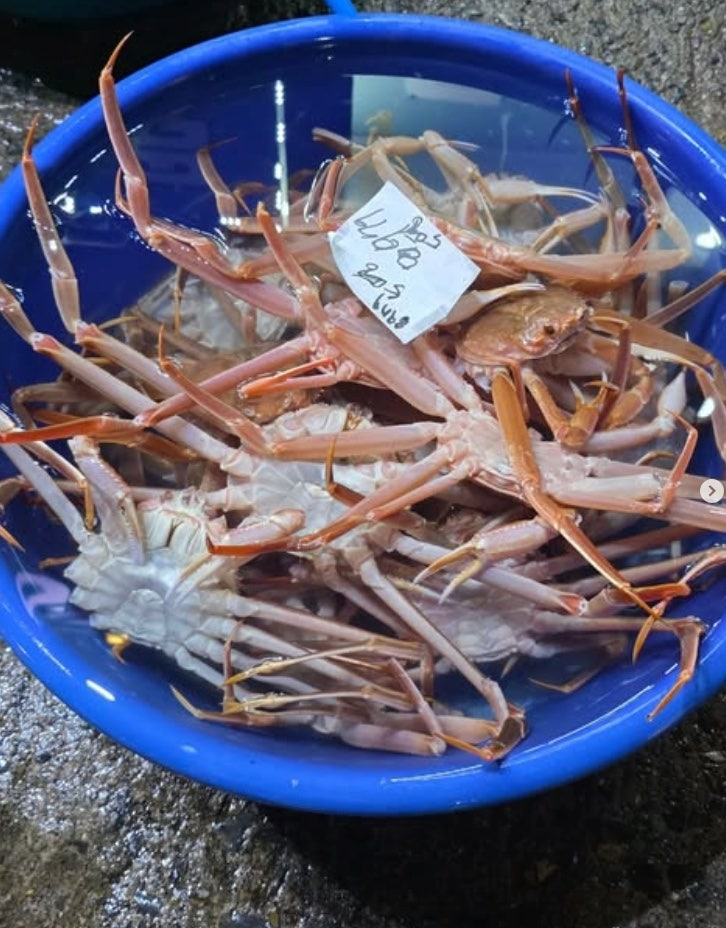
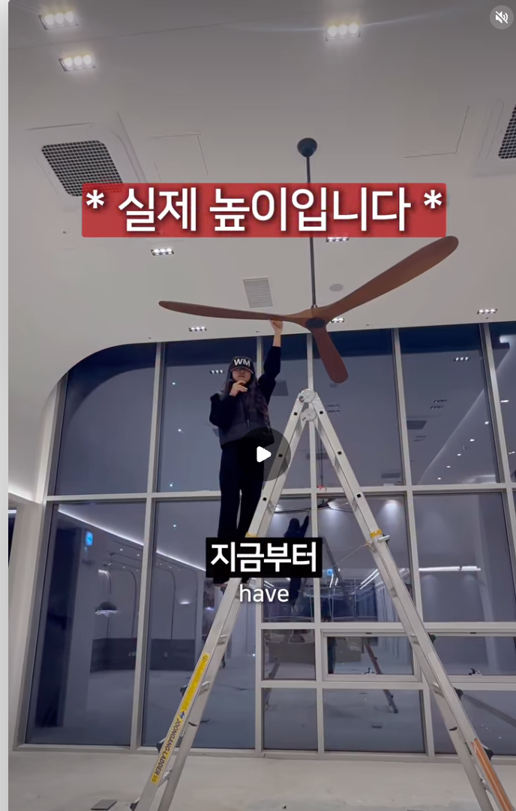
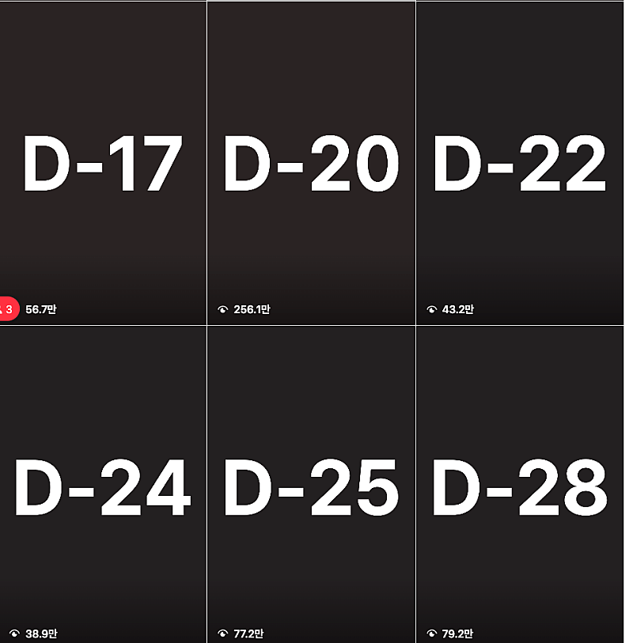

# (1탄) 10평매장에서 연매출 60억 프랜차이즈 본사 대표님 인터뷰

- 원천 ID: EPR-CAFE-33579
- 작성자: 주는사란
- 작성일: 2026-01-05T18:55:03.827000+09:00
- 원문: https://cafe.naver.com/ranschool/33579
- 수집일: 2026-09-21
- 텍스트 정리: HTML 문단 순서 유지, 빈 문단·제로폭 공백만 제거. 원본 HTML·JSON 별도 보존. 이미지는 아래에 모아 보관하며 원래 배치는 HTML에서 확인.

## 원문 본문

<!-- P001 -->
2026년 새해 복 많이 받으세요~ 다들 올해 계획 다 세우셨나요?

<!-- P002 -->
저는 2026년에 해보고 싶은 것 중 하나가 회사 대표님들 인터뷰 입니다. 왜냐면 마케팅을 하다보면 회사 내부를 알게되고, 무엇보다 모든 회사에는 그 회사를 키운 방법?이 무조건 있는데 그걸 업계마다 알고 싶었어요.

<!-- P003 -->
그래서 문의 온 업체 대표님, 아는 회사 대표님, 대행하는 업체 대표님 등 각 회사의 성장과정에 대해 들으면서 마케팅 상담도 해드리는 그런 컨텐츠를 해보고 있어요. 12월부터 시작했는데 벌써 여섯분이나 했네요.

<!-- P004 -->
- 10평매장에서 월 1억 2천 부터 연매출 60억 프랜차이즈 본사 대표님

<!-- P005 -->
- 지방에서 연매출 30억 곰탕 / 순대국집 사장님

<!-- P006 -->
- 탈북, 이혼 4번 겪고 직원 20명 시스템에어컨 업체 대표님

<!-- P007 -->
- 화장품공장 운영하며 100억짜리 사옥 짓고 연매출 100억 대표님

<!-- P008 -->
- 저랑 동갑인데 금으로 연매출 300억 대표님

<!-- P009 -->
- 강남에서만 마케팅 없이 10년 넘게 2차 동물병원 대표님 2분

<!-- P010 -->
마케팅을 하는 분들이라면 도움이 되실것 같아서 각 회사 대표님과의 인터뷰 영상과 함께 느낀점을 좀 적어보려합니다.

<!-- P011 -->
먼저 첫번째 영상이예요.

<!-- P012 -->
10평매장에서 월 1억 2천 부터 연매출 60억 프랜차이즈 본사 대표님

<!-- P013 -->
이분은 2025년 6월부터 저희에게 무려 5번이나 연락주신 분입니다.

<!-- P014 -->
저희가 도저히 여건이 안되어서 진행이 어렵다고 말씀드렸음에도, 한번은 이야기 해보고 싶다고 하셔서 인터뷰로 찾아뵙게 되었습니다. 너무 재밌어서 이야기를 2시간 넘게 했는데 나름 짧게 줄였는데도 40분이네요.

<!-- P015 -->
아래는 제가 작년부터 운영하고 있는 마케팅 채널입니다. 이 채널은 마케팅 문의 받기용 채널이라 조회수나 구독자가 많지는 않지만 이 채널로 문의를 꾸준히 받고 있어요.

<!-- P016 -->
요약 및 느낀점

<!-- P017 -->
1. 디자이너에서 요식업 시작

<!-- P018 -->
보통 F&B에서는 '맛'이 매출을 결정한다고 착각하기 쉽지만, 냉정하게 마케팅 관점에서 보면 '맛'은 재방문을 위한 도구입니다. 고객은 먹어보기 전까지 맛을 알 수 없으니까요. 물론 '맛' 있어야 기존 고객이 다시오고, 또 그 사람들이 더 데리고 와서 매출이 늘어나겠지만, 새로운 고객을 데리고 오기 위해 더 쉬운 방법은 맛있어 '보이는 것' 입니다.

<!-- P019 -->
김찬우 대표님은 디자이너 출신이셔서 그런지, '보여지는 것'에 대한 감각이 있으셨던 것 같아요. 그리고 이걸 뒤에 이어서 말씀드리겠지만, 페이스북 인스타에 뿌리는 것 까지도 잘 연결하셨다고 느꼈습니다.

<!-- P020 -->
말한김에 'SNS로 마케팅 하기 좋은 업종' 에 대해 좀 정리해볼까 합니다. 여기서 SNS란, 유튜브,인스타, 블로그, 스레드 뭐 다 합쳐서 입니다. 어떤 업종이건, 내 상품이나 서비스를 '시각적'으로 잘 보여줄수록 마케팅 효과가 좋습니다.

<!-- P021 -->
근데 현재는 시각적으로 잘 보여지는 (예를들어 음식점, 옷) 업종들은 이미 경쟁이 치열한 경우가 많아요. 그렇다고 해서 효과가 없는건 아니지만 기준이 높아졌습니다. 그래서 이럴수록 '창의성' '소통' 이 중요해요. 이건 다음편에서 좀더 적어보겠습니다.

<!-- P022 -->
예시1. 대게 엄청 많이 보여주고 싸다는거 어필

<!-- P023 -->
반면, '시각'과 관련이 적은 업종은 "이걸 어떻게 영상으로 찍어?" 하는 문제 때문에 경쟁이 덜 치열합니다. 그래서 이런 업종이 개인적으로 좀 노다지라고 생각합니다. 예를들어 제가 하는 업체 중에서 보청기 회사 있는데 이런 업종은 청각 위주라서 경쟁도 덜 치열한데 효과도 좋습니다. 반응이 빨라요.

<!-- P024 -->
예시 2. 보청기 이어 몰드 뜨는 모습 보여주기

<!-- P025 -->
혹은 시각화하는데 시간이 오래 걸리는 업종도 마케팅 하기 좋은 업종이라 생각합니다. 예를들어 건축, 인테리어 등등 하나의 완성품까지 돈과 시간이 많이 들어가는 업종들이요. 이런 업종은 이미 sns 를 많이 하고 있어도, 그럼에도 수요대비 sns 하는 사람이 적기 때문에 조금만 조회수가 나와도 전환이 잘 됩니다.

<!-- P026 -->
예시 3. 건물 타임랩스

<!-- P027 -->
2. 페이스북 광고 효과 봤음

<!-- P028 -->
하루종일 유튜브, 인스타, 네이버를 쳐다보고 있는 저조차도 매번 시도하는게 엄청 쉬운 일은 아니거든요. 근데 찬우 대표님은 10년전에 페이스북 광고를 할 정도면 매체에 대한 민첩성이 좋으신 것 같아요. 솔직히 아마 10년 전으로 돌아가서 페이스북, 인스타 할래? 하면 안할 사람 없겠지만, 그 당시만 해도 이 효과를 아는 사람이 많지 않았으니까요.

<!-- P029 -->
그리고 제가 다른 대표님 인터뷰 느낀점에도 추가하겠지만, 대부분 매출이 일정 규모 이상 올라간 대표님들의 특징 중 하나가 '민첩성' 인것 같아요. 뭔가 새로 나올때 일단 투자해 보는 것에 대해서 주저 하지 않으시더라구요.

<!-- P030 -->
보통 초창기 시장에서는 하기만 해도 효과를 보는데 이때 느낀 '성공경험'이 또 다음 것을 하는데 돈과 시간을 만들어 주기도 하구요.

<!-- P031 -->
3. 오픈할때부터 인스타 시작

<!-- P032 -->
제가 촬영한 장소는 본점 매장이었는데, 매장은 정말 크지 않았어요. 제가 이자카야 할 당시 매장보다 조금 더 큰 정도였는데 저기서 사실 직원 3분을 고용하고도 수익이 남기까지 매장을 세팅한다는건 정말 어렵거든요. 근데 그게 처음부터 가능했던 이유가 인스타에 아예 창업 과정을 올리신 것 덕분이었어요.

<!-- P033 -->
요즘에는 솔직히 이제 창업하고 마케팅 한다? 그럼 좀 바보라고 생각합니다. 하는 과정을 다 찍으면서 미리 수요를 모아놓고, 그다음 오픈했을때는 줄세우기! 이게 핵심인것 같아요.

<!-- P034 -->
아마 인스타에 이런거 많이 보셨을거예요. "앞으로 ~일안에 저는 ~을 만들겁니다" 하는 그런 영상들인데, 예를들면 아래와 같은 영상들이예요.

<!-- P035 -->
이거 말고도 진짜 요즘에 겁나 많아요. 창업하는 과정에서 스토리 뿌리면서 팔로우 늘려놓거나 심지어 미리 주문 받아놓는거죠.

<!-- P036 -->
4. 고객 커넥션 문화

<!-- P037 -->
개인적으로 자영업/사업을 하는데서 가장 평가절하 된 분야를 꼽으라면 'CS'라고 생각해요. 뭔가 고객응대라고 하면 보통 '친절' 이라고 생각하는데, 개인적으로는 친절보다는 '친밀감' 이 더 중요하다고 생각해요.

<!-- P038 -->
이게 약간 다른데, '친절'은 내가 돈을 받았으니깐 친절한 느낌이라면, '친밀감'은 정말 친구 같다는 느낌이예요. 여기서 '친구 같다' 는건 꼭 그 고객이랑 사장이 친구가 된다 하는 의미는 아니고, 얼굴 한번 안봐도 내적 친밀감이 있을 수 있는 것 처럼 그 '내적친밀감'을 만든다는 거예요. 그런게 내가 올린 컨텐츠에서 느껴져야 한다고 생각하고, 또 내 매장을 방문했을때 느껴져야 한다고 생각해요.

<!-- P039 -->
근데 이런 '친밀감'을 만드려면 서로 소통할 '사건'이 필요한데, 그런 '사건'을 찬우 대표님은 잘 기획하신다고 생각했습니다. 이게 저는 요즘 당근마켓에서 경찰과 도둑이 유행인거랑 비슷한 원리인 것 같아요. 뭔가 편하게 만날 친구를 만들고 싶은? 그런 느낌이요. 그리고 이걸 얼마나 많은 고객이 내 매장에서 느끼느냐가 결국 지역기반 자영업에서 재구매 + 입소문을 나게 하는 것 같아요.

<!-- P040 -->
위 4가지 키워드 외에도 찬우 대표님과의 인터뷰에서 추가로 느낀 4가지 키워드는 아래와 같은데요. 이건 다음 인터뷰와 겹치는 내용이 있어서 그 인터뷰 내용과 함께 느낀점 적겠습니다.

<!-- P041 -->
5. 결국 매출 케파는 온라인

<!-- P042 -->
6. 최소 10년

<!-- P043 -->
7. 메뉴별 재방문기간

<!-- P044 -->
8. 성공경험

<!-- P045 -->
그럼 다들 새해 복 많이 받으시고, 다음 인터뷰도 기대해주세용 ㅎㅎ

## 본문 이미지

## 원문에 포함된 링크

- #

## 원본 HTML에 포함된 외부 게시물 메타데이터

외부 게시물의 현재 본문을 재수집한 것이 아니라, 카페 게시 당시 함께 저장된 제목·설명이다. 잘린 문구는 보완하지 않았다.

- 원문 링크: https://youtu.be/6S2sNJaGI54?si=4ooxSXyRZKzbSjuq

13평 매장에서 시작해 월매출 60억까지 10년간의 과정

이 영상은 매출이나 성과를 검증하는 콘텐츠가 아닙니다.여러 대표님들을 만나며 제가 느낀 생각과 관점을 정리한 기록입니다.각자에게 와닿는 부분만 참고해 주세요.🔽 문의 🔽인터뷰 신청 / 출연영상 대표님 협업 / 마케팅문의http://pf.kakao.com/_xkxePMn/chat

- 원문 링크: https://youtube.com/shorts/BagnXtyGdlY?si=89WECPCpPyTXaawD

맞춤형 보청기를 제작하는 방법

#shorts #보청기 #청력맞춤형 보청기를 제작하는 방법

- 원문 링크: https://www.youtube.com/shorts/z6m2paPgi14

롯데월드 타워 건설 타임랩스

#Shorts롯~데 월드

