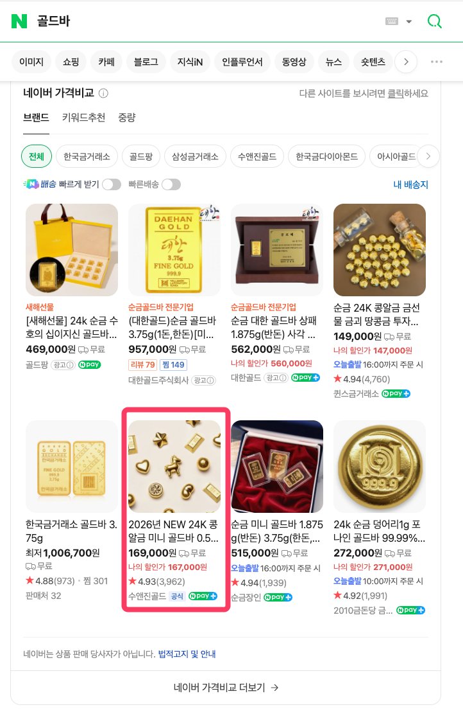

# 마케팅 효과 보는 업종 판별법

- 원천 ID: EPR-CAFE-33602
- 작성자: 주는사란
- 작성일: 2026-01-14T12:05:45.533000+09:00
- 원문: https://cafe.naver.com/ranschool/33602
- 수집일: 2026-09-21
- 텍스트 정리: HTML 문단 순서 유지, 빈 문단·제로폭 공백만 제거. 원본 HTML·JSON 별도 보존. 이미지는 아래에 모아 보관하며 원래 배치는 HTML에서 확인.

## 원문 본문

<!-- P001 -->
마케팅을 판매한다는 건 무엇일까요? 블로그 글, 유튜브 숏츠 영상, 인스타 릴스를 파는 게 아닙니다. "이전에 다른 업체에서 매출이 올랐던 하나의 성공 전략(공식)"을 파는 것입니다. 그래서 마케팅 대행을 하려면, 먼저 그 방식으로 성공해 본 경험이 있어야 합니다. 그리고 그 경험을 비슷한 업종(타겟)으로 확장해 봐야 합니다.

<!-- P002 -->
예를 들어 제가 블로그 강의 때 알려드린 '세부 키워드로 지역 고객 설득하기' 전략도 마찬가지입니다.

<!-- P003 -->
1. 저는 처음엔 학원에 적용해서 성공했고,

<!-- P004 -->
2. 이걸 다른 학원들에 적용해 확장했고,

<!-- P005 -->
3. '서비스업+고관여+객단가 30만 원 이상'이라는 공통점을 가진 인테리어, 변호사, B2C 공장으로 확장했습니다.

<!-- P006 -->
많은 분들이 "유튜브, 인스타, 스레드 같은 새로운 플랫폼을 더 배워야 돈을 번다"고 착각합니다. 아닙니다. 플랫폼 사용법이 아니라, "그래서 어떤 전략을 팔 것인가?"가 핵심입니다.

<!-- P007 -->
이게 무슨 말인지, 최근 제가 인터뷰한 연매출 300억 금 회사의 사례로 말씀드려볼게요.

<!-- P008 -->
위 금 회사 대표님의 인터뷰를 바탕으로 그 전략을 정리해보겠습니다.

<!-- P009 -->
1. 홈쇼핑 트래픽

<!-- P010 -->
대표님 인터뷰를 보면, 과거 아버님 시절에는 매출의 주도권이 홈쇼핑 MD에게 있었다고 합니다. 방송 편성을 잡아주냐 마냐에 따라 회사 매출이 흔들리는 구조였죠. 여기서 대표님이 잘하셨다고 생각한건, 이 홈쇼핑 트래픽을 활용한 것 입니다. 홈쇼핑을 단순히 물건 파는 곳이 아니라, '브랜드 인지도를 쌓고 트래픽을 폭발시키는 광고판'으로 활용한거죠.

<!-- P011 -->
이건 마케팅 공식 중 하나인데, 아직까지는 여전히 유효합니다. (곧 안될것 같긴 하지만) 그리고 보통 홈쇼핑 방송이 나가는 동안, 홈쇼핑에서 구매하기도 하지만 사람들은 네이버에 그 브랜드를 검색하는 경우도 많습니다. 이때 발생하는 '순간적인 검색 트래픽'이 있는데, 이 트래픽을 놓치지 않고 내꺼로 받아 내야합니다.

<!-- P012 -->
2. 스마트스토어 SEO

<!-- P013 -->
보통 여기서 바로 자사몰로 유도하면 더 좋을거라고 생각하는데, 사실 네이버 쇼핑도 생각하면 스마트스토어로 유입하는 것이 낫습니다. 네이버 로직상 트래픽과 판매량이 쏠리면 상위 노출이 되고, 그럼 네이버에서 검색하는 사람도 잡을수 있거든요. 그니깐 홈쇼핑에서 터진 트래픽을 스마트스토어로 몰아주면, 홈쇼핑 매출도 있지만 자연스럽게 네이버 스마트스토어 노출에도 도움이 되는거죠.

<!-- P014 -->
물론 이 회사는 이미 기존 고객이 있기 때문에 홈쇼핑 만으로 된건 아닐수 있으나, 현재 네이버 스마트스토어에서 '골드바' 라는 키워드로 검색했을때 네이버 쇼핑에서 1페이지에 뜹니다.

<!-- P015 -->
이걸 임의로 만드려면 사실 태워야 하는 광고비도 어마무시 하거든요. 무엇보다 '골드바' 같은 메인 키워드에서 1페이지에 있다는 건, 그외에 세부 키워드에서도 이미 상위를 장악했다는 뜻입니다.

<!-- P016 -->
즉, [홈쇼핑 방송(트래픽) → 스마트스토어 유입 → 판매 지수 상승 → 메인 키워드 상위 노출 → 방송 안 할 때도 자연 유입 발생] 이라는 선순환 구조를 만든 것입니다.

<!-- P017 -->
3. CRM

<!-- P018 -->
결국 최종적으로는 자사몰로 데리고 와야합니다. 수수료 문제도 있지만, 가장 중요한 건 '고객 데이터(DB)' 때문입니다. 그래서 자사몰로 넘어온 고객은 이제 '찐 내 고객'이라고 부릅니다. 그리고 이때부터는 주기적으로 할인이나 이벤트 혹은 신제품에 관한 내용을 보내고 매출을 주기적으로 내는 방식이죠.

<!-- P019 -->
제가 옛날에 다른 회사에서도 이걸 했었는데, 여기서 가장 효과가 좋았던건 아예 이 CRM문자를 컨텐츠로 보냈을때 였습니다. 너무 할인쿠 '고객에게 도움 되는 콘텐츠'를 보냈을때 효과가 가장 좋았습니다.

<!-- P020 -->
예를들면

<!-- P021 -->
(금 회사라면) "지금 금 시세가 요동치는 이유 분석"

<!-- P022 -->
(식품 회사라면) "제철 재료 고르는 법"

<!-- P023 -->
뭐 이런거죠.

<!-- P024 -->
이 글 맨 아래 자연스럽게 우리 제품 랜딩해서 매출 내는 방식이었습니다.

<!-- P025 -->
정리하자면, 이 회사 성장을 정리하면 아래와 같습니다.

<!-- P026 -->
Trigger: 홈쇼핑으로 대규모 트래픽 발생

<!-- P027 -->
Capture: 스마트스토어로 유입시켜 SEO(검색 노출) 장악

<!-- P028 -->
Lock-in: 자사몰로 전환하여 CRM(콘텐츠)으로 단골 만들기

<!-- P029 -->
지금까지 전형적으로 운영되는 방식인데, 여기서 아쉬운건 현재 새로운 트래픽이 부족하다는 것 입니다. 물론 퍼포먼스 광고를 돌리고 있긴 하지만 퍼포먼스 효율이 나오기 어려운 시대가 됐습니다. 제가 영상에서도 말했지만 요즘 광고비로 데리고 온 첫번째 고객 매출은 메타나 구글이 가져간다고 봐야합니다.

<!-- P030 -->
그래서 이 트래픽을 가능한 효율적으로 내려면 자체 컨텐츠가 있어야 합니다. 고객을 주기적으로 데리고올 유튜브나 인스타 채널에서의 자체 컨텐츠요. 여기서 자체 컨텐츠도 브랜드에서 운영할때 최소한 필요한 포맷들이 있습니다. 제가 판매하는 것은 이 포맷들을 구축하는 것 입니다. 홈쇼핑처럼 갑자기 단기간에 엄청난 트래픽을 가져오진 않겠지만, 대신 꾸준히 우상향하는 고객은 데리고 올수 있습니다.

<!-- P031 -->
그리고 이 포맷의 핵심은 이 사람을 바로 내 고객으로 만들수 있다는 것 입니다. 저는 여기서 커뮤니티를 중요하게 여겨요. 제가 유튜브나 인스타를 해보니깐 이게 매번 조회수를 내기가 쉽지가 않습니다. 근데 조회수를 내지 않아도 지금 제가 여기서 하는 것처럼 카페나 오픈채팅으로 사람을 모아두면 트래픽이 죽지 않습니다. 여기서 보통 저는 네이버 트래픽을 위해 네이버 카페를 많이 씁니다.

<!-- P032 -->
즉 위에 홈쇼핑 => 스마트 스토어 로 트래픽을 보내서서 네이버 상위노출이 된것 처럼, 유튜브,인스타에서 네이버 카페로 보내고 네이버 카페로 네이버 트래픽을 잡으려는 목적입니다. 이게 되면 사실 매출은 자연스럽게 나옵니다.

<!-- P033 -->
사실 주는사란도 이 방식으로 커왔던 것이구요. 물론 제가 업체 일이 많아지면서, 이 카페를 많이 관리하지 못하긴 했습니다ㅠㅠ 그래서 제 마음같이 다 되어있진 않지만 다시 잘 키워나가아죠.ㅎㅎ

<!-- P034 -->
여튼 요즘 제가 여러 대표님들을 인터뷰 하고 있는데요. 제가 인터뷰를 하러 다니는 이유도 이겁니다. 다른 대표님의 성공 스토리에서 '재현 가능한 공식'을 찾아내고, 그걸 제 클라이언트에게 적용하기 위해서입니다.

<!-- P035 -->
마지막으로 수강생분들에게 한마디 드립니다.

<!-- P036 -->
단순히 객단가를 높이려고 이것저것 끼워 팔지 마세요. 그건 전략이 아니라 욕심입니다.

<!-- P037 -->
많은 분들이 블로그 대행에 플레이스나 다른 마케팅 상품을 결합해서 팝니다. 방식은 자유입니다. 하지만 고객에게 필요한 구성이 아니라, 단지 내 수익을 위해 억지로 상품을 붙인다면 그건 100퍼센트 실패합니다.

<!-- P038 -->
제가 알려드린 블로그 전략이 시장에서 팔리는 이유는 운이 좋아서가 아닙니다. 세부 키워드와 지역 고객의 니즈를 파고드는 정확한 논리가 숨어 있기 때문입니다. 그런데 여기에 단순히 내가 할 줄 안다는 이유로 검증되지 않은 홈페이지형 블로그 같은 걸 섞어 버리면, 사실 전략처럼 보이기가 어려울수 있습니다.

<!-- P039 -->
새로운 기술을 더 배우려고 애쓰지 마세요. 대신 내가 지금 팔고 있는 상품이 정확히 누구에게 도움이 되는지, 내가 파는 것이 무엇인지부터 정의하세요. 확장은 그 다음 문제입니다. 내 상품이 확실해진 뒤에, 다른 업체가 어떻게 성공적으로 결합해서 파는지 벤치마킹해도 늦지 않습니다.

## 본문 이미지

## 원문에 포함된 링크

- #

## 원본 HTML에 포함된 외부 게시물 메타데이터

외부 게시물의 현재 본문을 재수집한 것이 아니라, 카페 게시 당시 함께 저장된 제목·설명이다. 잘린 문구는 보완하지 않았다.

- 원문 링크: https://youtu.be/L7fsY1ZtPbg

홈쇼핑부터 스마트스토어, 자사몰 브랜드 런칭으로 매출 300억때까지 과정

YouTube에서 마음에 드는 동영상과 음악을 감상하고, 직접 만든 콘텐츠를 업로드하여 친구, 가족뿐 아니라 전 세계 사람들과 콘텐츠를 공유할 수 있습니다.

